## Virtual Machine

先在虚拟机上安装一遍，为以后在物理机安装积累经验。

### 1 platform

| Name      | Version                         |
| --------- | ------------------------------- |
| Ubuntu    | Ubuntu 22.04.3 LTS              |
| VMware    | 17                              |
| ArchLinux | archlinux-2023.08.01-x86_64.iso |

### 2 install

#### 2.1 VMware创建虚拟机

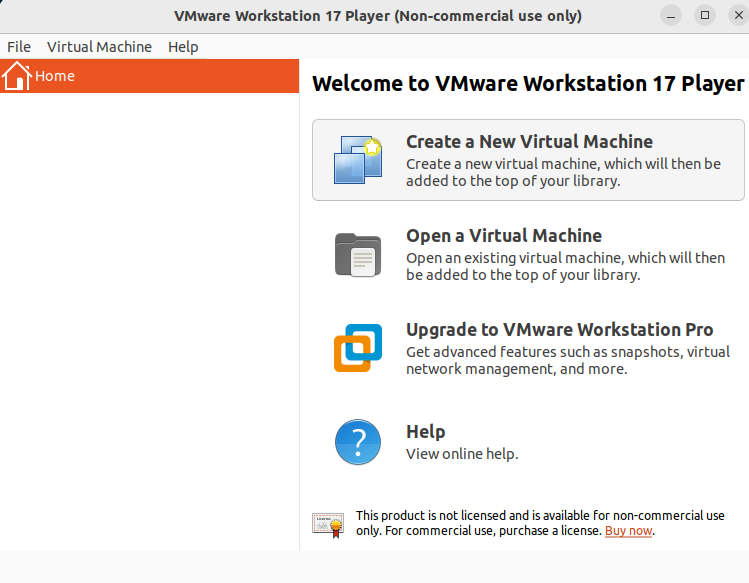

#### 

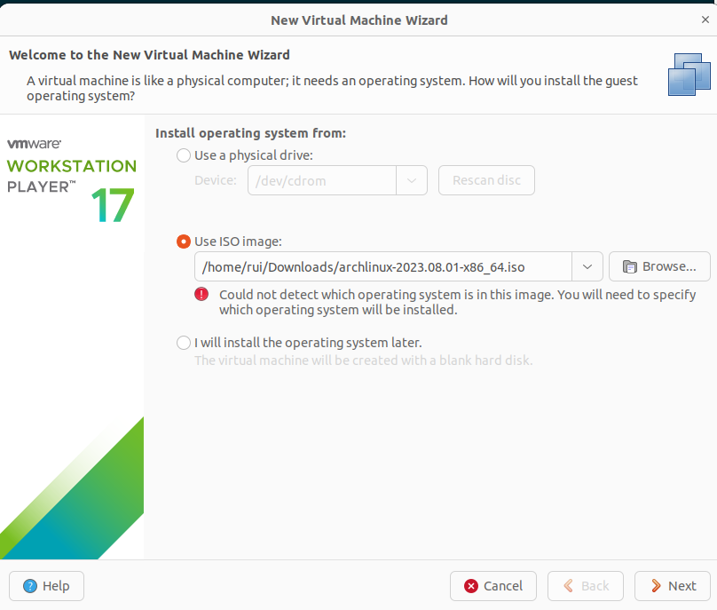

#### 

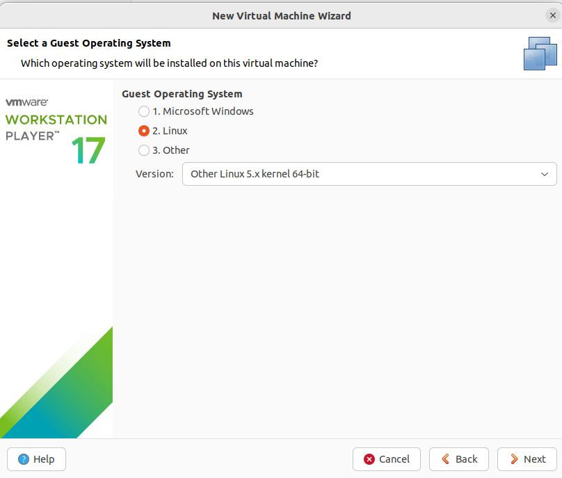

#### 

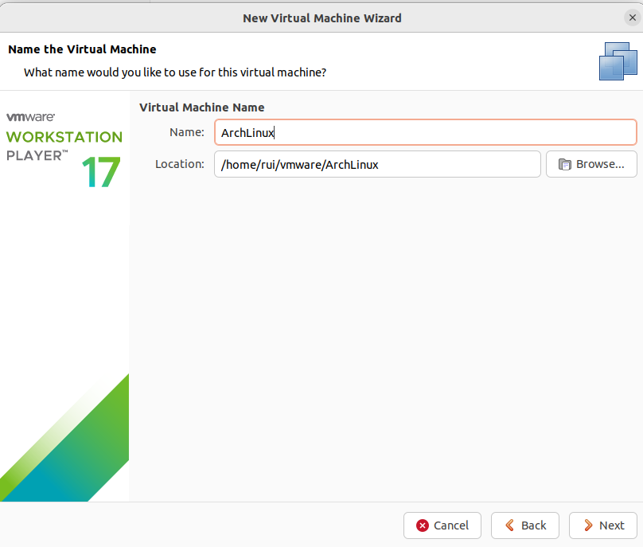

#### 

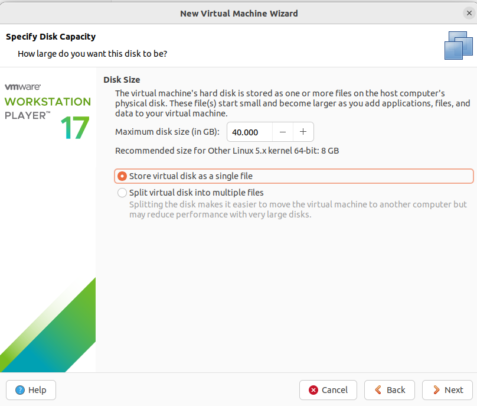

#### 

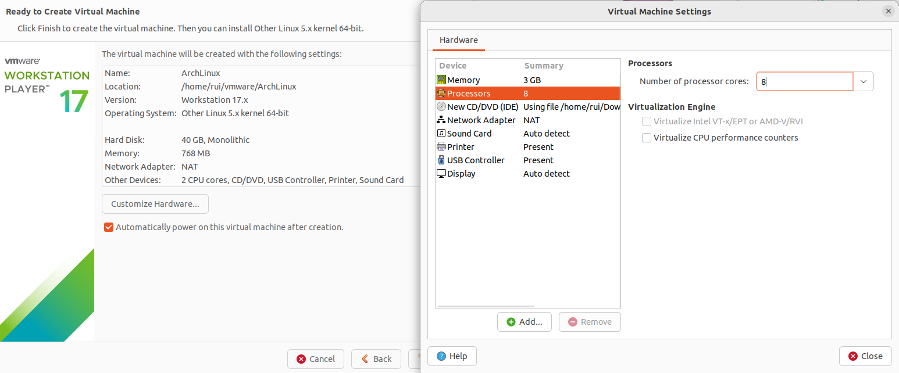


不要勾选虚拟机自动启动选项。

虚拟机创建好后，先不要启动，在启动之前设置一下UEFI。

```shell
echo firmware="efi" >> /home/rui/vmware/ArchLinux/ArchLinux.vmx
```

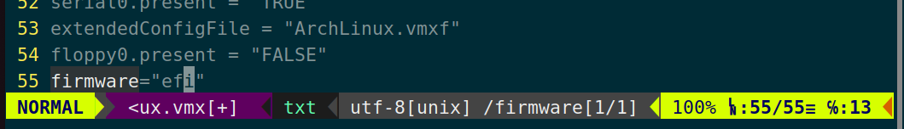

#### 2.2 安装ArchLinux

##### 2.2.1 联网同步时间

```shell
ip link
dhcpcd
ping -c 4 baidu.com
timedatectl set-ntp true
```

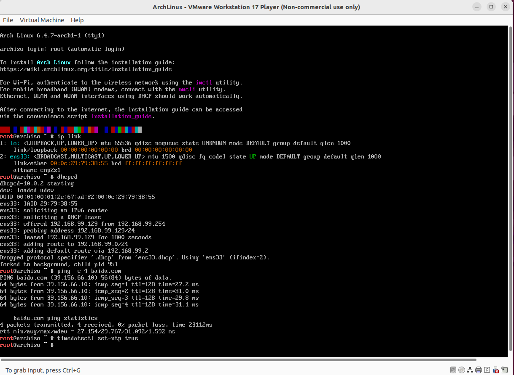

##### 2.2.2 磁盘

###### 2.2.2.1 查看磁盘

```shell
fdisk -l
```

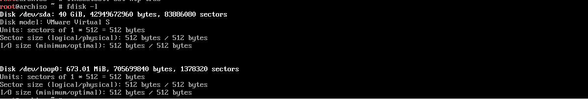

###### 2.2.2.2 创建磁盘分区

```shell
fdisk /dev/sda

g

n
<Enter>
<Enter>
+512M

n
<Enter>
<Enter>
+6G

n
<Enter>
<Enter>
<Enter>

t
1
1

t
2
19

p

w

fdisk -l /dev/sda
```

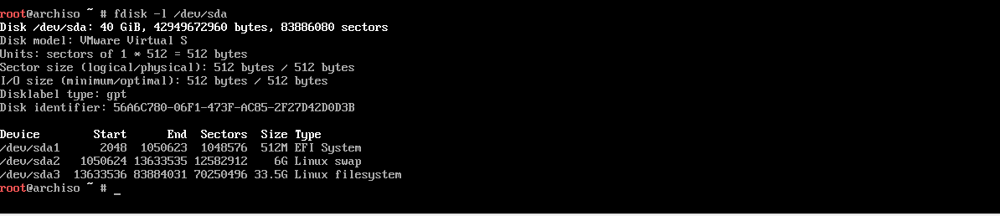

###### 2.2.2.3 格式化分区 设置swap分区

```shell
mkfs.fat -F32 /dev/sda1
mkswap /dev/sda2
mkfs.ext4 /dev/sda3
```

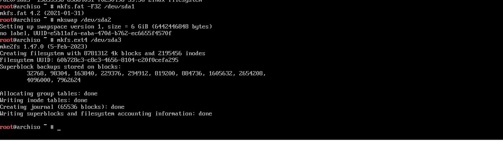

###### 2.2.2.4 启用交换分区

```shell
swapon /dev/sda2
swapon -show
```

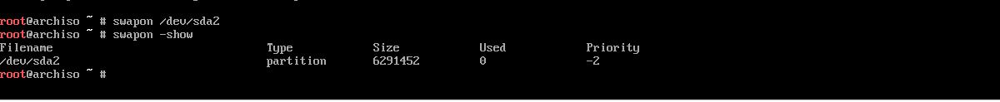

###### 2.2.2.5 文件系统挂载

```shell
mount /dev/sda3 /mnt

mkdir /mnt/boot
mount /dev/sda1 /mnt/boot
```

##### 2.2.3 安装

###### 2.2.3.1 镜像源

```shell
cat /etc/pacman.d/mirrorlist
```


###### 2.2.3.2 必需的软件包

```shell
pacstrap /mnt base linux linux-firmware
pacstrap /mnt networkmanager
```

###### 2.2.3.3 生成fstab文件

```shell
genfstab -U /mnt >> /mnt/etc/fstab
```

###### 2.2.3.4 arch-chroot

```shell
arch-chroot /mnt
```

###### 2.2.3.5 时区设置

```shell
ln -sf /usr/share/zoneinfo/Asia/Shanghai /etc/localtime

hwclock --systohc
```

###### 2.2.3.6 vim安装

```shell
pacman -S vim
```

###### 2.2.3.7 本地化

```shell
vim /etc/locale.gen
```

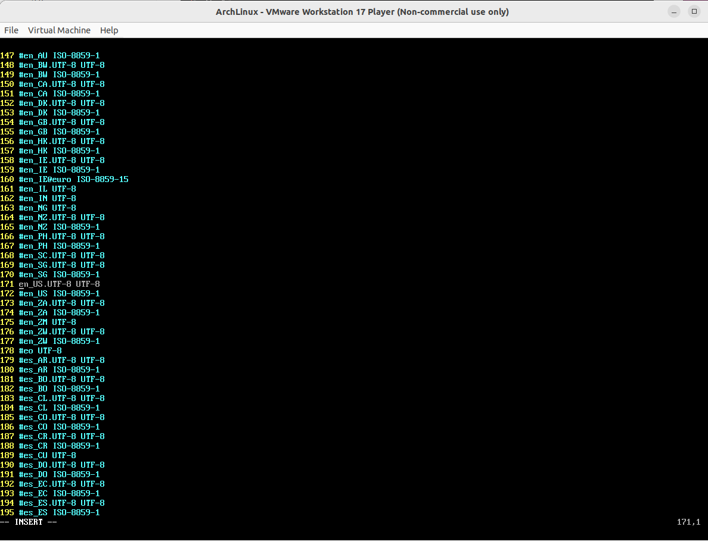

```shell
locale-gen

echo LANG=en_US.UTF-8 > /etc/locale.conf
```

###### 2.2.3.8 网络配置

2.2.3.8.1 主机名

```shell
echo rui-arch > /etc/hostname
```

2.2.3.8.2 hosts文件

```shell
vim /etc/hosts
```

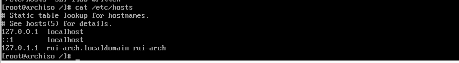

2.2.3.8.3 NetworkManager服务

```shell
systemctl enable NetworkManager
```

###### 2.2.3.9  root密码

```shell
passwd
```

###### 2.2.3.10 引导程序

2.2.3.10.1 EFI启动管理器

```shell
bootctl --path=/boot install
```

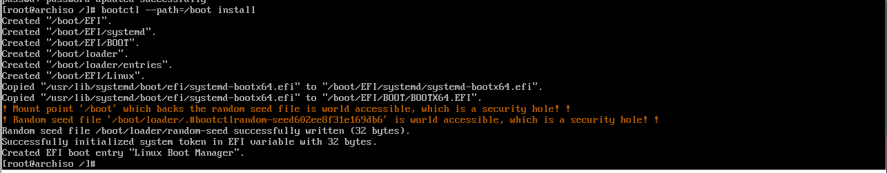

2.2.3.10.2 配置

```shell
vim /boot/loader/loader.conf
```

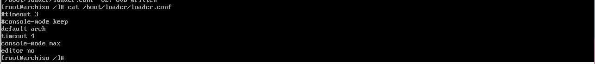

2.2.3.10.3 添加启动项

```shell
vim /boot/loader/entries/arch.conf
```

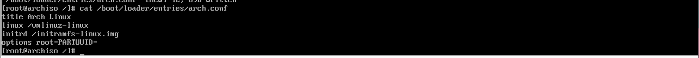


```shell
blkid -s PARTUUID -o value /dev/sda3 >> /boot/loader/entries/arch.conf

cat /boot/loader/entries/arch.conf
```

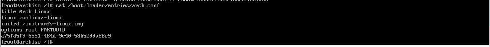

2.2.3.10.4 更新启动项

```shell
vim /boot/loader/entries/arch.conf
cat /boot/loader/entries/arch.conf
```

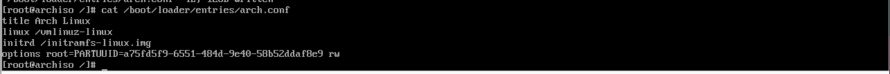

##### 2.2.4 重启

```shell
exit

systemctl reboot
```

##### 2.2.5 系统配置

###### 2.2.5.1 更新系统和软件包

```shell
pacman -Syu
```

###### 2.2.5.2 安装sudo

```shell
pacman -S sudo
```

###### 2.2.5.3 用户配置

2.2.5.3.1 配置sudoers

```shell
EDITOR=vim visudo
```


2.2.5.3.2 添加wheel组普通用户

```shell
useradd -m -G wheel dingrui
```

2.2.5.3.3 设置用户密码

```shell
passwd dingrui
```

2.2.5.3.4 退出root用户

```shell
Ctrl+d
```

###### 2.2.5.4 安装open-vm-tools

设置开机自启动

```shell
sudo pacman -S open-vm-tools
systemctl enable vmtoolsd vmware-vmblock-fuse
```

###### 2.2.5.5 安装gtkmm3

```shell
sudo pacman -S gtkmm3
```

###### 2.2.5.6 安装驱动

```shell
sudo pacman -S xf86-input-vmmouse xf86-video-vmware mesa
```

###### 2.2.5.7 桌面服务

```shell
sudo pacman -S xorg
```

###### 2.2.5.8 桌面环境

```shell
sudo pacman -S plasma-meta
```

###### 2.2.5.9 显示管理器

设置为开机自启动

```shell
sudo pacman -S sddm
systemctl enable sddm
```

#### 2.3 重启虚拟机

```shell
systemctl reboot
```

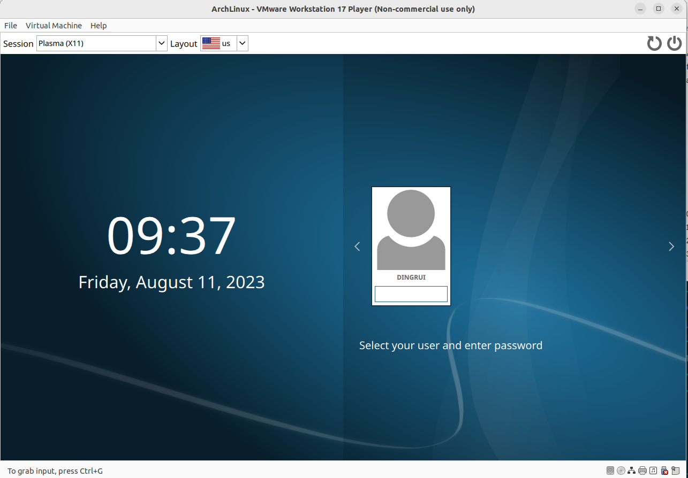

## Physic Machine
