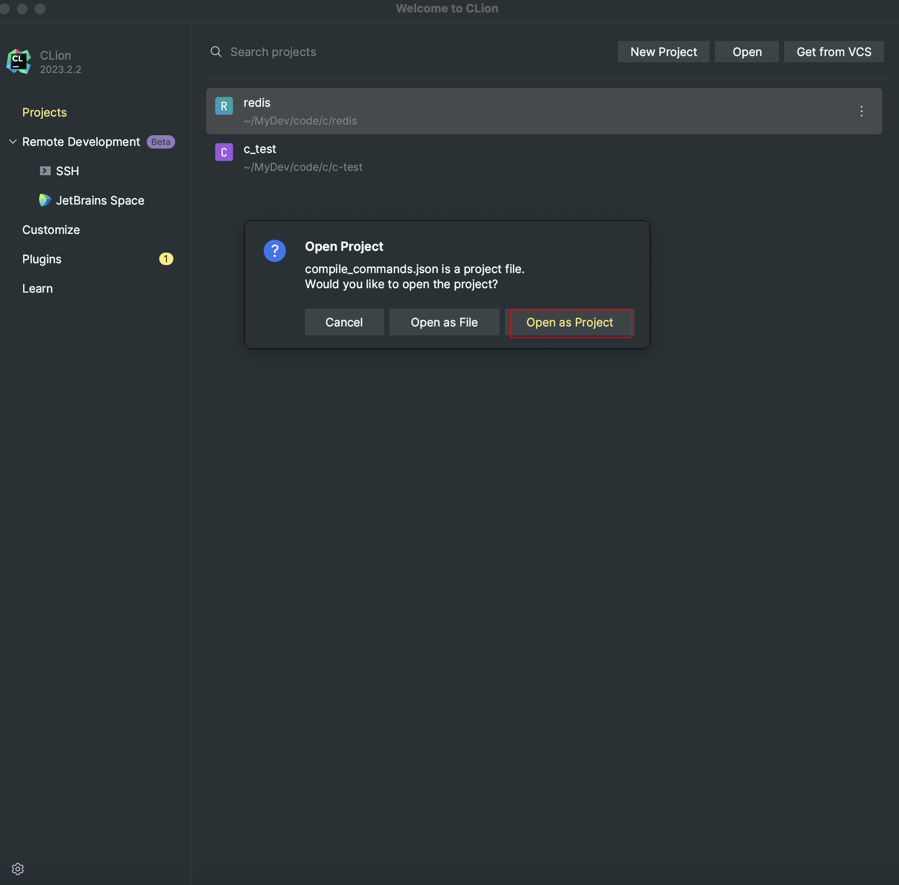

习惯了在Jetbrains系列上进行开发，自然而然也就用Clion阅读和开发C语言项目。但是该IDE对Makefile的支持远不如对Cmake的支持，比如用Clion打开Redis源码，无法进行函数跳转。

1 安装compiledb
---

```shell
brew search compiledb
brew info compiledb
brew install compiledb
```

2 创建compile_commands.json
---

进入到项目根目录

```shell
compiledb -nf make
```

如果提示缺少`pkg-config`命令就进行安装

```shell
brew install pkg-config
```

重新执行上述`compile -nf make`命令便会在项目根目录下生成compile_commands.json文件

3 Clion导入项目
---

### 3.1 打开compile_commands.json文件

Clion以项目形式打开该文件




### 3.2 重新加载Makefile项目


至此，便可以在源码中丝滑地跳转，如果后续对Makefile进行了变更操作，就将上述流程再执行一次即可。
