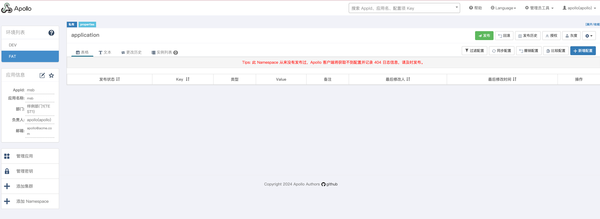
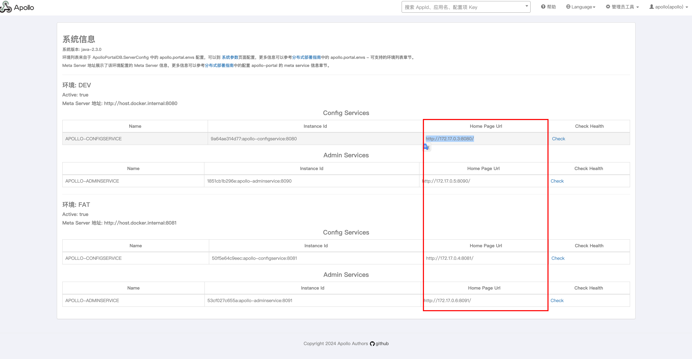
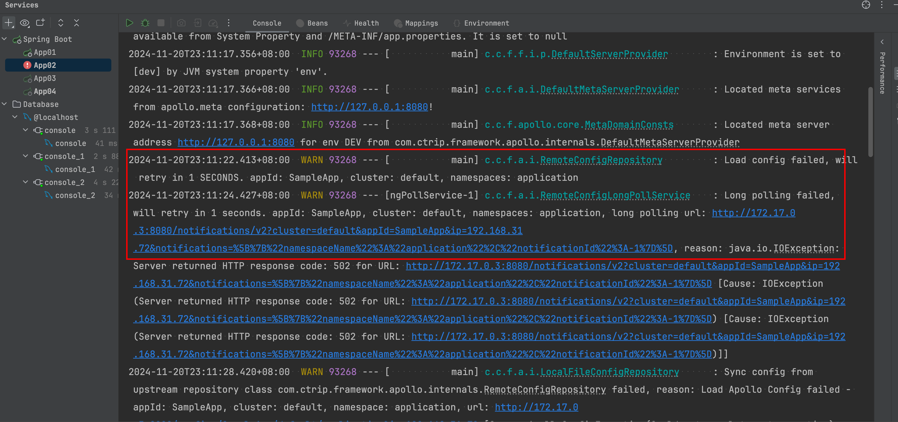
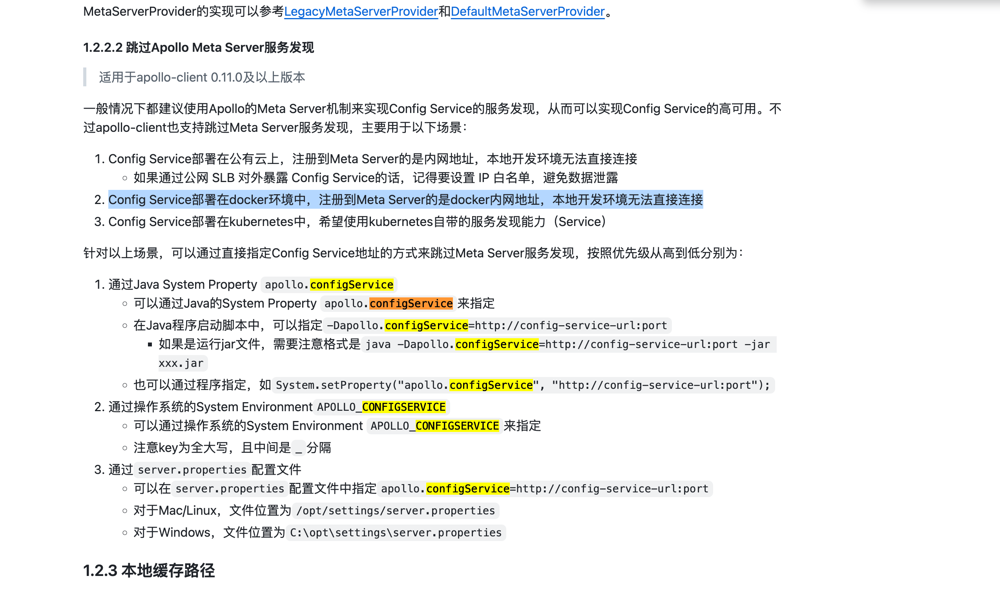

准备在docker中部署一套Apollo配置中心的集群

参考[官方文档](https://www.apolloconfig.com/#/zh/deployment/distributed-deployment-guide?id=_23-docker%e9%83%a8%e7%bd%b2)

需要注意的点就是部署在docker中域名不要使用localhost，用host.docker.internal

### 1 表

在配置多环境时
- ApolloConfigDB分环境 每个环境建立一张表
- ApolloPortalDB不分环境 所有环境都共用一张表
- ServerConfig::apollo.portal.meta.servers要写入所有环境的meta地址
- ServerConfig::pollo.portal.env要写入所有环境的标识

sql文件
- [ApolloConfigDB dev环境](./安装Apollo/%20ApolloConfigDB_DEV.sql)
- [ApolloConfigDB fat环境](./安装Apollo/%20ApolloConfigDB_FAT.sql)
- [ApolloPortalDB](./安装Apollo/ApolloPortalDB.sql)

### 2 启动容器

在`/Users/dingrui/MyApp/docker-app/apollo`目录下新建docker-compose.yml，执行`docker-compose up -d`

```yml
services:
  #Config Service提供配置的读取、推送等功能，服务对象是Apollo客户端
  apollo-configservice-dev:
    image: apolloconfig/apollo-configservice:2.3.0
    restart: on-failure:3
    container_name: apollo-configservice-dev
    volumes:
      - ./logs/apollo-configservice/dev:/opt/logs
    ports:
      - "8081:8081"
    environment:
      - TZ='Asia/Shanghai'
      - SERVER_PORT=8081
      - EUREKA_INSTANCE_IP_ADDRESS=host.docker.internal
      - EUREKA_INSTANCE_HOME_PAGE_URL=http://host.docker.internal:8081
      - SPRING_DATASOURCE_URL=jdbc:mysql://host.docker.internal:3306/ApolloConfigDB_DEV?characterEncoding=utf8&serverTimezone=Asia/Shanghai
      - SPRING_DATASOURCE_USERNAME=dingrui
      - SPRING_DATASOURCE_PASSWORD=19920308
    extra_hosts:
      - host.docker.internal:host-gateway

  apollo-configservice-fat:
    image: apolloconfig/apollo-configservice:2.3.0
    restart: on-failure:3
    container_name: apollo-configservice-fat
    volumes:
      - ./logs/apollo-configservice/fat:/opt/logs
    ports:
      - "8082:8082"
    environment:
      - TZ='Asia/Shanghai'
      - SERVER_PORT=8082
      - EUREKA_INSTANCE_IP_ADDRESS=host.docker.internal
      - EUREKA_INSTANCE_HOME_PAGE_URL=http://host.docker.internal:8082
      - SPRING_DATASOURCE_URL=jdbc:mysql://host.docker.internal:3306/ApolloConfigDB_FAT?characterEncoding=utf8&serverTimezone=Asia/Shanghai
      - SPRING_DATASOURCE_USERNAME=dingrui
      - SPRING_DATASOURCE_PASSWORD=19920308
    extra_hosts:
      - host.docker.internal:host-gateway
      
  #Admin Service提供配置的修改、发布等功能，服务对象是Apollo Portal（管理界面）
  apollo-adminservice-dev:
    image: apolloconfig/apollo-adminservice:2.3.0
    restart: on-failure:3
    container_name: apollo-adminservice-dev
    volumes:
      - ./logs/apollo-adminservice/dev:/opt/logs
    ports:
      - "8091:8091"
    depends_on:
      - apollo-configservice-dev
    environment:
      - TZ='Asia/Shanghai'
      - SERVER_PORT=8091
      - EUREKA_INSTANCE_IP_ADDRESS=host.docker.internal
      - SPRING_DATASOURCE_URL=jdbc:mysql://host.docker.internal:3306/ApolloConfigDB_DEV?characterEncoding=utf8&serverTimezone=Asia/Shanghai
      - SPRING_DATASOURCE_USERNAME=dingrui
      - SPRING_DATASOURCE_PASSWORD=19920308
    extra_hosts:
      - host.docker.internal:host-gateway

  apollo-adminservice-fat:
    image: apolloconfig/apollo-adminservice:2.3.0
    restart: on-failure:3
    container_name: apollo-adminservice-fat
    volumes:
      - ./logs/apollo-adminservice/fat:/opt/logs
    ports:
      - "8092:8092"
    depends_on:
      - apollo-configservice-fat
    environment:
      - TZ='Asia/Shanghai'
      - SERVER_PORT=8092
      - EUREKA_INSTANCE_IP_ADDRESS=host.docker.internal
      - SPRING_DATASOURCE_URL=jdbc:mysql://host.docker.internal:3306/ApolloConfigDB_FAT?characterEncoding=utf8&serverTimezone=Asia/Shanghai
      - SPRING_DATASOURCE_USERNAME=dingrui
      - SPRING_DATASOURCE_PASSWORD=19920308
    extra_hosts:
      - host.docker.internal:host-gateway
      
  #管理界面
  apollo-portal: 
    image: apolloconfig/apollo-portal:2.3.0
    restart: on-failure:3
    container_name: apollo-portal
    volumes:
      - ./logs/apollo-portal:/opt/logs
    ports:
      - "8070:8070"
    depends_on:
      - apollo-adminservice-dev
      - apollo-adminservice-fat
    environment:
      - TZ='Asia/Shanghai'
      - SERVER_PORT=8070
      - EUREKA_INSTANCE_IP_ADDRESS=host.docker.internal
      - APOLLO_PORTAL_ENVS=DEV,FAT
      - DEV_META=http://host.docker.internal:8081
      - FAT_META=http://host.docker.internal:8082
      - SPRING_DATASOURCE_URL=jdbc:mysql://host.docker.internal:3306/ApolloPortalDB?characterEncoding=utf8&serverTimezone=Asia/Shanghai
      - SPRING_DATASOURCE_USERNAME=dingrui
      - SPRING_DATASOURCE_PASSWORD=19920308
    extra_hosts:
      - host.docker.internal:host-gateway
```

### 3 访问

在宿主机访问`http://localhost:8070/`进入后台页面



### 4 问题

用docker部署的情况下，根据meta url返回的是docker镜像中的home page地址



这样会导致集成Apollo客户端读取不到正确的配置信息



解决方案参考[官方文档](https://github.com/apolloconfig/apollo/wiki/%E5%88%86%E5%B8%83%E5%BC%8F%E9%83%A8%E7%BD%B2%E6%8C%87%E5%8D%97#14-%E7%BD%91%E7%BB%9C%E7%AD%96%E7%95%A5)，启动客户端的时候`-Dapollo.configService=http://127.0.0.1:8080/`指定服务地址

