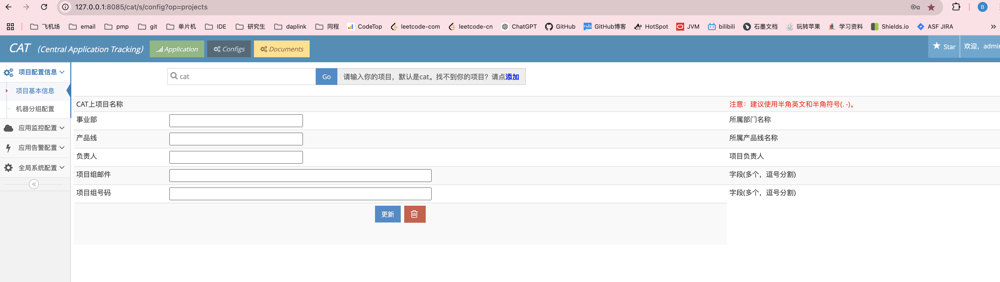
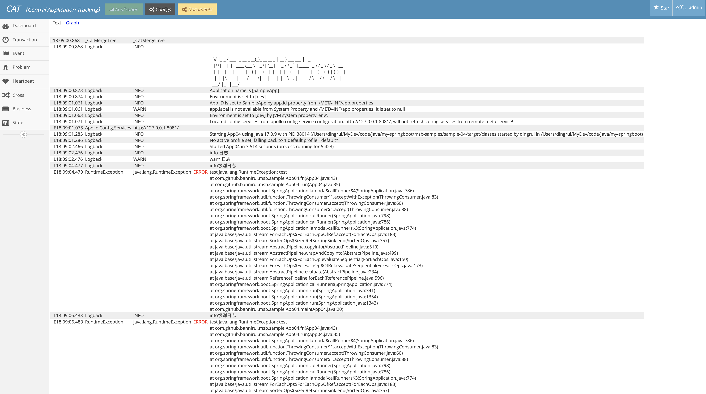

[官网地址](https://github.com/dianping/cat)

### 1 下载源码

```sh
git clone https://github.com/dianping/cat.git
```

3.0版本的提交还停留在6年前，4.0的版本是2年前，部署文档还是老版本，我简单尝试了4.0版本的部署发现启动都存在问题，所以针对3.1版本进行部署

```sh
git checkout -b docker-deploy-v3.0.0 origin/v3.0.0
```

### 2 初始化数据库

cat V3.1只支持mysql v5.7版本，不支持v8.0。在mysql中创建好cat库，然后建立下面的表

```sql
CREATE TABLE `dailyreport` (
  `id` int(11) NOT NULL AUTO_INCREMENT,
  `name` varchar(20) NOT NULL COMMENT '报表名称, transaction, problem...',
  `ip` varchar(50) NOT NULL COMMENT '报表来自于哪台cat-consumer机器',
  `domain` varchar(50) NOT NULL COMMENT '报表处理的Domain信息',
  `period` datetime NOT NULL  COMMENT '报表时间段',
  `type` tinyint(4) NOT NULL COMMENT '报表数据格式, 1/xml, 2/json, 默认1',
  `creation_date` datetime NOT NULL COMMENT '报表创建时间',
  PRIMARY KEY (`id`),
  UNIQUE KEY `period` (`period`,`domain`,`name`)
) ENGINE=InnoDB DEFAULT CHARSET=utf8 COMMENT='天报表';

CREATE TABLE `weeklyreport` (
  `id` int(11) NOT NULL AUTO_INCREMENT,
  `name` varchar(20) NOT NULL COMMENT '报表名称, transaction, problem...',
  `ip` varchar(50) NOT NULL COMMENT '报表来自于哪台cat-consumer机器',
  `domain` varchar(50) NOT NULL COMMENT '报表处理的Domain信息',
  `period` datetime NOT NULL  COMMENT '报表时间段',
  `type` tinyint(4) NOT NULL COMMENT '报表数据格式, 1/xml, 2/json, 默认1',
  `creation_date` datetime NOT NULL COMMENT '报表创建时间',
  PRIMARY KEY (`id`),
  UNIQUE KEY `period` (`period`,`domain`,`name`)
) ENGINE=InnoDB DEFAULT CHARSET=utf8 COMMENT='周报表';

CREATE TABLE `monthreport` (
  `id` int(11) NOT NULL AUTO_INCREMENT,
  `name` varchar(20) NOT NULL COMMENT '报表名称, transaction, problem...',
  `ip` varchar(50) NOT NULL COMMENT '报表来自于哪台cat-consumer机器',
  `domain` varchar(50) NOT NULL COMMENT '报表处理的Domain信息',
  `period` datetime NOT NULL  COMMENT '报表时间段',
  `type` tinyint(4) NOT NULL COMMENT '报表数据格式, 1/xml, 2/json, 默认1',
  `creation_date` datetime NOT NULL COMMENT '报表创建时间',
  PRIMARY KEY (`id`),
  UNIQUE KEY `period` (`period`,`domain`,`name`)
) ENGINE=InnoDB DEFAULT CHARSET=utf8 COMMENT='月报表';

CREATE TABLE `hostinfo` (
  `id` int(11) NOT NULL AUTO_INCREMENT,
  `ip` varchar(50) NOT NULL COMMENT '部署机器IP',
  `domain` varchar(200) NOT NULL COMMENT '部署机器对应的项目名',
  `hostname` varchar(200) DEFAULT NULL COMMENT '机器域名',
  `creation_date` datetime NOT NULL,
  `last_modified_date` datetime NOT NULL,
  PRIMARY KEY (`id`),
  UNIQUE KEY `ip_index` (`ip`)
) ENGINE=InnoDB DEFAULT CHARSET=utf8 COMMENT='IP和项目名的对应关系';

CREATE TABLE `hourlyreport` (
  `id` int(11) NOT NULL AUTO_INCREMENT,
  `type` tinyint(4) NOT NULL COMMENT '报表类型, 1/xml, 9/binary 默认1',
  `name` varchar(20) NOT NULL COMMENT '报表名称',
  `ip` varchar(50) DEFAULT NULL COMMENT '报表来自于哪台机器',
  `domain` varchar(50) NOT NULL  COMMENT '报表项目',
  `period` datetime NOT NULL COMMENT '报表时间段',
  `creation_date` datetime NOT NULL COMMENT '报表创建时间',
  PRIMARY KEY (`id`),
  KEY `IX_Domain_Name_Period` (`domain`,`name`,`period`),
  KEY `IX_Name_Period` (`name`,`period`),
  KEY `IX_Period` (`period`)
) ENGINE=InnoDB DEFAULT CHARSET=utf8 ROW_FORMAT=COMPRESSED COMMENT='用于存放实时报表信息，处理之后的结果';

CREATE TABLE `hourly_report_content` (
  `report_id` int(11) NOT NULL COMMENT '报表ID',
  `content` longblob NOT NULL COMMENT '二进制报表内容',
  `period` datetime NOT NULL  COMMENT '报表时间段',
  `creation_date` datetime NOT NULL COMMENT '创建时间',
  PRIMARY KEY (`report_id`),
  KEY `IX_Period` (`period`)
) ENGINE=InnoDB DEFAULT CHARSET=utf8 ROW_FORMAT=COMPRESSED COMMENT='小时报表二进制内容';

CREATE TABLE `daily_report_content` (
  `report_id` int(11) NOT NULL COMMENT '报表ID',
  `content` longblob NOT NULL COMMENT '二进制报表内容',
  `period` datetime  COMMENT '报表时间段',
  `creation_date` datetime NOT NULL COMMENT '创建时间',
  PRIMARY KEY (`report_id`),
  KEY `IX_Period` (`period`)
)ENGINE=InnoDB DEFAULT CHARSET=utf8 ROW_FORMAT=COMPRESSED COMMENT='天报表二进制内容';

CREATE TABLE `weekly_report_content` (
  `report_id` int(11) NOT NULL COMMENT '报表ID',
  `content` longblob NOT NULL COMMENT '二进制报表内容',
  `period` datetime  COMMENT '报表时间段',
  `creation_date` datetime NOT NULL COMMENT '创建时间',
  PRIMARY KEY (`report_id`),
  KEY `IX_Period` (`period`)
)ENGINE=InnoDB DEFAULT CHARSET=utf8 ROW_FORMAT=COMPRESSED COMMENT='周报表二进制内容';

CREATE TABLE `monthly_report_content` (
  `report_id` int(11) NOT NULL COMMENT '报表ID',
  `content` longblob NOT NULL COMMENT '二进制报表内容',
  `period` datetime  COMMENT '报表时间段',
  `creation_date` datetime NOT NULL COMMENT '创建时间',
  PRIMARY KEY (`report_id`),
  KEY `IX_Period` (`period`)
)ENGINE=InnoDB DEFAULT CHARSET=utf8 ROW_FORMAT=COMPRESSED COMMENT='月报表二进制内容';

CREATE TABLE `businessReport` (
  `id` int(11) NOT NULL AUTO_INCREMENT,
  `type` tinyint(4) NOT NULL COMMENT '报表类型 报表数据格式, 1/Binary, 2/xml , 3/json',
  `name` varchar(20) NOT NULL COMMENT '报表名称',
  `ip` varchar(50) NOT NULL COMMENT '报表来自于哪台机器',
  `productLine` varchar(50) NOT NULL COMMENT '指标来源于哪个产品组',
  `period` datetime NOT NULL COMMENT '报表时间段',
  `content` longblob COMMENT '用于存放报表的具体内容',
  `creation_date` datetime NOT NULL COMMENT '报表创建时间',
  PRIMARY KEY (`id`),
  KEY `IX_Period_productLine_name` (`period`,`productLine`,`name`)
) ENGINE=InnoDB DEFAULT CHARSET=utf8 ROW_FORMAT=COMPRESSED COMMENT='用于存放业务监控实时报表信息，处理之后的结果';

CREATE TABLE `task` (
  `id` int(11) NOT NULL AUTO_INCREMENT,
  `producer`      varchar(20) NOT NULL COMMENT '任务创建者ip',
  `consumer`      varchar(20) NULL COMMENT '任务执行者ip',
  `failure_count` tinyint(4) NOT NULL COMMENT '任务失败次数',
  `report_name`   varchar(20) NOT NULL COMMENT '报表名称, transaction, problem...',
  `report_domain` varchar(50) NOT NULL COMMENT '报表处理的Domain信息',  
  `report_period` datetime NOT NULL  COMMENT '报表时间',
  `status`        tinyint(4) NOT NULL COMMENT '执行状态: 1/todo, 2/doing, 3/done 4/failed',  
  `task_type`     tinyint(4) NOT NULL DEFAULT '1' COMMENT '0表示小时任务，1表示天任务',
  `creation_date` datetime NOT NULL  COMMENT '任务创建时间',
  `start_date`    datetime NULL  COMMENT '开始时间, 这次执行开始时间',
  `end_date`      datetime NULL  COMMENT '结束时间, 这次执行结束时间',
  PRIMARY KEY (`id`),
  UNIQUE KEY `task_period_domain_name_type` (`report_period`,`report_domain`,`report_name`,`task_type`)
) ENGINE=InnoDB DEFAULT CHARSET=utf8 COMMENT='后台任务';

CREATE TABLE `project` (
  `id` int(11) NOT NULL AUTO_INCREMENT,
  `domain` varchar(200) NOT NULL COMMENT '项目名称',
  `cmdb_domain` varchar(200) DEFAULT  NULL COMMENT 'cmdb项目名称',
  `level` int(5) DEFAULT NULL COMMENT '项目级别',  
  `bu` varchar(50) DEFAULT NULL COMMENT 'CMDB事业部',
  `cmdb_productline` varchar(50) DEFAULT NULL COMMENT 'CMDB产品线',
  `owner` varchar(50)  DEFAULT NULL COMMENT '项目负责人',
  `email` longtext  DEFAULT NULL COMMENT '项目组邮件',
  `phone` longtext  DEFAULT NULL COMMENT '联系电话',
  `creation_date` datetime DEFAULT NULL COMMENT '创建时间',
  `modify_date` datetime DEFAULT NULL COMMENT '修改时间',
  PRIMARY KEY (`id`),
  UNIQUE KEY `domain` (`domain`)
)ENGINE=InnoDB DEFAULT CHARSET=utf8 COMMENT='项目基本信息';

CREATE TABLE `topologyGraph` (
  `id` int(11) NOT NULL AUTO_INCREMENT,
  `ip` varchar(50) NOT NULL COMMENT '报表来自于哪台cat-client机器ip',
  `period` datetime NOT NULL  COMMENT '报表时间段,精确到分钟',
  `type` tinyint(4) NOT NULL COMMENT '报表数据格式, 1/xml, 2/json, 3/binary',
  `content` longblob COMMENT '用于存放报表的具体内容',
  `creation_date` datetime NOT NULL COMMENT '报表创建时间',
  PRIMARY KEY (`id`),
  KEY `period` (`period`)
) ENGINE=InnoDB DEFAULT CHARSET=utf8 COMMENT='用于存储历史的拓扑图曲线';

CREATE TABLE `config` (
  `id` int(11) NOT NULL AUTO_INCREMENT,
  `name` varchar(50) NOT NULL COMMENT '配置名称',
  `content` longtext COMMENT '配置的具体内容',
  `creation_date` datetime NOT NULL COMMENT '配置创建时间',
  `modify_date` datetime NOT NULL COMMENT '配置修改时间',
  PRIMARY KEY (`id`),
  UNIQUE KEY `name` (`name`)
) ENGINE=InnoDB DEFAULT CHARSET=utf8 COMMENT='用于存储系统的全局配置信息';

CREATE TABLE `baseline` (
  `id` int(11) NOT NULL AUTO_INCREMENT,
  `report_name` varchar(100) DEFAULT NULL,
  `index_key` varchar(100) DEFAULT NULL,
  `report_period` datetime DEFAULT NULL,
  `data` blob,
  `creation_date` datetime DEFAULT NULL,
  PRIMARY KEY (`id`),
  KEY `period_name_key` (`report_period`,`report_name`,`index_key`)
) ENGINE=InnoDB DEFAULT CHARSET=utf8;

CREATE TABLE `alteration` (
  `id` int(11) NOT NULL AUTO_INCREMENT COMMENT '自增长ID',
  `type` varchar(64) NOT NULL COMMENT '分类',
  `title` varchar(128) NOT NULL COMMENT '变更标题',
  `domain` varchar(128) NOT NULL COMMENT '变更项目',
  `hostname` varchar(128) NOT NULL COMMENT '变更机器名',
  `ip` varchar(128) DEFAULT NULL COMMENT '变更机器IP',
  `date` datetime NOT NULL COMMENT '变更时间',
  `user` varchar(45) NOT NULL COMMENT '变更用户',
  `alt_group` varchar(45) DEFAULT NULL COMMENT '变更组别',
  `content` longtext NOT NULL COMMENT '变更内容',
  `url` varchar(200) DEFAULT NULL COMMENT '变更链接',
  `status` tinyint(4) DEFAULT '0' COMMENT '变更状态',
  `creation_date` datetime NOT NULL COMMENT '数据库创建时间',
  PRIMARY KEY (`id`),
  KEY `ind_date_domain_host` (`date`,`domain`,`hostname`)
) ENGINE=InnoDB DEFAULT CHARSET=utf8 COMMENT='变更表';

CREATE TABLE `alert` (
  `id` int(11) NOT NULL AUTO_INCREMENT COMMENT '自增长ID',
  `domain` varchar(128) NOT NULL COMMENT '告警项目',
  `alert_time` datetime NOT NULL COMMENT '告警时间',
  `category` varchar(64) NOT NULL COMMENT '告警分类:network/business/system/exception -alert',
  `type` varchar(64) NOT NULL COMMENT '告警类型:error/warning',
  `content` longtext NOT NULL COMMENT '告警内容',
  `metric` varchar(128) NOT NULL COMMENT '告警指标',
  `creation_date` datetime NOT NULL COMMENT '数据插入时间',
  PRIMARY KEY (`id`),
  KEY `idx_alert_time_category_domain` (`alert_time`,`category`,`domain`)
) ENGINE=InnoDB DEFAULT CHARSET=utf8 COMMENT='存储告警信息';

CREATE TABLE `alert_summary` (
  `id` int(11) NOT NULL AUTO_INCREMENT COMMENT '自增长ID',
  `domain` varchar(128) NOT NULL COMMENT '告警项目',
  `alert_time` datetime NOT NULL COMMENT '告警时间',
  `content` longtext NOT NULL COMMENT '统一告警内容',
  `creation_date` datetime NOT NULL COMMENT '数据插入时间',
  PRIMARY KEY (`id`)
) ENGINE=InnoDB DEFAULT CHARSET=utf8 COMMENT='统一告警信息';

CREATE TABLE `operation` (
  `id` int(11) NOT NULL AUTO_INCREMENT COMMENT '自增长ID',
  `user` varchar(128) NOT NULL COMMENT '用户名',
  `module` varchar(128) NOT NULL COMMENT '模块',
  `operation` varchar(128) NOT NULL COMMENT '操作',
  `time` datetime NOT NULL COMMENT '修改时间',
  `content` longtext NOT NULL COMMENT '修改内容',
  `creation_date` datetime NOT NULL COMMENT '数据插入时间',
  PRIMARY KEY (`id`)
) ENGINE=InnoDB DEFAULT CHARSET=utf8 COMMENT='用户操作日志';

CREATE TABLE `overload` (
  `id` int(11) NOT NULL AUTO_INCREMENT COMMENT '自增长ID',
  `report_id` int(11) NOT NULL COMMENT '报告id',
  `report_type` tinyint(4) NOT NULL COMMENT '报告类型 1:hourly 2:daily 3:weekly 4:monthly',
  `report_size` double NOT NULL COMMENT '报告大小 单位MB',
  `period` datetime NOT NULL COMMENT '报表时间',
  `creation_date` datetime NOT NULL COMMENT '创建时间',
  PRIMARY KEY (`id`),
  KEY `period` (`period`)
) ENGINE=InnoDB DEFAULT CHARSET=utf8 COMMENT='过大容量表';

CREATE TABLE `config_modification` (
  `id` int(11) NOT NULL AUTO_INCREMENT COMMENT '自增长ID',
  `user_name` varchar(64) NOT NULL COMMENT '用户名',
  `account_name` varchar(64) NOT NULL COMMENT '账户名',
  `action_name` varchar(64) NOT NULL COMMENT 'action名',
  `argument` longtext COMMENT '参数内容',
  `date` datetime NOT NULL COMMENT '修改时间',
  `creation_date` datetime NOT NULL COMMENT '创建时间',
  PRIMARY KEY (`id`)
) ENGINE=InnoDB DEFAULT CHARSET=utf8 COMMENT='配置修改记录表';

CREATE TABLE `user_define_rule` (
  `id` int(11) NOT NULL AUTO_INCREMENT COMMENT '自增长ID',
  `content` text NOT NULL COMMENT '用户定义规则',
  `creation_date` datetime NOT NULL COMMENT '创建时间',
  PRIMARY KEY (`id`)
) ENGINE=InnoDB DEFAULT CHARSET=utf8 COMMENT='用户定义规则表';

CREATE TABLE `business_config` (
  `id` int(11) NOT NULL AUTO_INCREMENT,
  `name` varchar(20) NOT NULL DEFAULT '' COMMENT '配置名称',
  `domain` varchar(50) NOT NULL DEFAULT '' COMMENT '项目',
  `content` longtext COMMENT '配置内容',
  `updatetime` datetime NOT NULL,
  PRIMARY KEY (`id`),
  KEY `updatetime` (`updatetime`),
  KEY `name_domain` (`name`,`domain`)
) ENGINE=InnoDB DEFAULT CHARSET=utf8;

CREATE TABLE `metric_screen` (
  `id` int(11) NOT NULL AUTO_INCREMENT,
  `name` varchar(50) NOT NULL COMMENT '配置名称',
  `graph_name` varchar(50) NOT NULL DEFAULT '' COMMENT 'Graph名称',
  `view` varchar(50) NOT NULL DEFAULT '' COMMENT '视角',
  `endPoints` longtext NOT NULL,
  `measurements` longtext NOT NULL COMMENT '配置的指标',
  `content` longtext NOT NULL COMMENT '配置的具体内容',
  `creation_date` datetime NOT NULL COMMENT '配置创建时间',
  `updatetime` datetime NOT NULL COMMENT '配置修改时间',
  PRIMARY KEY (`id`),
  UNIQUE KEY `name_graph` (`name`,`graph_name`)
) ENGINE=InnoDB DEFAULT CHARSET=utf8 COMMENT='系统监控的screen配置';

CREATE TABLE `metric_graph` (
      `id` int(11) NOT NULL AUTO_INCREMENT,
      `graph_id` int(11) NOT NULL COMMENT '大盘ID',
      `name` varchar(50) NOT NULL COMMENT '配置ID',
      `content` longtext COMMENT '配置的具体内容',
      `creation_date` datetime NOT NULL COMMENT '配置创建时间',
      `updatetime` datetime NOT NULL COMMENT '配置修改时间',
      PRIMARY KEY (`id`),
      UNIQUE `name` (`name`)
) ENGINE=InnoDB DEFAULT CHARSET=utf8 COMMENT='系统监控的graph配置';

CREATE TABLE `server_alarm_rule` (
      `id` int(11) NOT NULL AUTO_INCREMENT,
      `category` varchar(50) NOT NULL COMMENT '监控分类',
      `endPoint` varchar(200) NOT NULL COMMENT '监控对象ID',
      `measurement` varchar(200) NOT NULL COMMENT '监控指标',
      `tags` varchar(200) NOT NULL DEFAULT '' COMMENT '监控指标标签',
      `content` longtext NOT NULL COMMENT '配置的具体内容',
      `type` varchar(20) NOT NULL DEFAULT '' COMMENT '数据聚合方式',
      `creator` varchar(100) DEFAULT '' COMMENT '创建人',
      `creation_date` datetime NOT NULL COMMENT '配置创建时间',
      `updatetime` datetime NOT NULL COMMENT '配置修改时间',
      PRIMARY KEY (`id`),
      KEY `updatetime` (`updatetime`)
) ENGINE=InnoDB DEFAULT CHARSET=utf8 COMMENT='系统告警的配置';
```

### 3 配置文件

docker目录下xxx.xml是配置文件

- 服务端使用
  - datasources.sh 根据docker镜像的环境参数动态替换datasources.xml
  - datasources.xml cat-server服务端启动要连接的mysql数据库信息 xml标签
- 客户端使用
  - client.xml cat-client接入服务端时要指定连接信息

### 4 构建镜像

进入到源码根目录

```sh
cp ./docker/Dockerfile ./
```

根据自己的需求编写调整Dockerfile，本地编译代码一直有问题，修改了maven仓库地址也拉不到包，如果一直不成功就直接下载[官网下载链接](https://github.com/dianping/cat/releases)，我下载的是v3.1.0版本`wget -P ~/MyDev/code/java/cat https://github.com/dianping/cat/releases/download/3.1.0/cat-home.war`

Dockerfile文件如下

```Dockerfile
# 构建
#FROM maven:3.8.4-openjdk-8 as builder
#WORKDIR /app
#COPY cat-alarm cat-alarm
#COPY cat-consumer cat-consumer
#COPY cat-hadoop cat-hadoop
#COPY cat-client cat-client
#COPY cat-core cat-core
#COPY cat-home cat-home
#COPY pom.xml pom.xml
#RUN mvn clean package -DskipTests

# 运行
FROM tomcat:8.5.84-jre8
ENV TZ=Asia/Shanghai
#COPY --from=builder /app/cat-home/target/cat-home.war /usr/local/tomcat/webapps/cat.war
COPY cat-home.war /usr/local/tomcat/webapps/cat.war
# cat-server的数据源配置
COPY docker/datasources.xml /data/appdatas/cat/datasources.xml
COPY docker/datasources.sh datasources.sh
# tomcat的端口替换为8085
RUN sed -i "s/port=\"8080\"/port=\"8085\"\ URIEncoding=\"utf-8\"/g" $CATALINA_HOME/conf/server.xml && chmod +x datasources.sh
# 暴露端口
EXPOSE 8085 2280
# cat-server依赖的目录权限
RUN mkdir -p /data/appdatas/cat
RUN mkdir -p /data/applogs/cat 
RUN chmod 777 /data/appdatas/cat 
RUN chmod 777 /data/applogs/cat
# 启动tomcat
CMD ["/bin/sh", "-c", "./datasources.sh && catalina.sh run"]
```

构建镜像

```sh
docker build -f Dockerfile -t my-cat:v1 .
```

### 5 启动容器

```sh
docker run \
    -p 8085:8085 \
    -p 2280:2280 \
    -v /Users/dingrui/MyDev/code/java/cat/docker:/data/appdatas/cat/ \
    -e MYSQL_URL=host.docker.internal \
    -e MYSQL_PORT=3306 \
    -e MYSQL_USERNAME=dingrui \
    -e MYSQL_PASSWD=19920308 \
    -e MYSQL_SCHEMA=cat \
    -d \
    --name my-cat \
    my-cat:v1
```

### 5 后台页面

- 网址 http://127.0.0.1:8085/cat/s/config?op=projects
- 账号 admin
- 密码 admin



### 6 修改服务端配置

http://127.0.0.1:8085/cat/s/config?op=serverConfigUpdate

```xml
<?xml version="1.0" encoding="utf-8"?>
<server-config>
   <server id="default">
      <properties>
         <property name="local-mode" value="false"/>
         <property name="job-machine" value="true"/>
         <property name="send-machine" value="true"/>
         <property name="alarm-machine" value="true"/>
         <property name="hdfs-enabled" value="false"/>
         <property name="remote-servers" value="127.0.0.1:8085"/>
      </properties>
      <storage local-base-dir="/data/appdatas/cat/bucket/" max-hdfs-storage-time="15" local-report-storage-time="2" local-logivew-storage-time="1" har-mode="true" upload-thread="5">
         <hdfs id="dump" max-size="128M" server-uri="hdfs://127.0.0.1/" base-dir="/user/cat/dump"/>
         <harfs id="dump" max-size="128M" server-uri="har://127.0.0.1/" base-dir="/user/cat/dump"/>
         <properties>
            <property name="hadoop.security.authentication" value="false"/>
            <property name="dfs.namenode.kerberos.principal" value="hadoop/dev80.hadoop@testserver.com"/>
            <property name="dfs.cat.kerberos.principal" value="cat@testserver.com"/>
            <property name="dfs.cat.keytab.file" value="/data/appdatas/cat/cat.keytab"/>
            <property name="java.security.krb5.realm" value="value1"/>
            <property name="java.security.krb5.kdc" value="value2"/>
         </properties>
      </storage>
      <consumer>
         <long-config default-url-threshold="1000" default-sql-threshold="100" default-service-threshold="50">
            <domain name="cat" url-threshold="500" sql-threshold="500"/>
            <domain name="OpenPlatformWeb" url-threshold="100" sql-threshold="500"/>
         </long-config>
      </consumer>
   </server>
   <server id="127.0.0.1">
      <properties>
         <property name="job-machine" value="true"/>
         <property name="send-machine" value="true"/>
         <property name="alarm-machine" value="true"/>
      </properties>
   </server>
</server-config>
```

配置好后重启容器

### 7 客户端路由配置

http://127.0.0.1:8085/cat/s/config?op=routerConfigUpdate

客户端路配置有两个注意点
- 要接入的cat-client
- 要连接的服务端ip不要写127.0.0.1，要写本机真实的ip

```xml
<?xml version="1.0" encoding="utf-8"?>
<router-config backup-server="10.181.137.245" backup-server-port="2280">
   <default-server id="10.181.137.245" weight="1.0" port="2280" enable="true"/>
   <network-policy id="default" title="默认" block="false" server-group="default_group">
   </network-policy>
   <server-group id="default_group" title="default-group">
      <group-server id="10.181.137.245"/>
   </server-group>
   <domain id="cat">
      <group id="default">
         <server id="10.181.137.245" port="2280" weight="1.0"/>
      </group>
   </domain>
   <domain id="msb">
      <group id="default">
         <server id="10.181.137.245" port="2280" weight="1.0"/>
      </group>
   </domain>
</router-config>

```

### 8 应用接入cat-client

#### 8.1 AppName

/resources/META-INF/app.properties

```properties
app.id=SampleApp
```

#### 8.2 client.xml

/resources/META-INF/cat/client.xml

```xml
<?xml version="1.0" encoding="utf-8"?>
<config mode="client">
    <servers>
        # cat-client要连接的服务端
        <server ip="127.0.0.1" port="2280" http-port="8085"/>
    </servers>
    # 客户端配置
    <domain id="msb" enabled="true" />
</config>
```

#### 8.3 日志看板

