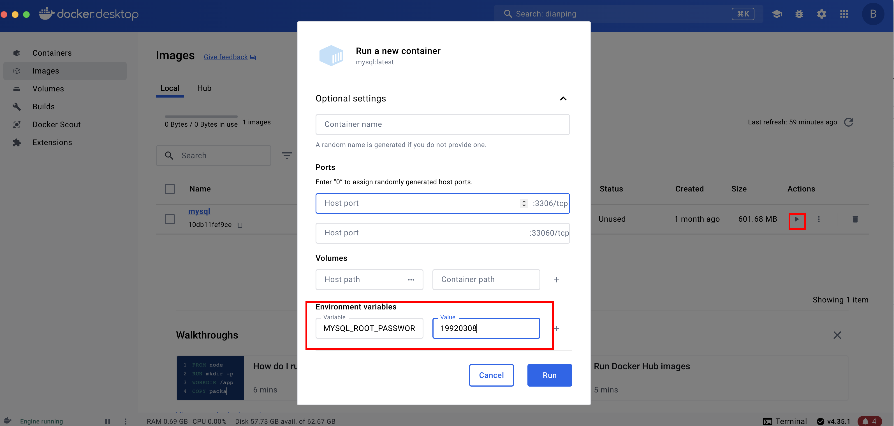
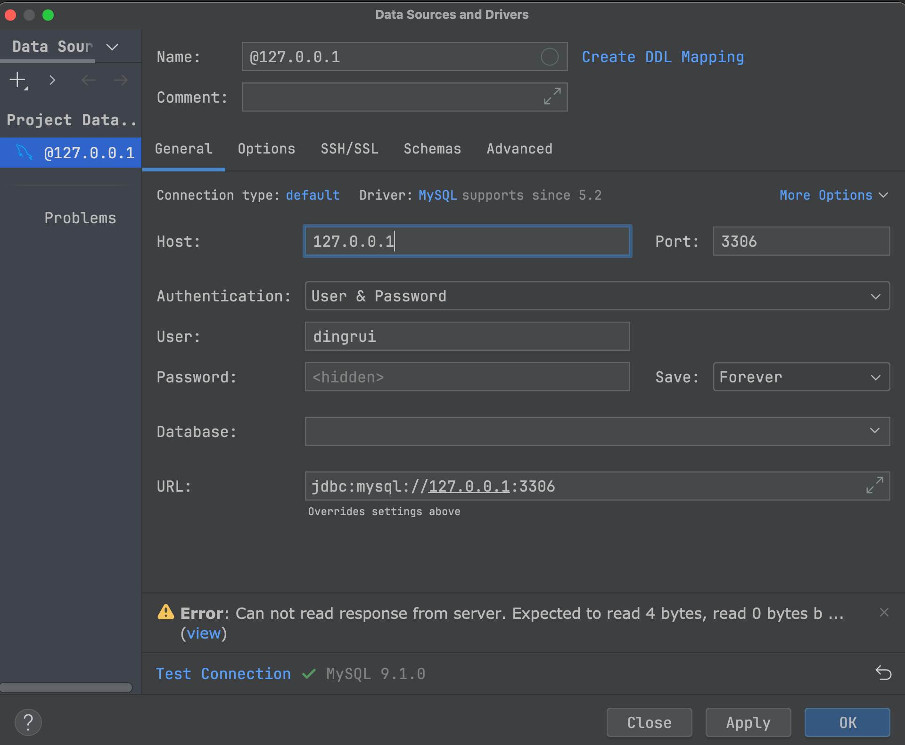

### 1 宿主机目录

```she
mkdir -p /Users/dingrui/MyApp/docker-app/mysql5
touch docer-compose.yml
```

### 2 docker compose

mysql官方没有mac arm架构的镜像

```sh
docker pull mysql:5.7 --platform linux/x86_6
```



为了多应用容器共享同个数据库，需要建立docker网络

```sh
docker network create mysql5network
```

```yaml
services:
  mysql5:
    image: mysql:5.7
    container_name: mysql5
    ports:
      - 3306:3306
    environment:
      - MYSQL_ROOT_PASSWORD=19920308
```

执行`docker-compose up -d`

### 3 新建mysql用户

启动docker bash以root用户登陆

`mysql -uroot -p19920308`

创建个新的mysql用户并分配远程访问权限

```sh
CREATE USER 'dingrui'@'%' IDENTIFIED BY '19920308';
GRANT ALL ON *.* TO 'dingrui'@'%';
FLUSH PRIVILEGES;
```

### 4 连接mysql

然后用宿主机ip进行连接

