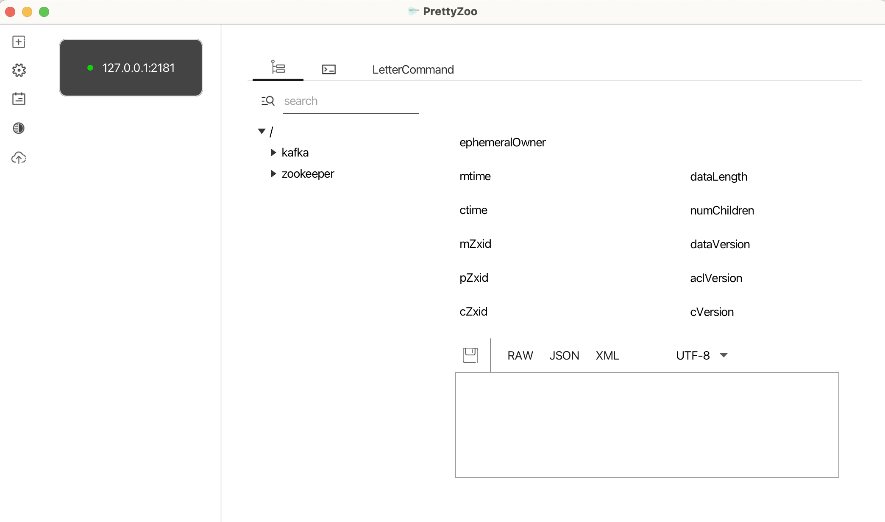
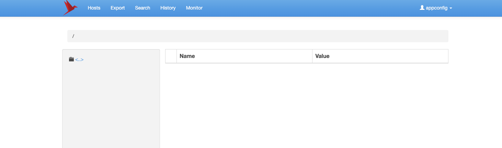

### 1 宿主机目录

```sh
cd /Users/dingrui/MyApp/docker-app/zk
mkdir zk1
mkdir zk2
mkdir zk3
touch docker-compose.yml
```

### 2 docker compose

#### 2.1 单机
```yaml
# zk单机
services:
  zk1:
    image: zookeeper:3.9
    hostname: zk1
    container_name: zk1
    # 8080端口是web admin 不要映射
    ports:
      - 2181:2181
    volumes:
      - ./zk1/data:/data
      - ./zk1/datalog:/datalog
```

#### 2.2 集群
```yaml
# 给zk集群配置一个网络，网络名为zk-net
networks:
  zk-net:
    name: zk-net

# zk集群
services:
  zk1:
    image: zookeeper:3.9
    hostname: zk1
    container_name: zk1
    # 8080端口是web admin 不要映射
    ports:
      - 2181:2181
    environment:
      # 当前zk实例的id
      ZOO_MY_ID: 1
      # 整个zk集群的机器、端口列表 2181服务端口开发给客户端程序连接集群 3888选主 2888内部通讯
      ZOO_SERVERS: server.1=0.0.0.0:2888:3888;2181 server.2=zk2:2888:3888;2181 server.3=zk3:2888:3888;2181
    volumes:
      - ./zk1/data:/data
      - ./zk1/datalog:/datalog
    # 加入名为zk-net的隔离网络
    networks:
      - zk-net

  zk2:
    image: zookeeper:3.9
    hostname: zk2
    container_name: zk2
    ports:
      - 2182:2181
    environment:
      ZOO_MY_ID: 2
      ZOO_SERVERS: server.1=zk1:2888:3888;2181 server.2=0.0.0.0:2888:3888;2181 server.3=zk3:2888:3888;2181
    volumes:
      - ./zk2/data:/data
      - ./zk2/datalog:/datalog
    networks:
      - zk-net

  zk3:
    image: zookeeper:3.9
    hostname: zk3
    container_name: zk3
    ports:
      - 2183:2181
    environment:
      ZOO_MY_ID: 3
      ZOO_SERVERS: server.1=zk1:2888:3888;2181 server.2=zk2:2888:3888;2181 server.3=0.0.0.0:2888:3888;2181
    volumes:
      - ./zk3/data:/data
      - ./zk3/datalog:/datalog
    networks:
      - zk-net
```

### 3 启动容器

```sh
docker-compose up -d
```

### 4 ui管理

[下载安装](https://github.com/vran-dev/PrettyZoo/releases)


但是这个dmg不支持mac arm架构的处理器，因此要另寻他路，修改上面的脚本

```yaml
# zk单机
services:
  zk1:
    image: zookeeper:3.9
    hostname: zk1
    container_name: zk1
    # 8080端口是web admin 不要映射
    ports:
      - 2181:2181
    volumes:
      - ./zk1/data:/data
      - ./zk1/datalog:/datalog
  #连接zk服务端的ui管理后台
  zkui:
    build:
      context: .
      dockerfile: Dockerfile
    restart: on-failure:3
    container_name: zkui
    ports:
      - 9090:9090
```

```Dockerfile
#FROM arm64v8/openjdk:8-jre
FROM bitnami/java:1.8
WORKDIR /var/app
RUN apt-get update && apt-get install -y git maven 
RUN git clone https://github.com/DeemOpen/zkui.git
RUN cd zkui && mvn clean package
RUN mv ./zkui/target/zkui-*jar-with-dependencies.jar ./zkui.jar
RUN mv ./zkui/config.cfg ./config.cfg
# localhost替换host.docker.internal
RUN sed -i "s/localhost/host.docker.internal/g" ./config.cfg
ENTRYPOINT java -jar zkui.jar
EXPOSE 9090
```

部署好后连接宿主机`127.0.0.1:9090`即可
