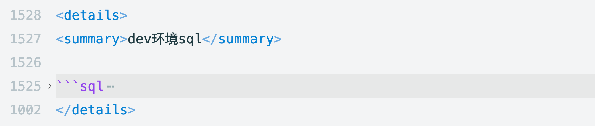
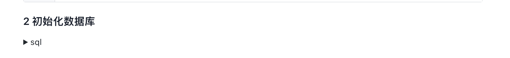
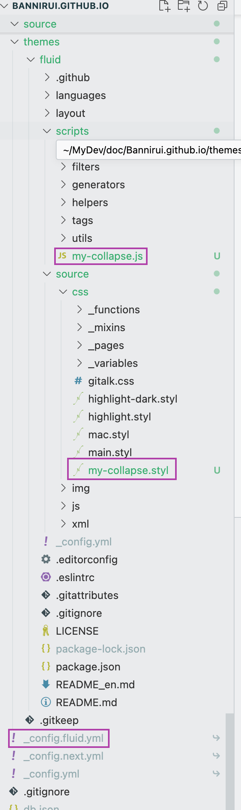
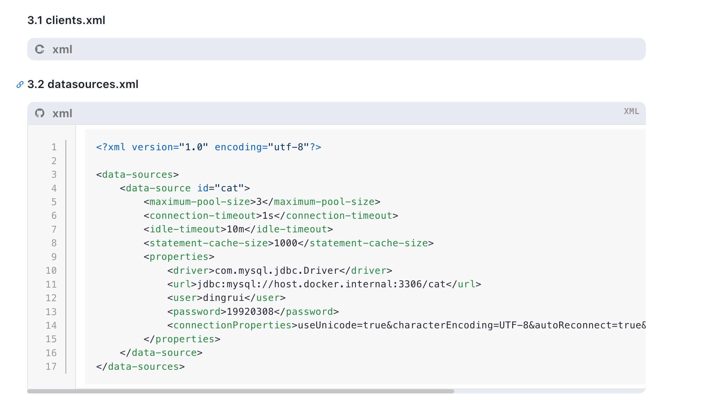

### 1 markdown语法



其呈现效果比较丑陋



### 2 Hexo过滤器



考虑到以后可能会在fluid源码上扩展，甚至改变了fluid的集成方式，从npm包换成了源码方式
添加js和css文件，更新主题配置文件

- /themes/fluid/scripts/my-collapse.js
- /themes/fluid/source/css/my-collapse.styl
- _conifg.fluid.yml

#### 2.1 js

```js
"use strict";

// 获取唯一 ID
function getUuid() {
  return Math.random().toString(36).substring(2, 8) + Date.now().toString(36);
}

hexo.extend.filter.register(
  "after_post_render",
  (data) => {
    const { line_number, lib } = hexo.theme.config.code.highlight;

    let reg;
    if (lib === "highlightjs") {
      if (line_number) {
        reg = /(<figure class="highlight.+?>)(.+?hljs (.*?)".+?)(<\/figure>)/gims;
      } else {
        reg = /(<div class="code-wrapper.+?>)(.+?hljs (.*?)".+?)(<\/div>)/gims;
      }
    } else if (lib === "prismjs") {
      reg = /(<div class="code-wrapper.+?>)(.+?data-language="(.*?)".+?)(<\/div>)/gims;
    }

    data.content = data.content.replace(reg, (match, begin, inner, lang, end, offset, string) => {
      const collapseId = `collapse-${getUuid()}`;
      //                             ↓↓↓↓↓↓↓↓↓↓↓↓↓↓↓↓↓↓↓↓↓↓↓↓↓ 设置折叠按钮图标，此处使用 GitHub 图标
      const collapseBtn = `<i class="iconfont icon-github-fill" type="button" data-toggle="collapse" data-target="#${collapseId}"></i>`;
      const collapseDiv = `<div class="collapse show" id="${collapseId}">${inner}</div>`;
      const langSpan = `<span>${lang}</span>`;
      return begin + collapseBtn + langSpan + collapseDiv + end;
    });
    return data;
  },
  10000 // 应该在完成其他渲染后执行，因此将优先级设大一点
);
```

#### 2.2 css

```css
.markdown-body .highlight table,
.markdown-body .code-wrapper pre {
  border-radius: 0 0 0.5rem 0.5rem;
}

.markdown-body .highlight,
.markdown-body .code-wrapper {
  background-color: #e6ebf1;
  border-radius: 0.625rem;

  // 折叠图标
  > i {
    color: #777777;
    margin-left: 10px;
    line-height: 2rem;
    transform: none;
    transition: color 0.2s ease-in-out, transform 0.2s ease-in-out;

    &.collapsed {
      transform: rotate(-90deg);
    }
  }

  // 代码语言
  > span {
    color: #777777;
    margin-left: 10px;
    font-weight: bold;
  }
}

[data-user-color-scheme='dark'] {
  .markdown-body .highlight,
  .markdown-body .code-wrapper {
    background-color: #696969;
    transition: background-color 0.2s ease-in-out;

    > i {
      color: #c4c6c9;
    }

    > span {
      color: #c4c6c9;
      transition: color 0.2s ease-in-out;
    }
  }
}
```

#### 2.3 配置文件

```yaml
custom_css: # 自定义css
  - /css/iconfont_gmail/iconfont.css
  - /css/iconfont_outlook/iconfont.css
  - /css/my-collapse.css # 代码块折叠样式
  #- /css/mac.css # mac风格代码块
```

### 3 效果

