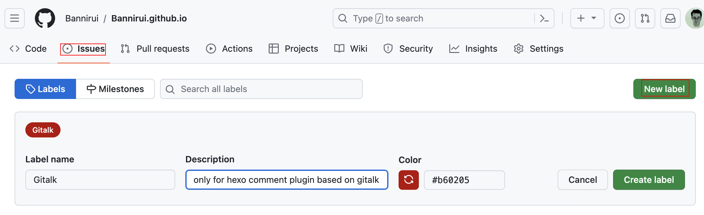
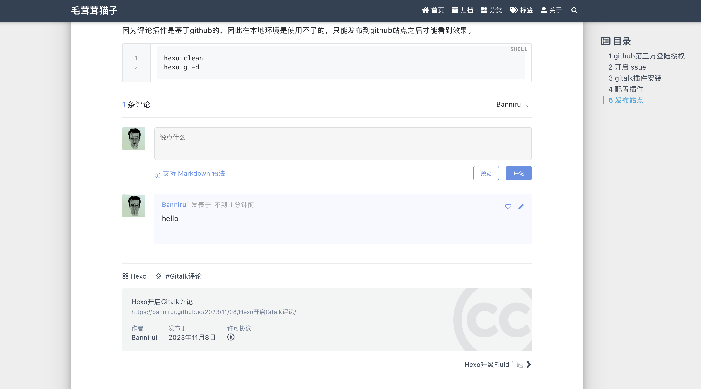
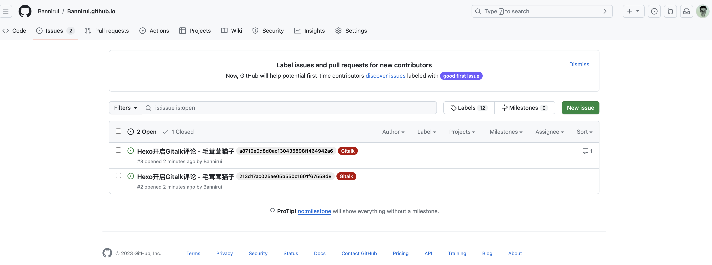
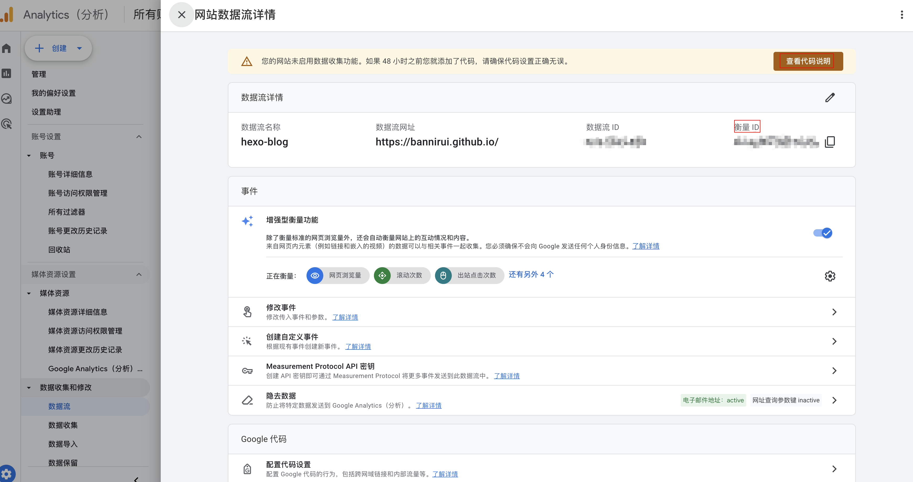
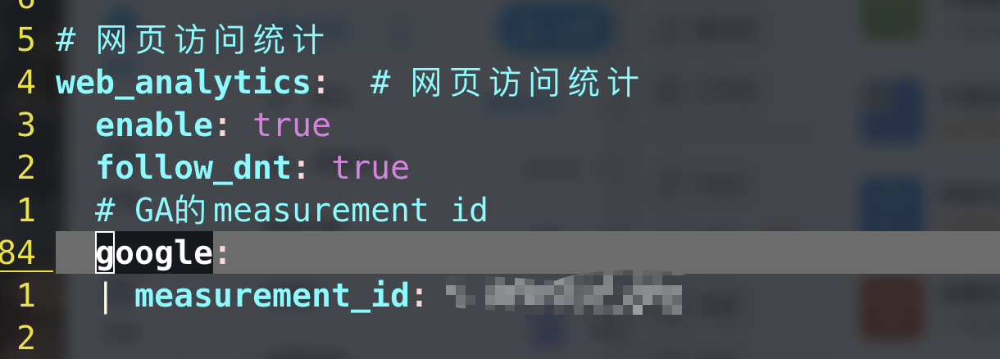
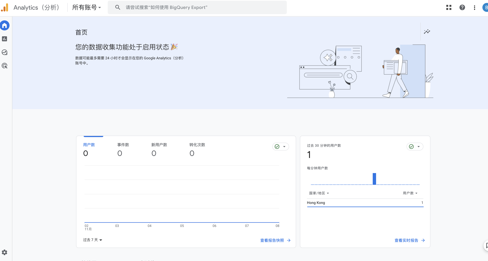
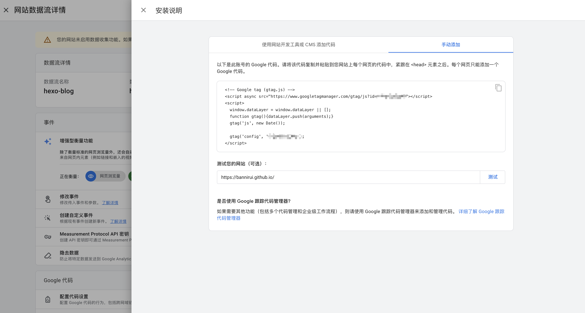

### 1 安装主题

在博客根目录下执行`sudo npm install --save hexo-theme-fluid`即可，这时候将Fluid的版本作为了博客项目的依赖进行管理，以后升级也很简单`sudo npm update --save hexo-theme-fluid`。

### 2 链接配置文件

- 先到[github上](https://github.com/fluid-dev/hexo-theme-fluid/blob/master/_config.yml)把配置文件复制出来

- 托管到自己的[github上](https://github.com/Bannirui/os_script)，统一管理工具链配置


fluid的配置文件`根目录/_config.fluid.yaml`

### 3 主题配置

#### 3.1 博客标题

配置项为`blog_title`

```yaml
blog_title: "光秃秃的猫子"
```

#### 3.2 主页文字

配置项为`text`

```yaml
text: "Bannriui的个人博客"
```

#### 3.3 git发布

##### 3.3.1 插件

依赖插件hexo-deployer-git

```sh
sudo npm install hexo-deployer-git --save
```

##### 3.3.2 配置token

将github的token配置在了环境变量GITHUB_TOKEN_FOR_HEXO中，在`~/.zshrc`中export该环境变量即可

```yaml
deploy:
  type: git
  repo: git@github.com:Bannirui/Bannirui.github.io.git
  branch: master
  token: $GITHUB_TOKEN_FOR_HEXO
```

#### 3.4 Gitalk评论

为hexo博客开启页面评论功能

##### 3.4.1 github第三方登陆授权
---

根据地址连接进行填写即可，https://github.com/settings/applications/new

根据提示信息填写好之后保存Client ID和Client secrets


如果之后忘记了信息可以点进[网址](https://github.com/settings/developers)查询

##### 3.4.2 开启issue

我觉得没有必要专门再创建一个仓库用来做comment，因此就直接基于了当前博客托管的仓库，在issue中创建一个新的label。



##### 3.4.3 gitalk插件安装

在博客根目录安装插件

```shell
(sudo) npm install hexo-plugin-gitalk --save
```

##### 3.4.4 配置插件

所配置的内容就是从github申请的auth信息，需要注意的是repo填写的是仓库名字而不是地址。

##### 3.4.4.1 hexo的配置

文件`根目录/_config.yaml`


##### 3.4.4.2 fluid的配置

文件`根目录/_config.fluid.yml`


##### 3.4.5 发布站点
---

因为评论插件是基于github的，因此在本地环境是使用不了的，只能发布到github站点之后才能看到效果。

```shell
hexo clean
hexo g -d
```

之后等待发布完成之后就可以使用评论区功能，并且评论的内容会被托管在github的issue中。





#### 3.5 网站数据统计

> Google Analytics提供了对站点访问的数据跟踪，即统计网站流量，便于进行用户行为分析。就是在网站植入回调js，可以自己进行硬编码，但是这样就不容易动态为每篇文章操作。Fluid主题提供了扩展支持，只要适配对应配置即可。

##### 3.5.1 创建GA4账号和媒体应用

创建好媒体应用之后记下measure id，之后要配置到fluid的配置文件中。



##### 3.5.2 配置Fluid



#### 3.5.3 效果



#### 3.5.4 Fluid的实现原理

##### 3.5.4.1 GA的安装说明



##### 3.5.4.2 Fluid的接入方式

在博客项目的node_modules下找到fluid，hexo-theme-fluid/layout/_partials/plugins/analytics.ejs就集成了网站统计的接入方式，其中包括google的，下图就是从_config.fluid.yml中读取配置，编码成GA指定的方式。


#### 3.6 网站运行时长

在网站页脚上显示该站运行时长。

##### 3.6.1 js函数
---

在`根目录\source\js\`路径下新建一个js文件`duration.js`，内容如下：

```js
!(function() {
    /* 建站时间 */
  var start = new Date("2023/02/27 24:00:00");

  function update() {
    var now = new Date();
    now.setTime(now.getTime()+250);
    days = (now - start) / 1000 / 60 / 60 / 24;
    dnum = Math.floor(days);
    hours = (now - start) / 1000 / 60 / 60 - (24 * dnum);
    hnum = Math.floor(hours);
    if(String(hnum).length === 1 ){
      hnum = "0" + hnum;
    }
    minutes = (now - start) / 1000 /60 - (24 * 60 * dnum) - (60 * hnum);
    mnum = Math.floor(minutes);
    if(String(mnum).length === 1 ){
      mnum = "0" + mnum;
    }
    seconds = (now - start) / 1000 - (24 * 60 * 60 * dnum) - (60 * 60 * hnum) - (60 * mnum);
    snum = Math.round(seconds);
    if(String(snum).length === 1 ){
      snum = "0" + snum;
    }
    document.getElementById("timeDate").innerHTML = "本站安全运行&nbsp"+dnum+"&nbsp天";
    document.getElementById("times").innerHTML = hnum + "&nbsp小时&nbsp" + mnum + "&nbsp分&nbsp" + snum + "&nbsp秒";
  }

  update();
  setInterval(update, 1000);
})();
```

##### 3.6.2 配置hexo

文件`根目录/_config.yml`

```yaml
skip_render:
  - js/**
```

这样配置的目的是告诉hexo不要对js目录下的js文件进行渲染，直接将这个文件复制到public目录下

##### 3.6.3 配置fluid

文件`根目录/_config.fluid.yml`文件

```yaml
footer:
  # 页脚加上自定义js 网站运行时长
  content: '
     <div>
       <span id="timeDate">载入天数...</span>
       <span id="times">载入时分秒...</span>
       <script src="/js/duration.js"></script>
     </div>
  '
```

##### 3.6.4 效果

```sh
hexo clean
hexo s

hexo g -d
```

