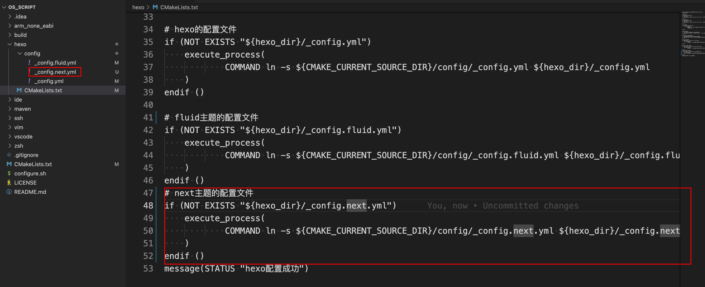

### 1 主题安装

在Fluid的主题安装中说过并不是很喜欢耦合源码的方式，因此还是选用npm管理包的方式

到项目根目录下

```sh
sudo npm install hexo-theme-next
```

将来更新主题`sudo npm install hexo-theme-next@latest`

### 2 启用主题

修改hexo的配置文件`根目录/_config.yml`

```yaml
# 主题
# fluid
# next
theme: next
```

本地运行站点看下效果

```sh
hexo clean
hexo s
```

### 3 主题配置

下面便是针对主题进行配置

- 先到[github上](https://github.com/next-theme/hexo-theme-next/blob/master/_config.yml)把配置文件复制出来

- 托管到自己的[github上](https://github.com/Bannirui/os_script)，统一管理工具链配置



执行如下脚本便可以在`博客根目录`下建立软链接`根目录/_config.next.yml`

```sh
cd /Users/dingrui/MyDev/env/os_script
./configure.sh
```

之后便在`根目录/_config.next.yml`中根据自己的需求进行配置即可

#### 3.1 菜单设置

```yaml
menu:
  home: /home/ || fa fa-home
  tags: /tags/ || fa fa-tags
  categories: /categories/ || fa fa-th
  archives: /archives/ || fa fa-archive
  about: /about/ || fa fa-user
  #schedule: /schedule/ || fa fa-calendar
  #sitemap: /sitemap.xml || fa fa-sitemap
  #commonweal: /404/ || fa fa-heartbeat
```

将来通过`hexo generate`生成静态页面的时候会在`public`目录下生成对应的`index.html`，在source目录下默认是没有这几个页面的

- /source/home/index.md

- /source/home/tags.md

- /source/home/categories.md

- /source/home/about.md

因此要自己新建对应的页面

- 1 home

  - 新建

    ```sh
    hexo new page home
    ```

  - 内容

    ```md
    ---
    title: home
    date: 2024-03-03 15:05:49
    type: home
    ---
    ```

- 2 tags

  - 新建

    ```sh
    hexo new page tags
    ```

  - 内容

    ```md
    ---
    title: 标签
    date: 2024-03-03 14:59:32
    type: tags
    ---
    ```

 - 3 categories

  - 新建

    ```sh
    hexo new page categories
    ```

  - 内容

    ```md
    ---
    title: 类别
    date: 2024-03-03 14:59:43
    type: categories
    ---
    ```

- 4 about

  - 新建

    ```sh
    hexo new page about
    ```

  - 内容

    ```md
    ---
    title: about
    date: 2023-02-27 22:43:06
    layout: about
    ---
    ```