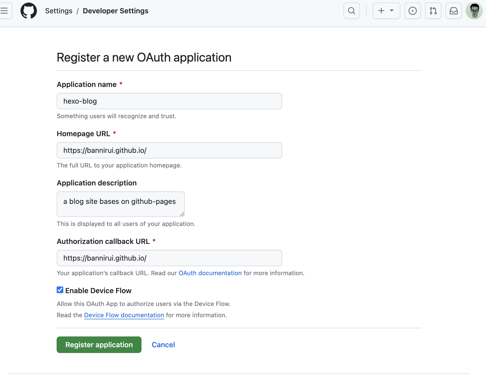
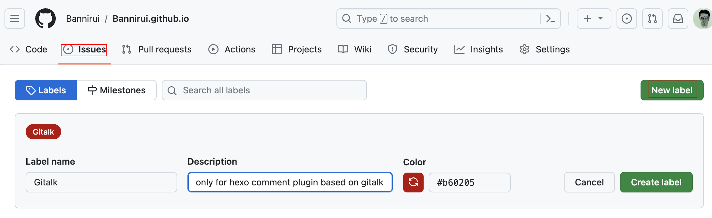
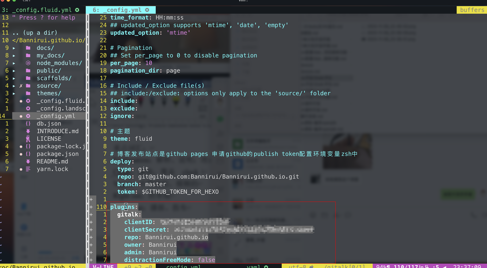
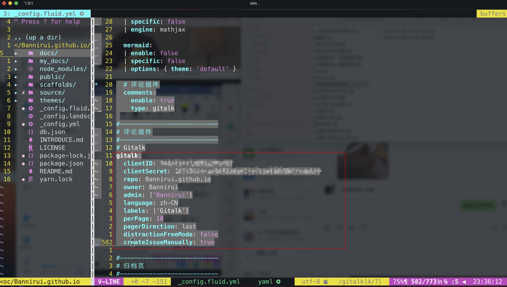

为hexo博客开启页面评论功能。

1 github第三方登陆授权
---

根据地址连接进行填写即可，https://github.com/settings/applications/new，根据提示信息填写好之后保存Client ID和Client secrets。



如果之后忘记了信息可以点进[网址](https://github.com/settings/developers)查询。

2 开启issue
---

我觉得没有必要专门再创建一个仓库用来做comment，因此就直接基于了当前博客托管的仓库，在issue中创建一个新的label。



3 gitalk插件安装
---

在博客根目录安装插件

```shell
(sudo) npm install hexo-plugin-gitalk --save
```

4 配置插件
---

所配置的内容就是从github申请的auth信息，需要注意的是repo填写的是仓库名字而不是地址。

4.1 hexo的配置文件_config.yml



4.2 fluid的配置文件_config.fluid.yml



5 发布站点
---

因为评论插件是基于github的，因此在本地环境是使用不了的，只能发布到github站点之后才能看到效果。

```shell
hexo clean
hexo g -d
```


