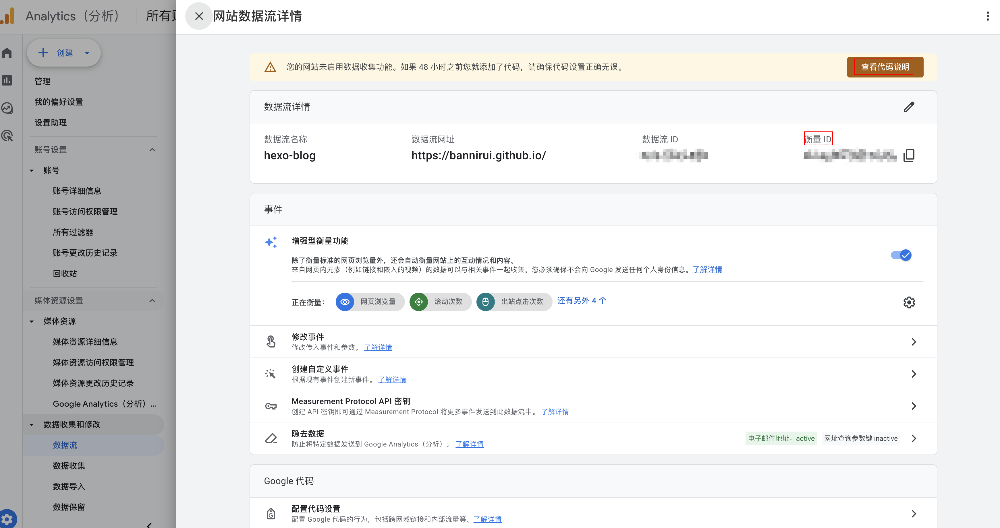
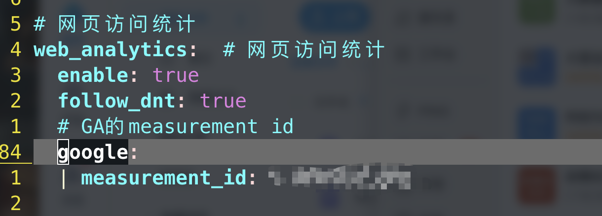
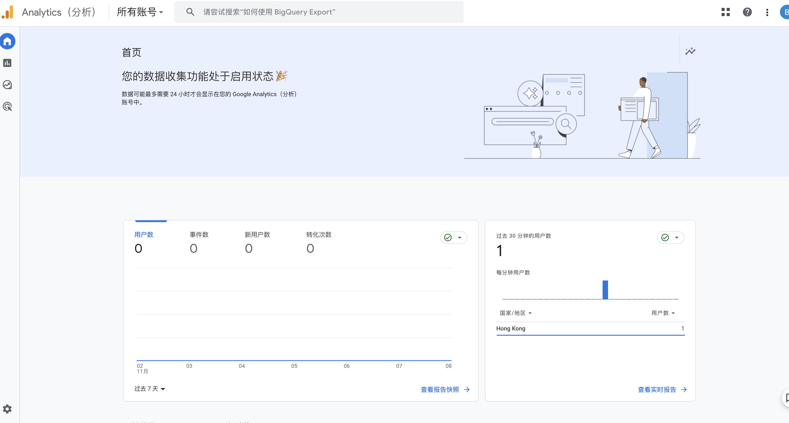
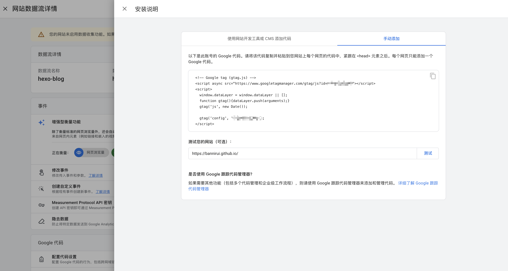
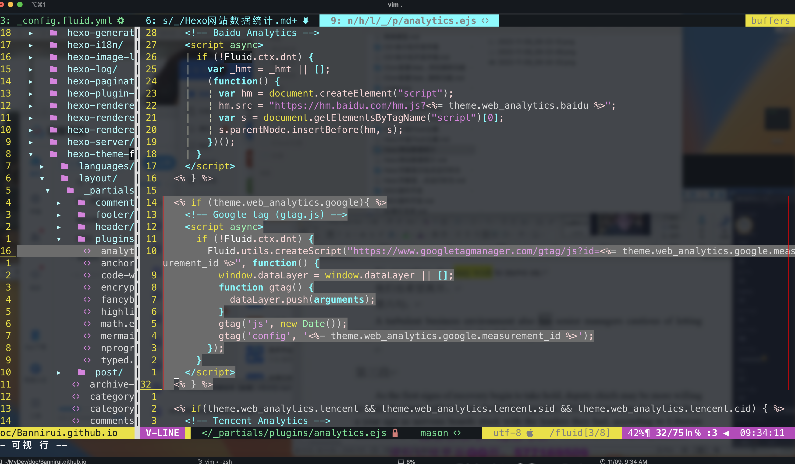

> Google Analytics提供了对站点访问的数据跟踪，即统计网站流量，便于进行用户行为分析。就是在网站植入回调js，可以自己进行硬编码，但是这样就不容易动态为每篇文章操作。Fluid主题提供了扩展支持，只要适配对应配置即可。

1 创建GA4账号和媒体应用
---

创建好媒体应用之后记下measure id，之后要配置到fluid的配置文件。

2 配置Fluid
---

3 效果
---

4 Fluid的实现原理
---

### 4.1 GA的安装说明

### 4.2 Fluid的接入方式

在博客项目的node_modules下找到fluid，hexo-theme-fluid/layout/_partials/plugins/analytics.ejs就集成了网站统计的接入方式，其中包括google的，下图就是从_config.fluid.yml中读取配置，编码成GA指定的方式。

