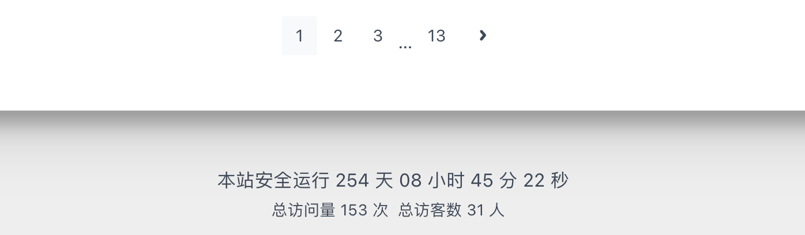

> 在网站页脚上显示该站运行时长。

1 js函数
---

在`根目录\source\vvd_js\`路径下新建一个js文件`duration.js`，内容如下：

```js
!(function() {
    /* 建站时间 */
  var start = new Date("2023/02/27 24:00:00");

  function update() {
    var now = new Date();
    now.setTime(now.getTime()+250);
    days = (now - start) / 1000 / 60 / 60 / 24;
    dnum = Math.floor(days);
    hours = (now - start) / 1000 / 60 / 60 - (24 * dnum);
    hnum = Math.floor(hours);
    if(String(hnum).length === 1 ){
      hnum = "0" + hnum;
    }
    minutes = (now - start) / 1000 /60 - (24 * 60 * dnum) - (60 * hnum);
    mnum = Math.floor(minutes);
    if(String(mnum).length === 1 ){
      mnum = "0" + mnum;
    }
    seconds = (now - start) / 1000 - (24 * 60 * 60 * dnum) - (60 * 60 * hnum) - (60 * mnum);
    snum = Math.round(seconds);
    if(String(snum).length === 1 ){
      snum = "0" + snum;
    }
    document.getElementById("timeDate").innerHTML = "本站安全运行&nbsp"+dnum+"&nbsp天";
    document.getElementById("times").innerHTML = hnum + "&nbsp小时&nbsp" + mnum + "&nbsp分&nbsp" + snum + "&nbsp秒";
  }

  update();
  setInterval(update, 1000);
})();
```

2 hexo配置
---

```yaml
skip_render:
  - vvd_js/**
```

3 fluid配置
---

```yaml
footer:
  # 页脚加上自定义js 网站运行时长
  content: '
     <div>
       <span id="timeDate">载入天数...</span>
       <span id="times">载入时分秒...</span>
       <script src="/vvd_js/duration.js"></script>
     </div>
  '

```

4 效果
---


