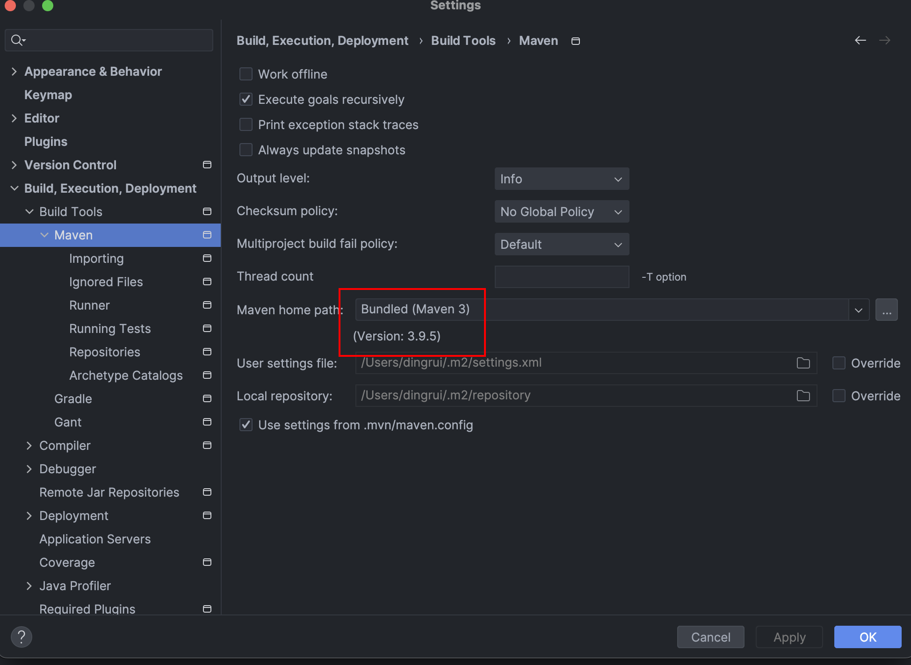
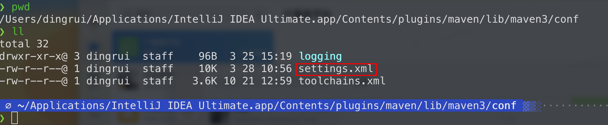

升级IDE之后，maven拉取包报错，禁用了http的域名

### 1 maven插件版本

版本大于3.8的



### 2 maven安装目录的配置

找到IDE内置maven的安装目录

`/Users/dingrui/Applications/IntelliJ IDEA Ultimate.app/Contents/plugins/maven/lib/maven3/conf`



如下配置内容注释即可

```xml
    <!--maven3.8.x之后就加了这样一个默认配置 禁用了http的仓库 但是公司私服基本都是http的-->
    <!--
    <mirror>
      <id>maven-default-http-blocker</id>
      <mirrorOf>external:http:*</mirrorOf>
      <name>Pseudo repository to mirror external repositories initially using HTTP.</name>
      <url>http://0.0.0.0/</url>
      <blocked>true</blocked>
    </mirror>
    -->
```