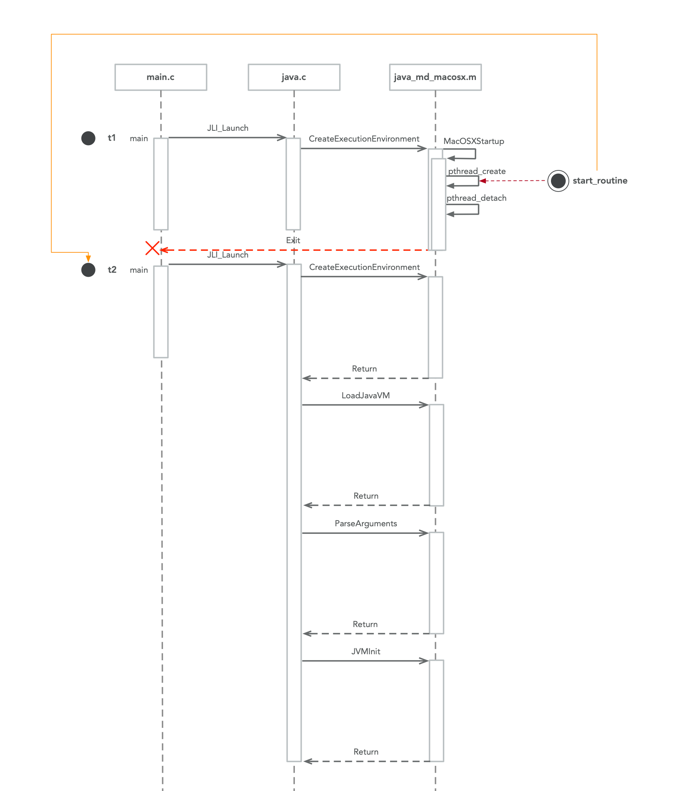

这个函数涉及过程比较多，按照功能将其拆分成小的模块。

### 1 参数解析

这个环节我觉得不重要，就是打端点看看哪些参数做了哪些操作，所有的这些变量肯定都是为了后面服务的执行铺垫的，后面看到重要的环节了，不知道某个参数怎么赋值的再回过头来看就行了。

```c
  /**
   * java的启动方式
   *   - Class启动
   *   - Jar包启动
   *   - ...
   */
    int mode = LM_UNKNOWN;
    char *what = NULL;
    char *main_class = NULL;
    int ret;
    InvocationFunctions ifn;
    jlong start = 0, end = 0;
    char jvmpath[MAXPATHLEN];
    char jrepath[MAXPATHLEN];
    char jvmcfg[MAXPATHLEN];

    _fVersion = fullversion;
    _launcher_name = lname;
    _program_name = pname;
    _is_java_args = javaargs;
    _wc_enabled = cpwildcard;

    // 窗体模式启动进程 只支持win系统
    InitLauncher(javaw);
    DumpState();
    if (JLI_IsTraceLauncher()) {
        int i;
        printf("Java args:\n");
        for (i = 0; i < jargc ; i++) {
            printf("jargv[%d] = %s\n", i, jargv[i]);
        }
        printf("Command line args:\n");
        for (i = 0; i < argc ; i++) {
            printf("argv[%d] = %s\n", i, argv[i]);
        }
        AddOption("-Dsun.java.launcher.diag=true", NULL);
    }

    /*
     * SelectVersion() has several responsibilities:
     *
     *  1) Disallow specification of another JRE.  With 1.9, another
     *     version of the JRE cannot be invoked.
     *  2) Allow for a JRE version to invoke JDK 1.9 or later.  Since
     *     all mJRE directives have been stripped from the request but
     *     the pre 1.9 JRE [ 1.6 thru 1.8 ], it is as if 1.9+ has been
     *     invoked from the command line.
     */
    SelectVersion(argc, argv, &main_class);
```

### 2 

```c
    /**
     * 创建运行环境
     *   - 解析jre jvm路径
     *   - 创建线程t2
     *     - 第一次执行到这的线程是t1 t2被创建之后t1被挂起
     *     - t2线程被cpu调度之后执行的是main.c中的入口方法main 顺着调用链会再次执行到这
     *     - 第二次执行和第一次执行的唯一区别就是不用再创建新的线程
     */
    CreateExecutionEnvironment(&argc, &argv,
                               jrepath, sizeof(jrepath),
                               jvmpath, sizeof(jvmpath),
                               jvmcfg,  sizeof(jvmcfg));
```

也就是说从启动开始，会有2个不同的线程以同样的启动参数执行到这。

时序图如下：



### 3 加载JVM

### 4 解析命令行参数

### 5 启动JVM
