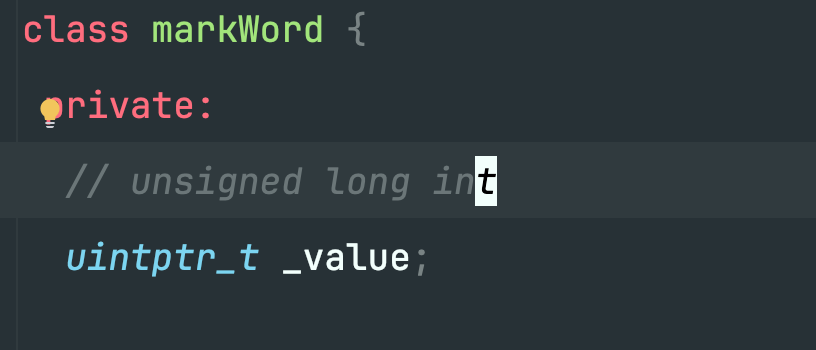
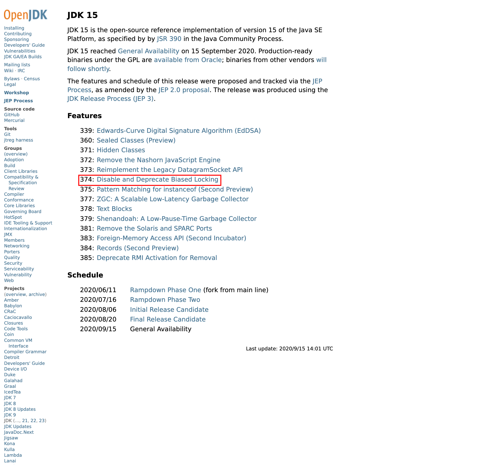
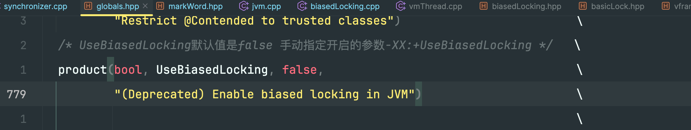
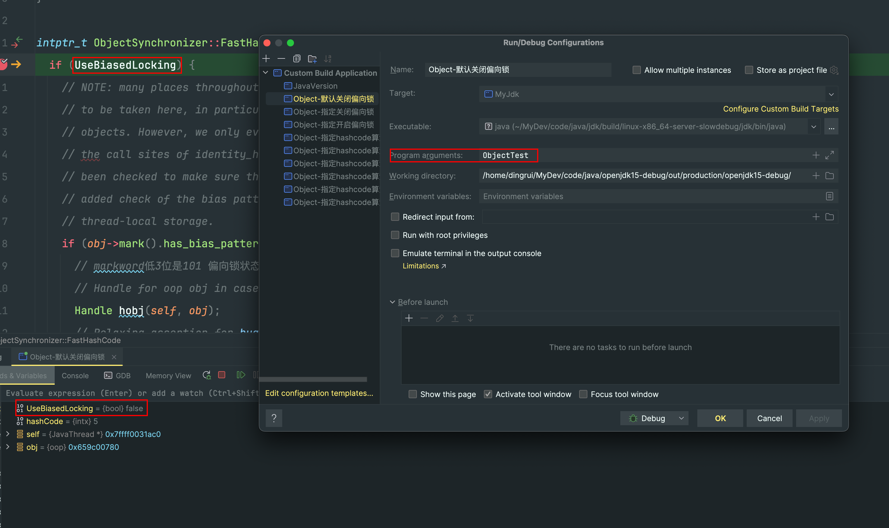
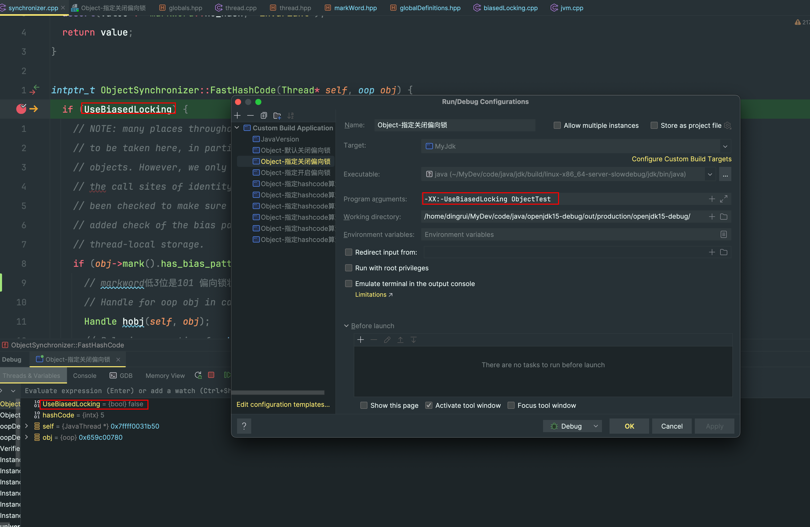
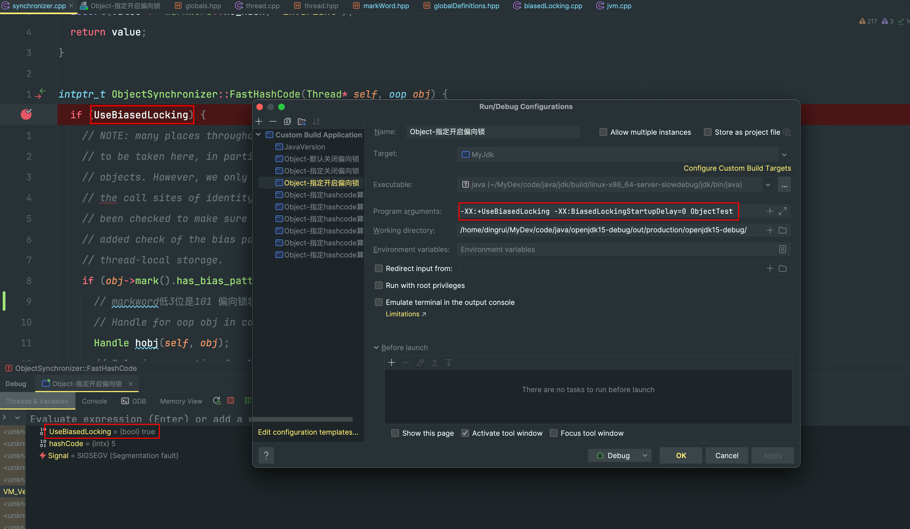

### 1 类结构



```cpp
#if __WORDSIZE == 64
# ifndef __intptr_t_defined
typedef long int		intptr_t;
#  define __intptr_t_defined
# endif
typedef unsigned long int	uintptr_t;
```

这个类很简单，就一个成员变量`_value`，以我当前64位系统为例，该成员的类型是64位整数

即，markword就是一个64位的整数

### 2 布局


关于不同状态的翻译，下面贴上源码中的注释作为对比

|中文|英文|
|---|---|
|无锁|unlocked|
|偏向锁|biased|
|轻量级锁|locked|
|重量级锁|monitor|
|GC标记|marked|

偏向锁状态下根据高位记录的线程id又分为

- 记录了偏向的线程id `lock is biased toward given thread`

- 记录了0 `lock is anonymously biased`

### 3 偏向锁



我是基于jdk15进行的学习，官网可以看到openjdk15的特性，其中之一就是默认关闭了偏向锁

文件`src/hotspot/share/runtime/globals.hpp`



### 3.1 验证UseBiasedLocking

#### 3.1.1 默认



#### 3.1.1 手动关闭



#### 3.1.1 手动开启

