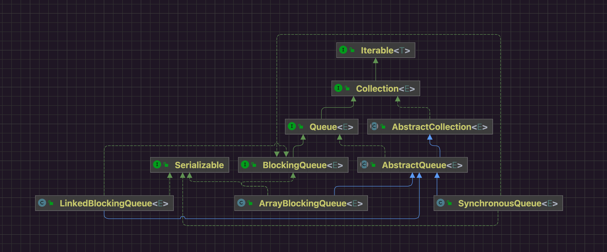

## 1 阻塞队列API

|         | Throws exception | Special value | Blocks | Times out            |
| ------- | ---------------- | ------------- | ------ | -------------------- |
| Insert  | add(e)           | offer(e)      | put(e) | offer(e, time, unit) |
| Remove  | remove()         | poll()        | take() | poll(time, uint)     |
| Examine | element()        | peek()        |        |                      |

## 2 类图



## 3 构造方法

```java
// ArrayBlockingQueue.java
final Object[] items; // 存放数据元素的数组
int putIndex; // put脚标
int count; // 队列中存放的元素数量

/**
     * ReentrantLock
     *     - 保证多生产者多消费者场景下线程安全
     *     - 通过条件队列实现阻塞/通知模式
     */
final ReentrantLock lock;

/**
     * ReentrantLock锁的条件队列
     * 队列已经空了就无法继续take元素 让线程阻塞在条件队列上
     * 阻塞在上面的线程只有队列不为空才会被唤醒 有机会继续竞争take元素
     */
@SuppressWarnings("serial")  // Classes implementing Condition may be serializable.
private final Condition notEmpty;

/** Condition for waiting puts */
/**
     * ReentrantLock锁的条件队列
     * 队列已经满了就无法继续put元素 让线程阻塞在条件队列上
     * 阻塞在上面的线程只有队列不满才会被唤醒 有机会继续竞争put元素
     */
@SuppressWarnings("serial")  // Classes implementing Condition may be serializable.
private final Condition notFull;

public ArrayBlockingQueue(int capacity, boolean fair) {
    if (capacity <= 0)
        throw new IllegalArgumentException();
    this.items = new Object[capacity]; // 数据结构使用数组 必须指定容量进行初始化
    lock = new ReentrantLock(fair); // 默认使用非公平锁 吞吐高于公平锁
    notEmpty = lock.newCondition();
    notFull =  lock.newCondition();
}
```

ArrayBlockingQueue使用的数据结构是数组，通过两个指针移动控制元素入队出队，循环往复。

阻塞的实现依赖于ReentrantLock的条件队列。

## 4 API

### 4.1 put

```java
// ArrayBlockingQueue.java
public void put(E e) throws InterruptedException {
        Objects.requireNonNull(e);
        final ReentrantLock lock = this.lock;
        lock.lockInterruptibly();
        try {
            while (count == items.length)
                notFull.await(); // 队列已经满了就把put线程阻塞在条件队列上 等待有其他线程take走元素唤醒put线程
            this.enqueue(e); // 元素入队操作
        } finally {
            lock.unlock();
        }
    }
```


```java
// ArrayBlockingQueue.java
private void enqueue(E e) { // 元素入队操作
        // assert lock.isHeldByCurrentThread();
        // assert lock.getHoldCount() == 1;
        // assert items[putIndex] == null;
        final Object[] items = this.items;
        items[this.putIndex] = e;
        if (++putIndex == this.items.length) putIndex = 0; // 移动put脚标
        this.count++; // 更新元素数量
        this.notEmpty.signal(); // 尝试唤醒曾经因为队列空了阻塞的take线程
    }
```

### 4.2 take

```java
// ArrayBlockingQueue.java
public E take() throws InterruptedException {
    final ReentrantLock lock = this.lock;
    lock.lockInterruptibly();
    try {
        while (count == 0)
            notEmpty.await(); // 队列已经空了就把当前take线程阻塞在ReentrantLock的条件队列上 等待其他线程put元素后唤醒take线程
        return this.dequeue(); // 元素出队
    } finally {
        lock.unlock();
    }
}
```


```java
// ArrayBlockingQueue.java
private E dequeue() {
    // assert lock.isHeldByCurrentThread();
    // assert lock.getHoldCount() == 1;
    // assert items[takeIndex] != null;
    final Object[] items = this.items;
    @SuppressWarnings("unchecked")
    E e = (E) items[takeIndex]; // 取到的元素
    items[takeIndex] = null; // help GC
    if (++takeIndex == items.length) takeIndex = 0; // 移动take脚标
    count--; // 元素数量跟新
    if (this.itrs != null)
        this.itrs.elementDequeued();
    this.notFull.signal(); // 尝试唤醒曾经可能因为队列满了而阻塞的put线程
    return e;
}
```

## *5* 总结

|                  | ArrayBlockingQueue                 |
| ---------------- | ---------------------------------- |
| 数据结构         | 数组                               |
| 是否有界         | 有界，必须指定大小初始化数组       |
| 锁实现           | ReentrantLock                      |
| 锁数量           | 1                                  |
| 线程阻塞机制     | ReentrantLock条件队列阻塞/通知唤醒 |
| 生产者消费者用锁 | 共用同一个锁                       |

