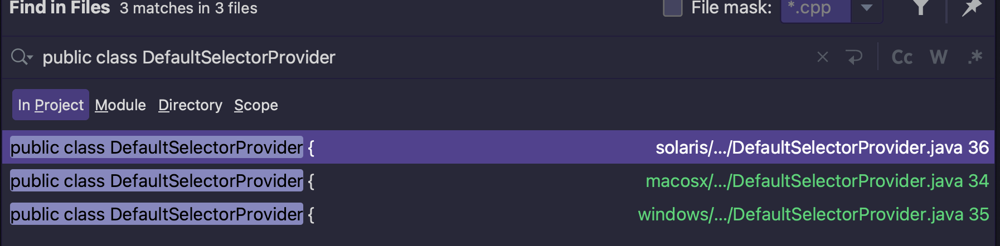
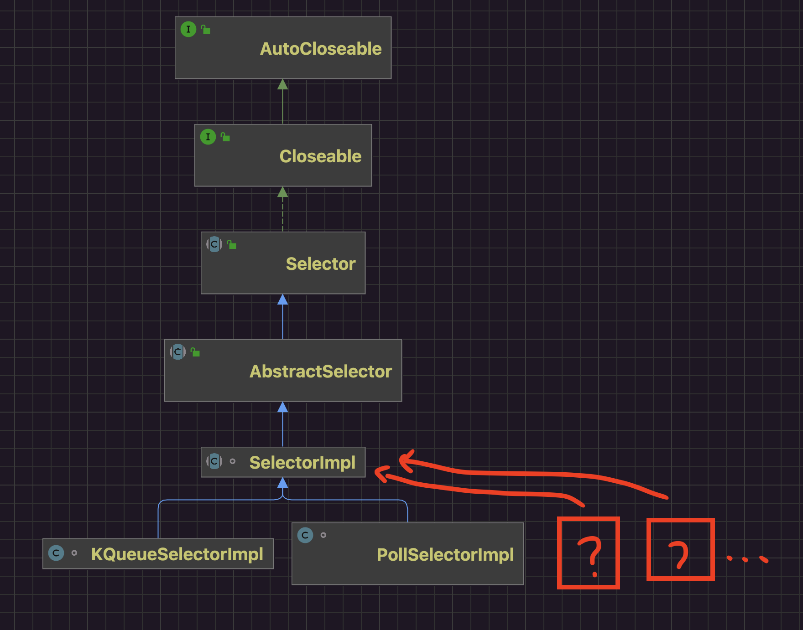
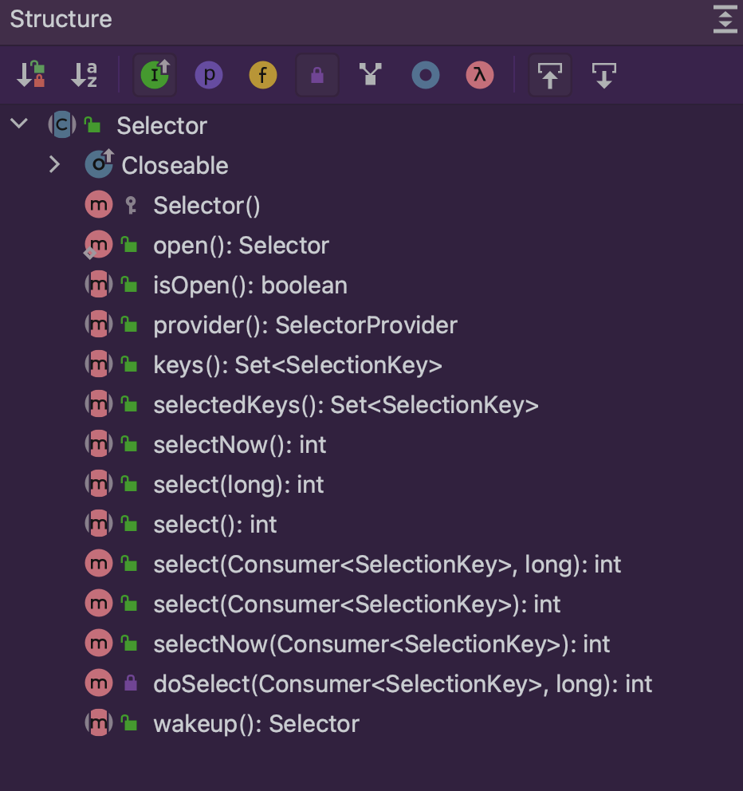
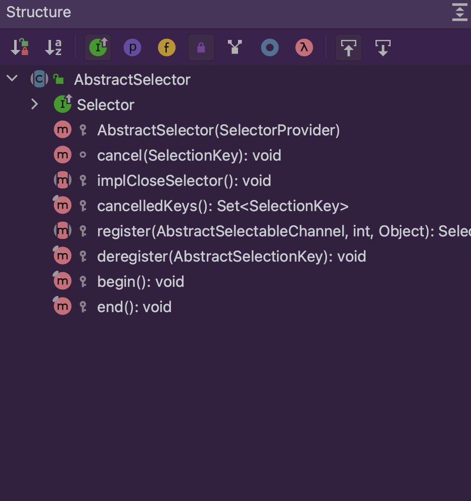

对操作系统而言：

1 多路复用就是os提供了系统调用，能一次性知道多个fd的状态。

2 不同的操作系统类型有不同的实现方式，实现方式即使是轮询也是发生在kernel中，其效率肯定远远大于在内核外的轮询。

* select 数组容量限制fd数量的无差别轮询O(N) 发生内存拷贝
* poll 没有fd数量限制的链表无差别轮询O(N) 发生内存拷贝
* epoll 近乎O(1)时间复杂度

就Java而言，封装统一API，追根溯源是依赖OS的实现方式。

## 一 Demo

```java
package debug.io.nio;

import java.io.IOException;
import java.net.InetSocketAddress;
import java.nio.channels.SelectionKey;
import java.nio.channels.Selector;
import java.nio.channels.ServerSocketChannel;
import java.util.Iterator;
import java.util.Set;

/**
 * <p>{@link Selector}就是复用器 在java nio下的一种对多路复用的具体实现<ul>
 *     <li>select</li>
 *     <li>poll</li>
 *     <li>epoll</li>
 *     <li>kqueue</li>
 * </ul></p>
 * @since 2022/5/21
 * @author dingrui
 */
public class SelectorTest {

    public static void main(String[] args) throws IOException {
        // 服务端创建 监听端口
        ServerSocketChannel channel = ServerSocketChannel.open();
        channel.configureBlocking(false);
        channel.bind(new InetSocketAddress(9001));

        // 创建一个复用器
        Selector selector = Selector.open();
        channel.register(selector, SelectionKey.OP_ACCEPT); // 把channel注册到复用器
        int ret = selector.select();// 阻塞调用
        Set<SelectionKey> selectionKeys = selector.selectedKeys(); // 拿到事件就绪的channel

        // 以下就是根据业务展开了
        Iterator<SelectionKey> it = selectionKeys.iterator();
        while (it.hasNext()){
            SelectionKey sk = it.next();
            it.remove();
            sk.isValid();
            sk.isWritable();
            sk.isReadable();
            sk.isAcceptable();
        }
    }
}

```

重点API：

* Selector.open()
* serverSocketChannel.register()
* selector.select()

整体执行流程：

* 根据不同的OS类型，JDK适配操作系统创建不同的复用器实现，即open()方法。
* 一个复用器管理N个Channel，在恰当时机告知业务层有哪些Channel已经事件到达。
  * 每个Channel跟复用器的关联通过register()方法实现，
  * 让复用器对该Channel某种类型事件(连接、可读、可写)进行监听。
* 恰当的时机就是select()方法。

## 二 源码剖析

### 1 Java IO多路复用器创建

#### 1.1 Selector.open()

```java
// 打开Selector
Selector selector = Selector.open();
```

跟进到如下方法：

```java
return SelectorProvider.provider().openSelector();
```

对于一个实现没有直接给创建出来，而是通过一个所谓的Provider这样的中间者，这样做的方式应该是通过抽象一层，提供统一API，方便代码扩展。

* IO多路复用器是OS的实现，不同系统实现不同。
* JDK版本存在跨平台性，不同系统版本不同。
* 在Java语言层面根据不同的JDK版本，可以感知到不同的运行系统，封装对应系统的复用器实现。

那么就可知：

* Provider是依赖系统类型的。
* Provider提供了统一API创建具体的复用器实现。

#### 1.2 Provider复用器提供器创建

```java
SelectorProvider.provider()
```

##### 1.2.1 provider()方法

```java
/**
     * Returns the system-wide default selector provider for this invocation of
     * the Java virtual machine.
     *
     * <p> The first invocation of this method locates the default provider
     * object as follows: </p>
     *
     * <ol>
     *
     *   <li><p> If the system property
     *   <tt>java.nio.channels.spi.SelectorProvider</tt> is defined then it is
     *   taken to be the fully-qualified name of a concrete provider class.
     *   The class is loaded and instantiated; if this process fails then an
     *   unspecified error is thrown.  </p></li>
     *
     *   <li><p> If a provider class has been installed in a jar file that is
     *   visible to the system class loader, and that jar file contains a
     *   provider-configuration file named
     *   <tt>java.nio.channels.spi.SelectorProvider</tt> in the resource
     *   directory <tt>META-INF/services</tt>, then the first class name
     *   specified in that file is taken.  The class is loaded and
     *   instantiated; if this process fails then an unspecified error is
     *   thrown.  </p></li>
     *
     *   <li><p> Finally, if no provider has been specified by any of the above
     *   means then the system-default provider class is instantiated and the
     *   result is returned.  </p></li>
     *
     * </ol>
     *
     * <p> Subsequent invocations of this method return the provider that was
     * returned by the first invocation.  </p>
     *
     * @return  The system-wide default selector provider
     */
public static SelectorProvider provider() {
    synchronized (lock) {
        if (provider != null)
            return provider;
        return AccessController.doPrivileged(
            new PrivilegedAction<SelectorProvider>() {
                public SelectorProvider run() {
                    if (loadProviderFromProperty()) // VM参数指定
                        return provider;
                    if (loadProviderAsService()) // SPI指定
                        return provider;
                    provider = sun.nio.ch.DefaultSelectorProvider.create(); // 默认
                    return provider;
                }
            });
    }
}
```

根据方法名称以及JavaDoc可知Provider创建优先级：

* VM参数指定一个Provider。
* SPI机制指定Provider。
* 适配JDK版本的默认Provider。

##### 1.2.2 sun.nio.ch.DefaultSelectorProvider.create()

通过全局搜索openjdk源码发现有3个实现，不同系统类型，该实现不同。



* solaris：

  ```java
  /**
       * Returns the default SelectorProvider.
       */
  public static SelectorProvider create() {
      String osname = AccessController
          .doPrivileged(new GetPropertyAction("os.name"));
      if (osname.equals("SunOS"))
          return createProvider("sun.nio.ch.DevPollSelectorProvider");
      if (osname.equals("Linux"))
          return createProvider("sun.nio.ch.EPollSelectorProvider");
      return new sun.nio.ch.PollSelectorProvider();
  }
  ```

* macosx：

  ```java
  public static SelectorProvider create() {
      return new sun.nio.ch.KQueueSelectorProvider();
  }
  ```

* windows：

  ```java
  public static SelectorProvider create() {
      return new sun.nio.ch.WindowsSelectorProvider();
  }
  ```

#### 1.3 通过提供器Provider创建复用器Selector

```java
Provider.openSelector()
```

* Linux：

  ```java
  public class EPollSelectorProvider
      extends SelectorProviderImpl
  {
      public AbstractSelector openSelector() throws IOException {
          return new EPollSelectorImpl(this);
      }
  
      public Channel inheritedChannel() throws IOException {
          return InheritedChannel.getChannel();
      }
  }
  ```

  

* macosx：

  ```java
  public class KQueueSelectorProvider
  extends SelectorProviderImpl
  {
      public AbstractSelector openSelector() throws IOException {
          return new KQueueSelectorImpl(this);
      }
  }
  ```

  

* windows：

  ```java
  public class WindowsSelectorProvider extends SelectorProviderImpl {
  
      public AbstractSelector openSelector() throws IOException {
          return new WindowsSelectorImpl(this);
      }
  }
  ```


#### 1.4 从而可知不同的操作系统采用的复用器实现以及调用到系统调用

Jdk8版本下：

* Linux -> EPollSelectorProvider -> ``EPollSelectorImpl`` -> EPollArrayWrapper
  * Java_sun_nio_ch_EPollArrayWrapper_epollCreate -> epoll_create
  * Java_sun_nio_ch_EPollArrayWrapper_epollCtl -> epoll_ctl
  * Java_sun_nio_ch_EPollArrayWrapper_epollWait -> epoll_wait
* MacOS -> KQueueSelectorProvider -> ``KQueueSelectorImpl`` -> KQueueArrayWrapper
  * Java_sun_nio_ch_KQueueArrayWrapper_init -> kqueue
  * Java_sun_nio_ch_KQueueArrayWrapper_register0 -> EV_SET
  * Java_sun_nio_ch_KQueueArrayWrapper_kevent0 -> kevent
* Windows -> WindowsSelectorProvider -> ``WindowsSelectorImpl`` -> PollArrayWrapper
  * Java_sun_nio_ch_PollArrayWrapper_poll0 -> PollArrayWrapper::ipoll -> poll

Jdk11版本下：

* Linux -> EPollSelectorProvider -> ``EPollSelectorImpl``
  * Java_sun_nio_ch_EPoll_create -> epoll_create
  * Java_sun_nio_ch_EPoll_ctl -> epoll_ctl
  * Java_sun_nio_ch_EPoll_wait -> epoll_wait
* MacOS -> KQueueSelectorProvider -> ``KQueueSelectorImpl``
  * Java_sun_nio_ch_KQueue_create -> kqueue
  * Java_sun_nio_ch_KQueue_register -> EV_SET
  * Java_sun_nio_ch_KQueue_poll -> kevent
* Windows -> WindowsSelectorProvider -> ``WindowsSelectorImpl``
  * Java_sun_nio_ch_WindowsSelectorImpl_00024SubSelector_poll0 -> select

### 2 Java IO多路复用器流程



类图关系明显使用了模板方法的设计模式，将通用API封装在顶层抽象，将具体实现延迟到具体实现类各自关注细节，假使将来有其他的OS平台系统调用可选，就可以只要简单继承SelectorImpl就行，也做到了对修改关闭，对功能开发这样的基本原则。

#### 2.1Selector提供了``select(...)`` 抽象



以select()为例：

```java
// Selector.java
public abstract int select() throws IOException;

// SelectorImpl
@Override
public final int select() throws IOException {
    return this.lockAndDoSelect(null, -1);
}

// SelectorImpl
private int lockAndDoSelect(Consumer<SelectionKey> action, long timeout)
    throws IOException
{ // 从Selector#select()过来 action=null timeout=-1
    synchronized (this) { // 管程锁
        this.ensureOpen(); // 通过AbstractSelector#selectorOpen标识判断
        if (inSelect) // 线程重入判断
            throw new IllegalStateException("select in progress");
        inSelect = true; // 在同步代码块中修改值 释放锁后修改回去 以此为线程重入的依据
        try {
            synchronized (this.publicSelectedKeys) {
                return this.doSelect(action, timeout);
            }
        } finally {
            inSelect = false;
        }
    }
}


// SelectorImpl
protected abstract int doSelect(Consumer<SelectionKey> action, long timeout)
        throws IOException; // 实现留给子类关注 macos的实现类在KQueueSelectorImpl
```

#### 2.2 AbstractSelector提供了``register()``抽象



```java
// SelectableChannel.java
public final SelectionKey register(Selector sel, int ops)
    throws ClosedChannelException
{ // 向复用器sel注册当前Channel 关注Channel的ops事件
    return this.register(sel, ops, null);
}

// SelectableChannel.java
public abstract SelectionKey register(Selector sel, int ops, Object att)
        throws ClosedChannelException; // 向复用器sel注册Channel 对Channel的ops事件关注 Channel附加数据att

// AbstractSelectableChannel.java
public final SelectionKey register(Selector sel, int ops, Object att)
    throws ClosedChannelException
{ // 向复用器sel注册Channel 对Channel的ops事件关注 Channel的附加数据att
    if ((ops & ~validOps()) != 0) // 参数校验 确保复用器要关注的事件是有效的
        throw new IllegalArgumentException();
    if (!this.isOpen()) // 参数校验 确保channel是处于监听状态的
        throw new ClosedChannelException();
    synchronized (regLock) {
        if (isBlocking())
            throw new IllegalBlockingModeException();
        synchronized (keyLock) {
            // re-check if channel has been closed
            if (!isOpen()) // 典型的Double-Check
                throw new ClosedChannelException();
            SelectionKey k = this.findKey(sel); // k代表的是注册在sel这个复用器上的channel
            if (k != null) { // channel已经注册过了复用器 这个方法再次被调用可能意味着修改某些参数
                k.attach(att); // 可能Channel的附加数据att变更了(场景 写大量数据时分批写 每个tcp缓冲填满时不阻塞等待 Channel发送完第一批数据时 再次将Channel注册到复用器上 继续关注可写事件 将剩余没写完的数据挂到att上)
                k.interestOps(ops); // 可能Channel关注的事件变更了
            } else { // Channel首次向复用器上注册
                // New registration
                k = ((AbstractSelector)sel).register(this, ops, att); // channel注册复用器成功后返回的SelectionKey相当于是对channel的封装
                this.addKey(k); // 把复用器注册成功的channel缓存到keys集合中
            }
            return k;
        }
    }
}

// AbstractSelector
protected abstract SelectionKey register(AbstractSelectableChannel ch,
                                             int ops, Object att); // 将Channel注册到复用器上 关注Channel的ops事件 Channel携带的数据为att

// SelectorImpl.java
@Override
protected final SelectionKey register(AbstractSelectableChannel ch,
                                      int ops,
                                      Object attachment)
{ // 将Channel注册到复用器上 关注Channel的ops事件 Channel携带了数据attachment
    if (!(ch instanceof SelChImpl))
        throw new IllegalSelectorException();
    SelectionKeyImpl k = new SelectionKeyImpl((SelChImpl)ch, this); // 数据结构封装
    k.attach(attachment); // Channel携带的数据

    // register (if needed) before adding to key set
    this.implRegister(k); // channel注册复用器前置检查确认Channel处于Open状态

    // add to the selector's key set, removing it immediately if the selector
    // is closed. The key is not in the channel's key set at this point but
    // it may be observed by a thread iterating over the selector's key set.
    this.keys.add(k); // 监听的Channel 让复用器监听哪些Channel
    try {
        k.interestOps(ops); // 让复用器监听Channel的什么事件 将事件(新增/移除/覆盖更新)缓存到updateKeys
    } catch (ClosedSelectorException e) {
        assert ch.keyFor(this) == null;
        keys.remove(k);
        k.cancel();
        throw e;
    }
    return k;
}
```

在register(...)过程中，并没有涉及系统调用发生，仅仅是将事件缓存在Java容器之中。


```java
// SelectionKeyImpl.java
@Override
    public SelectionKey interestOps(int ops) {
        ensureValid();
        if ((ops & ~channel().validOps()) != 0)
            throw new IllegalArgumentException();
        int oldOps = (int) INTERESTOPS.getAndSet(this, ops);
        if (ops != oldOps) {
            this.selector.setEventOps(this); // 将事件(新增/移除/覆盖更新) 缓存到updateKeys中
        }
        return this;
    }

// SelectorImpl.java
protected abstract void setEventOps(SelectionKeyImpl ski); // 告知复用器处理事件的操作(新增/移除/更新...) 缓存在updateKeys 场景1(需要关注A这个Channel可读 将其注册到复用器上) 场景2(已经注册的A这个Channel可读事件 不需要再监听 让复用器移除) 场景3(已经注册的A这个Channel可读事件不需要再关注它的可读而是关注可写)
```

又是一个抽象，需要子类实现类去关注的。

#### 2.3 AbstractSelector构造方法

```java
// AbstractSelector.java
private final Set<SelectionKey> keys; // 缓存了SelectionKey(相当于对channel和复用器的封装) 也就是告诉复用器需要监听哪些Channel

private final Set<SelectionKey> selectedKeys; // 在监听的对象keys中有事件发生的Channel -> publicSelectedKeys(是selectedKeys的只读副本) -> 暴露给应用层

protected SelectorImpl(SelectorProvider sp) { // 属性初始化工作
    super(sp);
    this.keys = ConcurrentHashMap.newKeySet();
    this.selectedKeys = new HashSet<>();
    this.publicKeys = Collections.unmodifiableSet(keys);
    this.publicSelectedKeys = Util.ungrowableSet(this.selectedKeys); // 这个就是select()的结果 又自己实现了数据结构 不支持写 相当于读写分离的设计 本质上引用指针指向的是selectedKeys
}
```

#### 2.4 获取状态就绪Channel

```java
// Demo.java
Iterator<SelectionKey> keyIterator = selector.selectedKeys().iterator();

// Selector.java
public abstract Set<SelectionKey> selectedKeys(); // SelectorImpl#publicSelectedKeys对应的本质就是SelectorImpl#selectedKeys 这个集合就是存放事件就绪的channel

// SelectorImpl.java
@Override
public final Set<SelectionKey> selectedKeys() {
    this.ensureOpen();
    return this.publicSelectedKeys; // 返回了一个集合作为结果 那么只要关注这个集合的生成和添加过程就行
}
```


而这个``publicSelectedKeys``集合就是在AbstractSelector构造方法中定义的：

```java
// AbstractSelector.java
this.publicSelectedKeys = Util.ungrowableSet(this.selectedKeys); // 这个就是select()的结果 又自己实现了数据结构 不支持写 相当于读写分离的设计 本质上引用指针指向的是selectedKeys

// Util.java
static <E> Set<E> ungrowableSet(final Set<E> s) {
        return new Set<E>() {

                public int size()                 { return s.size(); }
                public boolean isEmpty()          { return s.isEmpty(); }
                public boolean contains(Object o) { return s.contains(o); }
                public Object[] toArray()         { return s.toArray(); }
                public <T> T[] toArray(T[] a)     { return s.toArray(a); }
                public String toString()          { return s.toString(); }
                public Iterator<E> iterator()     { return s.iterator(); }
                public boolean equals(Object o)   { return s.equals(o); }
                public int hashCode()             { return s.hashCode(); }
                public void clear()               { s.clear(); }
                public boolean remove(Object o)   { return s.remove(o); }

                public boolean containsAll(Collection<?> coll) {
                    return s.containsAll(coll);
                }
                public boolean removeAll(Collection<?> coll) {
                    return s.removeAll(coll);
                }
                public boolean retainAll(Collection<?> coll) {
                    return s.retainAll(coll);
                }

                public boolean add(E o){
                    throw new UnsupportedOperationException();
                }
                public boolean addAll(Collection<? extends E> coll) {
                    throw new UnsupportedOperationException();
                }

        };
    }
```

可以将``publicSelectedKeys``看成是``selectedKeys``的副本。

因此，只需要关注实现类里面这几个方法即可：

* 构造方法
* setEventOps(...)方法
* doSelect(...)方法

### 3 Java IO多路复用器不同平台实现

#### 3.1 MacOSX平台KQueueSelectorImpl实现

##### 3.1.1 构造方法

```java
// KQueueSelectorImpl.java
// maximum number of events to poll in one call to kqueue
private static final int MAX_KEVENTS = 256;

KQueueSelectorImpl(SelectorProvider sp) throws IOException { // sp是KQueueSelectorProvider的实例 除了发生一次kevent系统调用之外 这个构造器的主要作用就是定义两个容器 一个放注册到复用器里面的Channel 另一个处于就绪状态的Channel
    super(sp);

    this.kqfd = KQueue.create(); // 系统调用创建内核事件队列 返回文件描述符 也就是kqueue实例
    this.pollArrayAddress = KQueue.allocatePollArray(MAX_KEVENTS); // os实现kqueue定义了kevent数据结构 申请指定数量的kevent内存 这一片内存作为每次kevent()系统调用状态就绪的事件存放

    try {
        long fds = IOUtil.makePipe(false); // 文件描述符 [高32位 低32位]分别对应[读文件描述符 写文件描述符]
        this.fd0 = (int) (fds >>> 32); // 可读文件描述符
        this.fd1 = (int) fds; // 可写文件描述符
    } catch (IOException ioe) {
        KQueue.freePollArray(pollArrayAddress); // 申请好的内存进行释放
        FileDispatcherImpl.closeIntFD(kqfd);
        throw ioe;
    }

    // register one end of the socket pair for wakeups
    KQueue.register(kqfd, fd0, EVFILT_READ, EV_ADD); // kqfd=kqueue系统调用文件描述符 fd0=一个可读文件描述符 EVFILT_READ=让kqueue关注fd0的可读事件 EV_ADD=构建一个fd0的kevent加到kqueue中 作用就是向kqueue新增一个事件 让kqueue监听fd0的可读状态
}
```

后面代码创建IO标识的fd并且向KQueue复用器注册一个事件，去关注这个fd的读状态，我还没明白此处的意图，先忽略。


##### 3.1.2 setEventOps(...)方法

```java
@Override
public void setEventOps(SelectionKeyImpl ski) { // 告知复用器处理事件的操作(新增/移除/更新...)
    ensureOpen();
    synchronized (updateLock) {
        this.updateKeys.addLast(ski); // 尝试更新updateKeys 新增事件 移除事件 覆盖更新事件
    }
}
```


##### 3.1.3 doSelect(...)方法

```java
// KqueueSelectorImpl.java
@Override
protected int doSelect(Consumer<SelectionKey> action, long timeout)
    throws IOException
{ // 从Selector#select()跟进来 action=null timeout=-1
    assert Thread.holdsLock(this); // 这个方法是实现了SelectorImpl#deoSelect()预留的模板钩子 入口在SelectorImpl#lockAndDoSelect() 进入之前外面包了synchronized 这个地方再判断一下当前执行线程是否持有了管程锁

    long to = Math.min(timeout, Integer.MAX_VALUE);  // max kqueue timeout // to表示在有超时机制下还有多行时间可用 timeout=-1表示阻塞
    boolean blocking = (to != 0); // true
    boolean timedPoll = (to > 0); // 标识是否还有超时时间

    int numEntries;
    this.processUpdateQueue(); // 缓存fd跟key的映射 向内核多路复用器注册/移除事件 发生与OS内核的交互(注册事件/移除事件/变更事件) 但是其内部实现仅仅是一个宏
    this.processDeregisterQueue();
    try {
        this.begin(blocking);

        do {
            long startTime = timedPoll ? System.nanoTime() : 0; // 0
            numEntries = KQueue.poll(kqfd, this.pollArrayAddress, MAX_KEVENTS, to); // 发生一次系统调用 函数原型为JNIEXPORT jint JNICALL Java_sun_nio_ch_KQueue_poll(JNIEnv *env, jclass clazz, jint kqfd, jlong address, jint nevents, jlong timeout) 作用是从pollArrayAddress指向的kevent一片内存开始监听MAX_KEVENTS个事件 看看有多少个事件状态就绪了
            if (numEntries == IOStatus.INTERRUPTED && timedPoll) { // 系统调用中断(有可能是超时导致的) 如果客户端设置了超时限制 判定果真超时就将返回值修改为对应的结果
                // timed poll interrupted so need to adjust timeout
                long adjust = System.nanoTime() - startTime; // 配置了超时时间 还剩多长时间可用
                to -= TimeUnit.MILLISECONDS.convert(adjust, TimeUnit.NANOSECONDS);
                if (to <= 0) { // 超时了
                    // timeout expired so no retry
                    numEntries = 0;
                }
            }
        } while (numEntries == IOStatus.INTERRUPTED); // 本质就是在允许的timeout时间范围内 如果系统调用是因为线程中断导致的 就一直尝试直到超时
        assert IOStatus.check(numEntries);

    } finally {
        end(blocking);
    } // 截止目前 从内核拿到了numEntries表示pollArrayAddress指针开始有多少个Channel发生过事件 但这些Channel不一定全是关注的 所以需要继续过滤筛选
    this.processDeregisterQueue(); // 从复用器移除事件
    return this.processEvents(numEntries, action); // action=null 内核告知了多少个Channel发生了事件 也将这些Channel存放在一片内存上 现在需要去轮询看看哪些是我们关注的
}
```

主要功能是：

* 向OS内核IO多路复用器注册事件。
* OS内核复用器告知有多少个Channel发生了事件，并且将这些事件放在一片内存上(KQueueSelectorImpl::pollArrayAddress指针)。
* 过滤OS复用器结果，筛选哪些是真正关注的。

###### 3.1.3.1 向OS内核复用器注册事件

```java
// KQueueSelectorImpl.java
this.processUpdateQueue();

// KQueueSelectorImpl.java
private void processUpdateQueue() {
        assert Thread.holdsLock(this);

        synchronized (updateLock) {
            SelectionKeyImpl ski;
            while ((ski = this.updateKeys.pollFirst()) != null) { // 向复用器注册/移除这样操作的事件
                if (ski.isValid()) {
                    int fd = ski.getFDVal();
                    // add to fdToKey if needed
                    SelectionKeyImpl previous = fdToKey.putIfAbsent(fd, ski); // fd对应的SelectionKey 只有这一个地方会添加fd的映射
                    assert (previous == null) || (previous == ski);

                    int newEvents = ski.translateInterestOps();
                    int registeredEvents = ski.registeredEvents();
                    if (newEvents != registeredEvents) {

                        // add or delete interest in read events
                        if ((registeredEvents & Net.POLLIN) != 0) {
                            if ((newEvents & Net.POLLIN) == 0) {
                                KQueue.register(kqfd, fd, EVFILT_READ, EV_DELETE); // 宏
                            }
                        } else if ((newEvents & Net.POLLIN) != 0) {
                            KQueue.register(kqfd, fd, EVFILT_READ, EV_ADD);
                        }

                        // add or delete interest in write events
                        if ((registeredEvents & Net.POLLOUT) != 0) {
                            if ((newEvents & Net.POLLOUT) == 0) {
                                KQueue.register(kqfd, fd, EVFILT_WRITE, EV_DELETE);
                            }
                        } else if ((newEvents & Net.POLLOUT) != 0) {
                            KQueue.register(kqfd, fd, EVFILT_WRITE, EV_ADD);
                        }

                        ski.registeredEvents(newEvents);
                    }
                }
            }
        }
    }

// KQueue.java
static native int register(int kqfd, int fd, int filter, int flags); // 向kqueue注册事件 让复用器关注fd的filter事件(连接 可读 可写) flags=向kqueue注册事件(注册 移除...)

// KQueue.c
JNIEXPORT jint JNICALL
Java_sun_nio_ch_KQueue_register(JNIEnv *env, jclass clazz, jint kqfd,
                                jint fd, jint filter, jint flags)

{
    struct kevent changes[1];
    int res;

    EV_SET(&changes[0], fd, filter, flags, 0, 0, 0); // kevent实例 为这个kevent进行赋值 fd=属于fd的kevent filter=让kqueue关注fd的filter事件 flags=告诉kqueue如何处理这个kevent(添加 移除 ...)
    RESTARTABLE(kevent(kqfd, &changes[0], 1, NULL, 0, NULL), res); // int kevent(int kq, const struct kevent *changelist, int nchanges, struct kevent *eventlist, int nevents, const struct timespec *timeout) 一次系统调用 向kqueue注册kevent事件 changelist=待监听事件 nchanges=待监听事件数量
    return (res == -1) ? errno : 0; // 但凡changes注册发生失败就返回-1 超时返回0
}
```

本质就是在客户端通过``channel.register(selector)``方式，让复用器监听哪些channel时，将这些事件封装到``updateKey``这个队列容器中，此时轮询队列中所有事件，注册到OS的复用器上。

* 宏调用EV_SET对kevent数据结构赋值。
* kevent中阈值描述了包括但不限于，让复用器关注哪个Channel的什么事件。

* 一次系统调用，将事件kevent注册到kqueue中。

###### 3.1.3.2 OS内核复用器返回状态就绪结果

```java
// KQueueSelectorImpl.java
numEntries = KQueue.poll(kqfd, this.pollArrayAddress, MAX_KEVENTS, to);

// KQueue.java
static native int poll(int kqfd, long pollAddress, int nevents, long timeout)
    throws IOException; // 本质是发生一次系统调用 给定超时时间为timeout毫秒 那些已经注册到kqueue队列的事件 监听其中nevents个 将这nevents个事件已经就绪的数量返回出来 并将就绪状态的kevent放在pollAddress这个指针指向的这一片内存上

// KQueue.c
JNIEXPORT jint JNICALL
    Java_sun_nio_ch_KQueue_poll(JNIEnv *env, jclass clazz, jint kqfd, jlong address,
                                jint nevents, jlong timeout)
{ // kqfd=kqueue()系统调用返回的fd 标识这个kqueue实例 给定超时时间为timeout毫秒 那些已经注册到kqueue队列的事件 监听其中nevents个 将这nevents个事件已经就绪的数量返回出来 并将就绪状态的kevent放在address这个指针指向的这一片内存上
    struct kevent *events = jlong_to_ptr(address); // kevent数组首地址指针
    int res;
    struct timespec ts;
    struct timespec *tsp; // 超时时间

    if (timeout >= 0) {
        ts.tv_sec = timeout / 1000; // 秒
        ts.tv_nsec = (timeout % 1000) * 1000000; // 纳秒
        tsp = &ts;
    } else {
        tsp = NULL;
    }

    res = kevent(kqfd, NULL, 0, events, nevents, tsp); // 系统调用 kqfd=kqueue实例 给定超时时间为tsp毫秒 那些已经注册到kqueue队列的事件 监听其中nevents个 将这nevents个事件已经就绪的数量返回出来 并将就绪状态的kevent放在events这个指针指向的这一片内存上
    if (res < 0) { // 发生异常
        if (errno == EINTR) {
            return IOS_INTERRUPTED;
        } else {
            JNU_ThrowIOExceptionWithLastError(env, "kqueue failed");
            return IOS_THROWN;
        }
    }
    return res; // res个事件处于就绪状态
}
```

###### 3.1.3.3 后置处理OS内核结果

```java
// KQueueSelectorImpl.java
return this.processEvents(numEntries, action); // action=null 内核告知了多少个Channel发生了事件 也将这些Channel存放在一片内存上 现在需要去轮询看看哪些是我们关注的

// KQueueSelectorImpl.java
private int processEvents(int numEntries, Consumer<SelectionKey> action)
    throws IOException
{
    assert Thread.holdsLock(this);

    int numKeysUpdated = 0; // 内核系统调用已经返回了告知了有numTries个Channel发生过事件 但是这些发生过事件的不一定都是被关注的 需要从中判定出来哪些是应用层委托复用器关注的
    boolean interrupted = false;

    // A file descriptor may be registered with kqueue with more than one
    // filter and so there may be more than one event for a fd. The poll
    // count is incremented here and compared against the SelectionKey's
    // "lastPolled" field. This ensures that the ready ops is updated rather
    // than replaced when a file descriptor is polled by both the read and
    // write filter.
    this.pollCount++;

    for (int i = 0; i < numEntries; i++) { // pollArrayAddress指针指向[...]数组首地址 numEntries个kevent事件处于就绪状态 本质就是轮询数组元素
        long kevent = KQueue.getEvent(this.pollArrayAddress, i); // 数组中元素 就是状态就绪的kevent事件
        int fd = KQueue.getDescriptor(kevent); // kevent事件对应的fd
        if (fd == fd0) {
            interrupted = true;
        } else {
            SelectionKeyImpl ski = this.fdToKey.get(fd); // fd对应的SelectionKey 这个SelectionKey会在注册的时候触发缓存映射起来
            if (ski != null) {
                int rOps = 0; // Channel实际发生的事件
                short filter = KQueue.getFilter(kevent); // 当初注册时需要让kqueue关注kevent事件什么状态
                if (filter == EVFILT_READ) { // 关注kevent的可读状态
                    rOps |= Net.POLLIN;
                } else if (filter == EVFILT_WRITE) { // 关注kevent的可写状态
                    rOps |= Net.POLLOUT;
                }
                int updated = super.processReadyEvents(rOps, ski, action); // rOps=kqueue关注的kevent事件状态(可能是单一某个状态 也可能是多个状态的组合状态) action=null 过滤出os内核给出的kevent发生过事件变更的(上一次select选出过来一个Channel返回给客户端 但是迭代器使用完后没有移除 然后可能更新过关注的事件 现在发生的事件恰好就是第二次关注的)
                if (updated > 0 && ski.lastPolled != pollCount) { // 场景边界: 一个Channel注册到了多个复用器上或者一个Channel被关注多个事件
                    numKeysUpdated++;
                    ski.lastPolled = pollCount;
                }
            }
        }
    }

    if (interrupted) {
        clearInterrupt();
    }
    return numKeysUpdated;
}

// SelectorImpl.java
protected final int processReadyEvents(int rOps, // 当前实际发生的事件
                                       SelectionKeyImpl ski,
                                       Consumer<SelectionKey> action) { // 返回值要么是0 要么是1 rOps是os从kqueue的kevent中拿来的
    if (action != null) {
        ski.translateAndSetReadyOps(rOps);
        if ((ski.nioReadyOps() & ski.nioInterestOps()) != 0) {
            action.accept(ski);
            ensureOpen();
            return 1;
        }
    } else { // action=null
        assert Thread.holdsLock(publicSelectedKeys);
        if (this.selectedKeys.contains(ski)) { // 状态就绪的事件(有可能是上一轮没有通过迭代器remove的事件)
            if (ski.translateAndUpdateReadyOps(rOps)) { // 尝试更新到已经发生过的事件中
                return 1; // 发生的事件补充到了已经发生过的事件中
            }
        } else {
            ski.translateAndSetReadyOps(rOps); // 将当前事件记录为已经发生过的事件
            if ((ski.nioReadyOps() & ski.nioInterestOps()) != 0) { // Channel发生过的事件(位操作来的 可能标识多个状态 可读 可写...)跟感兴趣事件与操作 只要感兴趣的事件在发生过的事件集合中 就表示找到了一个Channel是应用层需要复用器返回出去的
                this.selectedKeys.add(ski); // ski指向的这个Channel是应用层委托复用器关注的事件 该事件状态就绪
                return 1;
            }
        }
    }
    return 0;
}
```

所以最终就是将状态就绪的Channel放在了``selectedKeys``容器中了，从AbstractSelector的构造方法可知将来返回给用户的结果``publicSelectedKeys``也就是此时的``selectedKeys``。

有了KQueue的实现分析，下面的实现就比较简单了。

#### 3.2 Linux平台EPollSelectorImpl实现

##### 3.2.1 构造方法

```java
// EPollSelectorImpl.java

// maximum number of events to poll in one call to epoll_wait
private static final int NUM_EPOLLEVENTS = Math.min(IOUtil.fdLimit(), 1024);

EPollSelectorImpl(SelectorProvider sp) throws IOException {
    super(sp); // 定义了两个集合 一个存放注册到复用器的Channel(事件+需要关注的事件状态) 另一个存放状态就绪的事件

    this.epfd = EPoll.create(); // 创建epoll实例
    this.pollArrayAddress = EPoll.allocatePollArray(NUM_EPOLLEVENTS); // 开辟一片内存存放那些OS系统调用结果(哪些Channel状态就绪了)

    try {
        long fds = IOUtil.makePipe(false); // 高32位存放可读fd 低32位存放可写fd
        this.fd0 = (int) (fds >>> 32); // 可读fd
        this.fd1 = (int) fds; // 可写fd
    } catch (IOException ioe) {
        EPoll.freePollArray(pollArrayAddress);
        FileDispatcherImpl.closeIntFD(epfd);
        throw ioe;
    }

    // register one end of the socket pair for wakeups
    EPoll.ctl(epfd, EPOLL_CTL_ADD, fd0, EPOLLIN); // 向epoll实例添加一个事件 关注fd0可读状态
}
```

跟KQueue实现几乎一致，区别在于：

* 依赖实现为epoll，创建的是epoll实例。
* KQueue一次系统调用返回的状态就绪结果数量上限为256个，EPoll一次系统调用返回的状态就绪结果数量上限为1024个(正常情况下一个进程fd可以关联的fd远不止1024个)。

##### 3.2.2 setEventOps(...)方法

跟KQueue实现是一样的。

```java
// EPollSelectorImpl.java
@Override
    public void setEventOps(SelectionKeyImpl ski) {
        ensureOpen();
        synchronized (updateLock) {
            updateKeys.addLast(ski);
        }
    }
```

##### 3.2.3 doSelect(...)方法

```java
// EPollSelector.java
@Override
protected int doSelect(Consumer<SelectionKey> action, long timeout)
    throws IOException
{
    assert Thread.holdsLock(this);

    // epoll_wait timeout is int
    int to = (int) Math.min(timeout, Integer.MAX_VALUE);
    boolean blocking = (to != 0);
    boolean timedPoll = (to > 0);

    int numEntries;
    processUpdateQueue(); // // 向内核注册事件(哪些Channel的什么事件) 可能是新增 可能是移除 也可能是覆盖更新
    processDeregisterQueue();
    try {
        begin(blocking);

        do { // 在超时时段内 如果因为系统调用线程中断 就继续尝试到超时
            long startTime = timedPoll ? System.nanoTime() : 0;
            numEntries = EPoll.wait(epfd, pollArrayAddress, NUM_EPOLLEVENTS, to); // epfd=epoll实例 那些已经注册epoll的事件中 多少个已经处于就绪状态 将数量返回(该结果数量上限为NUM_EPOLLEVENTS) 并将这些就绪的事件epoll_event放在pollArrayAddress指向的内存区域上
            if (numEntries == IOStatus.INTERRUPTED && timedPoll) {
                // timed poll interrupted so need to adjust timeout
                long adjust = System.nanoTime() - startTime;
                to -= TimeUnit.MILLISECONDS.convert(adjust, TimeUnit.NANOSECONDS);
                if (to <= 0) {
                    // timeout expired so no retry
                    numEntries = 0;
                }
            }
        } while (numEntries == IOStatus.INTERRUPTED);
        assert IOStatus.check(numEntries);

    } finally {
        end(blocking);
    }
    processDeregisterQueue();
    return processEvents(numEntries, action); // 内核有numEntries个Channel发生了事件 从中筛选出客户端关注的有多少个
}
```

###### 3.2.3.1 向OS内核复用器注册事件

```java
// EPollSelector.java
processUpdateQueue(); // 向内核注册事件(哪些Channel的什么事件) 可能是新增 可能是移除 也可能是覆盖更新

// EPollSelector.java
private void processUpdateQueue() {
    assert Thread.holdsLock(this);

    synchronized (updateLock) {
        SelectionKeyImpl ski;
        while ((ski = updateKeys.pollFirst()) != null) {
            if (ski.isValid()) {
                int fd = ski.getFDVal();
                // add to fdToKey if needed
                SelectionKeyImpl previous = fdToKey.putIfAbsent(fd, ski);
                assert (previous == null) || (previous == ski);

                int newEvents = ski.translateInterestOps();
                int registeredEvents = ski.registeredEvents();
                if (newEvents != registeredEvents) {
                    if (newEvents == 0) {
                        // remove from epoll
                        EPoll.ctl(epfd, EPOLL_CTL_DEL, fd, 0);
                    } else {
                        if (registeredEvents == 0) {
                            // add to epoll
                            EPoll.ctl(epfd, EPOLL_CTL_ADD, fd, newEvents); // 向OS内核注册事件
                        } else {
                            // modify events
                            EPoll.ctl(epfd, EPOLL_CTL_MOD, fd, newEvents);
                        }
                    }
                    ski.registeredEvents(newEvents);
                }
            }
        }
    }
}

// EPoll.java
static native int ctl(int epfd, int opcode, int fd, int events);

// EPoll.c
JNIEXPORT jint JNICALL
    Java_sun_nio_ch_EPoll_ctl(JNIEnv *env, jclass clazz, jint epfd,
                              jint opcode, jint fd, jint events)
{ // 向epoll实例进行opcode(添加 移除...)一个事件 该事件关注fd的events状态
    struct epoll_event event;
    int res;

    event.events = events;
    event.data.fd = fd;

    res = epoll_ctl(epfd, (int)opcode, (int)fd, &event); // 系统调用
    return (res == 0) ? 0 : errno;
}
```

跟KQueue实现几乎一致，区别在于：

* EPoll注册事件的系统调用名称为epoll_ctl。
* EPoll使用的数据结构名称为epoll_event，采用手动赋值方式，没有借助宏。
* EPoll注册事件只能借助epoll_ctl一个一个操作，而KQueue可以轮询EV_SET赋值完kevent后，将整个changelist通过kevent一次性注册。

###### 3.2.3.2 OS内核复用器返回状态就绪结果

```java
// EPollSelectorImpl.java
numEntries = EPoll.wait(epfd, pollArrayAddress, NUM_EPOLLEVENTS, to); // epfd=epoll实例 那些已经注册epoll的事件中 多少个已经处于就绪状态 将数量返回(该结果数量上限为NUM_EPOLLEVENTS) 并将这些就绪的事件epoll_event放在pollArrayAddress指向的内存区域上

// EPoll.java
static native int wait(int epfd, long pollAddress, int numfds, int timeout)
        throws IOException; // epfd=epoll实例 那些已经注册epoll的事件中 多少个已经处于就绪状态 将数量返回(该结果数量上限为numfds) 并将这些就绪的事件epoll_event放在pollAddress指向的内存区域上


// Epoll.c
JNIEXPORT jint JNICALL
Java_sun_nio_ch_EPoll_wait(JNIEnv *env, jclass clazz, jint epfd,
                           jlong address, jint numfds, jint timeout)
{ // epfd=epoll实例 那些已经注册epoll的事件中 多少个已经处于就绪状态 将数量返回(该结果数量上限为numfds) 并将这些就绪的事件epoll_event放在address指向的内存区域上
    struct epoll_event *events = jlong_to_ptr(address);
    int res = epoll_wait(epfd, events, numfds, timeout); // 一次系统调用 epfd=epoll实例 那些已经注册epoll的事件中 多少个已经处于就绪状态 将数量返回(该结果数量上限为numfds) 并将这些就绪的事件epoll_event放在events指向的内存区域上
    if (res < 0) {
        if (errno == EINTR) {
            return IOS_INTERRUPTED;
        } else {
            JNU_ThrowIOExceptionWithLastError(env, "epoll_wait failed");
            return IOS_THROWN;
        }
    }
    return res;
}
```

跟KQueue几乎一致，除了OS系统调用名称不同。

###### 3.2.3.3 后置处理OS内核结果

```java
// EPollSelectorImpl.java
return processEvents(numEntries, action); // 后置处理 内核有numEntries个Channel发生了事件 从中筛选出客户端关注的有多少个

// EPollSelectorImpl.java
private int processEvents(int numEntries, Consumer<SelectionKey> action)
    throws IOException
{ // 后置处理 内核有numEntries个Channel发生了事件 其中numKeysUpdated个是客户端关注的
    assert Thread.holdsLock(this);

    boolean interrupted = false;
    int numKeysUpdated = 0;
    for (int i=0; i<numEntries; i++) {
        long event = EPoll.getEvent(pollArrayAddress, i); // 通过指针偏移方式寻址 本质就是轮询数组元素 每个元素就是状态就绪的Channel事件
        int fd = EPoll.getDescriptor(event);
        if (fd == fd0) {
            interrupted = true;
        } else {
            SelectionKeyImpl ski = fdToKey.get(fd); // 从映射缓存中匹配出SelectionKey(Channel+复用器)
            if (ski != null) {
                int rOps = EPoll.getEvents(event); // 事件发生的类型
                numKeysUpdated += processReadyEvents(rOps, ski, action); // 父类方法
            }
        }
    }

    if (interrupted) {
        clearInterrupt();
    }

    return numKeysUpdated;
}

// SelectorImpl.java
protected final int processReadyEvents(int rOps, // 当前实际发生的事件
                                       SelectionKeyImpl ski,
                                       Consumer<SelectionKey> action) { // 返回值要么是0 要么是1 rOps是os从kqueue的kevent中拿来的
    if (action != null) {
        ski.translateAndSetReadyOps(rOps);
        if ((ski.nioReadyOps() & ski.nioInterestOps()) != 0) {
            action.accept(ski);
            ensureOpen();
            return 1;
        }
    } else { // action=null
        assert Thread.holdsLock(publicSelectedKeys);
        if (this.selectedKeys.contains(ski)) { // 状态就绪的事件(有可能是上一轮没有通过迭代器remove的事件)
            if (ski.translateAndUpdateReadyOps(rOps)) { // 尝试更新到已经发生过的事件中
                return 1; // 发生的事件补充到了已经发生过的事件中
            }
        } else {
            ski.translateAndSetReadyOps(rOps); // 将当前事件记录为已经发生过的事件
            if ((ski.nioReadyOps() & ski.nioInterestOps()) != 0) { // Channel发生过的事件(位操作来的 可能标识多个状态 可读 可写...)跟感兴趣事件与操作 只要感兴趣的事件在发生过的事件集合中 就表示找到了一个Channel是应用层需要复用器返回出去的
                this.selectedKeys.add(ski); // ski指向的这个Channel是应用层委托复用器关注的事件 该事件状态就绪
                return 1;
            }
        }
    }
    return 0;
}
```

跟KQueue几乎一致。

#### 3.3 PollSelectorImpl实现

##### 3.3.1 构造方法

```java
// PollSelectorImpl.java
PollSelectorImpl(SelectorProvider sp) throws IOException {
    super(sp);

    int size = pollArrayCapacity * SIZE_POLLFD;
    this.pollArray = new AllocatedNativeObject(size, false);

    try {
        long fds = IOUtil.makePipe(false);
        this.fd0 = (int) (fds >>> 32);
        this.fd1 = (int) fds;
    } catch (IOException ioe) {
        pollArray.free();
        throw ioe;
    }

    // wakeup support
    synchronized (this) {
        setFirst(fd0, Net.POLLIN);
    }
}
```

跟KQueue和EPoll的差别很大，Poll没有创建数据结构实例：

* KQueue创建了kqueue实例
* EPoll创建了epoll实例

由此已经可以猜测出：

* OS内核系统调用形参不需要实例
* 没有数据结构存放状态就绪的Channel，也就意味着poll只能知道多少个Channel状态就绪，却不知道它们是哪些

##### 3.3.2 setEventOps(...)方法

```java
// PollSelectorImpl.java
@Override
    public void setEventOps(SelectionKeyImpl ski) {
        ensureOpen();
        synchronized (updateLock) {
            updateKeys.addLast(ski);
        }
    }
```

跟EPoll一样。

##### 3.3.3 doSelect(...)方法

```java
// PollSelectorImpl.java
@Override
protected int doSelect(Consumer<SelectionKey> action, long timeout)
    throws IOException
{
    assert Thread.holdsLock(this);

    int to = (int) Math.min(timeout, Integer.MAX_VALUE); // max poll timeout
    boolean blocking = (to != 0);
    boolean timedPoll = (to > 0);

    processUpdateQueue(); // 用户注册的事件向OS内核注册
    processDeregisterQueue();
    try {
        begin(blocking);

        int numPolled;
        do {
            long startTime = timedPoll ? System.nanoTime() : 0;
            numPolled = poll(pollArray.address(), pollArraySize, to); // 系统调用 注册了pollArraySize个Channel待监听 它们以数组形式存储 首地址是pollArray.address()
            if (numPolled == IOStatus.INTERRUPTED && timedPoll) {
                // timed poll interrupted so need to adjust timeout
                long adjust = System.nanoTime() - startTime;
                to -= TimeUnit.MILLISECONDS.convert(adjust, TimeUnit.NANOSECONDS);
                if (to <= 0) {
                    // timeout expired so no retry
                    numPolled = 0;
                }
            }
        } while (numPolled == IOStatus.INTERRUPTED);
        assert numPolled <= pollArraySize;

    } finally {
        end(blocking);
    }

    processDeregisterQueue();
    return processEvents(action); // 后置处理
}
```

###### 3.3.3.1 向OS内核复用器注册事件

```java
// PollSelectorImpl.java
processUpdateQueue(); // 用户注册的事件向OS内核注册

// PollSelectorImpl.java
private void processUpdateQueue() {
    assert Thread.holdsLock(this);

    synchronized (updateLock) {
        SelectionKeyImpl ski;
        while ((ski = updateKeys.pollFirst()) != null) {
            int newEvents = ski.translateInterestOps();
            if (ski.isValid()) {
                int index = ski.getIndex();
                assert index >= 0 && index < pollArraySize;
                if (index > 0) {
                    assert pollKeys.get(index) == ski;
                    if (newEvents == 0) {
                        this.remove(ski); // 移除事件
                    } else {
                        this.update(ski, newEvents); // 覆盖更新
                    }
                } else if (newEvents != 0) {
                    this.add(ski, newEvents); // 新增事件
                }
            }
        }
    }
}

// PollSelectorImpl.java
private void add(SelectionKeyImpl ski, int ops) { // 新增事件 将事件体挂在pollArray数组中
    expandIfNeeded();

    int index = pollArraySize; // 即将写第几个事件
    assert index > 0;
    putDescriptor(index, ski.getFDVal()); // 操作指针写阈值
    putEventOps(index, ops); // 操作指针写阈值
    putReventOps(index, 0); // 操作指针写阈值
    ski.setIndex(index);
    pollArraySize++;

    pollKeys.add(ski);
    assert pollKeys.size() == pollArraySize;
}
```

Poll跟EPoll比较，差异很明显，注册不存在系统调用，仅仅是在用户层按照内核约定的时间数据结构准备好放在一个数组中，即pollArray指针指向的内存。

###### 3.3.3.2 OS内核复用器返回状态就绪结果

```java
// PollSelectorImpl.java
numPolled = poll(pollArray.address(), pollArraySize, to); // 系统调用 注册了pollArraySize个Channel待监听 它们以数组形式存储 首地址是pollArray.address()


// PollSelectorImpl.java
private static native int poll(long pollAddress, int numfds, int timeout);

// PollSelectorImpl.c
JNIEXPORT jint JNICALL
    Java_sun_nio_ch_PollSelectorImpl_poll(JNIEnv *env, jclass clazz,
                                          jlong address, jint numfds,
                                          jint timeout)
{ // address=待监听的Channel集合地址 numfds=监听多少个
    struct pollfd *a;
    int res;

    a = (struct pollfd *) jlong_to_ptr(address); // 数组首地址
    res = poll(a, numfds, timeout); // 系统调用
    if (res < 0) {
        if (errno == EINTR) {
            return IOS_INTERRUPTED;
        } else {
            JNU_ThrowIOExceptionWithLastError(env, "poll failed");
            return IOS_THROWN;
        }
    }
    return (jint) res; // 在numfds个Channel中 res个事件就绪
}
```

Poll跟EPoll区别：

* EPoll不仅能知道多少个事件就绪，还知道它们是谁。
* Poll只能知道多少个事件就绪，不知道它们是谁，如果想知道还得用户层轮询一遍。

这样的效率差距可想而知。

###### 3.3.3.3 后置处理OS内核结果

```java
// PollSelector.java
return processEvents(action); // 后置处理 OS内核已经告诉我们在pollArraySize个事件中 有多少个事件处于就绪状态了

// PollSelector.java
private int processEvents(Consumer<SelectionKey> action)
    throws IOException
{ // 从OS系统调用已知多少个事件就绪 轮询哪些监听事件 找出就绪事件分别是谁
    assert Thread.holdsLock(this);
    assert pollArraySize > 0 && pollArraySize == pollKeys.size();

    int numKeysUpdated = 0;
    for (int i = 1; i < pollArraySize; i++) {
        int rOps = getReventOps(i);
        if (rOps != 0) {
            SelectionKeyImpl ski = pollKeys.get(i);
            assert ski.getFDVal() == getDescriptor(i);
            if (ski.isValid()) {
                numKeysUpdated += processReadyEvents(rOps, ski, action);
            }
        }
    }

    // check for interrupt
    if (getReventOps(0) != 0) {
        assert getDescriptor(0) == fd0;
        clearInterrupt();
    }

    return numKeysUpdated;
}

// SelectorImpl.java
protected final int processReadyEvents(int rOps, // 当前实际发生的事件
                                       SelectionKeyImpl ski,
                                       Consumer<SelectionKey> action) { // 返回值要么是0 要么是1 rOps是os从kqueue的kevent中拿来的
    if (action != null) {
        ski.translateAndSetReadyOps(rOps);
        if ((ski.nioReadyOps() & ski.nioInterestOps()) != 0) {
            action.accept(ski);
            ensureOpen();
            return 1;
        }
    } else { // action=null
        assert Thread.holdsLock(publicSelectedKeys);
        if (this.selectedKeys.contains(ski)) { // 状态就绪的事件(有可能是上一轮没有通过迭代器remove的事件)
            if (ski.translateAndUpdateReadyOps(rOps)) { // 尝试更新到已经发生过的事件中
                return 1; // 发生的事件补充到了已经发生过的事件中
            }
        } else {
            ski.translateAndSetReadyOps(rOps); // 将当前事件记录为已经发生过的事件
            if ((ski.nioReadyOps() & ski.nioInterestOps()) != 0) { // Channel发生过的事件(位操作来的 可能标识多个状态 可读 可写...)跟感兴趣事件与操作 只要感兴趣的事件在发生过的事件集合中 就表示找到了一个Channel是应用层需要复用器返回出去的
                this.selectedKeys.add(ski); // ski指向的这个Channel是应用层委托复用器关注的事件 该事件状态就绪
                return 1;
            }
        }
    }
    return 0;
}
```

Poll跟EPoll区别在于：

* Poll只知道就绪状态事件的数量，不知道它们具体哪些，所以需要用户层程序进行轮询。
* EPoll在OS内核中就返回了就绪的事件，用户层直接去取就行。

#### 3.4 Windows平台WindowsSelectorImpl实现

##### 3.4.1 构造方法

```java
// WindowsSelectorImpl.java
WindowsSelectorImpl(SelectorProvider sp) throws IOException {
    super(sp);
    pollWrapper = new PollArrayWrapper(INIT_CAP);
    wakeupPipe = Pipe.open();
    wakeupSourceFd = ((SelChImpl)wakeupPipe.source()).getFDVal();

    // Disable the Nagle algorithm so that the wakeup is more immediate
    SinkChannelImpl sink = (SinkChannelImpl)wakeupPipe.sink();
    (sink.sc).socket().setTcpNoDelay(true);
    wakeupSinkFd = ((SelChImpl)sink).getFDVal();

    pollWrapper.addWakeupSocket(wakeupSourceFd, 0);
}
```

##### 3.4.2 setEventOps(...)方法

```java
// WindowsSelectorImpl.java
@Override
public void setEventOps(SelectionKeyImpl ski) {
    ensureOpen();
    synchronized (updateLock) {
        updateKeys.addLast(ski);
    }
}
```

##### 3.4.3 doSelect(...)方法

```java
// WindowsSelectorImpl.java
@Override
protected int doSelect(Consumer<SelectionKey> action, long timeout)
    throws IOException
{
    assert Thread.holdsLock(this);
    this.timeout = timeout; // set selector timeout
    processUpdateQueue(); // 事件注册
    processDeregisterQueue();
    if (interruptTriggered) {
        resetWakeupSocket();
        return 0;
    }
    // Calculate number of helper threads needed for poll. If necessary
    // threads are created here and start waiting on startLock
    adjustThreadsCount();
    finishLock.reset(); // reset finishLock
    // Wakeup helper threads, waiting on startLock, so they start polling.
    // Redundant threads will exit here after wakeup.
    startLock.startThreads();
    // do polling in the main thread. Main thread is responsible for
    // first MAX_SELECTABLE_FDS entries in pollArray.
    try {
        begin();
        try {
            subSelector.poll();
        } catch (IOException e) {
            finishLock.setException(e); // Save this exception
        }
        // Main thread is out of poll(). Wakeup others and wait for them
        if (threads.size() > 0)
            finishLock.waitForHelperThreads();
    } finally {
        end();
    }
    // Done with poll(). Set wakeupSocket to nonsignaled  for the next run.
    finishLock.checkForException();
    processDeregisterQueue();
    int updated = updateSelectedKeys(action); // 后置处理
    // Done with poll(). Set wakeupSocket to nonsignaled  for the next run.
    resetWakeupSocket();
    return updated;
}

```

###### 3.4.3.1 向OS内核复用器注册事件

```java
// WindowSelectorImpl.java
processUpdateQueue(); // 事件注册

// WindowsSelector.java
private void processUpdateQueue() {
    assert Thread.holdsLock(this);

    synchronized (updateLock) {
        SelectionKeyImpl ski;

        // new registrations
        while ((ski = newKeys.pollFirst()) != null) {
            if (ski.isValid()) {
                growIfNeeded();
                channelArray[totalChannels] = ski;
                ski.setIndex(totalChannels);
                pollWrapper.putEntry(totalChannels, ski); // 真正的写
                totalChannels++;
                MapEntry previous = fdMap.put(ski);
                assert previous == null;
            }
        }

        // changes to interest ops
        while ((ski = updateKeys.pollFirst()) != null) {
            int events = ski.translateInterestOps();
            int fd = ski.getFDVal();
            if (ski.isValid() && fdMap.containsKey(fd)) {
                int index = ski.getIndex();
                assert index >= 0 && index < totalChannels;
                pollWrapper.putEventOps(index, events);
            }
        }
    }
}
```

###### 3.4.3.2 OS内核复用器返回状态就绪结果

```java
// WindowsSelectorImpl.java
subSelector.poll(); // 发起系统调用

// WindowsSelectorImpl.java::SubSelector
private int poll() throws IOException{ // poll for the main thread
    return poll0(pollWrapper.pollArrayAddress,
                 Math.min(totalChannels, MAX_SELECTABLE_FDS),
                 readFds, writeFds, exceptFds, timeout);
}

// WindowsSelectorImpl.java::SubSelector
private int poll(int index) throws IOException {
    // poll for helper threads
    return  poll0(pollWrapper.pollArrayAddress +
                  (pollArrayIndex * PollArrayWrapper.SIZE_POLLFD),
                  Math.min(MAX_SELECTABLE_FDS,
                           totalChannels - (index + 1) * MAX_SELECTABLE_FDS),
                  readFds, writeFds, exceptFds, timeout);
}

// WindowsSelectorImpl.java::SubSelector
private native int poll0(long pollAddress, int numfds,
                         int[] readFds, int[] writeFds, int[] exceptFds, long timeout);

// WindowsSelectorImpl.c
JNIEXPORT jint JNICALL
    Java_sun_nio_ch_WindowsSelectorImpl_00024SubSelector_poll0(JNIEnv *env, jobject this,
                                                               jlong pollAddress, jint numfds,
                                                               jintArray returnReadFds, jintArray returnWriteFds,
                                                               jintArray returnExceptFds, jlong timeout)
{
    DWORD result = 0;
    pollfd *fds = (pollfd *) pollAddress;
    int i;
    FD_SET readfds, writefds, exceptfds;
    struct timeval timevalue, *tv;
    static struct timeval zerotime = {0, 0};
    int read_count = 0, write_count = 0, except_count = 0;

    ...

        for (i = 0; i < numfds; i++) {
            if (fds[i].events & POLLIN) {
                readfds.fd_array[read_count] = fds[i].fd;
                read_count++;
            }
            if (fds[i].events & (POLLOUT | POLLCONN))
            {
                writefds.fd_array[write_count] = fds[i].fd;
                write_count++;
            }
            exceptfds.fd_array[except_count] = fds[i].fd;
            except_count++;
        }

    readfds.fd_count = read_count;
    writefds.fd_count = write_count;
    exceptfds.fd_count = except_count;

    ...

        if ((result = select(0 , &readfds, &writefds, &exceptfds, tv))
            == SOCKET_ERROR)
        {
            ...
        }

}
```

###### 3.4.3.3 后置处理OS内核结果

```java
// WindowsSelectorImpl.java
int updated = updateSelectedKeys(action); // 后置处理


// WindowsSelectorImpl.java
private int updateSelectedKeys(Consumer<SelectionKey> action) {
    updateCount++;
    int numKeysUpdated = 0;
    numKeysUpdated += subSelector.processSelectedKeys(updateCount, action);
    for (SelectThread t: threads) {
        numKeysUpdated += t.subSelector.processSelectedKeys(updateCount, action);
    }
    return numKeysUpdated;
}

// WindowsSelectorImpl.java::SubSelector
private int processSelectedKeys(long updateCount, Consumer<SelectionKey> action) {
    int numKeysUpdated = 0;
    numKeysUpdated += processFDSet(updateCount, action, readFds,
                                   Net.POLLIN,
                                   false);
    numKeysUpdated += processFDSet(updateCount, action, writeFds,
                                   Net.POLLCONN |
                                   Net.POLLOUT,
                                   false);
    numKeysUpdated += processFDSet(updateCount, action, exceptFds,
                                   Net.POLLIN |
                                   Net.POLLCONN |
                                   Net.POLLOUT,
                                   true);
    return numKeysUpdated;
}


// WindowsSelectorImpl.java::SubSelector
private int processFDSet(long updateCount,
                         Consumer<SelectionKey> action,
                         int[] fds, int rOps,
                         boolean isExceptFds)
{
    int numKeysUpdated = 0;
    for (int i = 1; i <= fds[0]; i++) {
        int desc = fds[i];
        if (desc == wakeupSourceFd) {
            synchronized (interruptLock) {
                interruptTriggered = true;
            }
            continue;
        }
        MapEntry me = fdMap.get(desc);
        // If me is null, the key was deregistered in the previous
        // processDeregisterQueue.
        if (me == null)
            continue;
        SelectionKeyImpl sk = me.ski;

        // The descriptor may be in the exceptfds set because there is
        // OOB data queued to the socket. If there is OOB data then it
        // is discarded and the key is not added to the selected set.
        if (isExceptFds &&
            (sk.channel() instanceof SocketChannelImpl) &&
            discardUrgentData(desc))
        {
            continue;
        }

        int updated = processReadyEvents(rOps, sk, action); // 父类方法
        if (updated > 0 && me.updateCount != updateCount) {
            me.updateCount = updateCount;
            numKeysUpdated++;
        }
    }
    return numKeysUpdated;
}
}

// SelectorImpl.java
protected final int processReadyEvents(int rOps, // 当前实际发生的事件
                                       SelectionKeyImpl ski,
                                       Consumer<SelectionKey> action) { // 返回值要么是0 要么是1 rOps是os从kqueue的kevent中拿来的
    if (action != null) {
        ski.translateAndSetReadyOps(rOps);
        if ((ski.nioReadyOps() & ski.nioInterestOps()) != 0) {
            action.accept(ski);
            ensureOpen();
            return 1;
        }
    } else { // action=null
        assert Thread.holdsLock(publicSelectedKeys);
        if (this.selectedKeys.contains(ski)) { // 状态就绪的事件(有可能是上一轮没有通过迭代器remove的事件)
            if (ski.translateAndUpdateReadyOps(rOps)) { // 尝试更新到已经发生过的事件中
                return 1; // 发生的事件补充到了已经发生过的事件中
            }
        } else {
            ski.translateAndSetReadyOps(rOps); // 将当前事件记录为已经发生过的事件
            if ((ski.nioReadyOps() & ski.nioInterestOps()) != 0) { // Channel发生过的事件(位操作来的 可能标识多个状态 可读 可写...)跟感兴趣事件与操作 只要感兴趣的事件在发生过的事件集合中 就表示找到了一个Channel是应用层需要复用器返回出去的
                this.selectedKeys.add(ski); // ski指向的这个Channel是应用层委托复用器关注的事件 该事件状态就绪
                return 1;
            }
        }
    }
    return 0;
}

```

