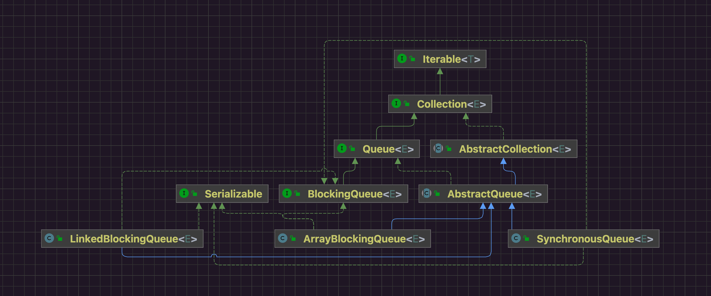

## 1 类图



## 2 构造方法

```java
public SynchronousQueue() {
        this(false);
    }

    /**
     * Creates a {@code SynchronousQueue} with the specified fairness policy.
     *
     * @param fair if true, waiting threads contend in FIFO order for
     *        access; otherwise the order is unspecified.
     */
    public SynchronousQueue(boolean fair) {
        this.transferer = fair ? new TransferQueue<E>() : new TransferStack<E>();
    }
```

默认的使用栈实现，我们就跟进TransferStack

## 3 类结构

```java
/**
         * 抽象里面就一个方法 通过e是不是null判定线程是put线程还是take线程
         *     - e有值 put线程
         *     - e为null take线程
         */
        abstract E transfer(E e, boolean timed, long nanos);
```

TransferStack和TransferQueue都是Transfer的实现，只声明了一个方法

## 4 API


### 4.1 put


```java
public void put(E e) throws InterruptedException {
        if (e == null) throw new NullPointerException();
        if (transferer.transfer(e, false, 0) == null) {
            Thread.interrupted();
            throw new InterruptedException();
        }
    }
```

### 4.2 take

```java
public E take() throws InterruptedException {
        E e = transferer.transfer(null, false, 0);
        if (e != null)
            return e;
        Thread.interrupted();
        throw new InterruptedException();
    }
```

### 4.3 transfer

```java
/**
         * 通过e是不是null判定线程是put线程还是take线程
         *     - e有值 put线程
         *     - e为null take线程
         * 不管是put还是take都会将其数据(e或者null)封装为节点放到栈上 移动head指针模拟出元素入栈
         * 通过节点中的mode不同体现出职责
         *     - put的mode是data
         *     - take的mode是request
         * 封装入栈的节点根据既有的栈顶节点mode状态决定自己的mode和行为
         *     - 直接入栈型
         *         - 空栈
         *         - 栈顶节点跟自己一样mode 不互补
         *     - 交易型
         *         - 跟栈顶节点互补 可以交易
         *     - 帮助交易型
         *         - 栈上两个节点正在交易 帮他们加速
         */
@SuppressWarnings("unchecked")
E transfer(E e, boolean timed, long nanos) {
    /*
             * Basic algorithm is to loop trying one of three actions:
             *
             * 1. If apparently empty or already containing nodes of same
             *    mode, try to push node on stack and wait for a match,
             *    returning it, or null if cancelled.
             *
             * 2. If apparently containing node of complementary mode,
             *    try to push a fulfilling node on to stack, match
             *    with corresponding waiting node, pop both from
             *    stack, and return matched item. The matching or
             *    unlinking might not actually be necessary because of
             *    other threads performing action 3:
             *
             * 3. If top of stack already holds another fulfilling node,
             *    help it out by doing its match and/or pop
             *    operations, and then continue. The code for helping
             *    is essentially the same as for fulfilling, except
             *    that it doesn't return the item.
             */

    SNode s = null; // constructed/reused as needed
    /**
             * put线程初始状态 请求交易还没交付的生产者
             * take线程初始状态 请求交易还没匹配的消费者
             */
    int mode = (e == null) ? REQUEST : DATA;

    for (;;) {
        SNode h = this.head; // 栈顶节点
        if (h == null || h.mode == mode) {  // empty or same-mode // 交易栈为空或者交易栈顶节点和新节点模式一样 新节点作为栈顶入栈等待被交易
            if (timed && nanos <= 0L) {     // can't wait
                if (h != null && h.isCancelled())
                    casHead(h, h.next);     // pop cancelled node
                else
                    return null;
            } else if (this.casHead(h, s = snode(s, e, h, mode))) { // 新节点为栈顶
                SNode m = awaitFulfill(s, timed, nanos);
                if (m == s) {               // wait was cancelled
                    clean(s);
                    return null;
                }
                if ((h = head) != null && h.next == s)
                    casHead(h, s.next);     // help s's fulfiller
                return (E) ((mode == REQUEST) ? m.item : s.item);
            }
        } else if (!isFulfilling(h.mode)) { // try to fulfill // 栈顶节点没处在交易中 尝试跟栈顶节点进行交易
            if (h.isCancelled())            // already cancelled // 栈顶节点无效了弹出 所谓弹出就是将栈顶指针移向栈顶的下一个节点
                casHead(h, h.next);         // pop and retry
            else if (casHead(h, s=snode(s, e, h, FULFILLING|mode))) { // 入栈新节点 栈顶mode集合加上交易中 用交易中标识栈顶节点
                for (;;) { // loop until matched or waiters disappear
                    SNode m = s.next;       // m is s's match // 栈上前2个节点交易
                    if (m == null) {        // all waiters are gone
                        casHead(s, null);   // pop fulfill node
                        s = null;           // use new node next time
                        break;              // restart main loop
                    }
                    SNode mn = m.next;
                    /**
                             * s是栈顶节点
                             *     - 当初已经有线程因为等待交易而阻塞 线程记录在s的waiter中
                             *     - s中的mode集合包含了正在交易
                             * m是第二个节点
                             *     - m对应的线程还没当作阻塞线程记录到m的waiter上 线程正在进行这交易行为
                             */
                    if (m.tryMatch(s)) {
                        casHead(s, mn);     // pop both s and m // 栈上前2个节点匹配成功 弹出
                        return (E) ((mode == REQUEST) ? m.item : s.item);
                    } else                  // lost match
                        s.casNext(m, mn);   // help unlink
                }
            }
        } else {                            // help a fulfiller // 栈顶节点正在交易中 帮他们两个节点交易加速
            SNode m = h.next;               // m is h's match
            if (m == null)                  // waiter is gone
                casHead(h, null);           // pop fulfilling node
            else {
                SNode mn = m.next;
                if (m.tryMatch(h))          // help match
                    casHead(h, mn);         // pop both h and m
                else                        // lost match
                    h.casNext(m, mn);       // help unlink
            }
        }
    }
}
```
