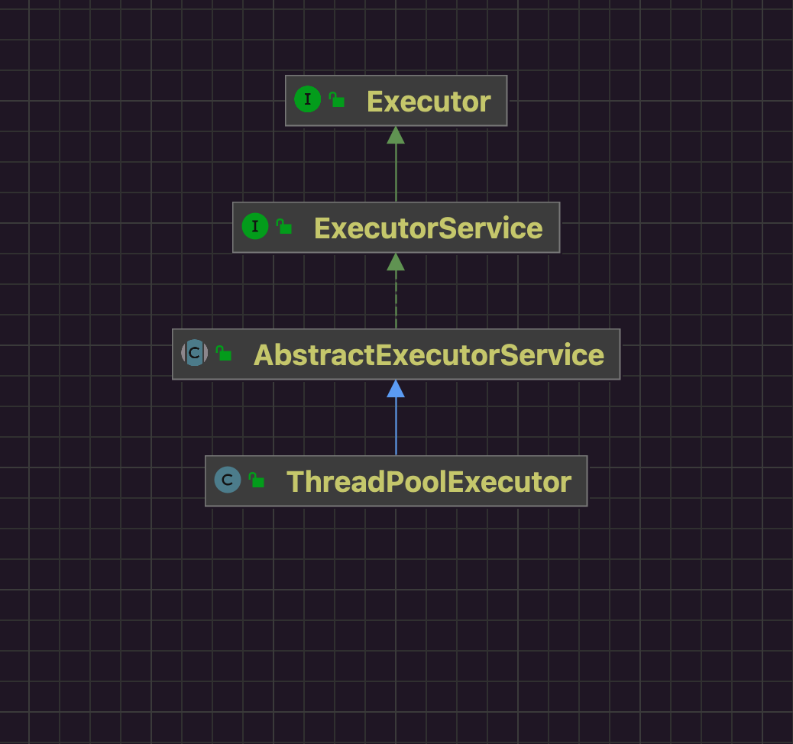
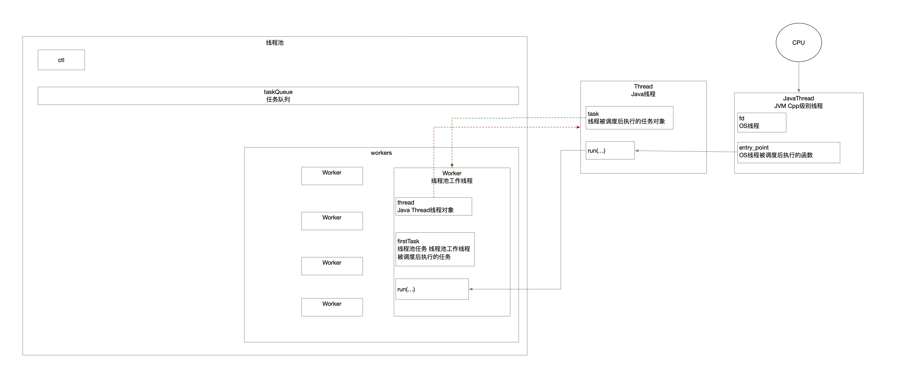

## 1 Executors工具类创建ThreadPoolExecutor

|                 | SingleThreadExecutor | newFixedThreadPool   | newCachedThreadPool  | newScheduledThreadPool | newSingleThreadScheduledExecutor |
| --------------- | -------------------- | -------------------- | -------------------- | ---------------------- | -------------------------------- |
| corePoolSize    | 1                    | n                    | 0                    | n                      | 1                                |
| maximumPoolSize | 1                    | n                    | Integer.MAX_VALUE    | Integer.MAX_VALUE      | Integer.MAX_VALUE                |
| keepAliveTime   | 0                    | 0                    | SECONDS              | 10                     | 10                               |
| unit            | MILLISECONDS         | MILLISECONDS         | SECONDS              | MILLISECONDS           | MILLISECONDS                     |
| workQueue       | LinkedBlockingQueue  | LinkedBlockingQueue  | SynchronousQueue     | DelayedWorkQueue       | DelayedWorkQueue                 |
| threadFactory   | DefaultThreadFactory | DefaultThreadFactory | DefaultThreadFactory | DefaultThreadFactory   | DefaultThreadFactory             |
| handler         | AbortPolicy          | AbortPolicy          | AbortPolicy          | AbortPolicy            | AbortPolicy                      |

## 2 类图



## 3 构造方法

```java
// ThreadPoolExecutor.java
private volatile boolean allowCoreThreadTimeOut; // 标识核心线程是否保活 默认情况下核心线程保活 线程池空闲时即使没有任务也不销毁核心线程
private volatile int corePoolSize; // 线程池的核心线程数量 核心线程保活情况下允许的空闲线程数量上限 核心线程不保活情况下线程池空闲时活跃线程数就是0


public ThreadPoolExecutor(int corePoolSize,
                          int maximumPoolSize,
                          long keepAliveTime, // 空闲线程的保活时间 如果某个线程的空闲时间超过这个值都没有任务给它做 就可以被关闭了 但是这个值在默认的情况下并不是对所有线程都起作用 线程数<=corePoolSize的线程不会因为空闲太长被回收 对于>corePoolSize的线程才会回收 可以手动设置allowCoreThreadTimeOut(true)设置空闲回收作用于所有线程
                          TimeUnit unit,
                          BlockingQueue<Runnable> workQueue,
                          ThreadFactory threadFactory,
                          RejectedExecutionHandler handler) { // 构造方法仅仅是设置一些必要的阈值 不涉及线程资源创建(懒加载)
    if (corePoolSize < 0 ||
        maximumPoolSize <= 0 ||
        maximumPoolSize < corePoolSize ||
        keepAliveTime < 0)
        throw new IllegalArgumentException(); // 简单地有效性校验
    if (workQueue == null || threadFactory == null || handler == null)
        throw new NullPointerException();
    this.corePoolSize = corePoolSize;
    this.maximumPoolSize = maximumPoolSize;
    this.workQueue = workQueue; // 阻塞队列放线程池任务
    this.keepAliveTime = unit.toNanos(keepAliveTime);
    this.threadFactory = threadFactory;
    this.handler = handler; // 阻塞队列满了之后拒绝策略(默认是直接往上抛异常)
}
```

## 4 提交任务到线程池

```java
// AbstractExecutorService.java
/**
     * 提交任务到线程池
     *     - 任务提交线程只负责将任务提交给线程池 不关注任务的执行结果
     *     - 线程池通过异步编程方式立即返回FutureTask给任务提交线程
     *     - 线程池中有任务执行线程对任务的执行过程负责 任务执行完通过回调方式通知结果
     */
    public Future<?> submit(Runnable task) {
        if (task == null) throw new NullPointerException();
        RunnableFuture<Void> ftask = newTaskFor(task, null); // 实现是FutureTask
        this.execute(ftask); // 任务提交线程只负责将任务交给线程池 任务执行由线程池关注
        return ftask;
    }
```

线程池状态

|            | 新任务   | 正在执行的任务 | 任务队列任务 | 调用terminated() |
| ---------- | -------- | -------------- | ------------ | ---------------- |
| RUNNING    | &#10004; | &#10004;       | &#10004;     | &#10007;         |
| SHUTDOWN   | &#10007; | &#10004;       | &#10004;     | &#10007;         |
| STOP       | &#10007; | &#10007;       | &#10007;     | &#10007;         |
| TIDYING    | &#10007; | &#10007;       | &#10007;     | &#10004;         |
| TERMINATED | &#10007; | &#10007;       | &#10007;     | &#10007;         |

### 4.1 线程池接收任务

```java
// ThreadPoolExecutor.java
public void execute(Runnable command) { // 向线程池提交任务 任务提交的线程不阻塞 任务由异步线程负责执行
    if (command == null)
        throw new NullPointerException();
    /*
         * Proceed in 3 steps:
         *
         * 1. If fewer than corePoolSize threads are running, try to
         * start a new thread with the given command as its first
         * task.  The call to addWorker atomically checks runState and
         * workerCount, and so prevents false alarms that would add
         * threads when it shouldn't, by returning false.
         *
         * 2. If a task can be successfully queued, then we still need
         * to double-check whether we should have added a thread
         * (because existing ones died since last checking) or that
         * the pool shut down since entry into this method. So we
         * recheck state and if necessary roll back the enqueuing if
         * stopped, or start a new thread if there are none.
         *
         * 3. If we cannot queue task, then we try to add a new
         * thread.  If it fails, we know we are shut down or saturated
         * and so reject the task.
         */
    int c = this.ctl.get();
    if (workerCountOf(c) < corePoolSize) { // 工作线程数还没达到核心线程数限制 线程池创建新线程 其扮演角色为核心线程 负责接收新任务
        if (this.addWorker(command, true))
            return;
        c = ctl.get();
    }
    if (isRunning(c) && this.workQueue.offer(command)) { // 工作线程数已经达到核心线程数限制 线程池将提交的任务缓存到任务队列中
        int recheck = ctl.get();
        if (! isRunning(recheck) && this.remove(command)) // 任务提交到任务队列中后线程池状态变更(SHUTDOWN STOP TIDYING TERMINATED) 不再接收新任务了 需要将刚加进来的新任务再移除并触发拒绝策略(默认是往上抛异常)
            reject(command);
        else if (workerCountOf(recheck) == 0) // 任务提交任务队后线程池工作线程数为0 没有线程能及时处理任务 需要创建新线程负责任务处理
            addWorker(null, false);
    }
    else if (!addWorker(command, false)) // 线程池任务队列已经满了不能继续缓存任务了 线程池创建新线程 其扮演角色为非核心线程 负责接收任务
        reject(command);
}
```

### 4.2 线程池创建线程

#### 4.2.1 线程池中的线程对象

```java
// ThreadPoolExecutor.java::Worker
/**
     * 线程池中的线程
     * 组合了Java线程和线程池任务
     * Worker是ThreadPoolExecutor的内部类
     * 这样的组合关系和类结构设计为了将Java线程和线程池任务管理权交给线程池
     *
     * Java中的线程映射着OS系统的线程
     *     - Java线程Thread调用start(...)方法
     *         - JVM创建Cpp层面的JavaThread
     *         - 系统调用pthread_create创建OS线程
     *         - OS线程被CPU调度后回调Java线程Thread的run(...)方法
     *     - Java Thread run(...)方法中调用Java线程任务的run(...)方法
     *     - 线程池工作线程本身就是Java线程任务 run(...)方法被执行
     *     - 线程池runWorker(...)方法被执行
     */
private final class Worker
    extends AbstractQueuedSynchronizer
    implements Runnable
{
    /**
         * This class will never be serialized, but we provide a
         * serialVersionUID to suppress a javac warning.
         */
    private static final long serialVersionUID = 6138294804551838833L;

    /** Thread this worker is running in.  Null if factory fails. */
    @SuppressWarnings("serial") // Unlikely to be serializable
    /**
         * 组合了Java的线程
         * 创建Java线程的时候指定的Java线程任务是线程池工作线程Worker
         *
         * 当OS系统CPU调度OS线程之后
         *     - OS线程执行
         *     - JVM的JavaThread执行 回调Java Thread的run方法 调用任务的run方法
         *     - 线程池的Worker工作线程run方法被回调
         *     - 线程池的runWorker(...)方法被执行
         */
    final Thread thread;
    /** Initial task to run.  Possibly null. */
    @SuppressWarnings("serial") // Not statically typed as Serializable
    Runnable firstTask; // 工作线程被调度后执行的任务
    /** Per-thread task counter */
    volatile long completedTasks;

    // TODO: switch to AbstractQueuedLongSynchronizer and move
    // completedTasks into the lock word.

    /**
         * Creates with given first task and thread from ThreadFactory.
         * @param firstTask the first task (null if none)
         */
    Worker(Runnable firstTask) {
        setState(-1); // inhibit interrupts until runWorker
        this.firstTask = firstTask;
        this.thread = getThreadFactory().newThread(this); // 巧妙之处 创建Java的线程指定的任务就是线程池中的工作线程
    }

    /** Delegates main run loop to outer runWorker. */
    public void run() {
        ThreadPoolExecutor.this.runWorker(this); // Java线程被调度后回调到runWorker(...)方法
    }

    // Lock methods
    //
    // The value 0 represents the unlocked state.
    // The value 1 represents the locked state.

    protected boolean isHeldExclusively() {
        return getState() != 0;
    }

    protected boolean tryAcquire(int unused) {
        if (compareAndSetState(0, 1)) {
            setExclusiveOwnerThread(Thread.currentThread());
            return true;
        }
        return false;
    }

    protected boolean tryRelease(int unused) {
        setExclusiveOwnerThread(null);
        setState(0);
        return true;
    }

    public void lock()        { acquire(1); }
    public boolean tryLock()  { return tryAcquire(1); }
    public void unlock()      { release(1); }
    public boolean isLocked() { return isHeldExclusively(); }

    void interruptIfStarted() {
        Thread t;
        if (getState() >= 0 && (t = thread) != null && !t.isInterrupted()) {
            try {
                t.interrupt();
            } catch (SecurityException ignore) {
            }
        }
    }
}
```

#### 4.2.2 工作线程创建和启动

```java
// ThreadPoolExecutor.java
/**
     * 线程池创建工作线程
     *     - 创建的线程并非直接是Java的线程对象 封装了Woker标识工作线程
     *         - 组合了Java线程
     *         - 组合了Java任务
     *     - firstTask意味着工作线程被调度后回调的任务
     *     - core标识着创建的线程是核心线程还是非核心线程
     */
private boolean addWorker(Runnable firstTask, boolean core) {
    // 外层轮询校验线程池状态 内层轮询校验工作线程数
    retry:
    for (int c = ctl.get();;) {
        // Check if queue empty only if necessary.
        /**
             * 线程池状态校验
             *     - 线程池状态(STOP TIDYING TERMINATED)标识不再接收新任务 终止正在运行的任务 已经接收的任务不再处理 这些状态不需要新创建线程
             *     - 线程池状态SHUTDOWN不再接收新任务 处理完正在执行的任务和任务队列缓存的任务 这种情况下不能向线程池提交新任务了
             *     - 线程池状态SHUTDOWN线程池任务队列中还有大量任务的情况还可以创建新线程进行处理 如果任务队列中都处理完了 这种情况下不需要创建新线程
             */
        if (runStateAtLeast(c, SHUTDOWN)
            && (runStateAtLeast(c, STOP)
                || firstTask != null
                || workQueue.isEmpty()))
            return false;

        for (;;) {
            if (workerCountOf(c)
                >= ((core ? corePoolSize : maximumPoolSize) & COUNT_MASK))
                return false; // 工作线程数限制校验
            if (compareAndIncrementWorkerCount(c)) // 工作线程数+1
                break retry;
            c = ctl.get();  // Re-read ctl
            if (runStateAtLeast(c, SHUTDOWN)) // 线程池状态发生变更 外层轮询继续校验一次
                continue retry;
            // else CAS failed due to workerCount change; retry inner loop
        }
    }

    /**
         * 执行到这
         *     - 线程池状态ok
         *     - 工作线程数ok
         *     - 工作线程数已经+1
         */
    boolean workerStarted = false; // 标识位 新建的线程池线程是否启动
    boolean workerAdded = false; // 标识位 新建的线程池线程是否已经缓存到线程池中
    Worker w = null; // 线程池的线程
    try {
        w = new Worker(firstTask); // 创建线程池工作线程 组合了工作线程 Java线程 线程池任务三者关系 利用了Java Thrad被OS调度回调机制
        final Thread t = w.thread; // Java线程
        if (t != null) {
            final ReentrantLock mainLock = this.mainLock;
            mainLock.lock();
            try {
                // Recheck while holding lock.
                // Back out on ThreadFactory failure or if
                // shut down before lock acquired.
                int c = ctl.get();

                if (isRunning(c) ||
                    (runStateLessThan(c, STOP) && firstTask == null)) {
                    if (t.getState() != Thread.State.NEW)
                        throw new IllegalThreadStateException();
                    this.workers.add(w); // 缓存工作线程
                    workerAdded = true;
                    int s = workers.size();
                    if (s > largestPoolSize)
                        largestPoolSize = s;
                }
            } finally {
                mainLock.unlock();
            }
            if (workerAdded) {
                t.start(); // 线程池层面的线程已经创建好 启动Java的线程 等待被CPU调度 进而通过Java线程被调度传递到线程池线程被调度
                workerStarted = true;
            }
        }
    } finally {
        if (! workerStarted)
            addWorkerFailed(w); // 线程池线程创建失败 进行一些标识复原
    }
    return workerStarted;
}
```

### 4.3 线程池线程模型

```java
// ThreadPoolExecutor.java
t.start(); // 线程池层面的线程已经创建好 启动Java的线程 等待被CPU调度 进而通过Java线程被调度传递到线程池线程被调度
```


```java
// ThradPoolExecutor.java::Worker
public void run() {
    ThreadPoolExecutor.this.runWorker(this); // Java线程被调度后回调到runWorker(...)方法
}
```


```java
// ThreadPoolExecutor.java
/**
     * 线程池工作线程启动 工作线程的线程模型
     *     - 执行工作线程上的指定任务
     *     - 阻塞队列获取任务
     *         - 阻塞
     *         - 工作线程销毁
     */
final void runWorker(Worker w) {
    Thread wt = Thread.currentThread();
    Runnable task = w.firstTask;
    w.firstTask = null;
    w.unlock(); // allow interrupts
    boolean completedAbruptly = true; // 标识工作线程健康状态 工作线程执行的内容是线程池外界提交进来的任务 如果执行任务出现异常 本质就是Java线程受到了异常影响 线程池就要针对这个Java线程替换掉工作线程
    try {
        /**
             * 对于线程池中的一条工作线程而言 要执行任务只有两个来源
             *     - 线程池工作线程创建时候指定了回调任务
             *     - 工作线程从线程池任务队列中获取
             */
        while (task != null || (task = this.getTask()) != null) { // 线程池有任务待工作线程执行
            w.lock();
            // If pool is stopping, ensure thread is interrupted;
            // if not, ensure thread is not interrupted.  This
            // requires a recheck in second case to deal with
            // shutdownNow race while clearing interrupt
            /**
                 * 线程池状态检测
                 * STOP TIDYING TERMINATED都不接收新任务 并且中断正在执行的任务 丢弃阻塞队列中任务
                 * 工作线程在运行中 持有了任务 但是还没开始执行
                 * 给Java线程打上中断标识
                 */
            if (
                (
                    runStateAtLeast(ctl.get(), STOP) ||
                    (Thread.interrupted() && runStateAtLeast(ctl.get(), STOP))
                ) &&
                !wt.isInterrupted()
            ) wt.interrupt(); // 中断Java线程(给Java线程设置一个中断标识 Java线程仍然继续运行)
            try {
                this.beforeExecute(wt, task); // 预留的钩子
                try {
                    task.run(); // 线程池工作线程执行任务实例 对于线程池外提交任务的线程而言 这个执行任务的线程就是异步线程
                    this.afterExecute(task, null);
                } catch (Throwable ex) {
                    this.afterExecute(task, ex); // 预留的钩子
                    throw ex;
                }
            } finally {
                task = null;
                w.completedTasks++;
                w.unlock();
            }
        }
        completedAbruptly = false; // 能执行到这说明提交到线程池的任务代码逻辑没有异常
    } finally {
        /**
             * 能执行到这的就两种情况
             *     - 工作线程空闲了
             *         - 线程池没有任务可执行了 对线程有保活机制但是已经超时了 需要销毁工作线程
             *         - 这种工作线程的Java线程还存活着
             *         - 线程池的工作线程数已经重新设置过(减1)
             *     - 工作线程执行任务出现了异常
             *         - 这种工作线程的Java线程已经因为异常退出了
             *         - 线程池的工作线程数没有重新设置过(需要减1)
             */
        this.processWorkerExit(w, completedAbruptly);
    }
}
```




### 4.4 工作线程保活

```java
// ThreadPoolExecutor.java
/**
     * 线程池工作线程从线程池任务队列取任务(线程池工作线程) 通过阻塞队列的阻塞机制实现工作线程的保活机制
     * 一旦返回null也就意味着工作线程空闲了
     *     - 返回null标识这条工作线程要被销毁
     *     - 返回null之前更新线程池工作线程数(减-)
     */
private Runnable getTask() {
    /**
         * 标识位 标识工作线程要被销毁
         * 线程池中活跃的工作线程应该只有两种状态
         *    - 执行任务中
         *    - 从阻塞队列上取任务
         *        - 获取到任务
         *        - 虽然没获取到任务 但是线程保活 阻塞在任务队列上
         * 对于从任务队列上没获取到任务的工作线程 他们属于空闲线程 需要被销毁
         * 对于销毁而言 线程池需要做两件事情
         *     - 更新ctl工作线程数 原子操作 可能因为竞争而失败
         *     - 将工作线程从缓存workers中删除
         *
         * 所以用timedOut标识某个工作线程已经被线程池判定需要销毁 但是CAS修改ctl工作线程数失败了 for轮询中就提前对已经判定销毁的线程执行销毁动作就行
         */
    boolean timedOut = false; // Did the last poll() time out?

    for (;;) { // 轮询 取到了任务就返回出去
        int c = ctl.get();

        // Check if queue empty only if necessary.
        // STOP TIDYING TERMINATED状态的线程池 不处理任务队列中的任务了 这样状态下的工作线程直接销毁掉
        if (runStateAtLeast(c, SHUTDOWN)
            && (runStateAtLeast(c, STOP) || workQueue.isEmpty())) {

            this.decrementWorkerCount(); // 更新线程池工作线程数(减1)
            return null; // 返回null标识该工作线程空闲了需要被销毁
        }

        int wc = workerCountOf(c);

        // Are workers subject to culling?
        boolean timed = allowCoreThreadTimeOut || wc > corePoolSize; // 对工作线程进行永久保活

        if ((wc > maximumPoolSize || (timed && timedOut))
            && (wc > 1 || workQueue.isEmpty())) { // 工作线程可以直接销毁
            if (compareAndDecrementWorkerCount(c)) // CAS修改完工作线程数后返回null标识可以销毁的空闲工作线程
                return null;
            continue;
        }

        try {
            /**
                 * 线程池逻辑上将工作线程分为了核心线程和非核心线程
                 * 但是本质上都是工作线程->Java线程 没有标识区分
                 * 实现上利用阻塞队列阻塞机制
                 *     - 对核心线程进行空闲永久保活 线程池只负责永久保活corePoolSize数量的工作线程 而不必要具体他们是谁
                 *     - 非核心线程空闲指定时长保活
                 * 阻塞队列
                 *     - poll 为空时线程超时阻塞+队列为空条件打破
                 *     - take 为空时线程永久阻塞+队列为空条件打破
                 */
            Runnable r = timed ?
                workQueue.poll(keepAliveTime, TimeUnit.NANOSECONDS) :
            workQueue.take();
            if (r != null)
                return r;
            timedOut = true; // 运行到这说明当前工作线程从阻塞队列被唤醒不是因为有任务达到 而是因为阻塞超时时间到了 也就是这个是非核心空闲工作线程 需要被回收 打上标识
        } catch (InterruptedException retry) {
            timedOut = false;
        }
    }
}
```

