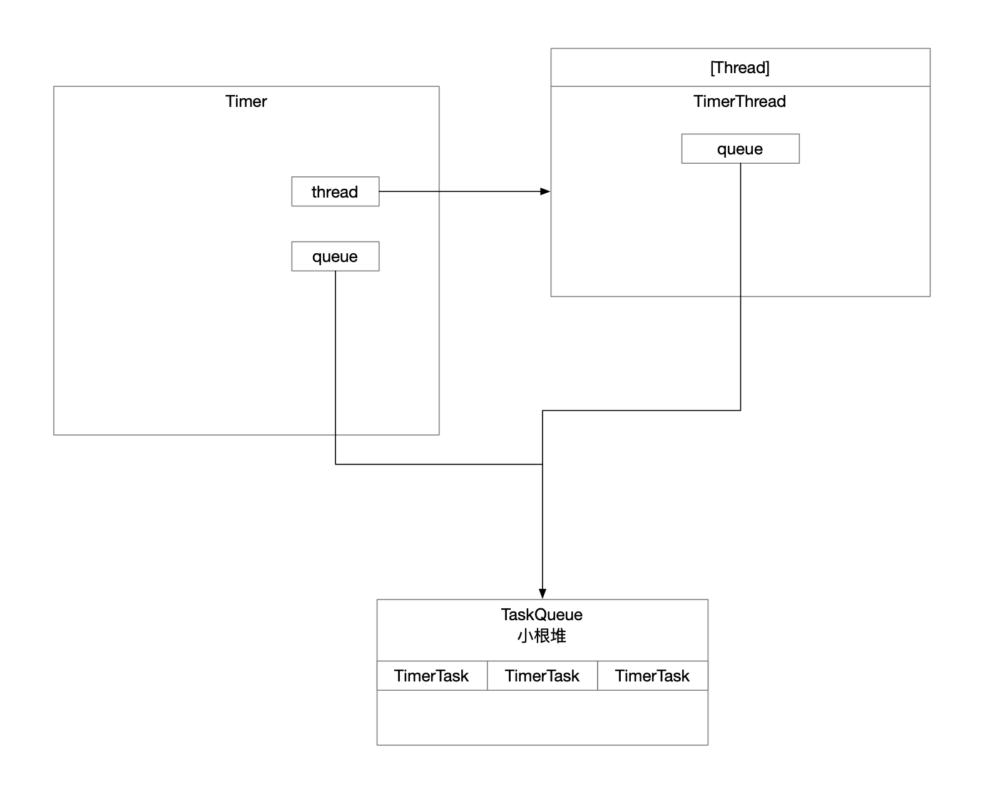

定时器，调度执行延时任务。

## 1 使用方式

```java
/**
 * 定时器.
 *
 * @author dingrui
 * @since 2023/3/4
 */
public class TimerTest {

    private class MyTask extends TimerTask {

        private static final String TASK_INFO = "this is my task.";

        @Override
        public void run() {
            System.out.println("Thread=" + Thread.currentThread().getName() + " , Task=" + TASK_INFO);
        }
    }

    public void test() {
        Timer timer = new Timer("my-timer", false);
        timer.scheduleAtFixedRate(new MyTask(), 0, 3_000);
    }

    public static void main(String[] args) throws IOException {
        new TimerTest().test();
        System.in.read();
    }
}
```

## 2 源码分析



涉及到的几个类

* Timer-定时器，负责调度任务和执行任务。
  * TimerThread-本质是Java线程。
    * 首先，Timer定时器依赖这个线程轮询监控任务队列，实现对任务的调度。
    * 其次，Timer定时器获取到满足执行条件的任务后，依赖该线程执行任务。
  * TaskQueue-小根堆，存放任务的容器，Timer定时器管理任务的实现。
* TimerTask-Runnable类型的抽象类，预留了run()，业务逻辑实现定义在该方法等着被Timer定时器调度执行。

### 2.1 Timer构造方法

```java
/**
 * 这个线程的意义在于
 *   - 轮询任务队列，管理任务
 *   - 拿到满足执行条件的任务后进行任务的执行
 */
private final TimerThread thread = new TimerThread(queue);

public Timer(String name, boolean isDaemon) {
    thread.setName(name);
    thread.setDaemon(isDaemon); // 守护线程
    thread.start(); // 启动线程 被CPU调度之后回调Thread::run()方法
}
```

`thread`这个成员变量本质是个线程，Java线程是映射到OS的`pthread_create`系统调用创建出来的线程，线程被CPU调度到之后回调定义在Java Thread中的run方法。

### 2.2 TimerThread::run

```java
public void run() {
    try {
        mainLoop();
    } finally {
        // Someone killed this Thread, behave as if Timer cancelled
        synchronized(queue) {
            newTasksMayBeScheduled = false;
            queue.clear();  // Eliminate obsolete references
        }
    }
}
```

实现逻辑定义在方法`mainLoop()`中了

#### mainLoop

```java

/**
     * The main timer loop.  (See class comment.)
     * 线程处于轮询状态
     *   - 优先级队列无任务
     *     - 无限阻塞等待有任务添加进来显式唤醒线程
     *   - 优先级队列有任务
     *     - 任务已经被标识取消 从任务队列中移除
     *     - 任务执行时机已经过了 继续下一轮的轮询
     *     - 任务可以执行
     *       - 只需要调度一次 从任务队列移除
     *       - 周而复始的定时任务 更新下一次调度时间
     */
private void mainLoop() {
    while (true) {
        try {
            TimerTask task;
            boolean taskFired;
            synchronized(queue) { // 保证了任务的有序性
                // Wait for queue to become non-empty
                while (queue.isEmpty() && newTasksMayBeScheduled)
                    queue.wait(); // 等有任务进来 不然就把线程无限阻塞只到外界有任务添加进来 显式notify这个阻塞线程
                if (queue.isEmpty())
                    break; // Queue is empty and will forever remain; die

                // Queue nonempty; look at first evt and do the right thing
                long currentTime, executionTime;
                task = queue.getMin(); // 优先级队列队头元素 考察这个定时任务是否满足执行条件
                synchronized(task.lock) {
                    if (task.state == TimerTask.CANCELLED) { // 任务被标志取消 从优先级队列中移除
                        queue.removeMin();
                        continue;  // No action required, poll queue again
                    }
                    currentTime = System.currentTimeMillis();
                    executionTime = task.nextExecutionTime; // 任务期待的执行时间
                    if (taskFired = (executionTime<=currentTime)) { // 标识队头任务满足执行时机 继续考察该任务是否是周期性任务
                        if (task.period == 0) { // Non-repeating, remove
                            queue.removeMin(); // 不是周期性任务 只调度一次即可 从队列中移除
                            task.state = TimerTask.EXECUTED; // 标识该任务应被调度到了 执行逻辑在下面
                        } else { // Repeating task, reschedule
                            queue.rescheduleMin(
                                task.period<0 ? currentTime   - task.period
                                : executionTime + task.period); // 根据周期时间重新设置下一次被调度时间
                        }
                    }
                }
                if (!taskFired) // Task hasn't yet fired; wait
                    queue.wait(executionTime - currentTime); // 队头任务还没到执行时机 暂时先将线程阻塞等待 这次就不能无限阻塞了 指定线程阻塞时长
            }
            if (taskFired)  // Task fired; run it, holding no locks
                task.run(); // 队头任务契合执行时机 当前线程执行它
        } catch(InterruptedException e) {
        }
    }
}
```

### 2.3 TaskQueue

优先级队列的实现，小根堆，数据结构使用的是数组，那么规则如下：

为了使用数组构造二叉树结构，假设root脚标为x，则：

* left节点脚标为2x
* right节点脚标为2x+1

这样的规则就要弃用数组中脚标0，实际存储元素重下标[1...]开始。

```java
/**
  * The number of tasks in the priority queue.  (The tasks are stored in
  * queue[1] up to queue[size]).
  *
  * 数组中元素数量
  * 为了构造二叉树结构
  * 假设root脚标为x 则
  *   - left节点脚标为2x
  *   - right节点脚标为2x+1
  * 这样的规则就要避开脚标0 意味着数组中脚标0弃用
  * 实际存储元素从下标[1...]开始
  * 那么当队列中有size个元素时 数据下标已经用到了size
  */
private int size = 0;
```


#### 2.3.1 入队

```java
void add(TimerTask task) {
    // Grow backing store if necessary
    if (size + 1 == queue.length)
        queue = Arrays.copyOf(queue, 2*queue.length);
    /**
         * 数组中当前已经使用完了脚标size，下一个脚标是size+1
         * 元素添加完后要根据排序规则重新排序
         */
    queue[++size] = task;
    fixUp(size); // 从最后一个元素 从下至上考核孩子节点和parent节点排序
```

```java
private void fixUp(int k) {
    while (k > 1) { // 队列中只有一个元素就没必要重排序
        int j = k >> 1; // k节点的parent是j
        if (queue[j].nextExecutionTime <= queue[k].nextExecutionTime) // 满足小根堆条件 不需要重排序
            break;
        TimerTask tmp = queue[j];  queue[j] = queue[k]; queue[k] = tmp; // child比parent小 交换上去
        k = j;
    }
}
```

#### 2.3.2 队头元素

```java
TimerTask getMin() { // 小根堆脚标1放的是最小元素
    return queue[1];
}
```

#### 2.3.2 出队

```java
void removeMin() { // 小根堆 出队
    queue[1] = queue[size]; // 删除数组上最后一个元素 更新容量 从上至下重排序
    queue[size--] = null;  // Drop extra reference to prevent memory leak
    fixDown(1);
}
```

```java
private void fixDown(int k) {
    int j; // 孩子节点
    while ((j = k << 1) <= size && j > 0) {
        if (j < size &&
            queue[j].nextExecutionTime > queue[j+1].nextExecutionTime)
            j++; // j indexes smallest kid
        if (queue[k].nextExecutionTime <= queue[j].nextExecutionTime) // k指向parent节点 j指向比较小的孩子节点
            break;
        TimerTask tmp = queue[j];  queue[j] = queue[k]; queue[k] = tmp; // 对于小根堆而言 parent理当放小元素 考核过程中孩子节点和根节点乱序了就进行重排序
        k = j;
    }
}
```
