### 1 Sdk编译

前言

* 大于openjdk11u的源码中都含有CompileCommands.gmk，修改即可解决openjdk在Clion中引入头文件问题。
* Java源码换行注释后重新编译一下就行，即可解决class与src对应不上问题。

#### 1.1 源码

[Git地址](https://github.com/Bannirui/jdk.git)，分支是jdk15-study。

#### 1.2 系统工具

* macOS Big Sur 11.5.2
* Xcode 12.5.1
* openjdk 15.0.2
* Make 3.81
* autoconf (GNU Autoconf) 2.71
* Apple clang version 12.0.5 (clang-1205.0.22.11)
* ccache version 4.6
* freetype-confi 2.12.0

#### 1.3 编译

##### 1.3.1 字符集修改

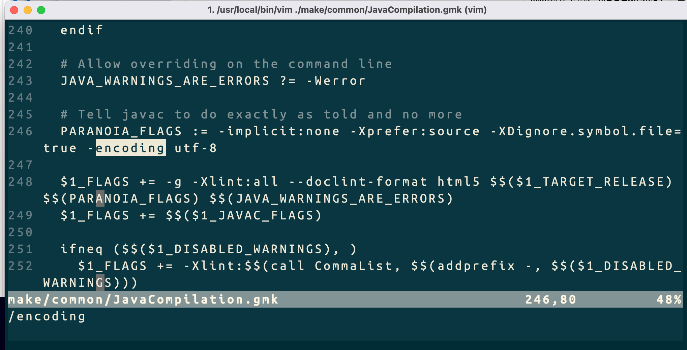

##### 1.3.2 配置

```shell
bash ./configure \
--with-debug-level=slowdebug \
--with-jvm-variants=server \
--with-freetype=bundled \
--with-boot-jdk=/Library/Java/JavaVirtualMachines/adoptopenjdk-15.jdk/Contents/Home \
--with-target-bits=64 \
--disable-warnings-as-errors \
--enable-dtrace
```

##### 1.3.3 编译

```shell
make CONF=macosx-x86_64-server-slowdebug compile-commands

make CONF=macosx-x86_64-server-slowdebug
```

##### 1.3.4 验证编译结果

```shell
./build/macosx-x86_64-server-slowdebug/jdk/bin/java -version
```

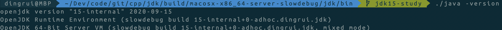

##### 1.3.5 重新编译

比如在jdk源码中进行了注释，调试断点错行了，就需要重新编译。

```sh
make CONF=macosx-x86_64-server-slowdebug
```

### 2 Clion调试

为什么不是使用clion直接open源码根目录，因为那样的方式在clion中代码跳转不了。

如下方式方便跳转阅读代码。

#### 2.1 导入Clion

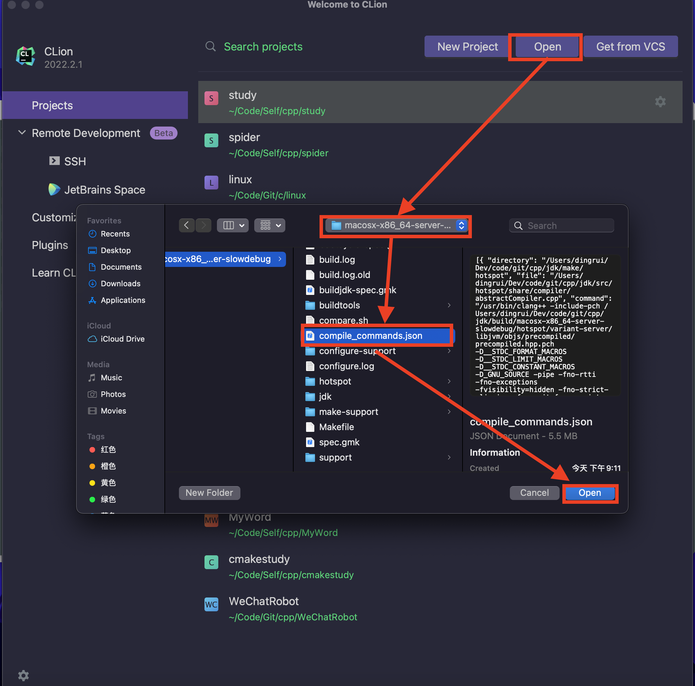

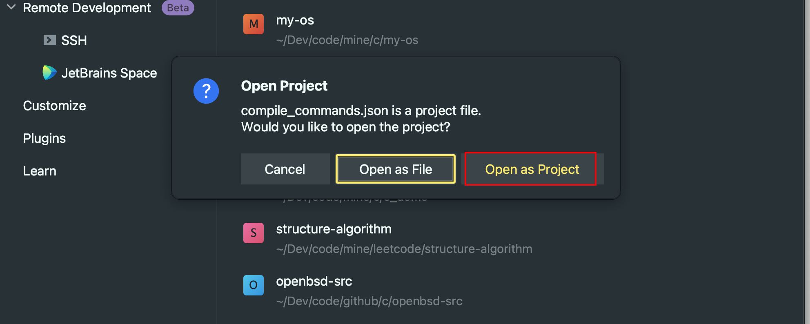

#### 2.2 源码目录

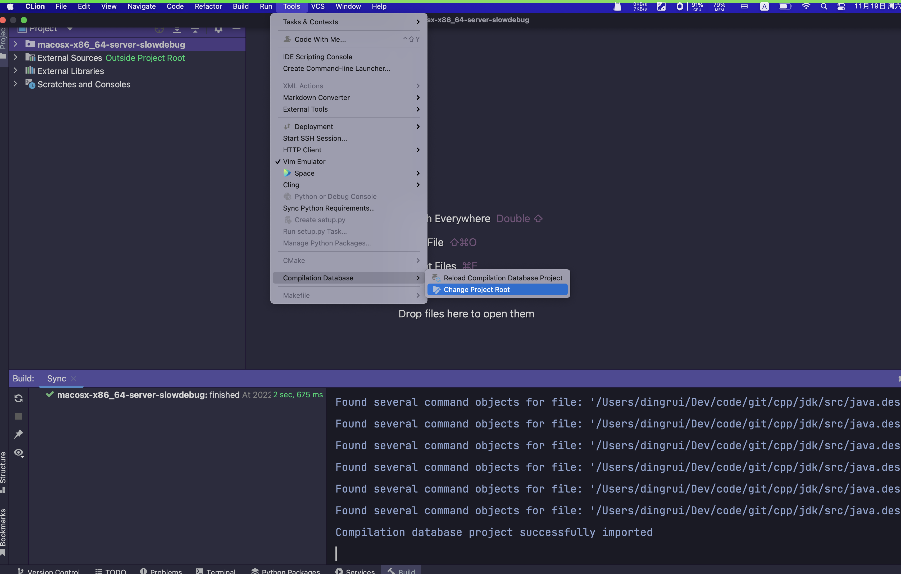


设置到项目根目录

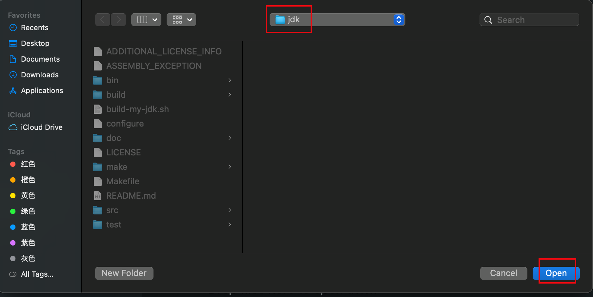

#### 2.3 配置

##### 2.3.1 build

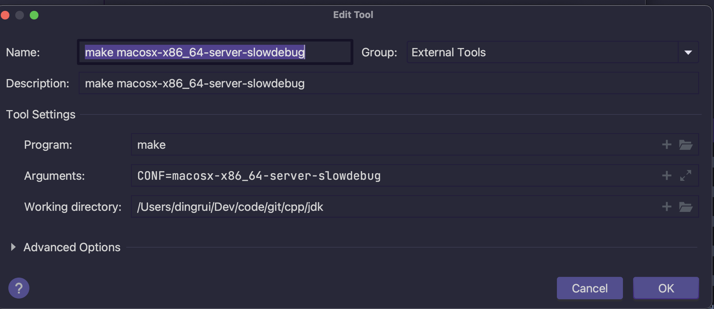

##### 2.3.2 clean

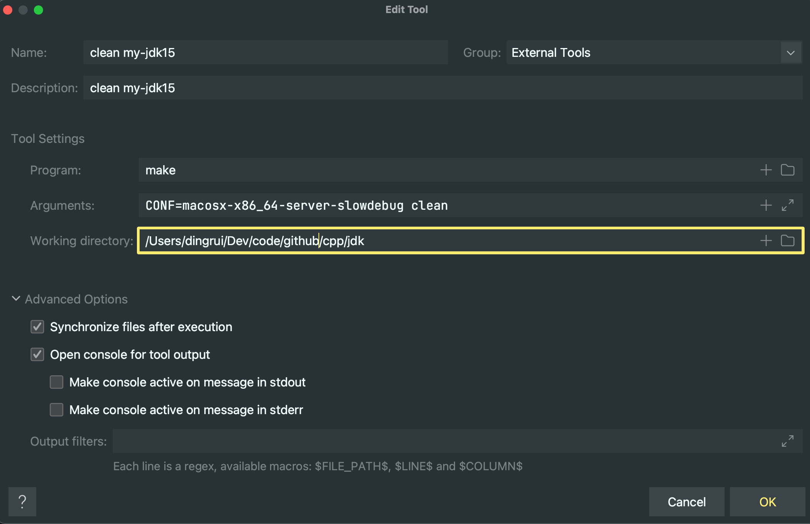

#### 2.4 构建目标

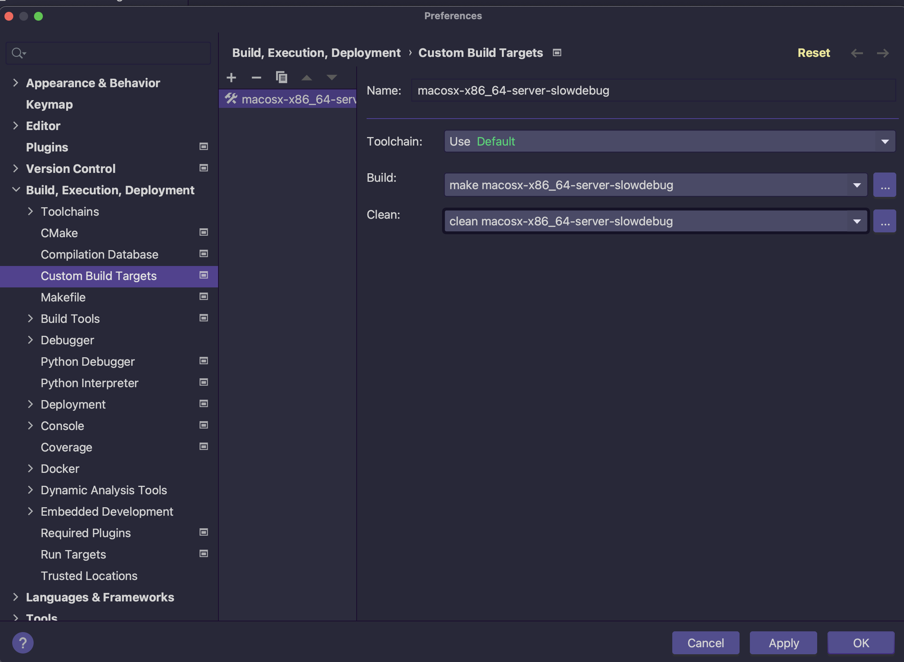

#### 2.5 LLDB修复

```shell
vim ~/.lldbinit
```


```she
br set -n main -o true -G true -C "pro hand -p true -s false SIGSEGV SIGBUS"
```

#### 2.6 调试面板配置

##### 2.6.1 Jdk版本

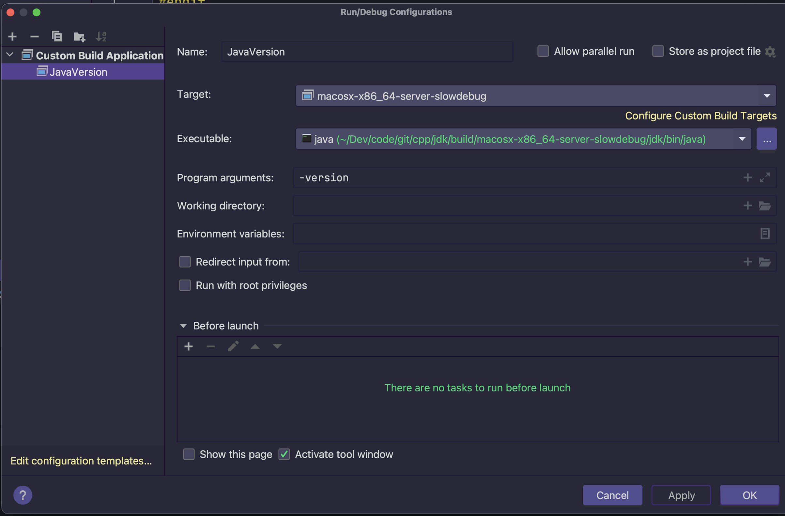

##### 2.6.2 Java文件

###### 2.6.2.1 编译Java代码

这种方式几乎不用，因为我觉得class字节码文件文.java源码文件放在一起太丑了。

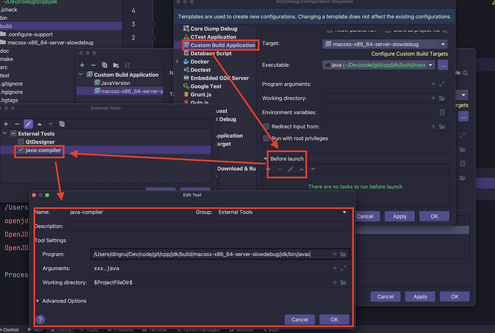

###### 2.6.2.2 调试Class文件

我几乎都用这种方式，直接提供javac编译好的class字节码文件。

但是这样的前提最好是保证java和javac的可执行文件版本一致，所以单独新建一个Java项目，使用当前构建出来的jdk作为sdk，指定javac的output目录，将调试流程固化。也就是下面段落3的内容。

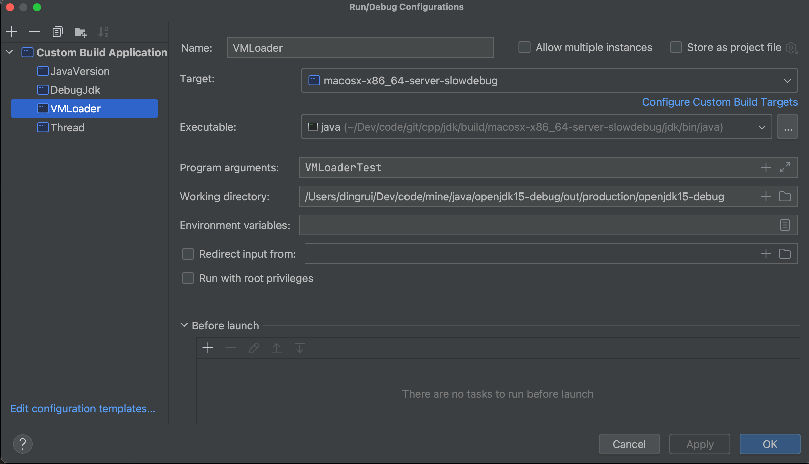

### 3 IDea调试

在调试Jdk源码过程中可能需要追踪c/cpp甚至汇编指令，方便起见新建项目不需要package路径。

#### 3.1 新建项目

[Git地址](https://github.com/Bannirui/openjdk15-debug.git)

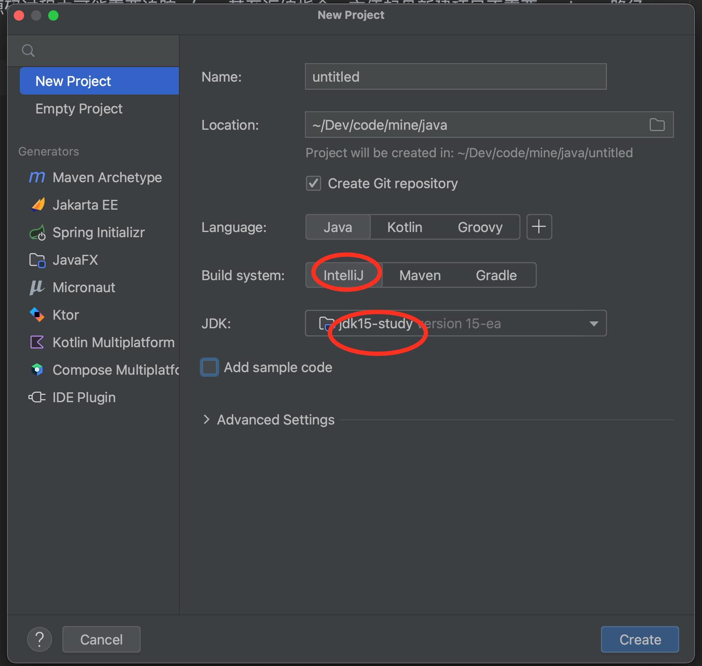

注意项

* Build system选择Intellij
* JDK选择自己编译好的SDK

#### 3.2 新建SDK

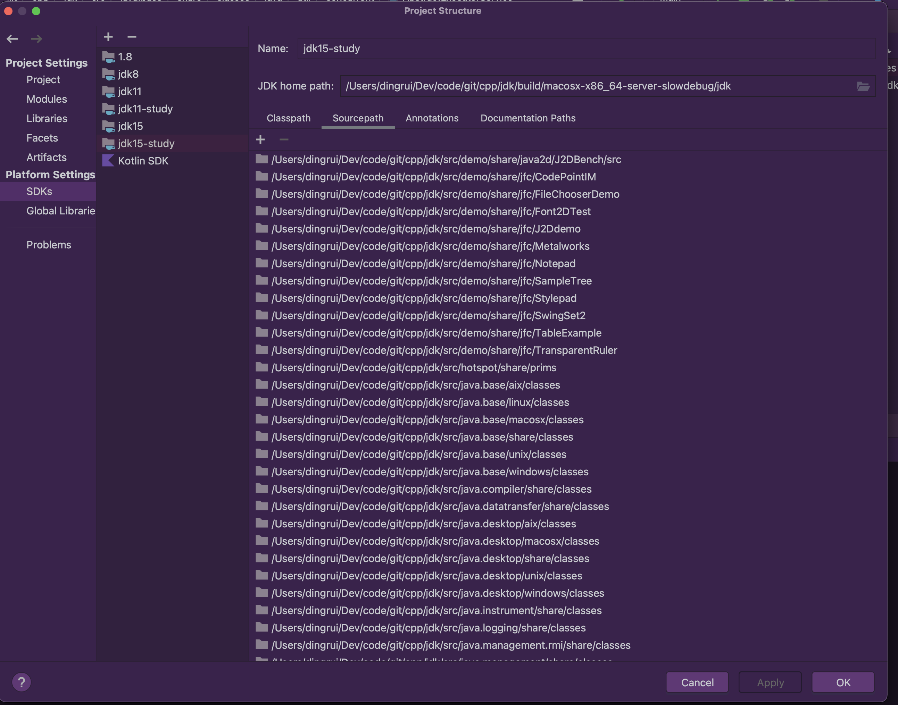

#### 3.3 项目使用SDK

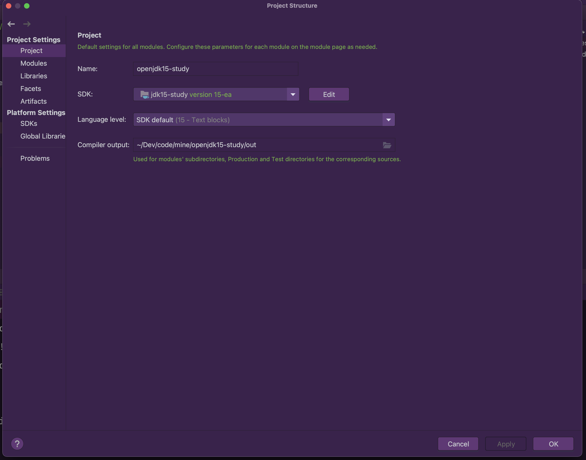

#### 3.4 项目依赖

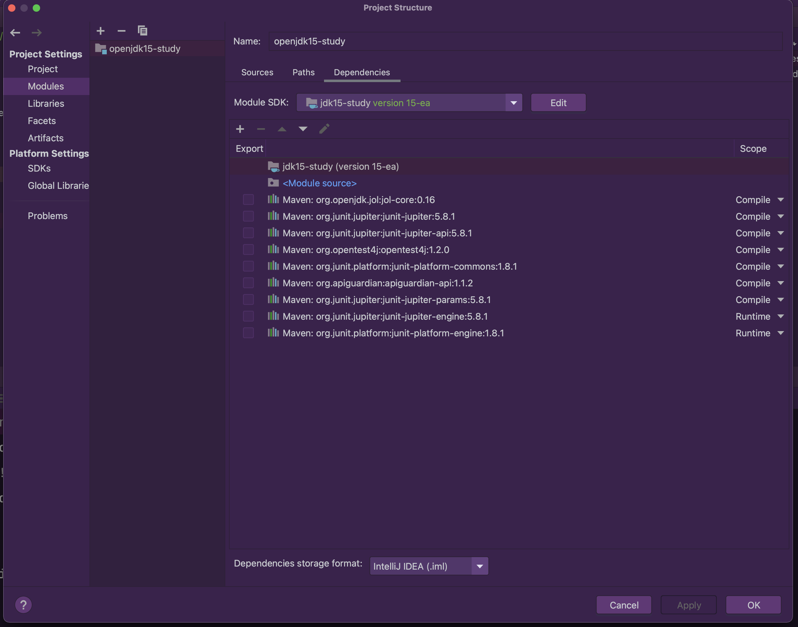

