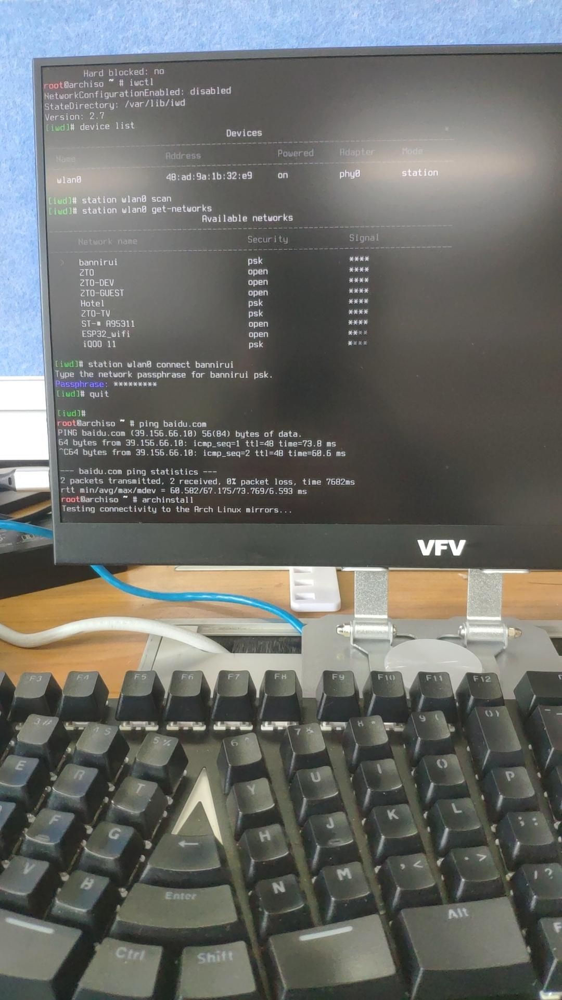
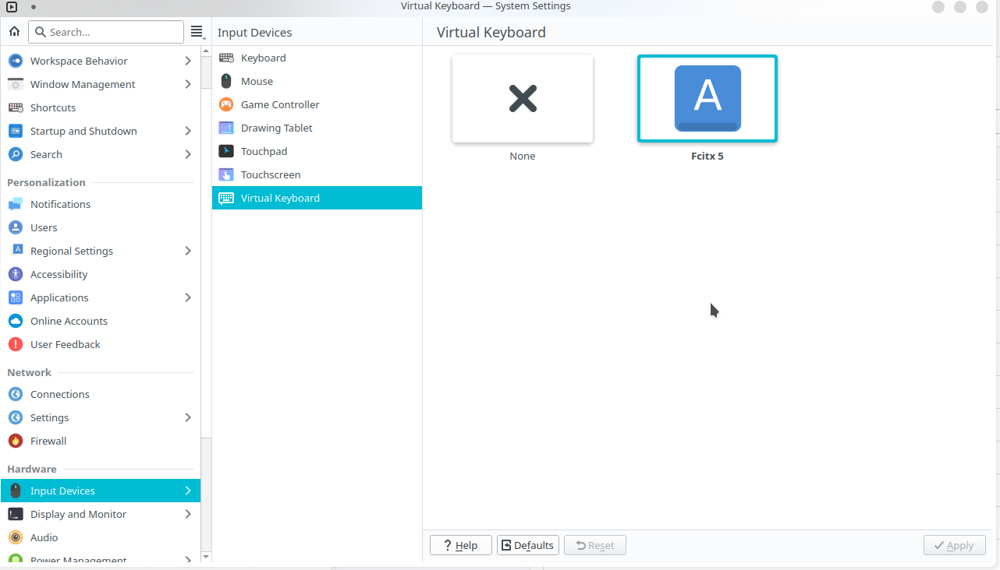
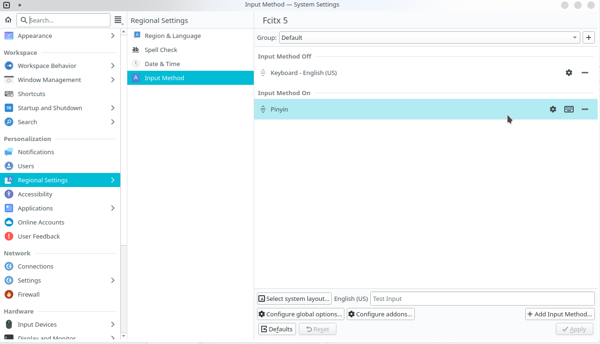
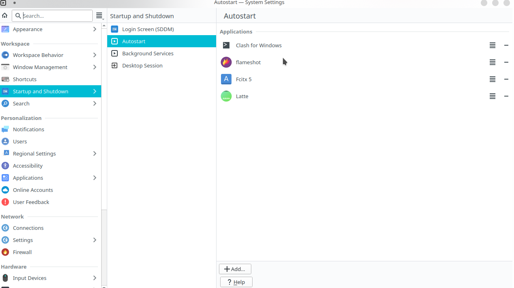
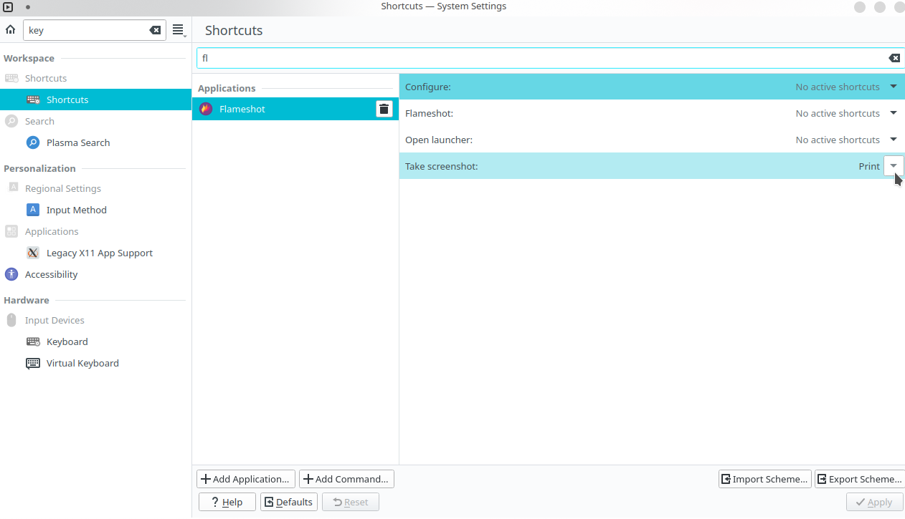

1 系统安装
---

### 1.1 ISO

https://archlinux.org/download/

### 1.2 bootloader

https://etcher.balena.io/

### 1.3 reboot

电脑启动期间按`Delete`键进入BIOS界面

### 1.4 BIOS

- secure boot -> enabled

- secure boot mode -> standard

  

- secure boot

  - boot option #1 -> usb

  

- F4 -> save & exit

### 1.5 wifi

```shell
rfkill list

iwctl

device list
station wlan0 scan
station wlan0 get-networks
station wlan0 connect wifi名称
```

随后根据提示输入wifi密码即可

```shell
quit

ping www.baidu.com
```



### 1.6 archinstall

archinstall内置在了系统镜像中，通过该脚本大大降低了系统安装的复杂性

```shell
archinstall
```


### 1.7 reboot

- 退出archinstall脚本安装模式

  ```shell
  exit
  ```

- 拔开启动引导U盘

- 重启系统

  ```shell
  reboot
  ```

### 1.8 archlinux desk


### 1.9 键盘键位修改

mac上高频使用`command`键位，vim中的键位映射也习惯了`command`，反而不习惯了windows笔记本的control键位。刚好我的外接键盘`Alt`布局比较奇特，面积最大的功能键位。

- 外接mac系统使用的时候将`Alt`映射为`Command`键，mac系统提供了键位修饰功能

- 外接ArchLinux系统使用的时候将`Alt`映射为`Ctrl`键，得修改系统文件

```shell
cd /usr/share/X11/xkb/keycodes/
sudo cp evdev evdev.bak
sudo vim evdev
```

然后根据自己的要求修改键位，比如我的需求是调换左边`ctrl`和左边`alt`。


修改完成之后需要重启电脑，便可以生效。

```shell
reboot

sudo rm -rf /usr/share/x11/skb/keycodes/evdev.bak
```

2 系统美化
---

[参考博客](https://arch.icekylin.online/guide/advanced/beauty-1.html)

3 常用软件
---

### 3.1 编程环境

通过git的私人仓库os-script脚本配置

- vim
- zsh
- maven
- git
- ideavim
- codestyle

#### 3.1.1 arm-none-eabi-gcc

嵌入式开发的时候需要依赖交叉编译器。正常情况下，使用pacman或者yay直接安装即可，但是有时候需要指定版本，而包管理器又没有提供对应的版本。

#### 3.1.1.1 使用yay安装

```shell
yay -Ss arm-none-eabi
yay -Syy arm-none-eabi
```

当前提供的版本是13.x，没有10.3版本的提供。

#### 3.1.1.2 手动安装

[10.3版本的下载](https://developer.arm.com/downloads/-/gnu-rm)

```shell
mkdir -p ~/Documents/software/arm-none-eabi
tar -jxvf ~/Downloads/gcc-arm-none-eabi-10.3-2021.10-x86-linux.tar.bz2 -C ~/Documents/software/arm-none-eabi --strip-components 1
```

zshrc环境变量
```shell
# arm-none-eabi-gcc指定10.3版本在yay上没有 手动安装设置环境变量
export ARM_NONE_EABI_HOME=~/Documents/software/arm-none-eabi
export PATH=$PATH:$ARM_NONE_EABI_HOME/bin
```

### ~~3.2 中文输入法~~

在linux使用中文输入法体验并不是很好，有需要的话还是用Mac ssh到Linux

#### 3.2.1 install

```shell
sudo pacman -Syu fcitx5-im
sudo pacman -S fcitx5-chinese-addons
```

#### 3.2.2 path

```shell
# ~.zshrc
export INPUT_METHOD=fcitx5
export GTK_IM_MODULE=fcitx5
export QT_IM_MODULE=fcitx5
export XMODIFIERS=@im=fcitx5
```

#### 3.2.3 系统设置



#### 3.2.4 输入法添加

列表中输入法顺序就是切换顺序，顺位第一个输入法就是系统启动后的默认输入法。当前管理界面没有上移\下移的操作，因此要切换默认输入法的方式是先移除，然后按照需要的顺序添加。



#### 3.2.5 系统自启动


### ~~3.3 截图~~

flameshot

#### 3.3.1 install

```shell
sudo pacman -S flameshot
```

#### 3.3.2 开机启动项



### 3.3.3 快捷键

自定义截图快捷键



### 3.4 yay

```shell
sudo pacman -S git
sudo git clone https://aur.archlinux.org/yay-git.git
cd yay-git
makepkg -si

yay --version
```

### 3.5 百度网盘

#### 3.5.1 安装

```shell
cd  /home/dingrui/Documents/software/baidu-disk
cp ~/Downloads/baidunetdisk_4.17.7_amd64.deb ./
sudo debtap baidunetdisk_4.17.7_amd64.deb
sudo pacman -U baidunetdisk-4.17.7-1-x86_64.pkg.tar.zst
```

#### 3.5.2 卸载

```shell
dkpg -l
sudo dpkg -P baidunetdisk
```

### 3.6 chrome

#### 3.6.1 安装

```shell
yay -Ss google-chrome
yay -S google-chrome
```

#### 3.6.2 卸载

```shell
pacman -Q google-chrome
sudo pacman -R google-chrome
```

### 3.7 kicad

```shell
pacman -Ss kicad
sudo pacman -S kicad
```

### 3.8 office

```shell
yay -Ss openoffice
yay -S openoffice-bin
```