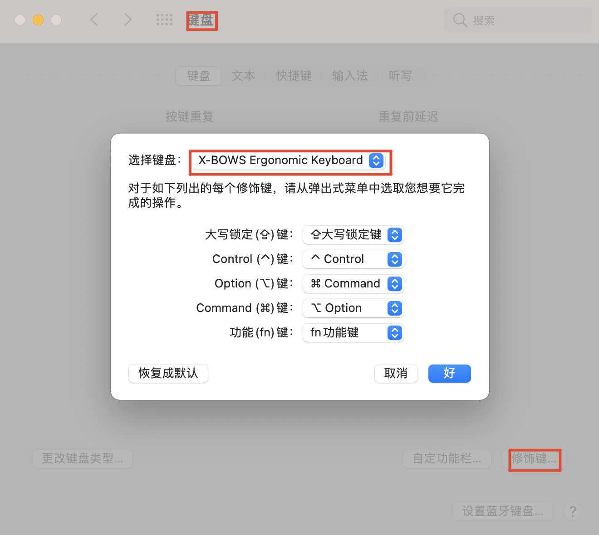
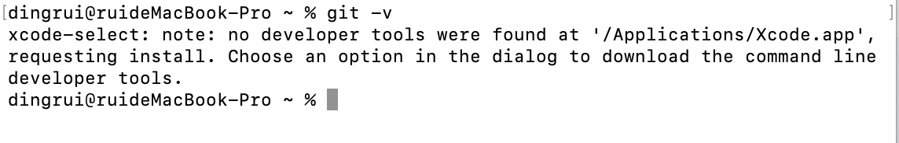
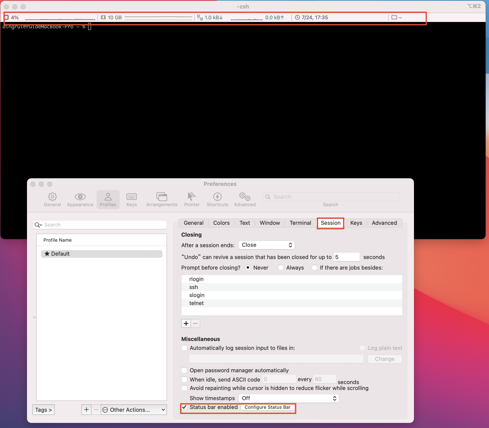
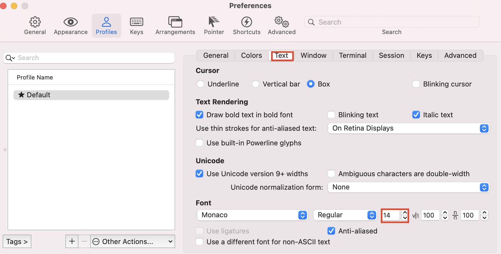

### 1 Chrome

https://www.google.com/chrome/

### 2 Clashx

https://github.com/yichengchen/clashX/releases

### 3 Typora

typora从0.11.18之后开始收订阅费，各平台的安装包链接如下。

https://github.com/Bannirui/tools/releases/tag/Typora-0.11.18

### 4 XBows键盘映射



### 5 IDE

https://www.jetbrains.com/toolbox-app/


### 6 xcode



### 7 启动台设置

- 自定义

  ```shell
  defaults write com.apple.dock springboard-columns -int 9

  defaults write com.apple.dock springboard-rows -int 6

  defaults write com.apple.dock ResetLaunchPad -bool TRUE

  killall Dock
  ```

- 恢复默认

  ```shell
  defaults write com.apple.dock springboard-rows Default

  defaults write com.apple.dock springboard-columns Default

  defaults write com.apple.dock ResetLaunchPad -bool TRUE

  killall Dock
  ```

### 8 Homebrew

```shell
/bin/bash -c "$(curl -fsSL https://raw.githubusercontent.com/Homebrew/install/HEAD/install.sh)"
```

### 9 iterm2

```shell
brew install iterm2
```

- icon

  

- size

  

- font

  

### 10 编程环境

通过git的私人仓库os-script脚本配置

- vim

- zsh

- maven

- git

- ideavim

- codestyle

### 11 arm-none-eabi-gcc

嵌入式开发的时候需要依赖交叉编译器。正常情况下，使用homebrew直接安装即可，但是有时候需要指定版本，而brew又没有提供对应的版本。

#### 11.1 brew安装

```shell
brew search arm-none-eabi-gcc

brew info arm-none-eabi-gcc

brew install arm-none-eabi-gcc

arm-none-eabi-gcc --version
```

#### 11.2 手动安装

[10.0版本的下载](https://developer.arm.com/downloads/-/gnu-rm)

```shell
mkdir -p ~/MyApp/arm-none-eabi
tar -zxvf ~/Downloads/gcc-arm-none-eabi-10.3-2021.10-mac.tar.bz2 -C ~/MyApp/arm-none-eabi --strip-components 1
```

zshrc环境变量
```shell
# arm-none-eabi-gcc指定10.3版本在homebrew上没有 手动安装设置环境变量
export ARM_NONE_EABI_HOME=~/MyApp/arm-none-eabi
export PATH=$PATH:$ARM_NONE_EABI_HOME/bin
```

### 12 VScode

#### 12.1 install

```shell
brew update
brew search visual-studio-code
brew install visual-studio-code
```

#### 12.2 vim

安装vim插件之后默认光标移动不能连续触发，需要设置系统，然后重启vscode

- 设置连续 `defaults write com.microsoft.VSCode ApplePressAndHoldEnabled -bool false
`

- 恢复默认 `defaults write com.microsoft.VSCode ApplePressAndHoldEnabled -bool true
`