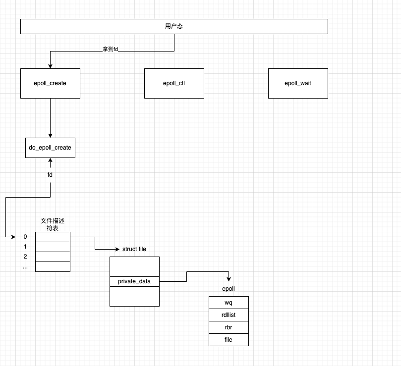

多路复用器的实现，我觉得epoll和kqueue的实现应该是最牛的，今天就浅尝下epoll的代码。

通过SYSCALL_DEFINE封装系统调用给用户，关键的系统调用也就3个

- epoll_create
- epoll_ctl
- epoll_wait

### 1 epoll_create

```c
/* 系统调用epoll_create 这个系统调用1个参数 */
SYSCALL_DEFINE1(epoll_create1, int, flags)
{
	return do_epoll_create(flags);
}
```

本质就是通过个系统调用拿到eventpoll的实例，将来可以对epoll进行操作。从面向对象角度看，epoll提供了两个方法

- ctl
- wait



### 2 epoll_ctl

```c
/* 系统调用epoll_ctl 这个系统调用4个参数 */
SYSCALL_DEFINE4(epoll_ctl, int, epfd, int, op, int, fd,
		struct epoll_event __user *, event)
{
	struct epoll_event epds;

	if (ep_op_has_event(op) &&
	    copy_from_user(&epds, event, sizeof(struct epoll_event)))
		return -EFAULT;

	return do_epoll_ctl(epfd, op, fd, &epds, false);
}
```

之前在中提到过，在nginx的worker进程转移端口监听权的时候，丧失监听权的进程要删除对事件的监听，当时的结论-内核会把已经就绪事件从就绪列表中删除-当时是合理的推测。

现在在源码中找到了依据

```c
/*
 * 移除对某个对象的监听
 * <ul>
 *   <li>目标对象在epoll内部的组织形式是epitem</li>
 *   <li>先把对象从红黑树上删除</li>
 *   <li>要是已经被内核放到了就绪列表 也要从就绪列表中删除</li>
 * </ul>
 * @param ep eventpoll实例
 * @param epi 被监听对象被封装成的epitem对象
 */
static bool __ep_remove(struct eventpoll *ep, struct epitem *epi, bool force)
{
	struct file *file = epi->ffd.file; // 被监听对象的file
	struct epitems_head *to_free;
	struct hlist_head *head;

	lockdep_assert_irqs_enabled();

	/*
	 * Removes poll wait queue hooks.
	 */
	ep_unregister_pollwait(ep, epi);

	/* Remove the current item from the list of epoll hooks */
	spin_lock(&file->f_lock);
	if (epi->dying && !force) {
		spin_unlock(&file->f_lock);
		return false;
	}

	to_free = NULL;
	head = file->f_ep;
	if (head->first == &epi->fllink && !epi->fllink.next) {
		file->f_ep = NULL;
		if (!is_file_epoll(file)) {
			struct epitems_head *v;
			v = container_of(head, struct epitems_head, epitems);
			if (!smp_load_acquire(&v->next))
				to_free = v;
		}
	}
	hlist_del_rcu(&epi->fllink);
	spin_unlock(&file->f_lock);
	free_ephead(to_free);

	rb_erase_cached(&epi->rbn, &ep->rbr); // 将epitem从红黑树中删除

	write_lock_irq(&ep->lock);
	// 检查epitem是不是已经在就绪列表中了 如果已经存在于就绪列表中了 得先从就绪列表中删除
	if (ep_is_linked(epi))
		list_del_init(&epi->rdllink);
	write_unlock_irq(&ep->lock);

	wakeup_source_unregister(ep_wakeup_source(epi));
	/*
	 * At this point it is safe to free the eventpoll item. Use the union
	 * field epi->rcu, since we are trying to minimize the size of
	 * 'struct epitem'. The 'rbn' field is no longer in use. Protected by
	 * ep->mtx. The rcu read side, reverse_path_check_proc(), does not make
	 * use of the rbn field.
	 */
	call_rcu(&epi->rcu, epi_rcu_free);

	percpu_counter_dec(&ep->user->epoll_watches);
	return ep_refcount_dec_and_test(ep);
}
```

### 3 epoll_wait

```c
/* 系统调用epoll_wait 6个参数*/
SYSCALL_DEFINE6(epoll_pwait, int, epfd, struct epoll_event __user *, events,
		int, maxevents, int, timeout, const sigset_t __user *, sigmask,
		size_t, sigsetsize)
{
	struct timespec64 to;

	return do_epoll_pwait(epfd, events, maxevents,
			      ep_timeout_to_timespec(&to, timeout),
			      sigmask, sigsetsize);
}
```

