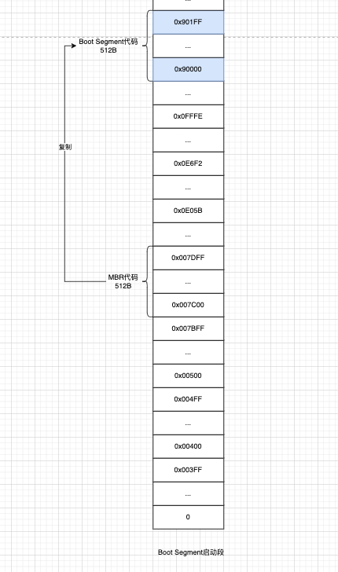

前面已经把启动段代码加载到了0x07c00，CPU也跳转过去。开始执行Boot Segment代码了，下面就看看Boot Segment代码在干什么。

### 1 把Boot Segment代码搬到高地址空间

从何处来，到何处去。

- 从0x07c00
- 搬到0x90000

```c
| BIOS已经把启动盘第一扇区代码加载到了内存0x007c00 并且cpu也跳过去了
| 现在cs=0x07c0 ip=0
| Boot Segment启动段代码开始工作
entry start
| 重复movw指令直到cx为0 一个word是2Byte 也就是复制512Byte
| 启动段代码自己把自己从0x07c00搬到0x90000 跳到高地址执行
start:
	mov	ax,#BOOTSEG
	mov	ds,ax
	mov	ax,#INITSEG
	mov	es,ax
	mov	cx,#256
	sub	si,si
	sub	di,di
	| 重复执行movw
	| 每搬完一次数据就si+=2 di+=2
	| cx-=1直到cx为0
	rep
	| movw的作用是搬运2Byte ds:si->es:di
	| mov只复制一次时si跟di寄存器值不会步进值自增 只有搭配rep指令时才会自增
	movw
	| 执行到这时Boot Segment代码已经被拷贝到了0x90000处了并且代码的复制功能已经执行完了 要跳到高地址地方继续执行
	jmpi	go,INITSEG
```

