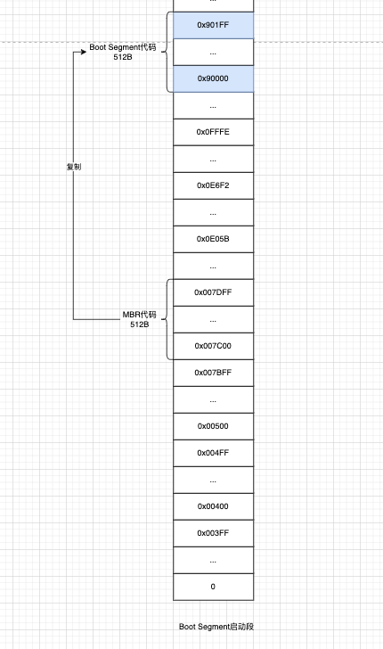
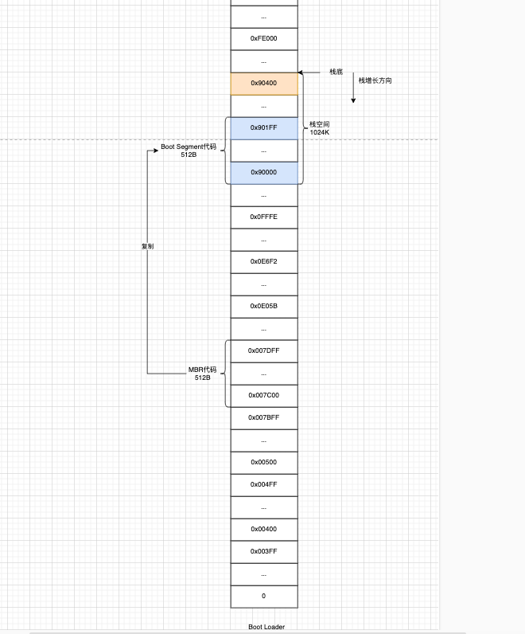
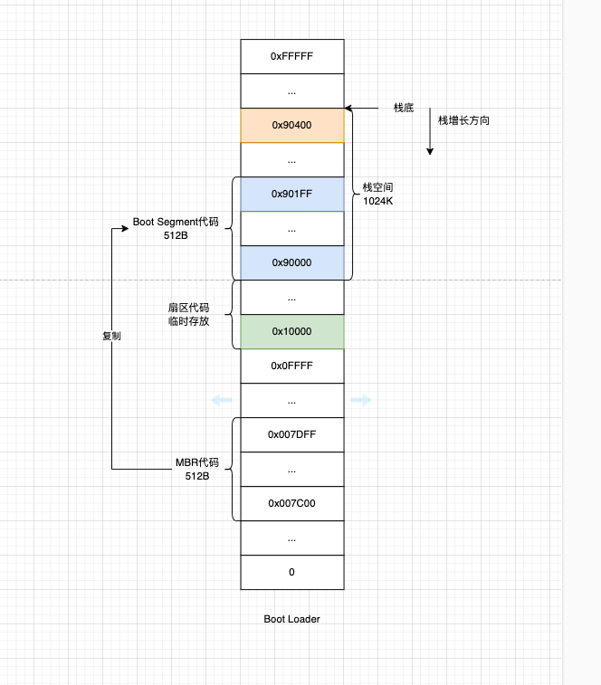
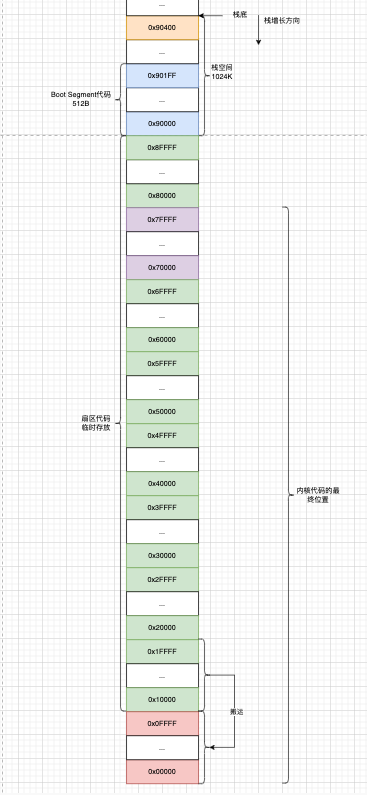

前面已经把启动段代码加载到了0x07c00，CPU也跳转过去。开始执行引导代码了，下面就看看引导代码在干什么。

### 1 启动段

引导代码把自己搬到高地址空间去执行。

从何处来，到何处去。

- 从0x07c00
- 搬到0x90000

```c
| BIOS已经把启动盘第一扇区代码加载到了内存0x007c00 并且cpu也跳过去了
| 现在cs=0x07c0 ip=0
| Boot Segment启动段代码开始工作
entry start
| 重复movw指令直到cx为0 一个word是2Byte 也就是复制512Byte
| 启动段代码自己把自己从0x07c00搬到0x90000 跳到高地址执行
start:
	mov	ax,#BOOTSEG
	mov	ds,ax
	mov	ax,#INITSEG
	mov	es,ax
	mov	cx,#256
	sub	si,si
	sub	di,di
	| 重复执行movw
	| 每搬完一次数据就si+=2 di+=2
	| cx-=1直到cx为0
	rep
	| movw的作用是搬运2Byte ds:si->es:di
	| mov只复制一次时si跟di寄存器值不会步进值自增 只有搭配rep指令时才会自增
	movw
	| 执行到这时Boot Segment代码已经被拷贝到了0x90000处了并且代码的复制功能已经执行完了 要跳到高地址地方继续执行
	jmpi	go,INITSEG
```



### 2 初始段

#### 2.1 开辟栈空间

```asm
| 执行到这此时CS是0x9000
| 初始化各个段寄存器ds es ss和sp
go:	mov	ax,cs
	mov	ds,ax
	mov	es,ax
	mov	ss,ax
	| 栈基地址0x9000 栈顶指针0x400 这个地方规划栈空间预留了1024K的大小
	| 栈指针增长方向是向低地址空间 入栈sp减小 出栈sp增加
	| 从0x9000:0->0x9000:0x400地址空间就是栈空间
	mov	sp,#0x400		| arbitrary value >>512
```

此时的内存布局情况是



#### 2.2 BIOS的10号中断调用

关于`int 0x10`在另一篇有详细介绍

##### 2.2.1 拿到光标位置

```asm
    | AH设置int 0x10功能号 读取光标位置 位置行列都是0-based 行号返回到DH 列号返回到DL
    | 这个地方读取光标坐标的用途是下面要输出字符串 输出字符串的光标就是现在获取到的
	mov	ah,#0x03	| read cursor pos
	| BH是int 0x10的参数 指定显示页 0表示使用默认的显示页
	xor	bh,bh
	int	0x10
```

##### 2.2.2 打印字符串

```asm
	| 要显示的字符串长度24
	mov	cx,#24
	| BH页码
	| BL属性
	mov	bx,#0x0007	| page 0, attribute 7 (normal)
	| 要显示的字符串地址 ES:BP 现在es已经是0x9000了 只要指定段内偏移量就行了
	mov	bp,#msg1
	| AH功能号0x13
	| AL显示方式0x01
	mov	ax,#0x1301	| write string, move cursor
	int	0x10
```

#### 2.3 磁盘加载代码到临时位置

继续利用BIOS的中断服务加载磁盘的内容，将内核代码加载到内存，临时先存放在0x10000上。

```asm
| 定义一个函数 发起真正的读盘行为
| 入参 AX=要从磁盘读多少个扇区read_track
|     BX=ES:BX=缓冲区地址
|     CX=要从磁盘读多少Byte内容
read_track:
	push ax
	push bx
	push cx
	push dx
	| ch=track的低8位=柱面号
	mov dx,track
	mov cx,sread
	| CL=要读的扇区号
	inc cx
	mov ch,dl
	| dh=head的低8位=磁头号
	mov dx,head
	mov dh,dl
	| dl=驱动器号=0表示软盘
	mov dl,#0
	and dx,#0x0100
	mov ah,#2
	| 13号中断调用功能号AH=0x02
	int 0x13
	| 出参 CF=0表示成功 CF不等于0说明异常
	jc bad_rt
	pop dx
	pop cx
	pop bx
	pop ax
	ret
```



现在的状态是CPU执行的初始化代码在0x900000高地址空间，现在已经把磁盘的内核代码加载到了0x10000低地址空间。也就说预留了(0x90000-0x10000+1)Byte=512KB空间给内核代码暂存，这个空间是足够了。

下面就要把这些代码搬到低地址空间去，为什么要多此一举，不直接给一步到位在加载的时候就直接放到低地址空间去。本质原因就是在加载磁盘的期间我们还需要依赖内存上的BIOS代码，BIOS中断向量表和中断程序。因此如果直接把磁盘的代码放到低地址空间，会覆盖掉BIOS程序，导致程序崩溃。

#### 2.4 内核代码搬运到低地址空间

```asm
| 代码已经暂存在DS:BX=0x10000上
| 现在开始把这片内核代码搬到0x00上 为构建内核空间做准备
| 但是现在不清楚内核代码到底有多大 预留给内核代码的暂存空间是[0x10000...0x8FFFF] 所以不用管到底有多少代码 直接把整片空间都搬一次就行
| 从0x10000到0x90000总共有8个段 每个段空间=0xFFFF=64KB
| 所以下面这段代码搬代码的时候分8次 每次搬1个段 每个段64KB
do_move:
    | ES=AX=这次1段搬到哪儿
	mov	es,ax		| destination segment
	| 搬完1段之后更新 下一次就知道搬到新的地址是哪儿
	add	ax,#0x1000
	| 目标段增加到0x9000时说明[0x10000...0x8FFFF]都已经搬完了 结束搬运代码的流程
	cmp	ax,#0x9000
	jz	end_move
	| DS:SI->ES:DI 复制 每次复制2个字节
	| CX=要复制多少次=0x8000个word=0x8000*2个Byte=64KB
	| 每复制完一次SI跟DI会自动自增2=2个Byte
	mov	ds,ax		| source segment
	sub	di,di
	sub	si,si
	mov 	cx,#0x8000
	rep
	movsw
	j	do_move
```



至此，原来的BIOS构建的空间已经被摧毁，准备开始构建属于内核的空间。

#### 2.5 切换保护模式的前置准备

在将CPU从实模式切换到保护模式之前，需要做准备工作，主要是构建好

```asm
end_move:
    | DS=CS=0x9000
    | 内核代码已经全部搬到0x0的低地址空间上了 下面准备切换CPU从实模式到保护模式 在切到保护模式之前先做准备工作 构建中断描述符表和全局描述符表
	mov	ax,cs		| right, forgot this at first. didn't work :-)
	mov	ds,ax
	| 把idt_48处的6字节内容加载到IDTR中断描述符表寄存器 之后CPU就知道中断向量表存在哪儿 有多大了
	| 此刻的idt中断描述符表是空的 也就是变相的临时禁用了中断服务
	lidt	idt_48		| load idt with 0,0
	| 进入保护模式的前提 lgdt指令把gdt_48处的6Byte内容加载到GDTR寄存器 之后CPU就知道全局描述符表在哪儿 有多大
	| 用于进入x86保护模式的关键汇编指令
	lgdt	gdt_48		| load gdt with whatever appropriate
```

- 

- 