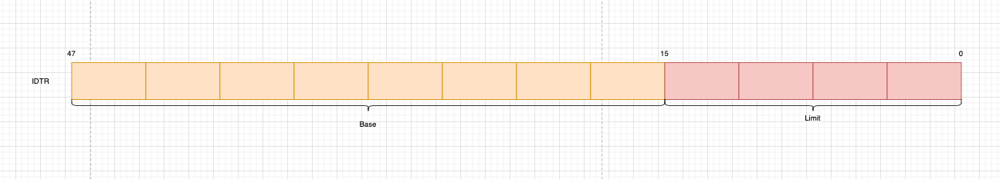

此时是禁用中断服务的，暂时不需要中断服务，因此告诉IDTR寄存器的那个中断描述符表是空的。

```asm
| 中断描述符表 此时中断描述表是空的
idt_48:
    | 2Byte IDT表的大小=0Byte
	.word	0			| idt limit=0
	| 4Byte IDT表的基地址 也就是说IDT表在0x0000上
	.word	0,0			| idt base=0L
```

