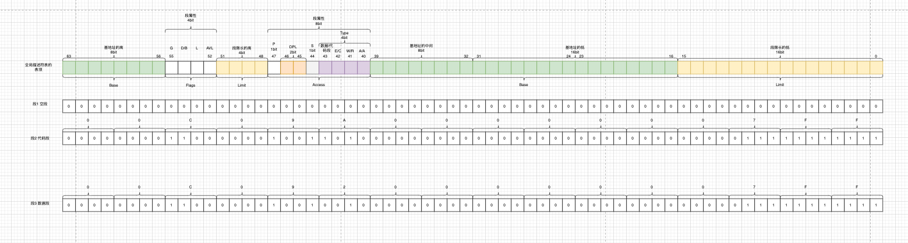

### 1 GDTR

告诉GDTR寄存器的信息是啥，将来CPU根据GDTR中的数据就可以找到全局描述符表在哪儿，有多大。

```asm
| GDT表 全局描述符表
gdt_48:
    | 2Byte GDT表的大小 也就是说GDT的大小=0x800Byte=2048Byte GDT表每个表项是8Byte 那么GDT表最多只有(2048/8)=256个段
	.word	0x800		| gdt limit=2048, 256 GDT entries
	| 4Byte GDT的线性地址 小端顺 4字节的DGT表地址是0x0009????
	.word	gdt,0x9		| gdt base = 0X9xxxx
```

### 2 GDT在哪儿

规划在高地址空间0x90000上

### 3 段信息

GDT表放了3项，也就是3个段

- 空段
- 代码段
- 数据段

GDT表中的3个项如下

```asm
| GDT表 里面每个表项是8Byte 每个表项是个段信息
gdt:
    | 段1 是空段
	.word	0,0,0,0		| dummy

    | 段2 代码段
	.word	0x07FF		| 8Mb - limit=2047 (2048*4096=8Mb)
	.word	0x0000		| base address=0
	.word	0x9A00		| code read/exec
	.word	0x00C0		| granularity=4096, 386

    | 段3 数据段
	.word	0x07FF		| 8Mb - limit=2047 (2048*4096=8Mb)
	.word	0x0000		| base address=0
	.word	0x9200		| data read/write
	.word	0x00C0		| granularity=4096, 386
```

关于段信息中，每个位上的含义，示意图中已经比较详细，需要特别说明是的段属性位

#### 3.1 段属性
##### 3.1.1 Type
第40到43位，Type属性存储了段的类型信息，该属性的含义随着S属性的不同而不同

###### S=0该段是系统段

| TYPE的4bit值16进制 | 含义                      |
| ------------------ | ------------------------- |
| 0x1                | 可用286TSS                |
| 0x2                | 该段存储了局部描述符表LDT |
| 0x3                | 忙的286TSS                |
| 0x4                | 286调用门                 |
| 0x5                | 任务门                    |
| 0x6                | 286中断门                 |
| 0x7                | 286陷阱门                 |
| 0x9                | 可用386TSS                |
| 0xB                | 忙的386TSS                |
| 0xC                | 386调用门                 |
| 0xE                | 386中断门                 |
| 0xF                | 386陷阱门                 |

###### S=1数据段或代码段

第43位=0代表数据段

| 位   | 属性 | 作用         | 值=0             | 值=1             |
| ---- | ---- | ------------ | ---------------- | ---------------- |
| 42   | E    | 段的增长方向 | 向上增长         | 向下增长         |
| 41   | W    | 段的写权限   | 只读             | 可读可写         |
| 40   | A    | 段的访问标记 | 该段没有被访问过 | 该段已经被访问过 |

第43位=1代表代码段

| 位   | 属性 | 作用           | 值=0             | 值=1             |
| ---- | ---- | -------------- | ---------------- | ---------------- |
| 42   | C    | 一致代码段标记 | 不是一致代码段   | 是一致代码段     |
| 41   | R    | 段的读权限     | 只能执行         | 可读\可执行      |
| 40   | A    | 段的访问标记   | 该段没有被访问过 | 该段已经被访问过 |

##### 3.1.2 S
第44位，S属性存储了描述符的类型

- 0 该描述符对应的段是系统段
- 1 该描述符对应的段是数据段或者代码段
##### 3.1.3 DPL

第45到46位， DPL属性占2bit，记录了访问段所需要的特权级，特权级范围从0到3，值越小特权级越高。

##### 3.1.4 P

第47位，P属性标记了该段是否存在

- P=0，该段在内存中不存在
- P=1，该段在内存中存在

尝试访问在内存中不存在的段时会触发段不存在错误

##### 3.1.5 AVL

第52位，AVL属性占1bit，该属性的意义可由操作系统、应用程序自己定义

##### 3.1.6 L

第53位，该属性仅在IA-32e模式下有意义，它标记了该段是否为64位代码段

- L=1，表示该段是64位代码段

如果L属性为1，则必须保证D属性为0

##### 3.1.7 D/B

第54位，这个属性随着段描述符是代码段、向下扩展数据段还是栈段有所不同

- 代码段(S属性第44位=1 TYPE属性第40位=1)，当段描述符是代码段的时候，此时第54位属性是D属性
  - 0 被视为16位代码段执行
  - 1 被视为32位代码段执行
- 栈段，被SS寄存器指向的数据段，这种情况下称之为B属性
  - 0 没有设置B属性，在采用堆栈访问如PUSH、POP指令时使用的是16位堆栈指针寄存器SP
  - 1 设置了B属性，在采用堆栈访问如PUSH、POP指令时使用的是32位堆栈指针寄存器ESP
- 向下扩展的数据段，这种情况是B属性
  - 0 没有设置B属性，段的上界是64KB
  - 1 设置了B属性，段的上界是4GB

##### 3.1.8 G

第55位，记录了段界限的粒度

- 0 段界限的粒度Byte
- 1 段界限的粒度是4KB

在一个段描述符中，Limit占用20bit

- 如果G=0，段的最大界限值=(1<<20)Byte=1MB
- 如果G=1，段的最大界限值=(1<<20)*4KB=4GB

GDT表中的3个段示意图



#### 3.2 代码段

代码段的8字节的16进制从高位到低位是00C0 9A00 0000 07FF

- [55]G=1 段界限的粒度4KB

- Limit=0x007FF=2047 得到段限长=(2047+1)*4KB=8MB
- Base=00000000=0x0
- [44]S=1 是代码段或数据段
- TYPE[43]=1 表示代码段
- TYPE[42]=0 不是一致性代码段
- TYPE[41]=1 可读
- TYPE[40]=0 没有被访问过
- DPL=0x00 特权级0
- P=1 该段在内存中存在
- [52]AVL=0 没有自定义含义
- [53]L=0 不是IA-32e 没有含义
- [54]是D属性=1 32位代码段

#### 3.3 数据段

数据段的8字节的16进制从高位到低位是00C0 9200 0000 07FF

- [55]G=1 段界限的粒度4KB

- Limit=0x007FF=2047 得到段限长=(2047+1)*4KB=8MB
- Base=00000000=0x0
- [44]S=1 是代码段或数据段
- TYPE[43]=0 表示数据段
- TYPE[42]=0 表示不是向下扩展
- TYPE[41]=1 可读可写
- TYPE[40]=0 没有被访问过
- DPL=0x00 特权级0
- P=1 该段在内存中存在
- [52]AVL=0 没有自定义含义
- [53]L=0 不是IA-32e 没有含义
- [54]是D属性=1 32位代码段