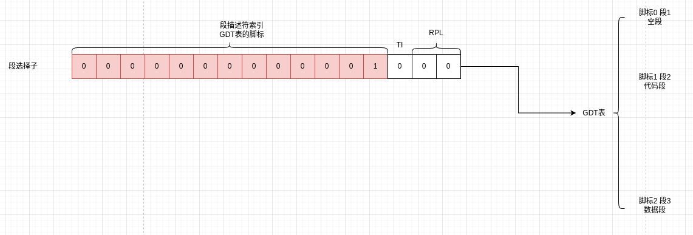

在中谈过，CS、DS寄存器中存放的段基址。

当cpu切换到32位保护模式后，CS、DS存放的就不再是段基址了，而是段选择子。顾名思义，就是CPU要根据CS、DS先选择一个段基址，再映射到物理地址。这也是GDT表存在的意义。

### 1 段选择子

比如`mov [ds:3], ax`

DS中的值是0x0008，对应的二进制就是上图

- 低3位是功能位
- 高13位的16进制就是0x01，含义就是到全局描述符表中找脚标1的地方的段描述符，也就是代码段

找到了段描述符之后读出来段基址=0

再用段基址加上偏移就是物理地址=0+0x3=0x3

### 2 GDT

在中有GDT表的详细布局。