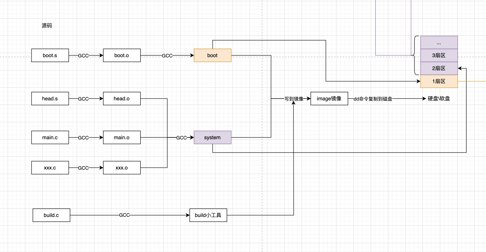
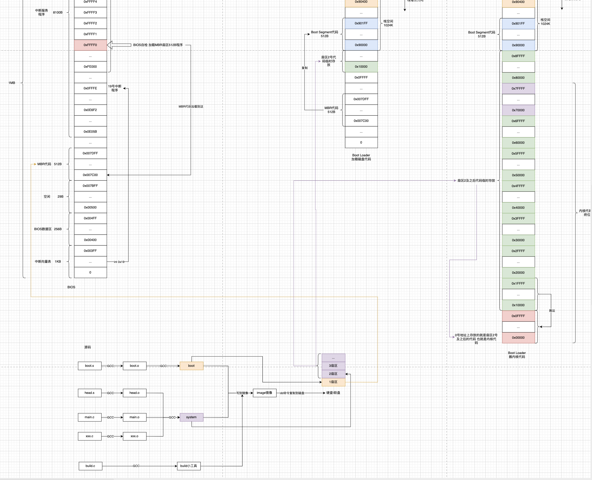

在中的最后一跳就跳到了内核代码上，前面已经讲了磁盘中代码是怎么被搬来搬去，但是当时没有讲磁盘中代码的布局。

因此这个地方有必要补上从源码编译开始到加载到内存。

### 1 源码的编译

源码分成3个部分

- build 辅助工具
- boot 负责自举
- 其他 内核

先看`Makefile`

```makefile
# 把boot模块写到镜像1号扇区 system模块从2号扇区开始写
Image: boot/boot tools/system tools/build
	tools/build boot/boot tools/system > Image
	sync

# system模块就是内核模块 包括head+其他代码
tools/system:	boot/head.o init/main.o \
		$(ARCHIVES) $(LIBS)
	$(LD) $(LDFLAGS) boot/head.o init/main.o \
	$(ARCHIVES) \
	$(LIBS) \
	-o tools/system > System.map

# boot模块 做cpu的模式切换和内存布局
boot/boot:	boot/boot.s tools/system
	(echo -n "SYSSIZE = (";ls -l tools/system | grep system \
		| cut -c25-31 | tr '\012' ' '; echo "+ 15 ) / 16") > tmp.s
	cat boot/boot.s >> tmp.s
	$(AS86) -o boot/boot.o tmp.s
	rm -f tmp.s
	$(LD86) -s -o boot/boot boot/boot.o
```

从源码到磁盘



### 2 自举过程

代码被搬来搬去的根本目的，就是在利用有限的内存空间，将内核代码放到0号内存，并提前构建好必要的内存空间。

