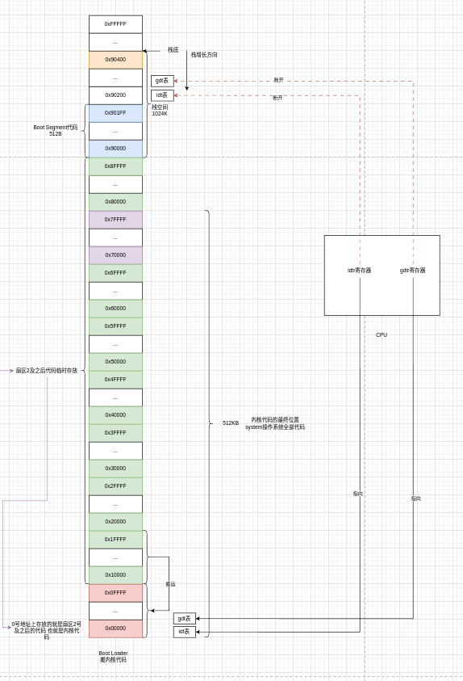

```asm
startup_32:	
	# 让ds es fs gs这几个寄存器的段选择子指向数据段描述符
    # 0x10=0B 0001 0000 低3位是000 高13位是0X10 也就是到GDT表检索脚标是2的段描述符 找到数据段
	# 让ds es fs gs这几个寄存器的段选择子指向数据段描述符
	movl $0x10,%eax
	mov %ax,%ds
	mov %ax,%es
	mov %ax,%fs
	mov %ax,%gs
	# lss指令让ss:esp这个指针指向_stack_start标号位置
	lss _stack_start,%esp
	# 设置中断描述符表
	call setup_idt
	# 设置全局描述符表
	call setup_gdt
	# 那么为什么要重建idt表和gdt表呢 因为系统代码已经被搬到了0地址上 而此时cpu寄存器的idtr和gdtr都还指向在0x90200高地址上
	# 所以这个地方重建的目的就是为了让idt表和gdt表都搬到0低地址空间上
	# 下面又重新设置段寄存器的段选择子是什么意思 因为上面修改了全局描述符表 所以这个地方要重新设置一遍刷新后才能生效
	movl $0x10,%eax		# reload all the segment registers
	mov %ax,%ds		# after changing gdt. CS was already
	mov %ax,%es		# reloaded in 'setup_gdt'
	mov %ax,%fs
	mov %ax,%gs
	lss _stack_start,%esp
	xorl %eax,%eax
```



经过这一跳，此时CPU的模式已经切换到了32位保护模式，CPU执行的代码指令地址来到了0低地址空间，但是还有2件事情待办

- cpu的代码段段选择子已经初始化好了，数据段段选择子还没初始化给cpu寄存器
- idt表和gdt表都还在0x90200高地址空间，搬代码的目的就是为了给system连续的低地址空间，现在还要把idt表和gdt表也搬下来