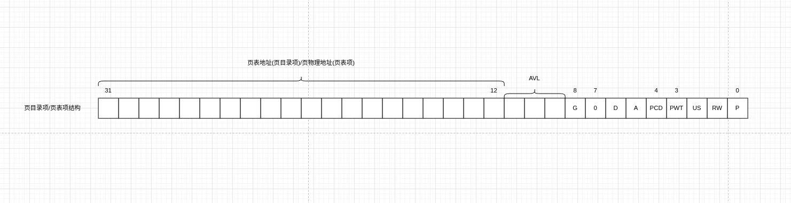
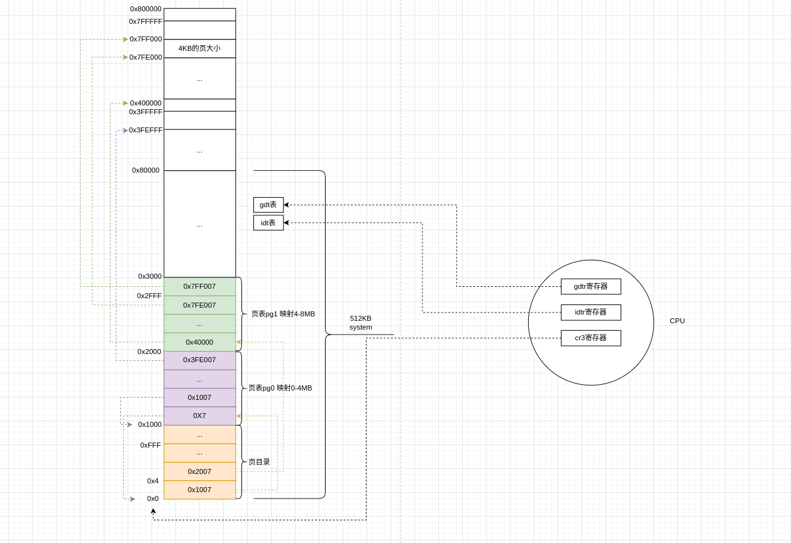

我看的这个版本分页映射的地址空间是8MB

- 1个页大小是4KB
- 1个页表有1024个页表项，即1个页表可以表达4MB

那么映射8MB需要2个页表，页表的索引信息维护在页表目录中。因此需要1个页表目录和2个页表。

核心流程分为如下部分

### 1 前置内存清理工作

```asm
	/*设置rep需要的参数*/
	movl $1024*3,%ecx
	xorl %eax,%eax
	xorl %edi,%edi			/* pg_dir is at 0x000 */
	/*cld先清除方向标志位保证下面执行的rep stosl指令地址从低到高进行复制*/
	/*重复执行ecx次stosl指令 每次将eax的值写到edi上 然后edi自增4*/
	/*达到的效果就是提前把页目录和页表构建要占用的内存清理干净*/
	/*不管页目录还是页表 每个数组项大小都是4Byte 都有1024项 也就是说一个页目录4KB 每个页目录项4B盛放一个地址指向一个页表 每个页表也是4KB 每个页表项4B盛放一个地址指向一个页 一个页大小4KB*/
	/*下面准备构建1个页目录和2个页表 也就是总共1024*3个项 把这3072个项 每个项大小4B 内存都抹0*/
	cld;rep;stosl
```

### 2 页目录填充

在进行页目录和页填充之前，先要了解页目录项和页表项的结构



```asm
	/*pg_dir是页目录的地址 也就是0地址*/
	/*页目录项和页表项存储的地址都是32位 低12位是标志位 其中低3位从低到高分别是Present Writeable User 因此0x07就是Present|R/W|User*/
	/*页目录一共1024项 前两项填充上页表pg0和pg1的地址*/
	movl $pg0+7,_pg_dir		/* set present bit/user r/w */
	movl $pg1+7,_pg_dir+4		/*  --------- " " --------- */
```

### 3 页表填充

```asm
	/*页目录已经填充完毕 准备填充页表项 这次循环从高地址往低地址 也就是先填充第2个页表最后一个表项*/
	movl $pg1+4092,%edi
	/**/
	movl $0x7ff007,%eax		/*  8Mb - 4096 + 7 (r/w user,p) */
	/*std设置方向标志位 向低地址写 因为此时edi指向了第2个页表的最后一项 每次写完一个页表项就往下跳4B到下一个页表项*/
	std
	/*stosl循环处理 把eax的值写道edi位置 每次写完edi就向低处移动4Byte跳到下一个页表项*/
1:	stosl			/* fill pages backwards - more efficient :-) */
	/*stosl跳出循环的边界eax从0x7ff000到0 也就是第1个页表的第1个页表项填充完 也就是两个页表项全部都填充完页地址*/
	subl $0x1000,%eax
	jge 1b
```

### 4 cr0寄存器和cr3寄存器

```asm
	/*eax寄存器值赋0给cr3寄存器 就是告诉cr3寄存器页目录表的地址在0处*/
	xorl %eax,%eax		/* pg_dir is at 0x0000 */
	movl %eax,%cr3		/* cr3 - page directory start */
	/*开启分页 方式是cr0寄存器高31位置1 算法是cr0寄存器的值或上0x8000 0000*/
	movl %cr0,%eax
	orl $0x80000000,%eax
	movl %eax,%cr0		/* set paging (PG) bit */
```

进行完分页开启之后，此刻内存布局为

