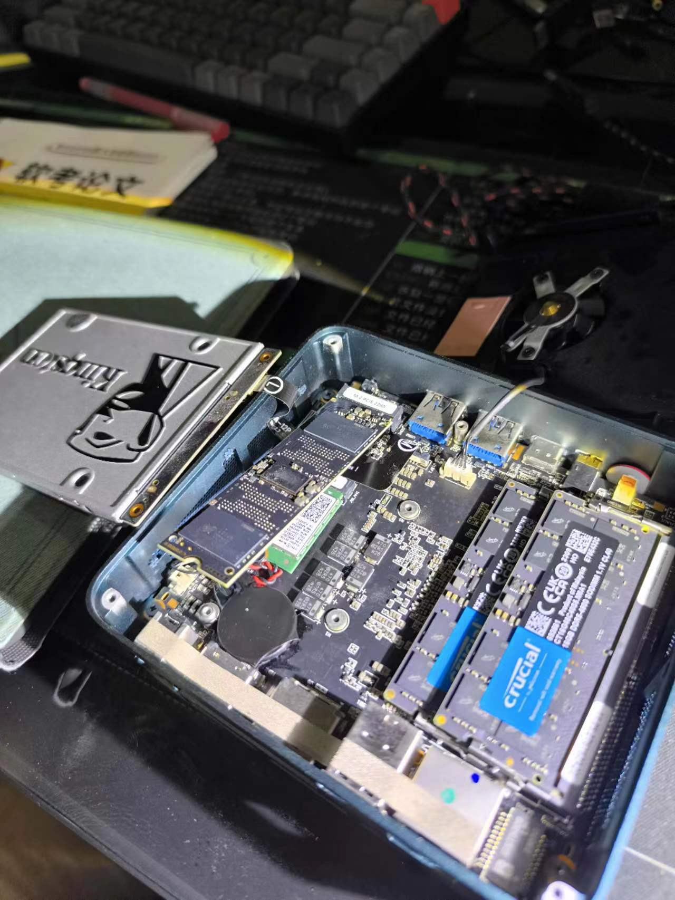
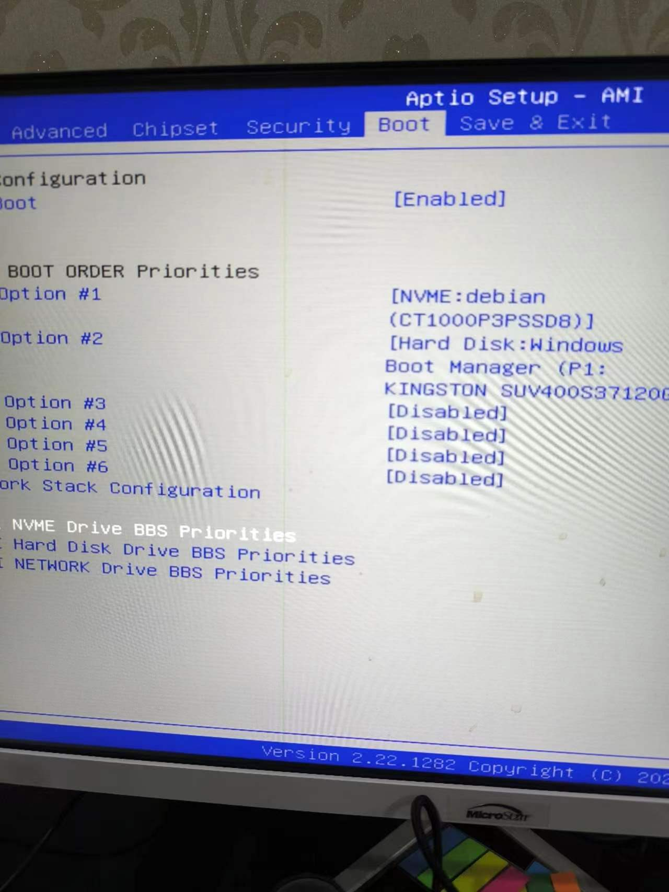
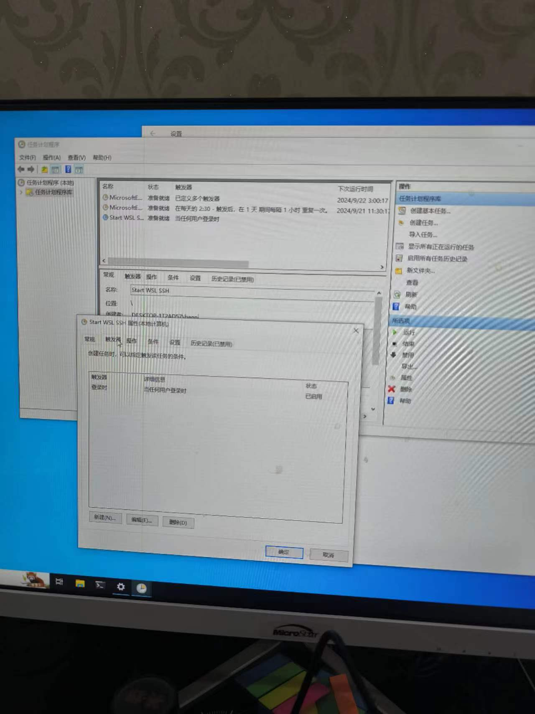

最近发现mac发热异常，并且伴随着没有规律的短暂性黑屏，想必是负载过重，结合实际的使用情况最终决定尝试一下如下方案

- mac作为使用入口 享受它的触摸板/画质/编辑器/命令行 总而言之就是不干重活

- windows作为跳板 因为要连公司的网就得安装个傻逼软件 这个软件没有linux版本 但是我是受不了一点windows作为开发平台

- 用windows的wsl干重活

那么大体的思路就是

- 刚好电脑有个sata硬盘接口 又恰好有个120G的固态 双硬盘双系统隔离

- windows开启sshd服务 收到请求后转发到wsl

- wsl开启sshd服务

### 1 装系统

为了不影响现在的系统盘，我的方式是

- 拆掉当前m2硬盘

- 安装sata硬盘

- 安装系统

- 系统安装好后重新安装m2硬盘

- 开机的时候调整BIOS启动选项选择想要使用的系统





### 2 wsl安装

在windows以管理员身份很运行powershell 安装默认的ubuntu发行版

- `dism.exe /online /enable-feature /featurename:VirtualMachinePlatform /all /norestart`

- `wsl --install`

- 安装好后在开始菜单中找到ubuntu运行 根据提示创建用户密码即可

- 修改软件源

```sh
sudo sed -i "s@http://.*archive.ubuntu.com@https://mirrors.tuna.tsinghua.edu.cn@g" /etc/apt/sources.list
sudo sed -i "s@http://.*security.ubuntu.com@https://mirrors.tuna.tsinghua.edu.cn@g" /etc/apt/sources.list
sudo apt update && sudo apt upgrade -y
```

- 安装ssh服务端

`sudo apt install openssh-server`

- 修改sshd配置`sudo vim /etc/ssh/sshd_config`

```sh
# 根据自己的喜好放开端口
Port 22
AddressFamily any
ListenAddress 0.0.0.0
PermitRootLogin yes
PasswordAuthentication yes
```

- 启动ssh服务`sudo /usr/sbin/service ssh start`

- 重启ssh服务`sudo service ssh --full-restart
`

### 3 windows配置

- 防火墙设置 放开上面配置的ssh端口

  - 打开控制面板->系统和安全->防火墙

  - 高级设置

  - 入站规则->新建入站规则

   - 端口->22

此时已经可以在本机ssh到wsl了`ssh wsl用户名@localhost -p 22`

下面就是要让windows在启动的时候执行脚本 负责两件事情

- 启动wsl的sshd服务

- 映射网卡请求到wsl

新建环境变量USERPROFILE=当前用户目录 在用户目录根目录下新建sshd.bat脚本

```sh
rem sshd.bat
@echo off
setlocal

; 这段脚本在终端执行 因为lunix主机需要密码 所以会唤醒终端等待用户输入 因此通过-S指定密码 就不会阻塞在终端等用户输入了
C:\Windows\System32\bash.exe -c "echo 19920308 | sudo -S /usr/sbin/service ssh start"
rem C:\Windows\System32\wsl.exe -e "echo 19920308 | sudo -S /usr/sbin/service ssh start"

; 映射网卡 把win收到的ssh请求转给linux
C:\Windows\System32\netsh.exe interface portproxy delete v4tov4 listenport=22 listenaddress=0.0.0.0 protocol=tcp

for /f %%i in ('wsl hostname -I') do set IP=%%i
C:\Windows\System32\netsh.exe interface portproxy add v4tov4 listenport=22 listenaddress=0.0.0.0 connectport=22 connectaddress=%IP%

endlocal

; pause
```

将上面的脚本配置到windows的开机自启动



### 4 mac连接wsl

在mac上`ssh wsl的用户名@windows的ip -p 22`即可