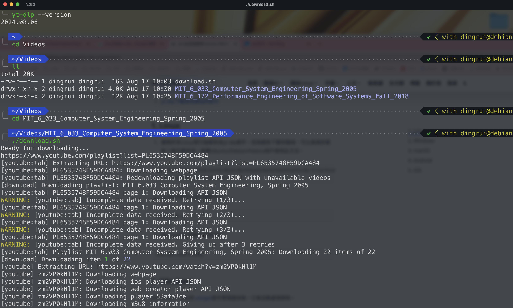

在MAC上用习惯了yt-dlp下载器，刚才用linux跑同样的脚本，在linux环境一直报错，初步判断是因为yt-dlp的版本过低导致的，但是apt下载到的已经是最新的了，为了以后升级方便。

### 1 安装

```sh
sudo wget https://github.com/yt-dlp/yt-dlp/releases/latest/download/yt-dlp -O /usr/local/bin/yt-dlp
sudo chmod a+rx /usr/local/bin/yt-dlp
```

### 2更新

```sh
sudo yt-dlp -U
```

### 3 ffmpeg

```sh
sudo apt install ffmpeg
```

### 4 下载

正如预期，下载了最新版本的yt-dlp就可以正常使用了。

```sh
url=https://www.youtube.com/playlist?list=PL6535748F59DCA484
echo 'Ready for downloading...'
echo $url
yt-dlp $url --proxy socks5://127.0.0.1:7890
```

