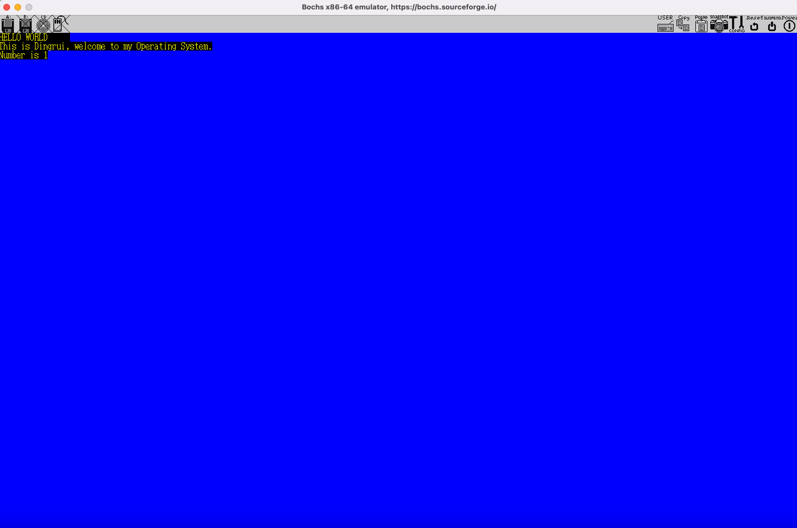

可能每个软件开发工程师都有深入探究操作系统的冲动。

> [GIT链接](https://github.com/Bannirui/my-os)

在最初的设计中，我想尽量避开汇编，用最少的汇编代码写必要的部分，剩下能c尽c。

为什么这条路行不通呢

- 处理器必须会从16位一路切换模式最终跑在64位下，这就意味着要用gcc编译c能跑在16位。这就立马衍生两个问题
  - gcc的交叉编译，我在github倒是找到一个ia16的交叉编译器，项目太过久远，特性支持有限。
  - 链接，需要跟引导扇区的boot代码联合，跨段调用和跨段跳转没有解决
- 汇编/c联合编程互相调用的参数压栈协议在交叉编译器下只支持near call

上面的问题导致还没进行到16位实模式向32位保护模式切换就夭折了。其实这也说明大牛的工程选择一定是通过验证的，linux从boot到loader，再到kernel中一小部分都是汇编。

之前已经简单看过了linux源码，这次真正照着资料和教程实现内核在屏幕上打印`HELLO WORLD`，体验和收获截然不同，或多或少都会对操作系统有更深的理解。

关于项目的考量规划和学习到的点有哪些

- 项目的开发环境是docker，防止pc/编译器/版本不同带来后期成本
- 处理器模式的切换
  - 16位实模式切32位保护模式
  - 16位实模式切32位Big-Real-Mode
  - 32位保护模式切64位IA-32e长模式
- 逻辑地址 vs 物理地址
  - 实模式下的逻辑地址
  - 保护模式下的逻辑地址
  - 长模式下的虚拟地址
- GDT内存布局和段描述符
- 段选择子
- 分页机制的工作原理
  - 页表跟页表项
  - 页表内存映射规划
  - 多级页表
    - 3级页表
    - 4级页表
- 汇编/c联合编程实现打印