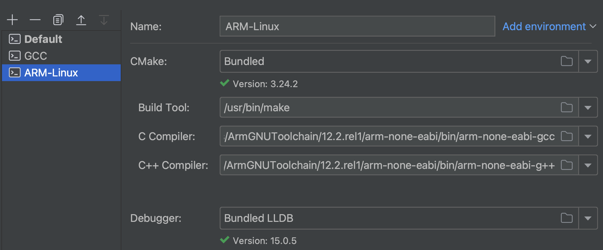
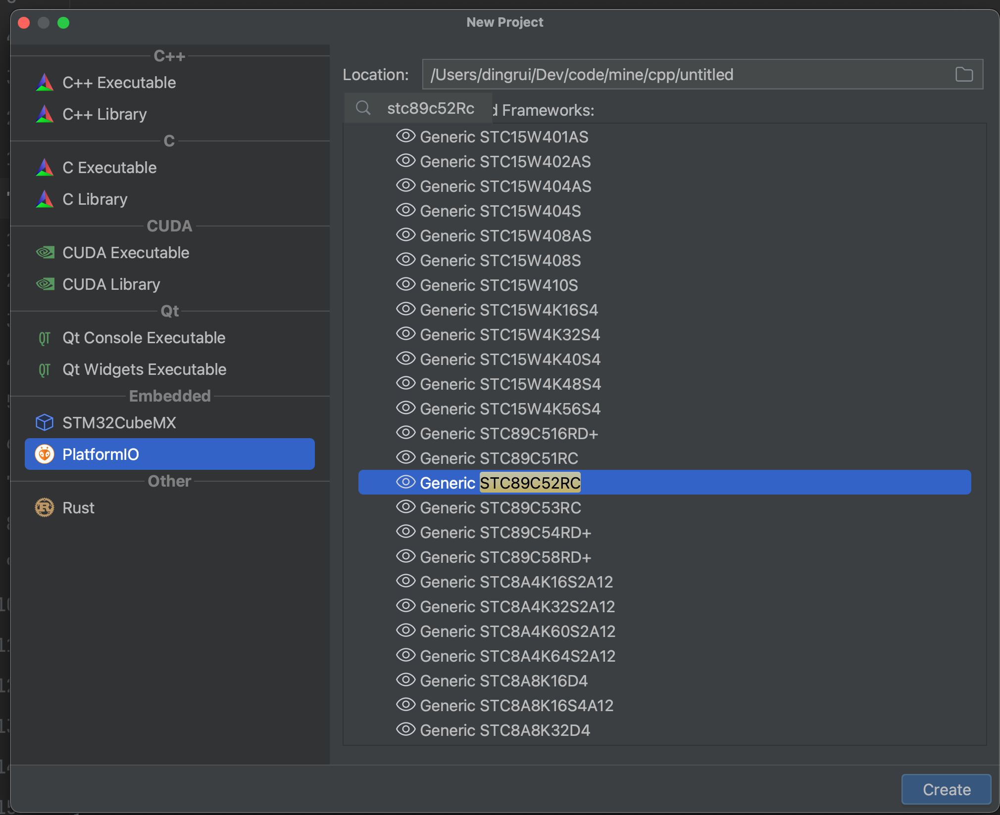
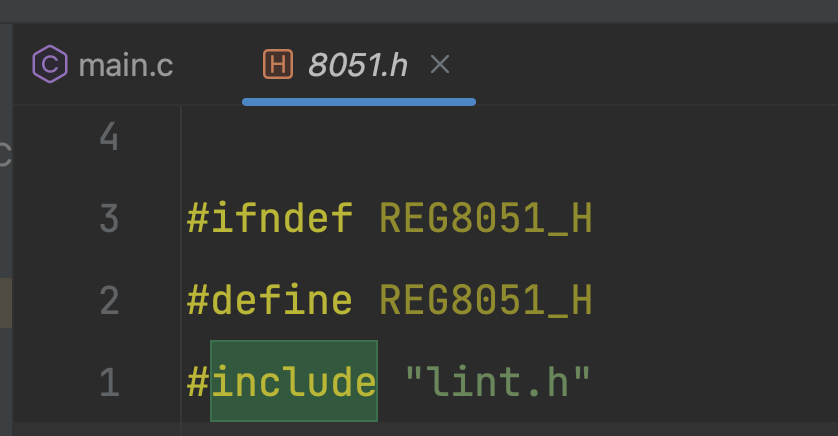
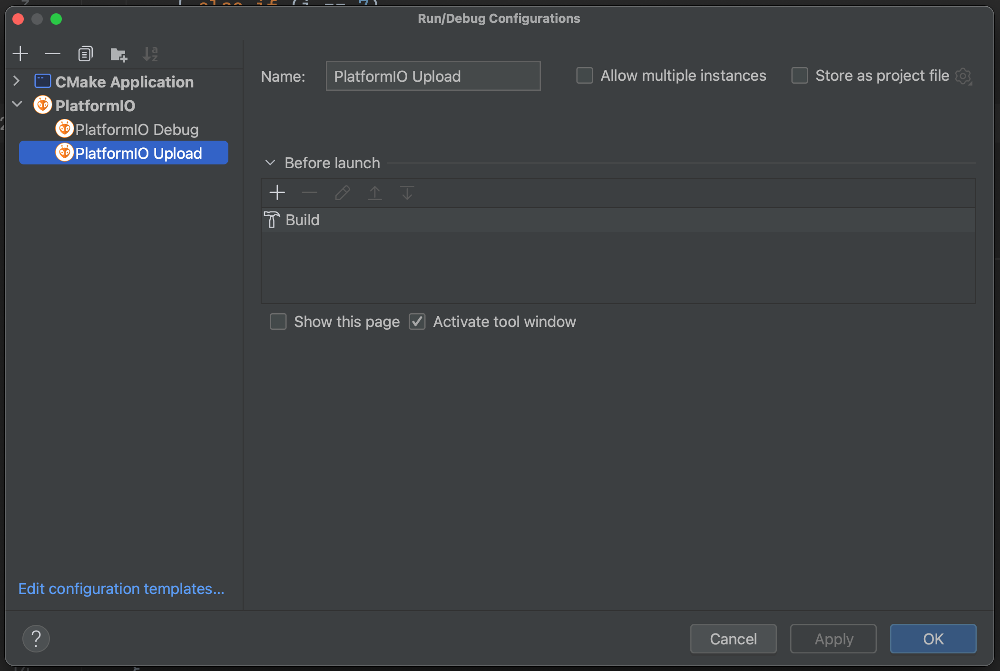

## 0 OS环境


## 1 IDE

下载Clion


## 2 嵌入式插件

安装pio插件


## 3 嵌入式

* [安装PlatformIO Core](https://docs.platformio.org/en/latest/core/installation/index.html)

* 我使用的是HomeBrew进行管理

  ```shell
  brew update
  
  brew install platformio
  ```

* 验证

  ```shell
  pio --version
  ```

## 4 IDE编译

### 4.1配置ToolChains

除了默认，我额外配置了2个，都是用的gcc编译器，但是调试器不一样

#### 4.1.1 Default


#### 4.1.2 GCC


#### 4.1.3 ARM-Linux



### 4.2 配置CMake

根据需要选择配置的ToolChain，我优先使用的是ARM-Linux

#### 4.2.1 Default


#### 4.2.2 Debug-ARM-Linux


## 5 烧录

### 5.1 安装对应的USB驱动

* 比如安装CH340驱动，[根据系统选择自己需要的版本进行安装](https://sparks.gogo.co.nz/ch340.html)

* 安装好驱动后，将板子连接PC进行验证

  ```shell
  pio device list
  ```

### 5.2 stcgal

* 这个是python项目的一个package，需要前置安装好py3

  ```shell
  pip3 install stcgal
  ```

* 验证

  ```shell
  stcgal --version
  ```

## 6 项目流程

### 6.1 新建项目

选择自己适配的板子型号，没有需要的板子就按照单片机型号进行选择



### 6.2 添加单片机头文件

pio集成的环境使用的是sdcc编译，提供了开发的头文件，需要加到CMakeLists中让IDE识别到

```shell
include_directories("$ENV{HOME}/.platformio/packages/toolchain-sdcc/share/sdcc/include")
```

### 6.3 修改platformio.ini

我使用的默认的upload烧录不成功，应该是我电脑上有多个py版本导致pip管理的stcgal有错乱，手动指定烧录命令

```in
upload_port = /dev/cu.wchusbserial14340
upload_protocol = stcgal
upload_flags =
    -P
    stc89
    -p$UPLOAD_PORT
upload_command = stcgal $UPLOAD_FLAGS ./.pio/build/STC89C52RC/firmware.hex
```

### 6.4 IDE头文件路径飘红问题

在8051.h和8052.h头文件中#include "lint.h"




### 6.5 语法问题

大部分教材文档都是基于windows+keil的，mac+sdcc的语法跟其有些不同

中断回调函数定义中x标识的是中断号

比如

| 中断号 | 含义        |
| ------ | ----------- |
| 0      | 外部中断0   |
| 1      | 定时器中断0 |
| 2      | 外部中断1   |
| 3      | 定时器中断1 |
| 4      | 串口中断    |


|                | sdcc                           | keil                             |
| -------------- | ------------------------------ | -------------------------------- |
| 头文件         | 8052.h/8051.h                  | reg52.h/reg51.h                  |
| 端口控制口定义 | #define LED1 P2_0              | sbit LED1 = P2 ^ 0;              |
| 中断回调定义   | void time1() __interrupt(x) {} | void time1() interrupt 3 using 2 |

### 6.6 烧录

#### 6.6.0 打开开关，给板子供电

#### 6.6.1 在Upload的前置加上Build，这样每次改完代码直接点击Upload就行



#### 6.6.2 烧录是根据终端提示进行断电/供电操作

出现==Waiting for MCU, please cycle power: done==提示时手动进行一次断电/上电动作

完整执行日志如下

```txt
/usr/local/Cellar/platformio/6.1.5_1/bin/platformio -c clion run --target upload -e STC89C52RC
Processing STC89C52RC (platform: intel_mcs51; board: STC89C52RC)
--------------------------------------------------------------------------------
Verbose mode can be enabled via `-v, --verbose` option
CONFIGURATION: https://docs.platformio.org/page/boards/intel_mcs51/STC89C52RC.html
PLATFORM: Intel MCS-51 (8051) (2.1.0) > Generic STC89C52RC
HARDWARE: STC89C52RC 11MHz, 512B RAM, 8KB Flash
PACKAGES: 
 - tool-stcgal @ 1.106.0 (1.6) 
 - tool-vnproch55x @ 1.0.220407 
 - toolchain-sdcc @ 1.40200.0 (4.2.0)
LDF: Library Dependency Finder -> https://bit.ly/configure-pio-ldf
LDF Modes: Finder ~ chain, Compatibility ~ soft
Found 0 compatible libraries
Scanning dependencies...
No dependencies
Building in release mode
Checking size .pio/build/STC89C52RC/firmware.hex
Advanced Memory Usage is available via "PlatformIO Home > Project Inspect"
Flash: [=         ]   7.6% (used 626 bytes from 8192 bytes)
Configuring upload protocol...
AVAILABLE: stcgal
CURRENT: upload_protocol = stcgal
Looking for upload port...
Using manually specified: /dev/cu.wchusbserial14340
Uploading .pio/build/STC89C52RC/firmware.hex
Waiting for MCU, please cycle power: done
Target model:
  Name: STC89C52RC/LE52R
  Magic: F002
  Code flash: 8.0 KB
  EEPROM flash: 6.0 KB
Target frequency: 11.030 MHz
Target BSL version: 6.6C
Target options:
  cpu_6t_enabled=False
  bsl_pindetect_enabled=False
  eeprom_erase_enabled=False
  clock_gain=high
  ale_enabled=True
  xram_enabled=True
  watchdog_por_enabled=False
Loading flash: 626 bytes (Intel HEX)
Switching to 19200 baud: checking setting testing done
Erasing 4 blocks: done

Writing flash:   0%|          | 0/1024 [00:00<?, ? Bytes/s]
Writing flash:  25%|██▌       | 256/1024 [00:00<00:00, 2110.54 Bytes/s]
Writing flash:  50%|█████     | 512/1024 [00:00<00:00, 1328.97 Bytes/s]
Writing flash:  75%|███████▌  | 768/1024 [00:00<00:00, 1274.83 Bytes/s]
Writing flash: 100%|██████████| 1024/1024 [00:00<00:00, 1315.79 Bytes/s]
Writing flash: 1152 Bytes [00:00, 1515.85 Bytes/s]                      
Setting options: done
Disconnected!
========================= [SUCCESS] Took 7.21 seconds =========================

Process finished with exit code 0
```

## 7 代码

[Git地址](https://github.com/Bannirui/STC89C52RC.git)，master分支。

