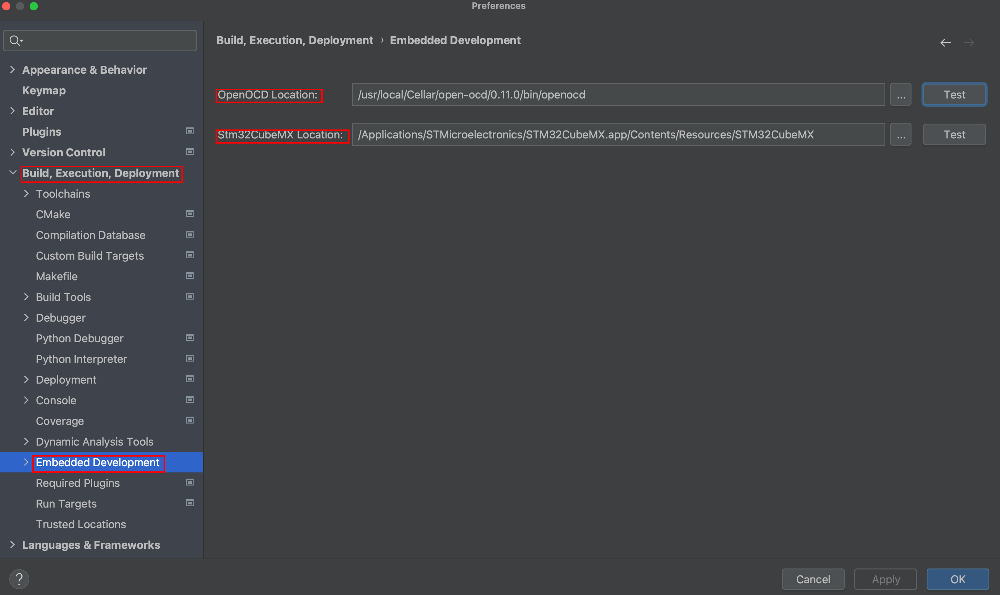
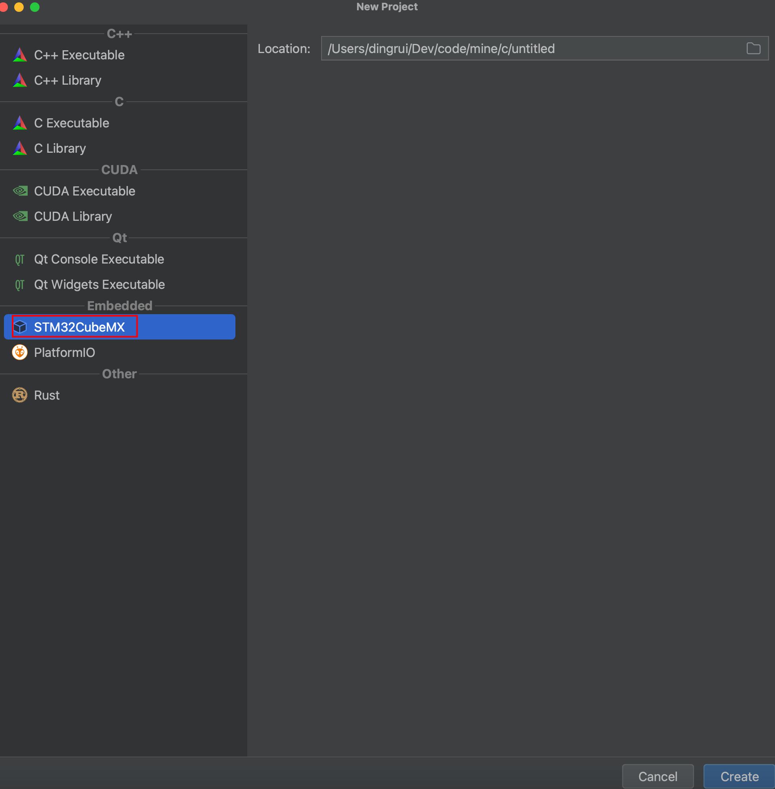
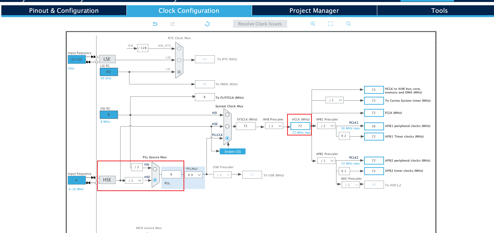
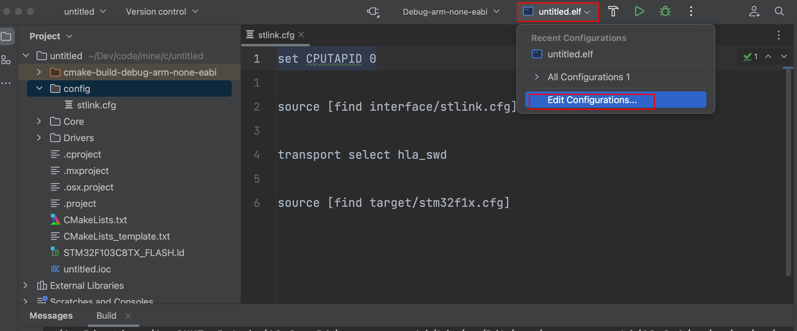
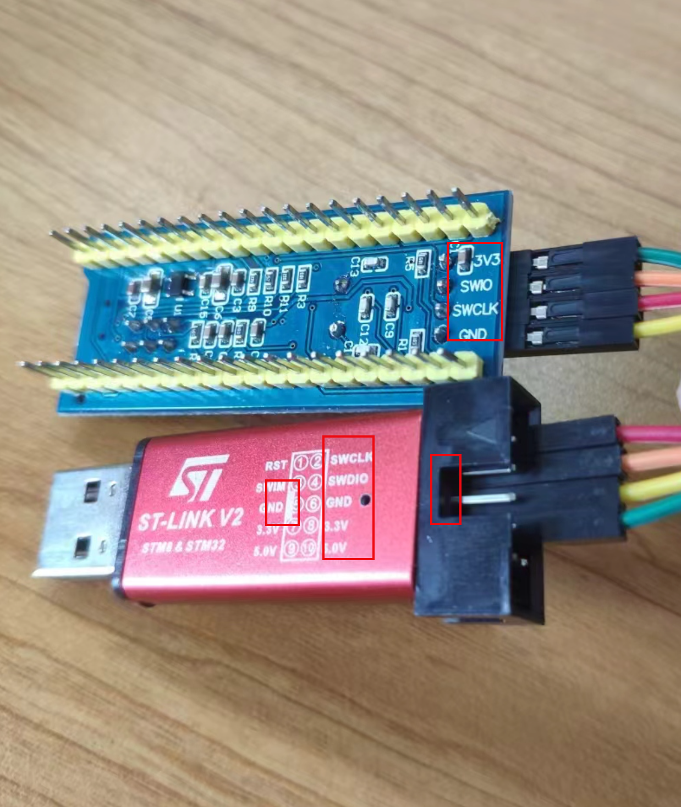

### 1 环境

| Name              | Version   | Mark     | Download\Install                                             |
| ----------------- | --------- | -------- | ------------------------------------------------------------ |
| macOS             | 11.5.2    | -        | -                                                            |
| Clion             | 2023.1.4  | -        | -                                                            |
| STM32CubeMX       | 6.8.1     | 配置MCU  | https://www.st.com/en/development-tools/stm32cubemx.html#get-software |
| arm-none-eabi-gcc | 12.2.Rel1 | 交叉编译 | https://developer.arm.com/downloads/-/arm-gnu-toolchain-downloads |
| open-ocd          | 0.12.0    | 烧录器   | brew install open-ocd                                        |

### 2 STM32CubeMX安装

#### 2.1 下载


#### 2.2 安装引导

上述下载的压缩文件zip解压后运行


#### 2.3 包管理路径设置

将MCU固件包和STM32Cube扩展包都安装都该路径。


### 3 交叉编译器安装

```shell
brew tap ArmMbed/homebrew-formulae

brew install arm-none-eabi-gcc

arm-none-eabi-gcc -v
```

### 4 Clion设置

#### 4.1 toolChain

ARM工具链，编译器指定为步骤3安装好的交叉编译器。


#### 4.2 cmake

使用arm工具链作为项目编译器。


#### 4.3 openocd && cubemx



### 5 新建项目

#### 5.1 clion创建项目




创建项目的过程就是Clion通过上面配置的STM32CubeMX进行初始化，创建好后弹出让我们选择板型配置文件的弹窗，这个文件是后面用来烧录程序用的，也就是openocd要识别的配置文件，现在可以选择跳过，后面到了烧录步骤再单独配置。


#### 5.2 配置MCU

##### 5.2.1 cube打开项目


找到刚才通过clion创建的项目。


##### 5.2.2 mcu型号

生成的默认的项目的stm芯片型号不一定刚好就是自己需要的，比如在下手里只有一个STM32F103C8T6的最小电路，那么我们就更改成自己需要的型号。


##### 5.2.3 SYS设置

我买的板子，附带了一个stlink下载器，到时候烧录程序就是通过openocd+usb stlink。

仿真模式选择SWD，只占用2个IO口。


##### 5.2.4 RCC时钟设置

高速时钟和低速时钟都设置为外部晶振


##### 5.2.5 时钟树设置


由电路原理图可知，该开发板使用的外部晶振频率是8MHZ



##### 5.2.6 管脚设置

###### 5.2.6.1 led电路原理图

LED阳极是3.3V电压，阴极接的是PC13网络标号的管脚。

那么给PC13高电平，LED就灭，给PC13低电平，LED就亮。


###### 5.2.6.2 PC13管脚设置

将PC13设置为输出


#### 5.3 项目配置

* 首先，注意项目路径及项目名，要跟clion创建好的相同，我们的目的是为了将配置好的项目信息覆盖到原有的项目上。
* 其次，开发工具下拉选项没有Clion，因此我就随便选了一个STM32CubeIDE。


#### 5.4 保存项目配置


### 6 Coding

#### 6.1 cmake配置


#### 6.2 编译


#### 6.3 openocd

##### 6.3.1 配置文件

```shell
set CPUTAPID 0
source [find interface/stlink.cfg]
transport select hla_swd
source [find target/stm32f1x.cfg]
adapter speed 10000
reset_config none
```


##### 6.3.2 配置项




#### 6.4 code


上面设置GPIO的时候给PC13设置过网络标号，这个地方也可以使用网络标号

```c
HAL_GPIO_WritePin(D2_GPIO_Port, D2_Pin, GPIO_PIN_SET);
HAL_Delay(500);
HAL_GPIO_WritePin(D2_GPIO_Port, D2_Pin, GPIO_PIN_RESET);
HAL_Delay(500);
```

#### 6.5 仿真器接线



板子是最小系统，只支持SWD接口。

仿真器是ST-Link，支持SWD和TTL两种模式。

在仿真器上有防呆标识，不要连错串口。

#### 6.6 烧录

##### 6.6.1 烧录程序


##### 6.6.2 观察开发板led闪烁情况


#### 6.7 调试


