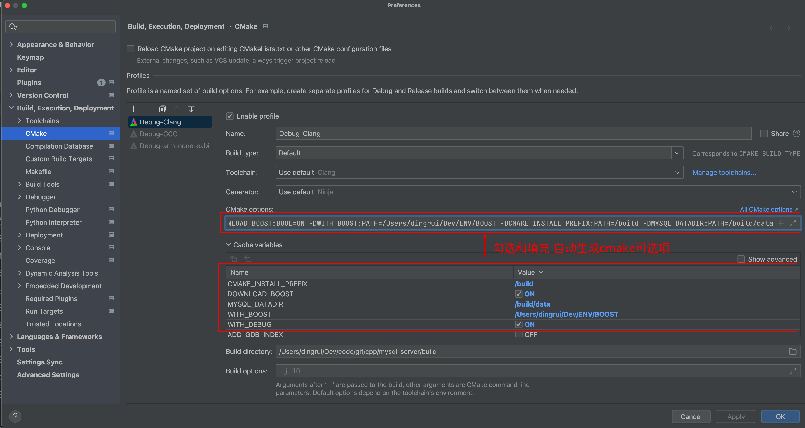
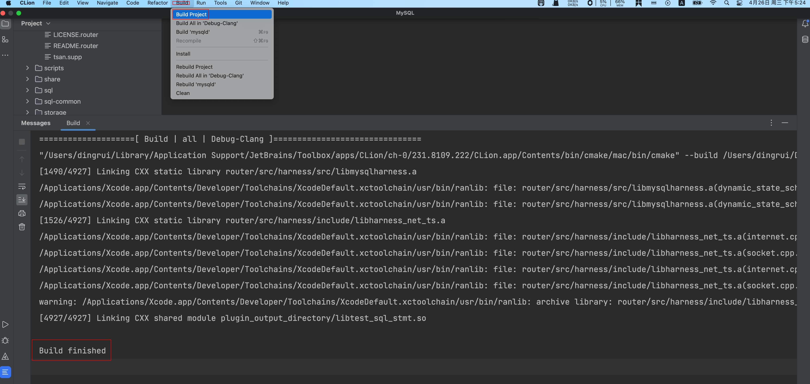
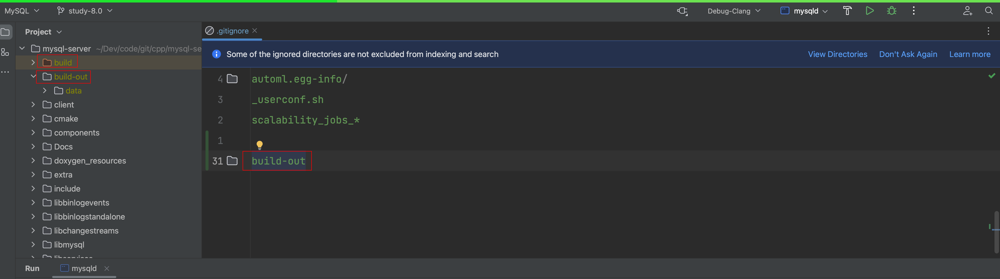
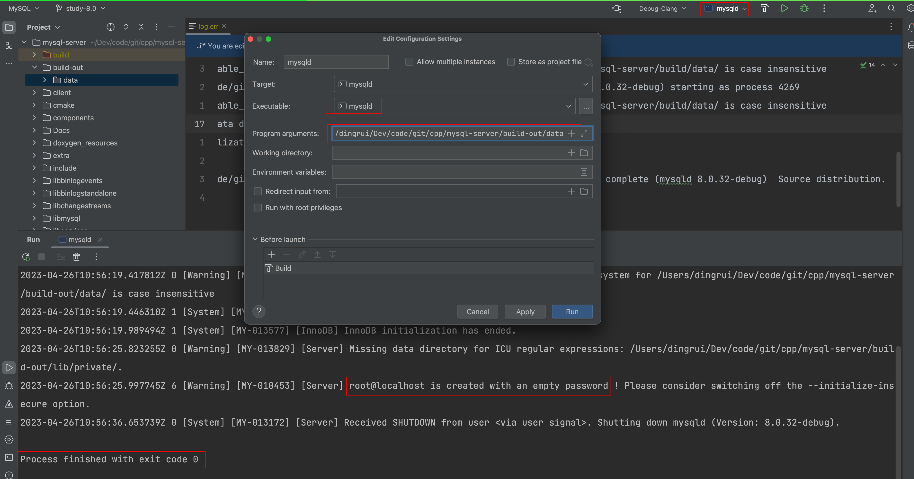

### 1 环境

| Name  | Version  |
| ----- | -------- |
| macOS | 11.5.2   |
| clion | 2023.1.1 |
| git   | 2.40.0   |

### 2 源码

```shell
fork

> git clone git@github.com:Bannirui/mysql-server.git

> git remote add upstream git@github.com:mysql/mysql-server.git
> git remote set-url --push upstream no_push

> git remote -v
origin  git@github.com:Bannirui/mysql-server.git (fetch)
origin  git@github.com:Bannirui/mysql-server.git (push)
upstream        git@github.com:mysql/mysql-server.git (fetch)
upstream        no_push (push)

> git checkout -b study-8.0 origin/8.0
> git add .
> git commit -m 'buid on clion'
> git push origin study-8.0
```

### 3 Clion设置

#### 3.1 新建日志目录

```shell
mkdir -p build/data
```

#### 3.2 cmake设置

```shell
-DWITH_DEBUG:BOOL=ON
-DDOWNLOAD_BOOST:BOOL=ON
-DWITH_BOOST:PATH=/Users/dingrui/Dev/ENV/BOOST
-DCMAKE_INSTALL_PREFIX:PATH=/build
-DMYSQL_DATADIR:PATH=/build/data
```



#### 3.3 编译



#### 3.4 运行msqld

##### 3.4.1 新建data目录

```shell
mkdir -p build-out/data
```

##### 3.4.1 gitignore



##### 3.4.2 初始化

```shell
--basedir=/Users/dingrui/Dev/code/git/cpp/mysql-server/build-out
--datadir=/Users/dingrui/Dev/code/git/cpp/mysql-server/build-out/data
--initialize-insecure
```



##### 3.4.3 启动服务

修改启动参数再次运行即可。

```shell
--basedir=/Users/dingrui/Dev/code/git/cpp/mysql-server/build-out
--datadir=/Users/dingrui/Dev/code/git/cpp/mysql-server/build-out/data
```

