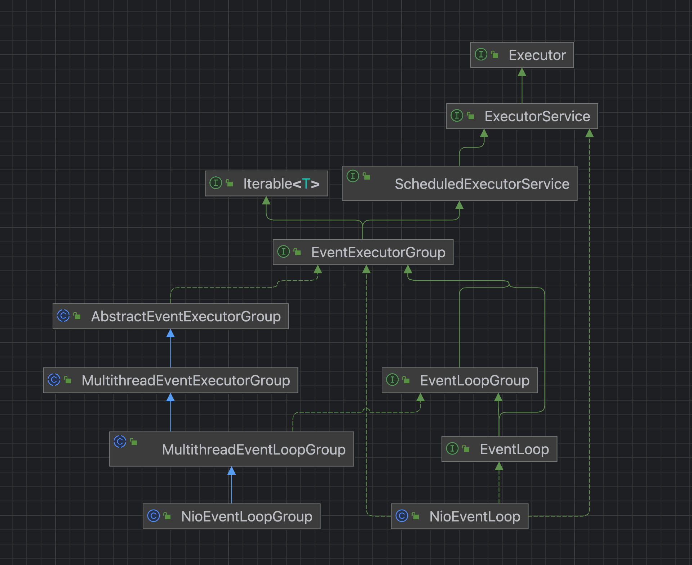
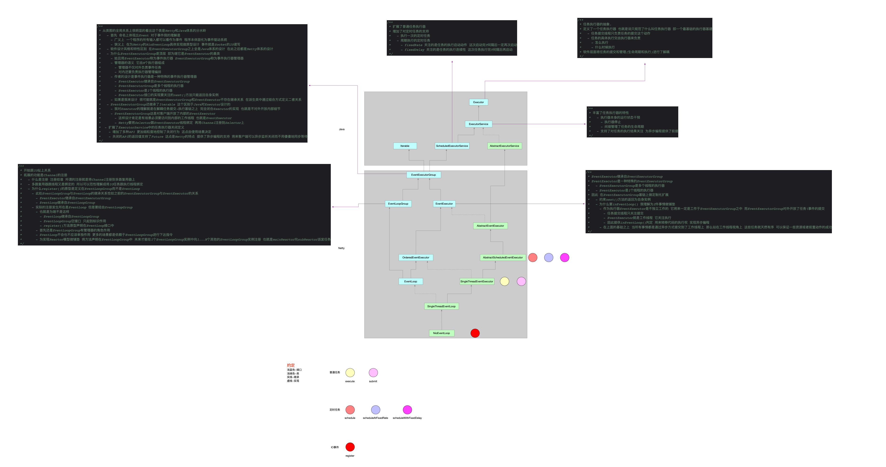

### 1 NioEventLoopGroup类图关系

Netty中NioEventLoopGroup组件和NioEventLoop组件比较重要，二者关系像是皮毛关系：

* NioEventLoopGroup是皮
* NioEventLoop是毛

从上面的类图可以看出来，NioEventLoopGroup和NioEventLoop追根溯源都派生自EventLoopGroup。

* NioEventLoopGroup充当的角色更多的是对NioEventLoop的管理，NioEventLoopGroup负责对外。
* NioEventLoop充当的角色是任务执行。
* 甚至二者的继承关系可以粗略理解为EventLoop是特殊的EventLoopGroup。

因此，梳理组件实现的时候，切入口最好选择NioEventLoopGroup，在此之前先宏观理解一下NioEventLoop的设计。

### 2 NioEventLoop抽象设计

### 3 期待了解的机制和实现

* NioEventLoopGroup和NioEventLoop的父子组合关系是怎么编排的
* 很明显NioEventLoopGroup具备任务管理能力和调度能力
  * 普通任务存放在哪儿
  * 定时任务存放在哪儿
  * IO读写(特指Socket编程)的主动权肯定在OS的多路复用器上，怎么转移对IO任务的控制权的
* 同上，NioEventLoop是具体的执行者
  * 普通任务怎么执行
  * 定时任务怎么执行
  * IO任务怎么执行
* NioEventLoop是单线程的模型，但是它的继承关系图上没有Thread，那么跟线程就不是派生关系，那就只剩组合关系了，怎么组合线程的
* NioEventLoop的线程模型是怎样的
* 用Netty都是进行网络编程的，既然这样，为什么作者设计的NioEventLoop是从Executor->EventLoop->NioEventLoop，为什么不是直接定义一个NioEventLoop，也就是说为什么NioEventLoop的实现要关注跟IO没关系的任务
  * 普通任务
  * 定时任务
* NioEventLoopGroup派生自EventLoopGroup，也就是从EventLoopGroup开始，整个组件体系跟Channel开始扯上关系，那么在多个NioEventLoopGroup时，是怎么实现类似于dispatch的功能的
* 继续上面问题，自然而然出现了Reactor模型，那么Netty的Reactor网络模型具体是怎么样
