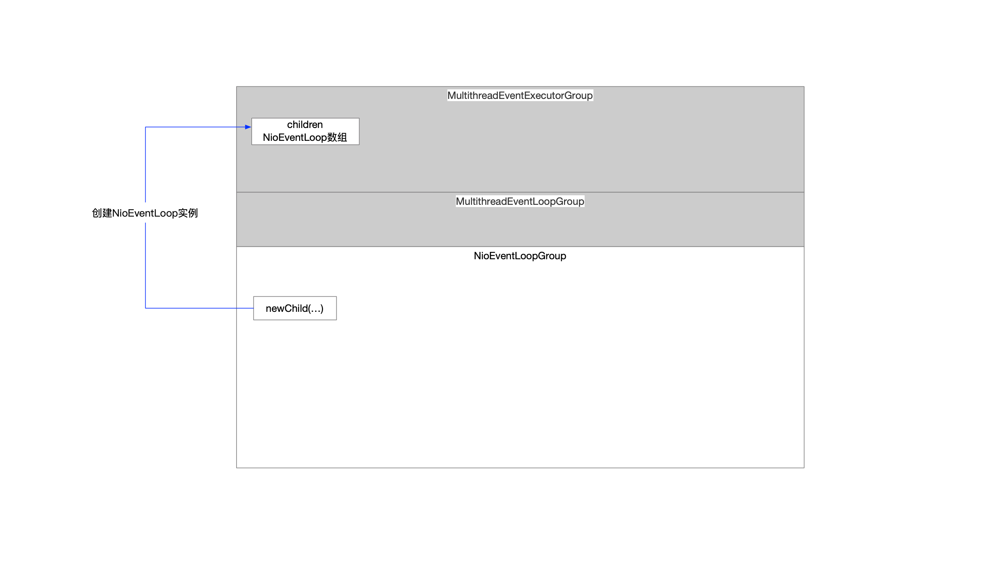

### 1 NioEventLoopGroup构造方法调用路径

```java
public NioEventLoopGroup(int nThreads, // 线程池中的线程数 就是NioEventLoop的实例数量
                             Executor executor, // 本身就要构造一个线程池Executor 现在又传进来一个executor实例 这个实例不是给线程池使用的 而是给NioEventLoop使用的
                             EventExecutorChooserFactory chooserFactory, // 当提交一个任务到线程池的时候 线程池需要选择其中的一个线程执行这个任务 chooserFactory就是实现选择策略的
                             SelectorProvider selectorProvider, // SelectorProvider.provider() 通过selectorProvider实例化jdk的Selector 每个线程池都持有一个selectorProvider实例
                             SelectStrategyFactory selectStrategyFactory, // DefaultSelectStrategyFactory.INSTANCE 涉及到线程在做select操作和执行任务过程中的策略选择问题
                             RejectedExecutionHandler rejectedExecutionHandler, // RejectedExecutionHandlers.reject() Netty选择的默认拒绝策略是抛出异常 线程池中没有可用线程时执行任务的情况时使用 这个是给NioEventLoop使用的
                             EventLoopTaskQueueFactory taskQueueFactory,
                             EventLoopTaskQueueFactory tailTaskQueueFactory
    ) { // 参数最全的构造方法
        super(nThreads, executor, chooserFactory, selectorProvider, selectStrategyFactory, rejectedExecutionHandler, taskQueueFactory, tailTaskQueueFactory); // 调用父类构造方法
    }
```

NioEventLoopGroup->MultithreadEventLoopGroup->MultithreadEventExecutorGroup

### 2 MultithreadEventExecutorGroup构造方法

```java
    /**
     * NioEventLoopGroup中维护的NioEventLoop集合 一个group里面有哪些EventLoop
     * NioEventLoop的基类是EventExecutor
     */
    private final EventExecutor[] children;
```


```java
    protected MultithreadEventExecutorGroup(int nThreads, // 标识着group中有几个EventLoop
                                            Executor executor, // null
                                            EventExecutorChooserFactory chooserFactory, // DefaultEventExecutorChooserFactory.INSTANCE
                                            Object... args // [SelectorProvider SelectStrategyFactory RejectedExecutionHandlers]
    ) {
        // ...

        /**
         * 构建NioEventLoop
         * NioEventLoop children数组 线程池中的线程数组
         */
        this.children = new EventExecutor[nThreads];

        for (int i = 0; i < nThreads; i ++) { // 根据NioEventLoopGroup构造器指定的数量创建NioEventLoop 也就是指定数量的线程数(线程的创建动作延迟到任务提交时)
            boolean success = false;
            try {
                /**
                 * 初始化NioEventLoop事件循环器集合 也就是多个线程
                 */
                children[i] = this.newChild(executor, args); // args=[SelectorProvider SelectStrategyFactory RejectedExecutionHandlers]
                success = true;
            } catch (Exception e) {
                // ....
            } finally {
				// ...
            }
        }
    }
```


```shell
the number of threads that will be used by this instance.
```

这些线程将来由NioEventLoopGroup实例使用

* 管理线程的生命周期
  * 线程的生控制权不在业务代码，一旦调用start()方法后，随后的调度是由OS的CPU去负责的
  * RUNNING之后的状态业务层是可以干预的
* 业务层通过线程这个载体去调度执行任务

### 3 NioEventLoop实例创建时机

```java
    /**
     * NioEventLoopGroup实例创建的时候通过构造方法调用链
     *   - NioEventLoopGroup->MutithreadEventLoopGroup->MultithreadEventExecutorGroup
     *   - 在MultithreadEventExecutorGroup定义了一个抽象方法
     *   - 延迟到当前类进行实现
     * 关注的内容就是创建NioEventLoop实例
     */
    @Override
    protected EventLoop newChild(Executor executor, Object... args) throws Exception { // executor=ThreadPerTaskExecutor实例 args=[SelectorProvider SelectStrategyFactory RejectedExecutionHandlers]
        // ...
    }
```

### 4 组件示意图


