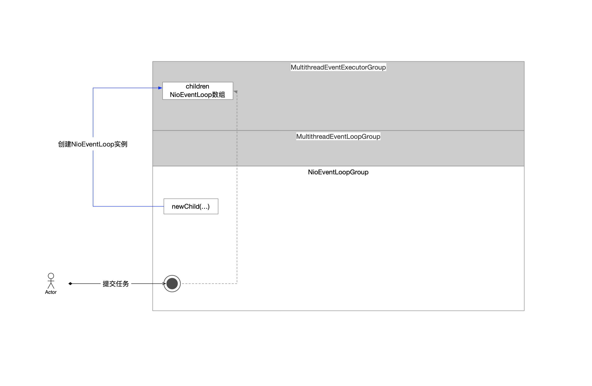

### 1 不同任务类型的提交方式

首先体现了Executor这个抽象接口的功能，实现解耦

* 提交任务的线程只关注于提交这个动作，任务提交完，使命就结束了
* NioEventLoopGroup负责关注任务的管理和调度
  * 所谓的管理就是如何在内存中组织编排任务实例
  * 调度就是负责实现任务如何执行

名词(术语)约定，在Netty世界中，任务有2种

* IO任务(特指的是Socket编程涉及的网络IO)
* 其他都叫做普通任务(或者叫其他任务)

```java
    /**
     * 分析NioEventLoopGroup组件对任务的提交\管理\调度
     */
    private static void test00() {
        NioEventLoopGroup eg = new NioEventLoopGroup();

        /**
         * 这个方法的声明->Executor
         * 任务-普通任务
         * SingleThreadEventExecutor::taskQueue
         */
        eg.execute(() -> System.out.println("execute::任务-普通任务"));

        /**
         * 这个方法的声明->ExecutorService
         * 任务-普通任务
         * SingleThreadEventExecutor::taskQueue
         */
        eg.submit(() -> System.out.println("submit::任务-普通任务"));

        /**
         * 这个方法的声明->ScheduledExecutorService
         * 任务-定时任务-一次性
         * AbstractScheduledEventExecutor::scheduledTaskQueue
         */
        eg.schedule(() -> System.out.println("schedule::任务-定时任务-一次性"), 10_000L, TimeUnit.MILLISECONDS);

        /**
         * 这个方法的声明->ScheduledExecutorService
         * 任务-定时任务-周期性
         * AbstractScheduledEventExecutor::scheduledTaskQueue
         */
        eg.scheduleAtFixedRate(() -> System.out.println("scheduleAtFixedRate::任务-定时任务-周期性"), 10_000L, 10_000L, TimeUnit.MILLISECONDS);

        /**
         * 这个方法的声明->ScheduledExecutorService
         * 任务-定时任务-周期性
         * AbstractScheduledEventExecutor::scheduledTaskQueue
         */
        eg.scheduleWithFixedDelay(() -> System.out.println("scheduleWithFixedDelay::任务-定时任务-周期性"), 10_000L, 10_000L, TimeUnit.MILLISECONDS);

        /**
         * 这个方法的声明->EventLoopGroup
         * IO(网络IO)事件
         * SingleThreadEventLoop
         */
        eg.register(new NioSocketChannel());
    }
```

### 2 任务的提交

* 普通任务

  普通任务的提交都是通过NioEventLoopGroup，它作为中间委托角色，将指令下发给NioEventLoop。

```java
    @Override
    public void execute(Runnable command) {
        /**
         * next()方法会将NioEventLoopGroup的children数组中的一个NioEventLoop实例返回给客户端
         */
        this.next().execute(command);
    }
```


```java
    @Override
    public Future<?> submit(Runnable task) {
        return this.next().submit(task);
    }
```


```java
    @Override
    public ScheduledFuture<?> schedule(Runnable command, long delay, TimeUnit unit) {
        return this.next().schedule(command, delay, unit);
    }
```


```java
    @Override
    public ScheduledFuture<?> scheduleAtFixedRate(Runnable command, long initialDelay, long period, TimeUnit unit) {
        return this.next().scheduleAtFixedRate(command, initialDelay, period, unit);
    }
```


```java
    @Override
    public ScheduledFuture<?> scheduleWithFixedDelay(Runnable command, long initialDelay, long delay, TimeUnit unit) {
        return this.next().scheduleWithFixedDelay(command, initialDelay, delay, unit);
    }
```

* IO任务

  任务的提交都是通过NioEventLoopGroup，它作为中间委托角色，将指令下发给NioEventLoop。

```java
    @Override
    public ChannelFuture register(Channel channel) {
        /**
         * next()从NioEventLoopGroup线程池中选择一个NioEventLoop线程
         */
        return this.next()
                .register(channel);
    }
```

综上，在任务提交这件事情上，NioEventLoopGroup不进行实质性的流程处理，真正干活的是NioEventLoop这个组件。

### 3 总结

NioEventLoopGroup组件只开放了跟客户端交互的窗口，只负责传达提交任务的指令，后续跟任务生命周期相关的流程已经跟NioEventLoopGroup没有关系了，都是由NioEventLoop组件负责，即

* NioEventLoop负责任务的管理
* NioEventLoop负责任务的调度
* NioEventLoop负责任务的执行


