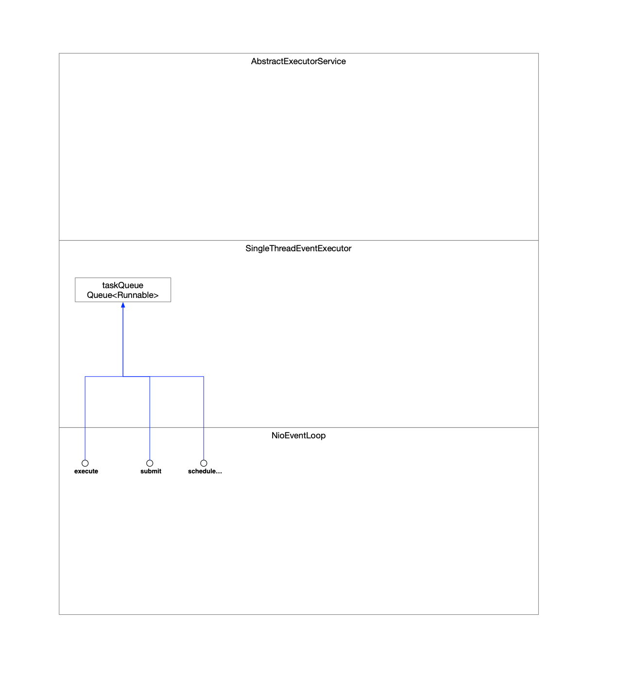

### 1 向NioEventLoop提交任务

| API                    | 实现类                         |
| ---------------------- | ------------------------------ |
| execute                | SingleThreadEventExecutor      |
| submit                 | AbstractEventExecutor          |
| schedule               | AbstractScheduledEventExecutor |
| scheduleAtFixedRate    | AbstractScheduledEventExecutor |
| scheduleWithFixedDelay | AbstractScheduledEventExecutor |
| register               | SingleThreadEventLoop          |

提交的普通任务都将缓存在taskQueue这种队列中。



#### 1.1 execute

将接收到的任务存放在taskQueue这个队列中。

```java
    @Override
    public void execute(Runnable task) {
        ObjectUtil.checkNotNull(task, "task");
        // !(task instanceof LazyRunnable) && wakesUpForTask(task) -> true
        // this.execute(task, true);
        this.execute(task, !(task instanceof LazyRunnable) && wakesUpForTask(task));
    }
```


```java
    private void execute(Runnable task, boolean immediate) {
        // ...
        this.addTask(task); // 添加任务到taskQueue中 如果任务队列已经满了 就触发拒绝策略(抛异常)
		// ...
    }
```


```java
    protected void addTask(Runnable task) {
        ObjectUtil.checkNotNull(task, "task");
        if (!this.offerTask(task)) {
            reject(task);
        }
    }
```


```java
    final boolean offerTask(Runnable task) {
        if (isShutdown()) {
            reject();
        }
        return this.taskQueue.offer(task);
    }
```

#### 1.2 submit

区别于execute的唯一地方是AbstractEventExecutor先将submit提交过来的任务进行封装，封装成RunnableFuture类型，最终还是调用的execute流程。

```java
    @Override
    public Future<?> submit(Runnable task) {
        return (Future<?>) super.submit(task);
    }
```

#### 1.3 schedule相关

##### 1.3.1 任务分类

###### 1.3.1.1 一次性定时任务

```java
    @Override
    public ScheduledFuture<?> schedule(Runnable command, long delay, TimeUnit unit) {
		// ...
        return this.schedule(new ScheduledFutureTask<Void>(
                this,
                command,
                deadlineNanos(unit.toNanos(delay))));
    }
```

###### 1.3.1.2 周期性定时任务

```java
    @Override
    public ScheduledFuture<?> scheduleAtFixedRate(Runnable command, long initialDelay, long period, TimeUnit unit) {
        // ...
        return this.schedule(new ScheduledFutureTask<Void>(
                this, command, deadlineNanos(unit.toNanos(initialDelay)), unit.toNanos(period)));
    }
```


```java
    @Override
    public ScheduledFuture<?> scheduleWithFixedDelay(Runnable command, long initialDelay, long delay, TimeUnit unit) {
        // ...
        return this.schedule(new ScheduledFutureTask<Void>(
                this, command, deadlineNanos(unit.toNanos(initialDelay)), -unit.toNanos(delay)));
    }
```

##### 1.3.2 通用

```java
    /**
     * NioEventLoop负责接收所有类型的定时任务
     *   - 一次性的定时任务
     *   - 周期性的定时任务
     *     - fixedDelay
     *     - fixedRate
     * 定时任务跟普通任务一样 最终都会缓存在SingleThreadEventExecutor::taskQueue中
     */
    private <V> ScheduledFuture<V> schedule(final ScheduledFutureTask<V> task) {
        if (inEventLoop()) {
            scheduleFromEventLoop(task);
        } else {
            final long deadlineNanos = task.deadlineNanos();
            // task will add itself to scheduled task queue when run if not expired
            if (beforeScheduledTaskSubmitted(deadlineNanos)) { // 定时任务期待被执行的时间已经过了 当前如果可以的话就立即执行这个任务一次
                /**
                 * 又调用了SingleThreadEventExecutor::execute()方法
                 *   - 在调用链里面肯定会通过是否立即执行这样一个参数控制当前任务先执行一次 但是NioEventLoop中的线程运行\阻塞控制权不在任务本体 主要控制者是Selector
                 *   - 然后将这个任务继续保存在taskQueue中
                 */
                this.execute(task);
            } else {
                /**
                 * 当前任务还没到执行时机
                 * 又调用了SingleThreadEventExecutor::execute()方法
                 *   - 仅仅是将任务缓存在taskQueue
                 */
                lazyExecute(task);
                // ...
            }
        }

        return task;
    }
```

#### 1.4 IO任务register

```java
    @Override
    public ChannelFuture register(Channel channel) {
        return this.register(new DefaultChannelPromise(channel, this)); // 实例化一个Promise 将当前channel带进到promise中去
    }
```

### 2 任务的执行

同任务的提交一样，任务都被缓存在NioEventLoop组件的taskQueue队列中，那执行的线程就负责取队列。

在NioEventLoop的继承体系中没有出现Thread身影，但是执行任务的本体肯定是Thread实例，所有一定有NioEventLoop的父类持有了Thread。

将来调用了Thread::start()->等待CPU回调->Thread::run()作为entry point执行->NioEvnetLoop的run()

```java
    /**
     * NioEventLoop的父类一定有一个会持有Thread
     * 这样才能保证线程的运行模型可控
     * 在Java中线程:OS线程=1:1
     * 因此线程资源的实例化是后置到任务被执行的时候
     */
    private volatile Thread thread; // 线程执行器持有一个线程 每个Executor持有一个线程(相当于有且只有一个线程的线程池)    

   /**
     * 为什么这个地方声明了一个run()的抽象方法
     * 可以这么判断
     * 谁持有Thread 跟Thread扯上关系 谁就关注Thread被回调之后要执行的entry point的方法
     * 因此
     * 当前类持有Thread
     * 所以它要声明一个方法让子类去关注 以便控制Thread的线程模型
     */
    protected abstract void run();
```


在NioEventLoop实现中会关注父类抽象的run()方法

```java
    @Override
    protected void run() {
        // ...
                    ranTasks = super.runAllTasks(0); 
        // ...
    }
```

