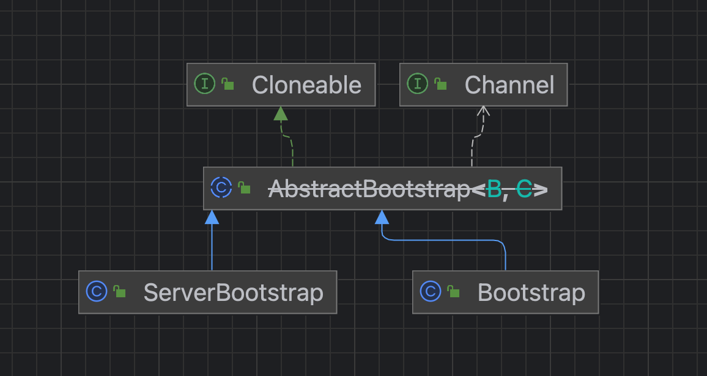

体系梳理

* 就绪
  * NioEventLoopGroup和NioEventLoop面向客户端提供了有关任务提交的接口
  * 负责对任务的管理，配合任务的属性进行生命的管理
  * 随时就绪任务的到来开辟资源，创建线程，启动线程，执行任务
  * 在整个线程的运行周期内提供线程阻塞\唤醒机制
* 待定
  * 跟Socket编程相关的关联
  * 整个框架的启动时机

Bootstrap这个组件就负责解决这两件事情

* 关联的东西就是socket和channel
* C\S模式就要分别关注两端
  * bind
  * connect

### 1 AbstractBootstrap

要去思考2个问题

* 为什么需要Cloneable这个基类，它要去clone
  * 因为这个组件还承担着启动前引导工作，这个引导工作就是开放给客户端进行Socket相关的配置
  * 为了友好深拷贝这些配置项，提供了clone接口
* 为什么要实现Channel这个接口
  * 目的不是为了实现Chennel，而是要在组件内部去组合一个Channel实例
  * 在Java体系中，对于C\S端有不同的实现，分别是SocketChannel和ServerSocketChannel
  * 在Netty体系中，自己单独实现了跟Java同名的Channel
  * 为了适配不同的实现，就声明了组合的这个channel都派生自Channel，也就是ServerBootstrap中持有一个ServerSocketChannel的实例，Bootstrap中持有一个SocketChannel的实例

#### 1.1 类图关系



### 2 重要的接口

#### 2.1 group方法将NioEventLoopGroup组件关联到启动流程

```java
    /**
     * 服务端需要bossGroup和workerGroup
     * 客户端只需要workerGroup
     * 因此提供了1个形参的接口
     */
    public B group(EventLoopGroup group) {
        if (this.group != null) throw new IllegalStateException("group set already");
        this.group = group; // group属性赋值为EventLoopGroup实例 服务端ServerBootstrap传进来的是bossGroup 客户端Bootstrap传进来的是group
        return self();
    }
```

##### 2.1.1 server

```java
    /**
     * ServerBootstrap组件通过group方法接收2个NioEventLoopGroup
     * 将来主要的作用
     *   - Netty是事件驱动 给驱动的事件提供入口
     *   - NioEventLoop是线程模型的核心 将这个模型引进来
     *   - 父子关系 谁是父 谁是子
     *     - 所有的这些设计都是在为Reactor网络模型做铺垫
     *       - 在服务端NioEventLoopGroup一般是创建2个
     *       - 这2个其中1个可以指派为mainReactor的mainGroup 另1个可以指派为subReactor的subGroup
     *     - 父就是Reactor中的mainReactor 子就是subReactor
     *     - 自然而然 bossGroup就是父 workerGroup就是子
     */
    public ServerBootstrap group(EventLoopGroup parentGroup, EventLoopGroup childGroup) { // 设置线程池
        super.group(parentGroup); // boss线程池组交给父类
        if (this.childGroup != null) throw new IllegalStateException("childGroup set already");
        this.childGroup = childGroup; // worker线程池组初始化childGroup属性
        return this;
    }
```

#### 2.2 channel方法将NettyChannel甚至JavaChannel关联到启动流程

```java
    /**
     * 为什么要维护一个Channel工厂
     * 因为将来要依赖这个工厂去创建对应的NettyChannel的实例
     *   - NioServerSocketChannel
     *   - NioSocketChannel
     * 有个NettyChannel就可以跟JavaChannel关联上
     *   - 通过JavaChannel进行底层的Socket相关编程
     *     - 服务端的bind\listen\accept
     *     - 客户端的connect
     *     - 连接建立之后进而通过Socket读写 但是Java里面其实也不通过Socket开发读写了 而是面向JavaChannel进行读写开发 因此在Netty里面就可以直接面向NettyChannel进行开发读写
     *
     * Channel创建工厂->内部阈维护了xxxChannel的默认构造器->触发时机->{@link AbstractBootstrap#initAndRegister()}->newInstance()方式创建xxxChannel实例
     *
     * {@link NioServerSocketChannel#NioServerSocketChannel()}->创建服务端Chanel实例
     * {@link NioSocketChannel#NioSocketChannel()}->创建客户端Channel实例
     *
     * 触发时机分别为:
     * 服务端{@link ServerBootstrap#bind()}
     * 客户端{@link Bootstrap#connect()}
     */
    @SuppressWarnings("deprecation")
    private volatile ChannelFactory<? extends C> channelFactory;
```


```java
    /**
     * 在启动引导流程中配置Channel
     *   - 将Netty跟Chanel的关系建立 因为在Java领域内网络编程开发的数据读写是不直接面向Socket 所以抽象出来的Channel就是提供给我们做数据读写的
     *   - 引进NettyChannel的作用也是为了间接引入JavaChannel
     *     - NioServerSocketChannel->ServerSocketChannel::bind\listen\accept
     *     - NioSocketChannel->SocketChannel::connect
     *     - 建立连接之后的的读写也是通过Channel完成的
     * 创建channelFactory->等到特定时机->创建SocketChannel
     *
     * 形参指向的类是
     * {@link io.netty.channel.socket.nio.NioServerSocketChannel} 无参构造器是{@link NioServerSocketChannel#NioServerSocketChannel()}
     * {@link io.netty.channel.socket.nio.NioSocketChannel} 无参构造器是{@link NioSocketChannel#NioSocketChannel()}
     *
     * 其作用就是提供SocketChannel的无参构造器 生成ChannelFactory
     */
    public B channel(Class<? extends C> channelClass) { // 指定Channel类型->根据Channel特定实现的无参构造方法->反射创建Channel实例
        return this.channelFactory(new ReflectiveChannelFactory<C>(channelClass)); // NioServerSocket的class对象
    }
```

#### 2.3 option方法为将来Socket设置铺垫配置参数

```java
    /**
     * 收集缓存ServerBootstrap和Bootstrap指定的配置
     * 将来针对客户端Socket和服务端被动Socket进行设置时
     * 再从这个缓存中获取配置项
     *   - Client
     *     - Nagle算法是否禁用
     *   - Server
     *     - backlog指定连接等待队列
     */
    private final Map<ChannelOption<?>, Object> options = new LinkedHashMap<ChannelOption<?>, Object>();
```

#### 2.4  handler以及childHandler方法指定IO数据处理器

```java
    /**
     * 作用域跟NioEventLoopGroup是一样的 或者说handler是寄宿在NioEventLoopGroup 严格来说是寄宿在NioEventLoopGroup的NioEventLoop中
     *   - 对于服务端而言
     *     - bossGroup -> handler
     *     - workerGroup -> childHandler
     *   - 对于客户端而言 只有一个group 也就只有handler
     */
    private volatile ChannelHandler handler;
```

##### 2.4.1 server端

```java
    /**
     * 作用域跟NioEventLoopGroup是一样的 或者说handler是寄宿在NioEventLoopGroup 严格来说是寄宿在NioEventLoopGroup的NioEventLoop中
     *   - 对于服务端而言
     *     - bossGroup -> handler
     *     - workerGroup -> childHandler
     *   - 对于客户端而言 只有一个group 也就只有handler
     */
    private volatile ChannelHandler childHandler;
```

### 3 点火启动