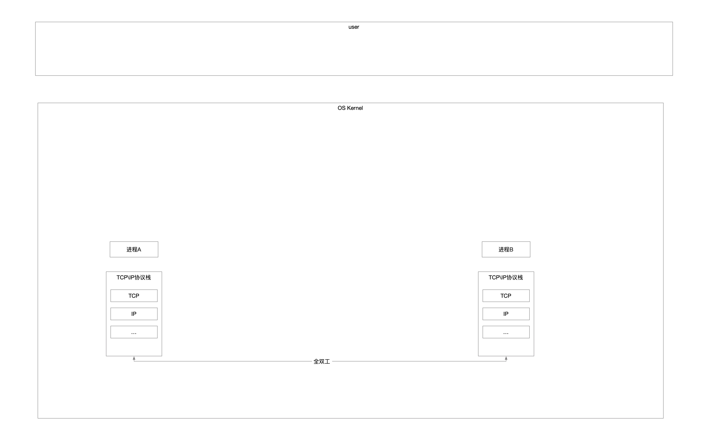
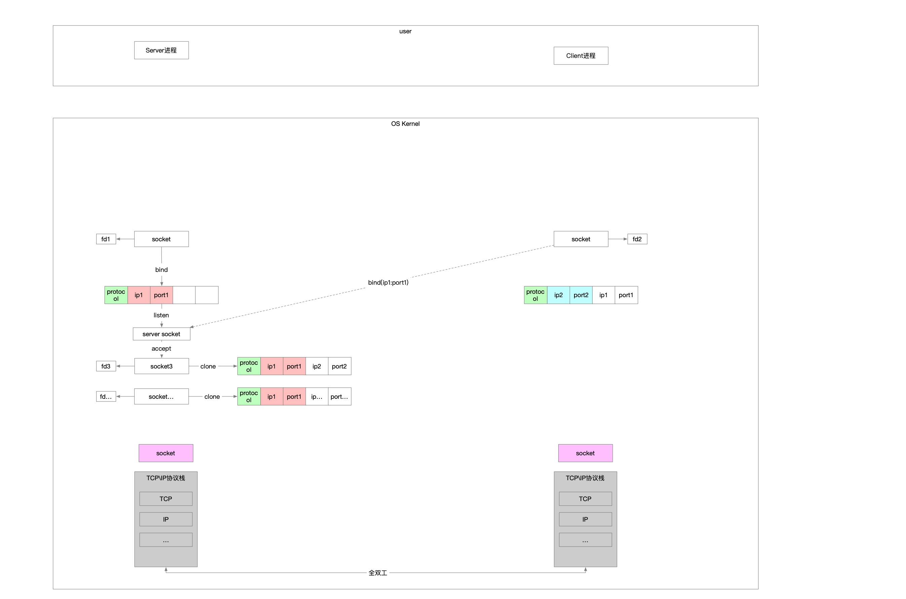
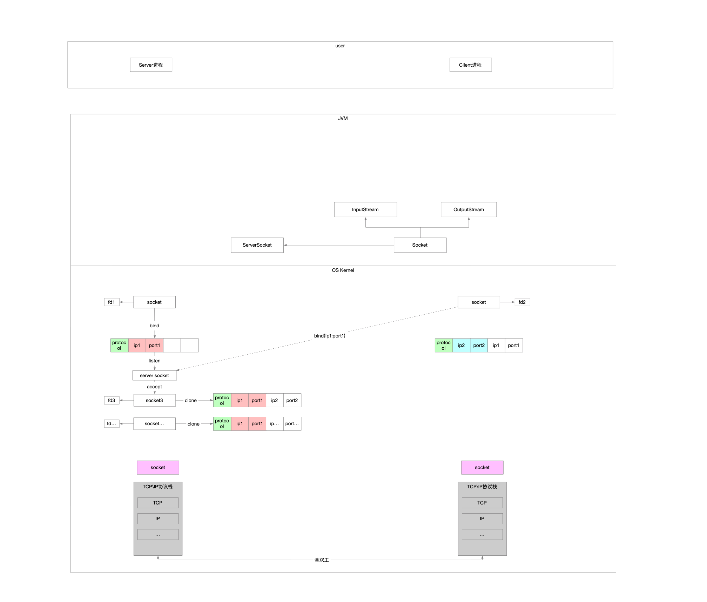
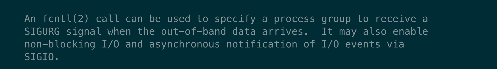
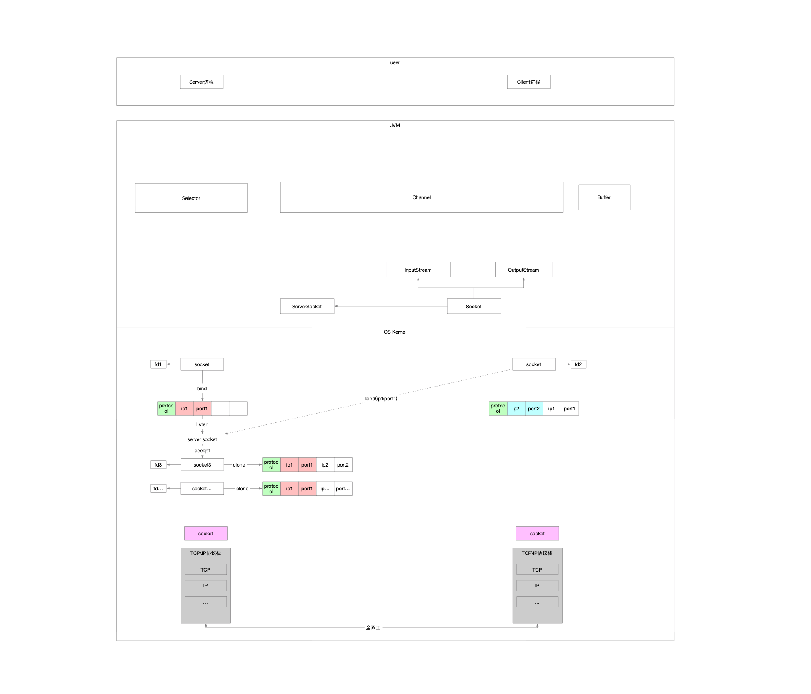
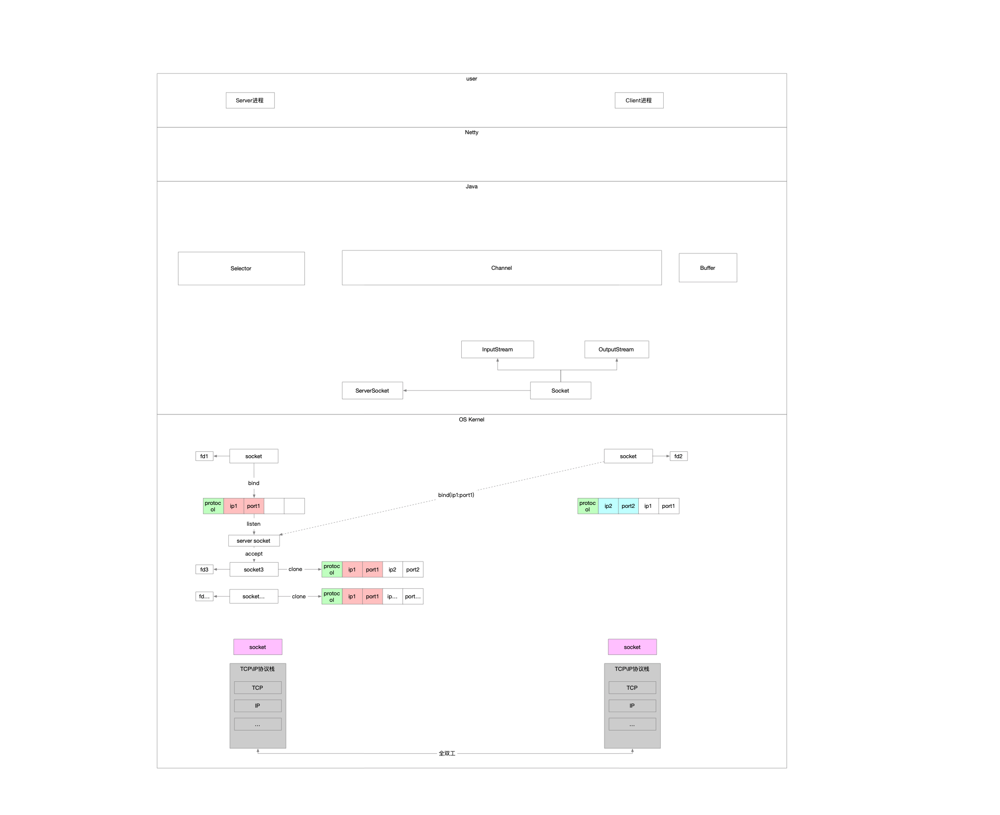

主要想学到什么

* 自底向上回溯网络编程的发展
* 温习涉及到的名词

### 1 TCP\IP协议栈



作为一名普通的业务开发，我怎么使用OS在2个应用之间通信

* OS直接将TCP\IP的实现暴露给用户
* 自此基础上进行封装再暴露给用户

### 2 socket

socket是在逻辑上对TCP\IP协议栈的抽象封装，在物理上是OS暴露用户层的接口

系统调用

* socket 负责创建socket实例 
* connect 负责向server socket发起连接请求
* bind 显式将socket跟ip:port绑定
* listen 将主动socket转换为被动socket，只负责接收连接请求
* aceept 负责建立连接请求
* read 读数据
* write 写数据

#### 2.1 手册

##### 2.1.1 socket

```c
     #include <sys/socket.h>

     int
     socket(int domain, int type, int protocol);
```

##### 2.1.2 connect

```c
     #include <sys/types.h>
     #include <sys/socket.h>

     int
     connect(int socket, const struct sockaddr *address,
         socklen_t address_len);
```

##### 2.1.3 bind

```c
     #include <sys/socket.h>

     int
     bind(int socket, const struct sockaddr *address,
         socklen_t address_len);
```

##### 2.1.4 listen

```c
     #include <sys/socket.h>

     int
     listen(int socket, int backlog);
```

##### 2.1.5 accept

```c
     #include <sys/socket.h>

     int
     accept(int socket, struct sockaddr *restrict address,
         socklen_t *restrict address_len);
```

##### 2.1.6 read

```c
     #include <sys/types.h>
     #include <sys/uio.h>
     #include <unistd.h>

     ssize_t
     pread(int d, void *buf, size_t nbyte, off_t offset);

     ssize_t
     read(int fildes, void *buf, size_t nbyte);

     ssize_t
     preadv(int d, const struct iovec *iov, int iovcnt, off_t offset);

     ssize_t
     readv(int d, const struct iovec *iov, int iovcnt);
```

##### 2.1.7 write

```c
     #include <unistd.h>

     ssize_t
     pwrite(int fildes, const void *buf, size_t nbyte, off_t offset);

     ssize_t
     write(int fildes, const void *buf, size_t nbyte);

     #include <sys/uio.h>

     ssize_t
     writev(int fildes, const struct iovec *iov, int iovcnt);

     ssize_t
     pwritev(int fildes, const struct iovec *iov, int iovcnt,
         off_t offset);
```

#### 2.2 伪代码

##### 2.2.1 服务端

```c
#include <stdio.h>
#include <sys/socket.h>
#include <netinet/in.h>
#include <arpa/inet.h>

#define HOST    "127.0.0.1"
#define PORT    9527
#define BACKLOG 50

// 服务端
void server()
{
    // server socket
    int sfd = 0;
    if ((sfd = socket(AF_INET, SOCK_STREAM, 0)) < 0)
    {
        // err
        printf("服务端创建socket失败\n");
        return;
    }
    struct sockaddr_in host = {0};
    host.sin_family = AF_INET;
    host.sin_port = htons(PORT);
    host.sin_addr.s_addr = htonl(INADDR_ANY);
    if (bind(sfd, (void *) &host, sizeof(host)) < 0)
    {
        printf("服务端绑定端口失败\n");
        return;
    }
    if (listen(sfd, BACKLOG) < 0)
    {
        printf("服务端监听端口失败\n");
        return;
    }
    while (1)
    {
        // 对端发起了连接 新建socket与之通信
        int socket = 0;
        // 用于接收对端的连接信息
        struct sockaddr_in client_host = {0};
        // 用于接收对端连接信息大小
        socklen_t client_len = 0;
        if ((socket = accept(sfd, (void *) &client_host, &client_len)) < 0)
        {
            printf("服务端接收连接失败\n");
            return;
        }
        // TODO: 2023/5/19 读写
    }
}
```

##### 2.2.2 客户端

```c
#include <stdio.h>
#include <sys/socket.h>
#include <netinet/in.h>
#include <arpa/inet.h>

#define HOST    "127.0.0.1"
#define PORT    9527
#define BACKLOG 50

// 客户端
void client()
{
    // socket
    int sfd = 0;
    if ((sfd = socket(AF_INET, SOCK_STREAM, 0)) < 0)
    {
        printf("客户端创建socket失败\n");
        return;
    }
    // 建立连接的对端信息
    struct sockaddr_in remote = {0};
    remote.sin_family = AF_INET;
    remote.sin_port = htons(PORT);
    unsigned int remote_addr = 0;
    inet_pton(AF_INET, HOST, &remote_addr);
    remote.sin_addr.s_addr = remote_addr;
    if (connect(sfd, (void *) &remote, sizeof(remote)) < 0)
    {
        printf("客户端连接失败\n");
        return;
    }
    // // TODO: 2023/5/19 读写
}
```

我们一直说socket，socket是什么东西呢

5元组，{协议，源ip，源port，目的ip，目的port}

socket是负责端到端，两个进程间的通信，因此它一定是成对的



### 3 Java是运行在JVM里面的

怎么调用socket相关方法呢

#### 3.1 Java针对OS的fd进行封装

* 首先就要封装fd，对应的类是FileDescriptor
* 其次封装Socket，真正对应OS的socket其实是SocksSocketImpl
* 为了区分专门负责连接的被动Socket，在此基础上封装出来了Socket和ServerSocket，将绑定端口这个系统调用封装到了ServerSocket的构造方法中
* Socket还需要负责读写，因此组合了InputStream和OutputStream
* 系统调用的read和write是通过工具类实现在JNI里面

```java
    /**
     * 它相当于直接映射着OS层的Socket
     * 实现是NioSocketImpl
     */
    SocketImpl impl;

    /**
     * 开放给客户端使用的数据读写
     * 但是本身它们对接的是实现在NioSocketImpl中的SocketInputStream
     */
    private volatile InputStream in;
    private volatile OutputStream out;
```


```java
    public InputStream getInputStream() throws IOException {
        if (isClosed())
            throw new SocketException("Socket is closed");
        if (!isConnected())
            throw new SocketException("Socket is not connected");
        if (isInputShutdown())
            throw new SocketException("Socket input is shutdown");
        InputStream in = this.in;
        if (in == null) {
            // wrap the input stream so that the close method closes this socket
            /**
             * 核心在impl.getInPutStream()方法
             * 将来客户端通过从Socket实例获取的InputStram进行read的时候
             * 本质是通过impl.getInputStream()的返回值进行的read
             */
            in = new SocketInputStream(this, impl.getInputStream());
            if (!IN.compareAndSet(this, null, in)) { // 把in局部变量赋值给Socket的成员变量in 那么下一次执行getInputStream的时候就不会进入if分支
                in = this.in;
            }
        }
        return in;
    }
```


```java
    @Override
    protected InputStream getInputStream() {
        return new InputStream() {
            @Override
            public int read() throws IOException {
                byte[] a = new byte[1];
                int n = read(a, 0, 1);
                return (n > 0) ? (a[0] & 0xff) : -1;
            }
            @Override
            public int read(byte[] b, int off, int len) throws IOException {
                return NioSocketImpl.this.read(b, off, len);
            }
            @Override
            public int available() throws IOException {
                return NioSocketImpl.this.available();
            }
            @Override
            public void close() throws IOException {
                NioSocketImpl.this.close();
            }
        };
    }
```

怎么封装

* 把OS里面关键的标识fd封装成一个Java类
* OS中读写是纯粹的动作，操作对象是fd，读写本身不隶属于任何的struct
* 而Java中我们封装出来的Socket类是要具有读写功能的，因此中间需要使用工具类的方式，将类的方法转交给JNI实现，将面向对象转换成面向过程



#### 3.2 伪代码

因为JDK是根据系统库函数做了一对一的封装，因此可以说跟C语言的开发几乎一样，区别仅仅在于

* C语言用的是库函数
* Java用的是JDK的封装类

##### 3.2.1 服务端

```java
    private static final String HOST = "127.0.0.1";
    private static final int PORT = 9527;

    // 阻塞式服务端
    private void blockingServer() throws IOException {
        ServerSocket serverSocket = new ServerSocket(PORT);
        while (true) {
            // 阻塞点
            Socket socket = serverSocket.accept();
            // 阻塞点
            socket.getInputStream().read();
            // 阻塞点
            socket.getOutputStream().write(1);
        }
    }
```

##### 3.2.2 客户端

```java
    // 阻塞式客户端
    private void blockingClient() throws IOException {
        Socket socket = new Socket();
        // 阻塞点
        socket.connect(new InetSocketAddress(HOST, PORT));
        // 阻塞点
        socket.getInputStream().read();
        // 阻塞点
        socket.getOutputStream().write(1);
    }
```

### 4 目前存在的问题

存在多个阻塞点，满足不了高并发的连接\读写请求

* accept是阻塞的系统调用
* read是阻塞的系统调用
* write是阻塞的系统调用

我们需要一个机制

* 这个机制能够不阻塞
  * 比如调用accept获取连接，此时没有客户端发起连接，那就立马返回，告诉我没有连接进来
  * 比如调用read，此时socket没有可读数据，那就立马返回，告诉我没有可读数据
  * 比如调用write，此时socket不可写，那就立马返回，告诉我不可写
* 以上机制还有缺陷，就是虽然单个系统调用不阻塞了，如果我有大批量的socket需要检查状态
  * 源源不断的socket发起连接
  * 也就是说有源源不断的socket通过accept创建出来
    * 一批socket需要检查是否可读怎么办，需要我自己再调用read
    * 一批socket需要检查是否可写怎么办，需要我自己再调用write
  * 虽然系统调用已经不阻塞了，但是面对这种批量的状态检测，需要发生大量的用户\内核切换，这个开销也是很大的

### 5 OS的非阻塞支撑

* 通过fcntl(fd control)系统调用指定Socket属性，支持非阻塞式编程
* 提供了多路复用机制
  * 所谓的多路复用就是我不再需要在用户层通过轮询的方式检查每个socket的状态，我可以一次性告诉OS的多路复用器，我要你对某个socket监测，监测它是否有连接进来，监测它是否可读，监测它是否可写
  * 然后等到某一个时机OS就将批量socket的状态一次性告诉我
    * 这个时机就是调用多路复用器提供的一个系统调用的时候
    * 相当于把用户层的轮询放到了内核去做，省却了大量的内核切换
    * OS对此做了大量的优化
      * 存储批量socket的数据结构，不仅要存储，还要提供增删改查的能力，基本都是向红黑树发展
      * 告诉客户端有多少个socket状态是满足监测需求的，明确的个数
      * 不仅告诉有多少个socket状态就绪，还把socket直接罗列出来提供给调用方，免去了调用方再轮询一次进行筛选
      * 内核检查socket状态也从简单的轮询发展为中断回调

#### 5.1 非阻塞式



#### 5.2 多路复用器

不同的平台，已经单个平台都有不同的实现

以mac为例，提供的最优方案是kqueue

###### 5.2.1 创建多路复用器实现的实例

```c
     int
     kqueue(void);
```

###### 5.2.2 对哪个socket的什么类型事件感兴趣

```c
     EV_SET(&kev, ident, filter, flags, fflags, data, udata);
```

###### 5.2.3 要监测的socket信息注册到多路复用器上

支持批量注册，也就是多路复用器提供了增删改查的能力

```c
     int
     kevent(int kq, const struct kevent *changelist, int nchanges,
         struct kevent *eventlist, int nevents,
         const struct timespec *timeout);
```

5.2.4 某一个时机客户端去询问多路复用器监测结果

macos中提供的kevent函数，通过组合参数，达到两种效果

* 注册
* 结果

```c
     int
     kevent(int kq, const struct kevent *changelist, int nchanges,
         struct kevent *eventlist, int nevents,
         const struct timespec *timeout);
```

### 6 Java怎么去支持这个非阻塞方式的

基本有两个思路

* 继续升级已有的Socket类
  * 代价小，向下直接兼容版本
  * 相当于构造方法提供一个形参，控制使用阻塞\非阻塞式的模式，直接对标OS的系统调用fcntl
  * 针对多路复用器，封装对应的Java中的多路复用器实现
  * 还是通过getInputStream\getOutputStream，对接的数据依然是byte数组，反序列化这件事情还得多一层结构
* 重新封装个类专门支持非阻塞式的Socket叫NioSocket
  * 冗余代码过多，以后回头看就会发现整个系统设计比较傻逼

在此基础之上，Java专门提供了非阻塞的支持

* Buffer
* Channel
* Selector

相当于没有了Socket，它去哪儿了

可以这样粗略理解，Channel就是Socket，它是对Socket更高层次的抽象和封装



### 7 为什么要有Netty

```java
public class SelectorTest {

    private static final int BUF_SIZE = 256;
    private static final int TIMEOUT = 3_000;

    public static void main(String[] args) throws Exception {
        // 打开服务端Socket
        ServerSocketChannel serverSocketChannel = ServerSocketChannel.open();
        // 打开Selector
        Selector selector = Selector.open();
        // 服务端Socket监听端口 配置非阻塞模式
        serverSocketChannel.socket().bind(new InetSocketAddress(8080));
        serverSocketChannel.configureBlocking(false);
        /**
         * 将channel注册到selector中
         * 通常都是先注册一个OP_ACCEPT事件 然后在OP_ACCEPT到来时 再将这个channel的OP_READ注册到selector中
         */
        serverSocketChannel.register(selector, SelectionKey.OP_ACCEPT);
        while (true) {
            // 阻塞等待channel IO可操作
            if (selector.select(TIMEOUT) == 0) {
                System.out.println(".");
                continue;
            }
            // 获取IO操作就绪的SelectionKey 通过SelectionKey可以知道哪些Channel的哪些IO操作已经就绪
            Iterator<SelectionKey> keyIterator = selector.selectedKeys().iterator();
            while (keyIterator.hasNext()) {
                SelectionKey key = keyIterator.next();
                // 当获取到一个SelectionKey后 就要将它删除 表示已经对这个IO事件进行了处理
                keyIterator.remove();
                if (key.isAcceptable()) {
                    /**
                     * 当OP_ACCEPT事件到来时 就从ServerSocketChannel中获取一个SocketChannel代表客户端的连接
                     * 注意:
                     *   - 在OP_ACCEPT事件中 key.channel()返回的Channel是ServerSocketChannel
                     *   - 在OP_READ和OP_WRITE事件中 从key.channel()返回Channel是SocketChannel
                     */
                    SocketChannel clientChannel = ((ServerSocketChannel) key.channel()).accept();
                    clientChannel.configureBlocking(false);
                    clientChannel.register(key.selector(), SelectionKey.OP_READ,
                            ByteBuffer.allocate(BUF_SIZE));
                }
                if (key.isReadable()) {
                    SocketChannel clientChannel = ((SocketChannel) key.channel());
                    ByteBuffer buf = ((ByteBuffer) key.attachment());
                    int bytesRead = clientChannel.read(buf);
                    if (bytesRead == -1) {
                        clientChannel.close();
                    } else if (bytesRead > 0) {
                        key.interestOps(SelectionKey.OP_READ | SelectionKey.OP_WRITE);
                        System.out.println("Get data length: " + bytesRead);
                    }
                }
                if (key.isValid() && key.isWritable()) {
                    ByteBuffer buf = ((ByteBuffer) key.attachment());
                    buf.flip();
                    SocketChannel clientChannel = (SocketChannel) key.channel();
                    clientChannel.write(buf);
                    if (!buf.hasRemaining()) {
                        key.interestOps(SelectionKey.OP_READ);
                    }
                    buf.compact();
                }
            }
        }
    }
}
```

现在已经有OS对非阻塞的支持，并且Java也开发了对应的封装，我们的业务开发可以直接使用三剑客，但是也会有很多问题

* 重复性太强，每次写的很多代码都是业务无关，偏系统性的
* Java对Selector的封装有BUG，个人直接使用三剑客还要去关注怎么兜底
* 细节性的优化，每个人都不尽相同
* Java喜欢造框架

凡此种种，Netty出现了


