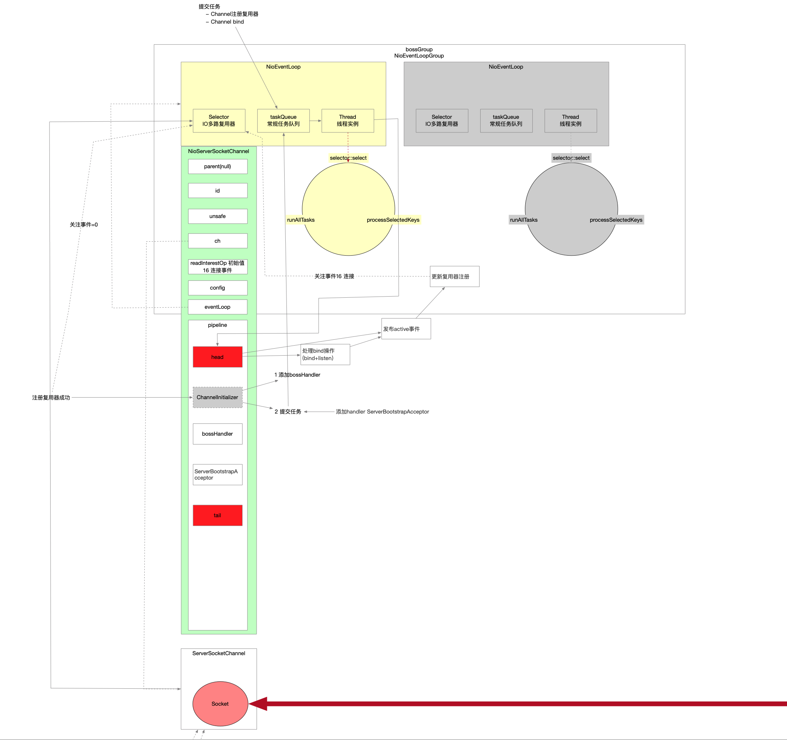

不管是服务端还是客户端 Netty都是先准备原材料 真正用到的时候才开辟资源

## 1 准备哪些原材料

- parent group
- child group
- channel factory
- parent handler
- child handler
- options

```java
            ServerBootstrap b = new ServerBootstrap(); // 创建服务端实例
            b
                    .group(bossGroup, workerGroup) // parent负责连接的 child负责读写的
                    .channel(NioServerSocketChannel.class) // 服务端用的channel
                    .option(ChannelOption.SO_BACKLOG, 100)
                    .handler(new LoggingHandler(LogLevel.INFO)) // 给parent 就是负责连接的用的
                    .childHandler(new ChannelInitializer<SocketChannel>() { // child就是给读写用的
                        @Override
                        public void initChannel(SocketChannel ch) throws Exception { // pipeline需要ChannelInitializer辅助类 借助辅助类可以指定多个handler组成pipeline 就是拦截器 在每个NioSocketChannel或NioServerSocketChannel实例内部都会有一个pipeline实例 并且还涉及到handler执行顺序
                            ChannelPipeline p = ch.pipeline();
                            p.addLast(new EchoServerHandler());
                        }
                    });
```

## 2 bind触发资源开辟



## 3 配置channel

```java
    /**
     * - NioServerSocketChannel->pipeline中添加个ChannelInitializer
     *     - 等待NioServerSocketChannel注册复用器后被回调
     *         - 添加workerHandler
     *         - 提交异步任务
     *             - 在pipeline中添加ServerBootstrapAcceptor
     */
    @Override
    void init(Channel channel) { // NioServerSocketChannel实例
        setChannelOptions(channel, newOptionsArray(), logger);
        setAttributes(channel, newAttributesArray());

        ChannelPipeline p = channel.pipeline(); // channel内部的pipeline实例 在创建NioServerSocketChannel的时候一起创建了pipeline实例

        final EventLoopGroup currentChildGroup = childGroup; // workerGroup
        final ChannelHandler currentChildHandler = childHandler; // workerHandler
        final Entry<ChannelOption<?>, Object>[] currentChildOptions = newOptionsArray(childOptions);
        final Entry<AttributeKey<?>, Object>[] currentChildAttrs = newAttributesArray(childAttrs);

        /**
         * 往ServerSocketChannel的pipeline中添加一个handler 这个handler是ChannelInitializer的实例 该处涉及到pipeline中的辅助类ChannelInitializer 它本身也是一个handler(Inbound类型) 它的作用仅仅是辅助其他的handler加入到pipeline中
         * ChannelInitializer的initChannel方法触发时机是在Channel注册到NioEventLoop复用器之后(NioEventLoop启动执行注册操作) 那么到时候会发生回调
         *     - 添加一个ServerBootstrap指定的bossHandler(也可能没指定) 比如指定了workerHandler 那么回调执行后 pipeline存在 headHandler-workerHandler-tailHandler
         *     - 向NioEventLoop提交添加handler的异步任务
         *         - 等NioEventLoop把这个异步任务执行完了之后 pipeline中变成 head-workerHandler-ServerBootstrapAcceptor-tail
         */
        p.addLast(new ChannelInitializer<Channel>() {
            @Override
            public void initChannel(final Channel ch) { // ChannelInitializer的这个方法会在Channel注册到EventLoop线程上复用器之后被回调
                final ChannelPipeline pipeline = ch.pipeline(); // NioServerSocketChannel的pipeline
                ChannelHandler handler = config.handler(); // 这个handler是在ServerBootstrap::handler()方法中指定的workerHandler
                if (handler != null) pipeline.addLast(handler); // 将bossHandler添加到NioServerSocket的pipeline中

                ch.eventLoop().execute(new Runnable() { // 往NioEventLoop线程添加一个任务 boss的NioEventLoop线程会执行这个任务 就是给Channel指定一个处理器 处理器的功能是接收客户端请求
                    @Override
                    public void run() {
                        pipeline.addLast(
                                // 添加一个handler到pipeline中 ServerBootstrapAcceptor这个handler目的是用来接收客户端请求的
                                new ServerBootstrapAcceptor(
                                    ch, // NioServerSocketChannel
                                    currentChildGroup, // workerGroup
                                    currentChildHandler, // workerHandler
                                    currentChildOptions,
                                    currentChildAttrs
                                )
                        );
                    }
                });
            }
        });
    }
```

并且这个方法什么时候被回调呢，在channel注册到selector后会发布事件触发

```java
                /**
                 * 发布handlerAdd事件
                 * 让pipeline中handler关注handlerAdded(...)的handler执行
                 *     - 触发ChannelInitializer方法执行
                 */
                pipeline.invokeHandlerAddedIfNeeded();
```

## 4 启动了EventLoop线程

```java
        /**
         * 至此NioEventLoop线程还没启动
         * 在register(...)方法之前 已经完成的工作
         *     - channel实例
         *         - pipeline实例化
         *             - pipeline中添加了{@link ChannelInitializer}辅助类的实例 而这个辅助类的触发时机是在Channel跟EventLoop线程绑定之后
         *         - unsafe实例
         *         - 设置了jdk channel的非阻塞模式
         *     - bossGroup中仅仅实例化了特定数量的EventLoop 但是此时线程并没有被真正创建
         *     - Channel跟EventLoop没有关联
         *
         * <pre>{@code this.config().group()}返回的是{@link io.netty.channel.nio.NioEventLoopGroup}实例</pre>
         * 对于ServerBootstrap而言是bossGroup线程组
         * 对于Bootstrap而言只有一个group线程组
         *
         * 执行register方法 最终由NioEventLoop调用到AbstractChannel里面执行 要是EventLoop线程还没启动 刚好这个时机会触发线程的启动
         *   - Channel跟NioEventLoop关联起来 Channel一旦跟EventLoop绑定 以后Channel的所有事件都由这个EventLoop线程处理
         *   - 并注册到NioEventLoop的Selector上 所谓的注册指的是将Java的Channel注册到复用器Selector上
         */
        ChannelFuture regFuture = this
                .config()
                .group() // {#link ServerBootstrap#group()}或者{@link Bootstrap#group()}传进去的 比如在服务端就是boss线程组 客户端只有一个group
                .register(channel);
```



服务端彻底启动

- socket完成了bind
- socket完成了listen
- 注册IO多路复用器关注连接事件
- IO线程阻塞在复用器上等待客户端的连接进来


