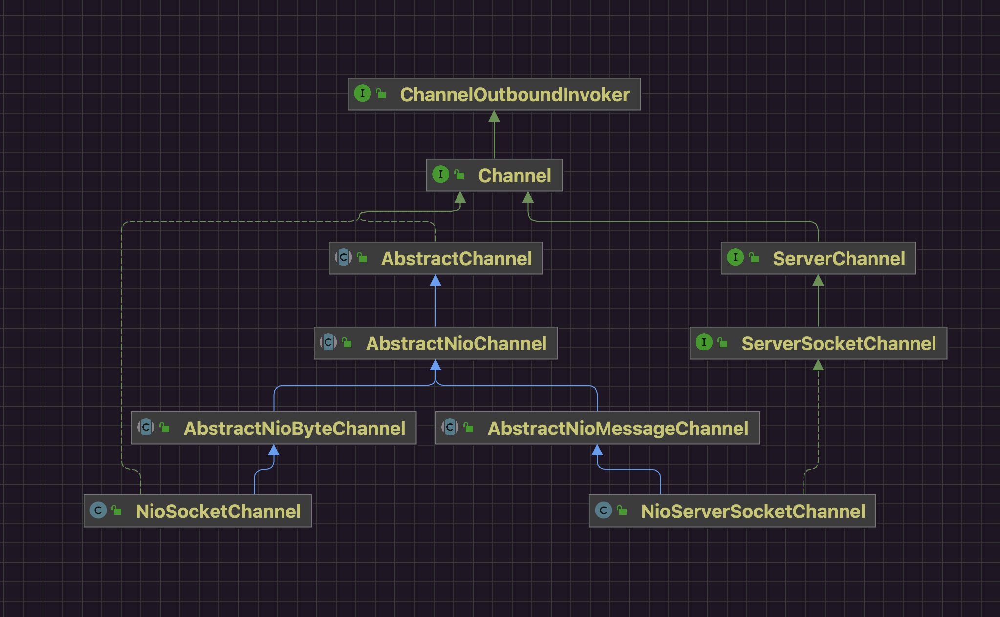

## 1 channel的类型



在Java的NIO体系中定义了ServerSocketChannel和SocketChannel Netty为了支持Reactor线程模型和异步编程 自己也实现了与Java中对应的两个实现

- NioServerSocketChannel 负责连接 对接的是ServerSocket 仅使用在服务端 
- NioSocketChannel 负责读写数据 对接Socket 可以使用在服务端也可以使用在客户端 

一般涉及资源开辟都使用懒加载方式 涉及多实现都会通过提供对应Provider或者Factory方式进行创建



## 2 关注的事件

```java
public abstract class SelectionKey {
    public static final int OP_READ = 1;
    public static final int OP_WRITE = 4;
    public static final int OP_CONNECT = 8;
    public static final int OP_ACCEPT = 16;
    private volatile Object attachment = null;
```