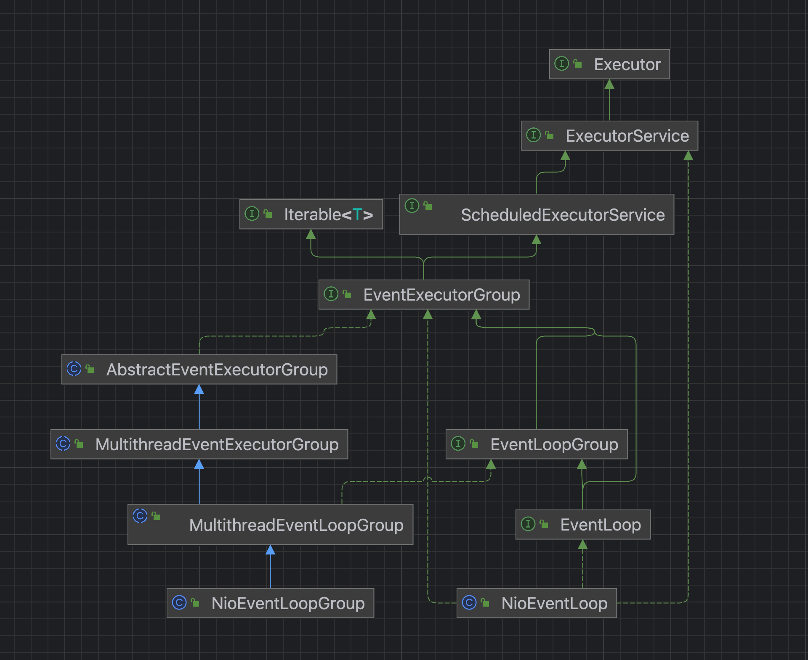
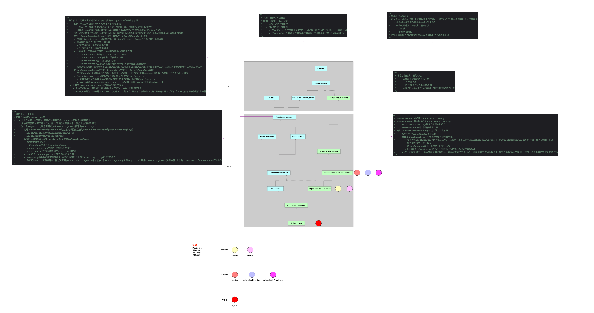

## 1 类图关系



Netty中NioEventLoopGroup组件和NioEventLoop组件比较重要，二者关系像是皮毛关系：

- NioEventLoopGroup是皮
- NioEventLoop是毛

从上面的类图可以看出来，NioEventLoopGroup和NioEventLoop追根溯源都派生自EventLoopGroup。

- NioEventLoopGroup充当的角色更多的是对NioEventLoop的管理，NioEventLoopGroup负责对外。
- NioEventLoop充当的角色是任务执行。
- 甚至二者的继承关系可以粗略理解为EventLoop是特殊的EventLoopGroup。

因此，梳理组件实现的时候，切入口最好选择NioEventLoopGroup，在此之前先宏观理解一下NioEventLoop的设计。

## 2 NioEventLoop抽象设计



记住EventLoop是持有Java的线程的，那么线程被调度执行的入口方法才是核心

## 3 构造

```java
    /**
     * 构造方法的访问修饰符是默认的 只能在同包级别下访问 也就是说不对外暴露
     * 当前类属性赋值
     *   - selectorProvider 提供创建当前OS的多路复用器实例
     *   - selectStrategy 定义了Selector多路复用器1次select操作下如何处理任务
     *   - selector 基于Java原生Selector优化的版本
     *   - unwrappedSelector Java原生Selector
     * @param parent NioEventLoopGroup实例 标识着NioEventLoop归谁管理
     * @param executor 任务执行器 ThreadPerTaskExecutor的实例 负责执行任务 逻辑关系上是跟NioEventLoop绑定的
     * @param selectorProvider 负责创建IO多路复用器 SelectorProvider::provider
     * @param strategy DefaultSelectStrategyFactory.INSTANCE 负责Selector多路复用器1次select操作如何选择任务(IO任务\普通任务)
     * @param rejectedExecutionHandler RejectedExecutionHandlers.reject() 定义了NioEventLoop中taskQueue任务队列满了怎么办
     * @param taskQueueFactory 定义了如何创建taskQueue任务队列->null
     * @param tailTaskQueueFactory 定义了如何创建tailTaskQueue任务队列->null
     */
    NioEventLoop(NioEventLoopGroup parent,
                 Executor executor, // 线程执行器 将线程和EventLoop绑定
                 SelectorProvider selectorProvider, // Java中IO多路复用器提供器
                 SelectStrategy strategy, // 正常任务队列选择策略
                 RejectedExecutionHandler rejectedExecutionHandler, // 正常任务队列拒绝策略
                 EventLoopTaskQueueFactory taskQueueFactory, // 非IO任务
                 EventLoopTaskQueueFactory tailTaskQueueFactory // 收尾任务
    ) {
        /**
         * 为什么要用MPSC队列
         *   - 为什么要用队列这个数据结构
         *     - FIFO特性
         *     - Netty是NioEventLoop线程:任务=1:N 所以从任务视角来看 任务有先后
         *   - 为什么不是用现有的数据结构比如ArrayBlockingQueue\LinkedBlockingQueue\PriorityQueue
         *     - 首先得保证线程安全
         *     - 其次它们的生产者\消费者模型是N:N
         *     - 但是Netty中现在场景是1个NioEventLoop工作线程 N个任务 也就是生产者:消费者=N:1
         */
        super(parent, // NioEventLoop归属的NioEventLoopGroup
                executor,
                false,
                newTaskQueue(taskQueueFactory), // 非IO任务队列 Netty对队列数据结构的优化
                newTaskQueue(tailTaskQueueFactory), // 收尾任务队列
                rejectedExecutionHandler
        ); // 调用父类构造方法
        /**
         * IO多路复用器提供器 用于创建多路复用器实现
         */
        this.provider = ObjectUtil.checkNotNull(selectorProvider, "selectorProvider");
        /**
         * 定义了将来Selector的1次select怎么处理任务
         *   - IO任务怎么处理
         *   - taskQueue任务队列中任务怎么处理
         */
        this.selectStrategy = ObjectUtil.checkNotNull(strategy, "selectStrategy");
        /**
         * 开启NIO中的组件Selector
         * 通过上面提供的selectorProvider创建适配当前OS平台的Selector多路复用器实现
         * 意味着NioEventLoopGroup这个线程池中每个线程NioEventLoop都有自己的selector
         */
        final SelectorTuple selectorTuple = this.openSelector();
        /**
         * 创建NioEventLoop绑定的selector对象
         * 初始化了IO多路复用器
         */
        this.selector = selectorTuple.selector; // Netty优化过的IO多路复用器
        this.unwrappedSelector = selectorTuple.unwrappedSelector; // Java原生的多路复用器
    }
```

## 4 怎么接收任务的

| API                    | 实现类                         |
| ---------------------- | ------------------------------ |
| execute                | SingleThreadEventExecutor      |
| submit                 | AbstractEventExecutor          |
| schedule               | AbstractScheduledEventExecutor |
| scheduleAtFixedRate    | AbstractScheduledEventExecutor |
| scheduleWithFixedDelay | AbstractScheduledEventExecutor |
| register               | SingleThreadEventLoop          |

提交的普通任务都将缓存在taskQueue这种队列中。

## 5 线程的创建

```java
    /**
     * 有任务提交过来希望被执行
     * EventLoop本质是跟Java的线程1:1映射的 而且EventLoop只有一个线程 所以意味着这个线程只会启动一次
     * 创建线程的时机就是在任务提交过来的时候
     *   - java向cpp创建线程
     *   - cpp向os创建线程 并且告诉os这个线程的entry point是哪儿 对应着java的一个函数
     *   - 等线程被cpu调度起来后就会顺着entry point回调到java里面的这个函数
     * 所以在EventLoop中用inEventLoop作为标识线程是不是已经创建了 保证只有一个线程 不会重复创建
     */
    private void execute(Runnable task, boolean immediate) {
        /**
         * NioEventLoop只有一个线程 且它的阻塞点只有在IO多路复用器操作上
         * 因此当前添加任务的线程
         *     - NioEventLoop线程自己给自己添加任务 说明它压根没有被阻塞 而且肯定已经处于运行中状态
         *         - 这个线程已经被创建执行 那么这个新添加的任务被放到了非IO任务队列中 迟早会被取出来执行
         *     - 不是NioEventLoop线程 是其他线程往NioEventLoop添加任务
         *         - 如果NioEventLoop线程还没被创建执行 那么相当于任务裹挟着线程进行延迟创建并执行任务
         *         - 非IO任务队列没有任务 也没有IO事件到达时 NioEventLoop线程迟早会阻塞在复用器上
         *             - 阻塞期间有IO事件到达 退出select阻塞继续工作
         *             - 有定时任务还可能超时退出select NioEventLoop线程继续工作
         *             - 没有定时任务就永远阻塞 唤醒的方式 只有外部线程往NioEventLoop添加新任务触发selector复用器的wakeup()
         */
        boolean inEventLoop = super.inEventLoop();
        this.addTask(task); // 添加任务到taskQueue中 如果任务队列已经满了 就触发拒绝策略(抛异常)
        if (!inEventLoop) {
            // NioEventLoop线程创建启动的时机就是提交进来的第一个异步任务 在这个方法里面创建线程并为线程的调度指定好entry point
            this.startThread();
            if (this.isShutdown()) {
                boolean reject = false;
                try {
                    if (removeTask(task)) reject = true;
                } catch (UnsupportedOperationException e) {
                    // The task queue does not support removal so the best thing we can do is to just move on and
                    // hope we will be able to pick-up the task before its completely terminated.
                    // In worst case we will log on termination.
                }
                if (reject) reject();
            }
        }

        // NioEventLoop中线程阻塞点有且只有一个是在复用器上 因此addTaskWakesUp为false
        if (!addTaskWakesUp && immediate) this.wakeup(inEventLoop); // 唤醒阻塞的线程 这个wakeup(...)方法在子类NioEventLoop中特定的实现(借助复用器进行唤醒阻塞在复用器上的线程)
    }
```

## 6 线程的运行模型

```java
@Override
protected void run() {
    int selectCnt = 0; // 当前EventLoop事件循环器代表的线程执行复用器select空轮询操作计数(Java对EPoll多路复用的实现缺陷 以阻塞方式执行复用器select 在没有读写事件时可能也会返回 产生空轮询 导致CPU负载)
    for (;;) {
        try {
            int strategy;
            try {
                /**
                     * strategy这个值只有3种情况 决定复用器如何执行(阻塞/非阻塞)
                     *     - 非IO任务队列为空->-1->复用器即将以阻塞方式执行一次看看有没有IO任务
                     *     - 非IO任务队列(常规任务队列taskQueue+收尾任务队列tailTasks)有任务 复用器以非阻塞方式执行一次看看有没有IO任务
                     *         - 没有IO事件->0
                     *         - 有IO事件->Channel数量
                     *
                     * 这样设计的方式是不要让复用器阻塞调用导致非IO任务不能及时执行
                     * 也就是尽可能多执行IO任务和非IO任务
                     */
                strategy = this.selectStrategy.calculateStrategy(this.selectNowSupplier, super.hasTasks());
                switch (strategy) {
                    case SelectStrategy.CONTINUE: // -2
                        continue;

                    case SelectStrategy.BUSY_WAIT: // -3
                        // fall-through to SELECT since the busy-wait is not supported with NIO

                    case SelectStrategy.SELECT: // -1 任务队列为空 将线程阻塞在复用器上 唤醒时机有两种情况(阻塞期间有IO事件到达 阻塞指定事件后主动结束阻塞开始执行定时任务)
                        long curDeadlineNanos = super.nextScheduledTaskDeadlineNanos(); // 定时任务队列中下一个待执行定时任务还有多久可以被唤醒执行 -1表示没有定时任务可以执行
                        if (curDeadlineNanos == -1L) curDeadlineNanos = NONE; // nothing on the calendar // 边界情况 没有定时任务要执行
                        this.nextWakeupNanos.set(curDeadlineNanos); // 下一次啥时候将线程唤醒
                        try {
                            if (!super.hasTasks()) strategy = this.select(curDeadlineNanos); // select()方法阻塞 超时时间是为了执行可能存在的定时任务 如果没有定时任务就将一直阻塞在复用器的select()操作上等待被唤醒
                        } finally {
                            // This update is just to help block unnecessary selector wakeups
                            // so use of lazySet is ok (no race condition)
                            nextWakeupNanos.lazySet(AWAKE);
                        }
                        // fall through
                    default:
                }
            } catch (IOException e) {
                // If we receive an IOException here its because the Selector is messed up. Let's rebuild
                // the selector and retry. https://github.com/netty/netty/issues/8566
                rebuildSelector0();
                selectCnt = 0;
                handleLoopException(e);
                continue;
            }

            selectCnt++; // 复用器select次数 但是疯狂自增的场景只会发生在没有非IO任务 本应该阻塞在复用器上的线程却一直select时 也就是空轮询
            cancelledKeys = 0;
            needsToSelectAgain = false;
            final int ioRatio = this.ioRatio; // 默认值是50
            boolean ranTasks; // 标识taskQueue中任务都被执行过一轮
            if (ioRatio == 100) { // 100->先处理IO任务 再执行非IO任务
                try {
                    if (strategy > 0) this.processSelectedKeys(); // 处理IO任务
                } finally {
                    // Ensure we always run tasks.
                    ranTasks = super.runAllTasks(); // 处理所有的非IO任务
                }
            } else if (strategy > 0) { // 不是100 先保证处理完所有IO任务 如果此时非IO任务很多(还是把所有非IO任务都执行完 耗时很多的话) 可能导致新到的IO任务不能得到及时处理 所以通过IoRatio参数控制非IO任务的处理时长
                final long ioStartTime = System.nanoTime(); // 记录IO任务处理开始时间
                try {
                    this.processSelectedKeys(); // 处理IO任务
                } finally {
                    // Ensure we always run tasks.
                    // 计算耗时 IO任务处理耗时
                    final long ioTime = System.nanoTime() - ioStartTime;
                    /**
                         * 计算非IO任务可以处理的时长 限定非IO任务处理时间 处理非IO任务
                         */
                    ranTasks = super.runAllTasks(ioTime * (100 - ioRatio) / ioRatio);
                }
            } else
                ranTasks = super.runAllTasks(0); // This will run the minimum number of tasks 非IO任务处理时间形参为0 但是内部实现对超时统计是有条件的 因此至少一次超时统计内这个时间段的非IO任务可以有机会处理

            if (ranTasks || strategy > 0) selectCnt = 0;
            else if (this.unexpectedSelectorWakeup(selectCnt)) selectCnt = 0; // 任务判定可能发生了空轮询 如果发生了空轮询场景 就通过重建复用器方式尽量避免再次发生空轮询
        } catch (CancelledKeyException e) {
            // Harmless exception - log anyway
        } catch (Error e) {
            throw e;
        } catch (Throwable t) {
            handleLoopException(t);
        } finally {
            // Always handle shutdown even if the loop processing threw an exception.
            try {
                if (isShuttingDown()) {
                    closeAll();
                    if (confirmShutdown()) return;
                }
            } catch (Error e) {
                throw e;
            } catch (Throwable t) {
                handleLoopException(t);
            }
        }
    }
}
```