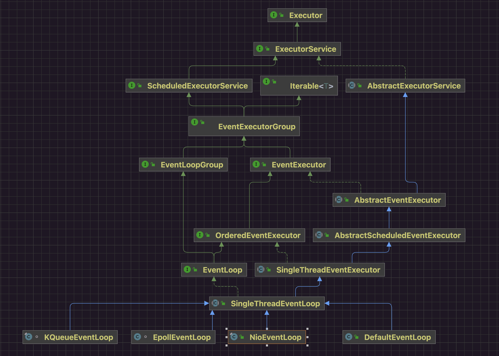

前文已经了解过了和。

在Netty中是用的是Reactor线程模型(IO多路复用器+多个线程)，真正处理业务流程的worker线程都是单个线程，一个线程处理多个Channel，一个Channel始终都是由特定的线程进行处理。

在这样的情况下，如果某个Channel的业务流程耗时较久或者阻塞，那么绑定在当前线程上所有的任务都会受到影响，这样的场景如何处理呢？

再看一下EventLoop的继承关系：



从名字就可以看出来EventLoop实现分为两类：

* 非IO事件循环线程 DefaultEventLoop
* IO事件循环线程，在非IO事件循环基础之上增加了对网络IO多路复用器的支持
* NioEventLoop 从API上看就是多了register(...)Channel的支持
  * KQueueEventLoop
  * EpollEventLoop
  * ...

NioEventLoop的具体实现依赖操作系统

* MacOSX -> KQueueEventLoop
* Linux -> EPollEventLoop
* Windows -> PollEventLoop

## 一 Demo

将一整条业务流程上比较耗时的部分拆开，使用适当的EventLoop来处理，尽量让每个线程处理的内容都短小，提升处理效率。

```java
package io.netty.example.basic.eventloop;

import io.netty.bootstrap.ServerBootstrap;
import io.netty.channel.*;
import io.netty.channel.nio.NioEventLoopGroup;
import io.netty.channel.socket.SocketChannel;
import io.netty.channel.socket.nio.NioServerSocketChannel;

/**
 *
 * @since 2022/11/8
 * @author dingrui
 */
public class EventLoopGroupTest01 {

    public static void main(String[] args) throws InterruptedException {
        EventLoopGroup bizGroup = new DefaultEventLoopGroup();
        new ServerBootstrap()
                .group(new NioEventLoopGroup())
                .channel(NioServerSocketChannel.class)
                .childHandler(new ChannelInitializer<SocketChannel>() {
                    @Override
                    protected void initChannel(SocketChannel ch) throws Exception {
                        ch.pipeline()
                                .addLast("handler1", new ChannelInboundHandlerAdapter() {
                                    @Override
                                    public void channelRead(ChannelHandlerContext ctx, Object msg) throws Exception {
                                        // TODO: 2022/11/8 业务处理1
                                        ctx.fireChannelRead(msg);
                                    }
                                })
                                .addLast(bizGroup, "handler1", new ChannelInboundHandlerAdapter() {
                                    @Override
                                    public void channelRead(ChannelHandlerContext ctx, Object msg) throws Exception {
                                        // TODO: 2022/11/8 业务处理2
                                    }
                                });
                    }
                })
                .bind(8080)
                .sync();
    }
}

```

## 二 DefaultEventLoop

```java
package io.netty.example.basic.eventloop;

import io.netty.channel.DefaultEventLoopGroup;
import io.netty.channel.EventLoopGroup;

/**
 *
 * @since 2022/11/8
 * @author dingrui
 */
public class EventLoopGroupTest00 {

    public static void main(String[] args) {
        EventLoopGroup group = new DefaultEventLoopGroup();
        group.next().execute(()-> System.out.println("execute..."));
        System.out.println();
    }
}
```

### 1 DefaultEventLoopGroup构造方法

NioEventLoop的实现是比DefaultEventLoop更丰富的，因此跟踪DefaultEventLoop源码就会简单很多。

```java
// DefaultEventLoopGroup.java
public DefaultEventLoopGroup() {
    this(0);
}
```


```java
public DefaultEventLoopGroup(int nThreads) {
    this(nThreads, (ThreadFactory) null);
}
```


```java
public DefaultEventLoopGroup(int nThreads, ThreadFactory threadFactory) {
    super(nThreads, threadFactory);
}
```


```java
// MultithreadEventLoopGroup.java
protected MultithreadEventLoopGroup(int nThreads, ThreadFactory threadFactory, Object... args) {
        super(nThreads == 0 ? DEFAULT_EVENT_LOOP_THREADS : nThreads, threadFactory, args);
    }
```


```java
// MultithreadEventExecutorGroup.java
protected MultithreadEventExecutorGroup(int nThreads, ThreadFactory threadFactory, Object... args) {
    this(nThreads, threadFactory == null ? null : new ThreadPerTaskExecutor(threadFactory), args);
}
```


```java
// MultithreadEventExecutorGroup.java
protected MultithreadEventExecutorGroup(int nThreads,
                                        Executor executor, // null
                                        Object... args // [SelectorProvider SelectStrategyFactory RejectedExecutionHandlers]
                                       ) {
    this(nThreads, executor, DefaultEventExecutorChooserFactory.INSTANCE, args);
}
```


```java
// MultithreadEventExecutorGroup.java
protected MultithreadEventExecutorGroup(int nThreads, // 标识着group中有几个EventLoop
                                        Executor executor, // null
                                        EventExecutorChooserFactory chooserFactory, // DefaultEventExecutorChooserFactory.INSTANCE
                                        Object... args // [SelectorProvider SelectStrategyFactory RejectedExecutionHandlers]
                                       ) {
    if (executor == null) // 线程执行器 非守护线程(main线程退出可以继续执行)
        executor = new ThreadPerTaskExecutor(this.newDefaultThreadFactory()); // 构造一个executor线程执行器 一个任务对应一个线程(线程:任务=1:n)

    /**
         * 构建NioEventLoop
         * NioEventLoop children数组 线程池中的线程数组
         */
    this.children = new EventExecutor[nThreads];

    for (int i = 0; i < nThreads; i ++) { // 根据NioEventLoopGroup构造器指定的数量创建NioEventLoop 也就是指定数量的线程数(线程的创建动作延迟到任务提交时)
        boolean success = false;
        try {
            /**
                 * 初始化NioEventLoop事件循环器集合 也就是多个线程
                 */
            children[i] = this.newChild(executor, args); // args=[SelectorProvider SelectStrategyFactory RejectedExecutionHandlers]
            success = true;
        } catch (Exception e) {
            // TODO: Think about if this is a good exception type
            throw new IllegalStateException("failed to create a child event loop", e);
        } finally {
            if (!success) {
                for (int j = 0; j < i; j ++) { // 但凡有一个child实例化失败 就把已经成功实例化的线程进行shutdown shutdown是异步操作
                    children[j].shutdownGracefully();
                }

                for (int j = 0; j < i; j ++) {
                    EventExecutor e = children[j];
                    try {
                        while (!e.isTerminated()) {
                            e.awaitTermination(Integer.MAX_VALUE, TimeUnit.SECONDS);
                        }
                    } catch (InterruptedException interrupted) {
                        // Let the caller handle the interruption.
                        Thread.currentThread().interrupt(); // 把中断状态设置回去 交给关心的线程来处理
                        break;
                    }
                }
            }
        }
    }

    /**
         * 创建线程选择器
         * 线程选择策略
         * NioEventLoopGroup都绑定一个chooser对象 作为线程选择器 通过这个线程选择器 为每一个channel发生的读写IO分配不同的线程进行处理
         */
    this.chooser = chooserFactory.newChooser(children);

    final FutureListener<Object> terminationListener = new FutureListener<Object>() { // 设置一个listener用来监听线程池中的termination事件 给线程池中的每一个线程都设置这个listener 当监听到所有线程都terminate以后 这个线程池就算真正的terminate了
        @Override
        public void operationComplete(Future<Object> future) throws Exception {
            if (terminatedChildren.incrementAndGet() == children.length)
                terminationFuture.setSuccess(null);
        }
    };

    for (EventExecutor e: children)
        e.terminationFuture().addListener(terminationListener);

    Set<EventExecutor> childrenSet = new LinkedHashSet<EventExecutor>(children.length);
    Collections.addAll(childrenSet, children);
    readonlyChildren = Collections.unmodifiableSet(childrenSet); // 只读集合
}
```

MultithreadEventExecutorGroup是父类，因此整体流程都是一样的，区别在于创建EventLoop的实现上。


```java
// MultithreadEventExecutorGroup.java
protected abstract EventExecutor newChild(Executor executor, Object... args) throws Exception;

```


```java
// DefaultEventExecutorGroup.java
@Override
protected EventExecutor newChild(Executor executor, Object... args) throws Exception {
    return new DefaultEventExecutor(this, executor, (Integer) args[0], (RejectedExecutionHandler) args[1]);
}
```


```java
// DefaultEventExecutor.java
public DefaultEventExecutor(EventExecutorGroup parent, Executor executor, int maxPendingTasks,
                            RejectedExecutionHandler rejectedExecutionHandler) {
    super(parent, executor, true, maxPendingTasks, rejectedExecutionHandler);
}
```


```java
// SingleThreadEventExecutor.java
protected SingleThreadEventExecutor(EventExecutorGroup parent, // EventLoop线程归属的管理器
                                    Executor executor, // 线程执行器
                                    boolean addTaskWakesUp, // EventLoop是单线程 不能让一个线程没有任务时候处于空转状态 以事件响应机制来驱动线程执行 所以需要一定机制让那个线程阻塞/唤起 在NioEventLoop中利用IO多路复用器机制实现 在DefaultEventLoop中使用阻塞队列机制实现 addTaskWakesUp为true表示使用阻塞队列实现
                                    int maxPendingTasks,
                                    RejectedExecutionHandler
                                    rejectedHandler
                                   ) {
    super(parent);
    this.addTaskWakesUp = addTaskWakesUp; // NioEventLoop和DefaultEventLoop差异
    this.maxPendingTasks = Math.max(16, maxPendingTasks);
    this.executor = ThreadExecutorMap.apply(executor, this);
    this.taskQueue = this.newTaskQueue(this.maxPendingTasks); // NioEventLoop和DefaultEventLoop差异
    rejectedExecutionHandler = ObjectUtil.checkNotNull(rejectedHandler, "rejectedHandler");
}
```


```java
// SingleThreadEventExecutor.java
protected Queue<Runnable> newTaskQueue(int maxPendingTasks) { // DefaultEventLoop不支持复用器 阻塞点发生在任务队列的存取上 因此任务队列的实现使用阻塞队列 NioEventLoop阻塞点发生在复用器上 因此不需要依赖阻塞队列 自己单独去实现
    return new LinkedBlockingQueue<Runnable>(maxPendingTasks);
}
```

实现跟DefaultEventLoop中队列实现不同

### 2 线程轮询

```java
// DefaultEventLoop.java
@Override
protected void run() {
    for (;;) {
        Runnable task = this.takeTask();
        if (task != null) {
            task.run();
            updateLastExecutionTime();
        }

        if (confirmShutdown()) {
            break;
        }
    }
}
```


```java
// SingleThreadEventExecutor.java
protected Runnable takeTask() {
    assert inEventLoop();
    if (!(taskQueue instanceof BlockingQueue)) {
        throw new UnsupportedOperationException();
    }

    BlockingQueue<Runnable> taskQueue = (BlockingQueue<Runnable>) this.taskQueue;
    for (;;) {
        ScheduledFutureTask<?> scheduledTask = super.peekScheduledTask();
        if (scheduledTask == null) {
            Runnable task = null;
            try {
                task = taskQueue.take(); // 阻塞点 阻塞队列为空了发生线程阻塞
                if (task == WAKEUP_TASK) {
                    task = null;
                }
            } catch (InterruptedException e) {
                // Ignore
            }
            return task;
        } else {
            long delayNanos = scheduledTask.delayNanos();
            Runnable task = null;
            if (delayNanos > 0) {
                try {
                    task = taskQueue.poll(delayNanos, TimeUnit.NANOSECONDS); // 阻塞点
                } catch (InterruptedException e) {
                    // Waken up.
                    return null;
                }
            }
            if (task == null) {
                // We need to fetch the scheduled tasks now as otherwise there may be a chance that
                // scheduled tasks are never executed if there is always one task in the taskQueue.
                // This is for example true for the read task of OIO Transport
                // See https://github.com/netty/netty/issues/1614
                fetchFromScheduledTaskQueue();
                task = taskQueue.poll(); // 非阻塞方式
            }

            if (task != null) {
                return task;
            }
        }
    }
}
```

## 三 工作流程图


