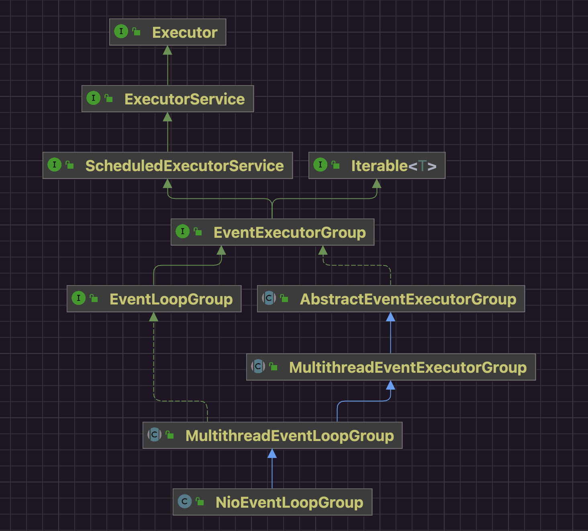

## 一 定义

摘自源码JavaDoc：

```java
/**
 * The {@link EventExecutorGroup} is responsible for providing the {@link EventExecutor}'s to use
 * via its {@link #next()} method. Besides this, it is also responsible for handling their
 * life-cycle and allows shutting them down in a global fashion.
 *
 */
```

* EventExecutor是NioEventLoop的抽象。
* NioEventLoopGroup是NioEventLoop管理器。
  * 管理NioEventLoop事件循环。
  * 通过next()方法选择一个NioEventLoop事件循环器使用。

## 二 类图

从继承关系上可以看出NioEventLoopGroup具有任务管理功能，类似线程池的一种实现。



## 三 源码

### 1 事件循环器选择

#### 1.1 Demo

```java
package io.netty.example.basic.eventloopgroup;

import io.netty.channel.EventLoop;
import io.netty.channel.EventLoopGroup;
import io.netty.channel.nio.NioEventLoopGroup;

/**
 *
 * @since 2022/11/7
 * @author dingrui
 */
public class NioEventLoopGroupTest00 {

    public static void main(String[] args) {
        EventLoopGroup group = new NioEventLoopGroup(3);
        for (int i = 0; i < 4; i++) {
            EventLoop el = group.next();
            System.out.println(el);
        }
    }
}

```

执行结果为：

```shell
io.netty.channel.nio.NioEventLoop@2ac1fdc4
io.netty.channel.nio.NioEventLoop@5f150435
io.netty.channel.nio.NioEventLoop@1c53fd30
io.netty.channel.nio.NioEventLoop@2ac1fdc4
```

从控制台的输出可以看出NioEventLoopGroup的管理功能：

* NioEventLoopGroup构造方法形参可以控制定义EventLoop数量。
* next()方法从EventLoop集合中选择一个。
* next()方法选择策略具有一定负载均衡功能，通过定义计数器进行集合取模。

#### 1.2 构造方法

##### 1.2.1 NioEventLoopGroup

```java
public NioEventLoopGroup(int nThreads) {
    this(nThreads, (Executor) null);
}
```

```java
public NioEventLoopGroup(int nThreads, Executor executor) {
    /**
         * executor用于开启NioEventLoop线程所需要的线程执行器
         * SelectorProvider.provider()用于创建selector
         */
    this(nThreads, executor, SelectorProvider.provider());
}
```

```java
public NioEventLoopGroup(int nThreads, Executor executor, final SelectorProvider selectorProvider) {
    this(nThreads, executor, selectorProvider, DefaultSelectStrategyFactory.INSTANCE);
}
```

```java
public NioEventLoopGroup(int nThreads,
                         Executor executor, // null
                         final SelectorProvider selectorProvider, // 创建Java的NIO复用器
                         final SelectStrategyFactory selectStrategyFactory
                        ) {
    super(nThreads, executor, selectorProvider, selectStrategyFactory, RejectedExecutionHandlers.reject());
}
```

##### 1.2.2 父类构造方法

MultithreadEventLoopGroup

```java
protected MultithreadEventLoopGroup(int nThreads,
                                    Executor executor, // null
                                    Object... args // [SelectorProvider SelectStrategyFactory RejectedExecutionHandlers]
                                   ) {
    super(nThreads == 0 ? DEFAULT_EVENT_LOOP_THREADS : nThreads, executor, args);
}
```

继续调用到MultithreadEventExecutorGroup的构造方法：

```java
protected MultithreadEventExecutorGroup(int nThreads,
                                        Executor executor, // null
                                        Object... args // [SelectorProvider SelectStrategyFactory RejectedExecutionHandlers]
                                       ) {
    this(nThreads, executor, DefaultEventExecutorChooserFactory.INSTANCE, args);
}
```

```java
protected MultithreadEventExecutorGroup(int nThreads, // 标识着group中有几个EventLoop
                                        Executor executor, // null
                                        EventExecutorChooserFactory chooserFactory, // DefaultEventExecutorChooserFactory.INSTANCE
                                        Object... args // [SelectorProvider SelectStrategyFactory RejectedExecutionHandlers]
                                       ) {
    if (executor == null)
        executor = new ThreadPerTaskExecutor(this.newDefaultThreadFactory()); // 构造一个executor线程执行器 一个任务对应一个线程(线程:任务=1:n)

    /**
         * 构建NioEventLoop
         * NioEventLoop children数组 线程池中的线程数组
         */
    this.children = new EventExecutor[nThreads];

    for (int i = 0; i < nThreads; i ++) { // 实例化children数组中的每一个元素
        boolean success = false;
        try {
            /**
                 * children是EventExecutor数组 也就是NioEventLoop集合
                 * {@link MultithreadEventExecutorGroup#newChild(Executor, Object...)}方法是抽象方法 具体实现子类关注
                 * 因为是NioEventLoopGroup调用的该方法 所以最终实现在NioEventLoopGroup中
                 *
                 * 将每个EventLoop和每个线程关联起来
                 */
            children[i] = this.newChild(executor, args);
            success = true;
        } catch (Exception e) {
            // TODO: Think about if this is a good exception type
            throw new IllegalStateException("failed to create a child event loop", e);
        } finally {
            if (!success) {
                for (int j = 0; j < i; j ++) { // 但凡有一个child实例化失败 就把已经成功实例化的线程进行shutdown shutdown是异步操作
                    children[j].shutdownGracefully();
                }

                for (int j = 0; j < i; j ++) {
                    EventExecutor e = children[j];
                    try {
                        while (!e.isTerminated()) {
                            e.awaitTermination(Integer.MAX_VALUE, TimeUnit.SECONDS);
                        }
                    } catch (InterruptedException interrupted) {
                        // Let the caller handle the interruption.
                        Thread.currentThread().interrupt(); // 把中断状态设置回去 交给关心的线程来处理
                        break;
                    }
                }
            }
        }
    }
```

其中比较重要的几个点：

* 线程执行器
* 事件循环器
* 线程选择器

##### 1.2.3 线程执行器Executor

```java
// MultithreadEventExecutorGroup.java
if (executor == null) // 线程执行器
            executor = new ThreadPerTaskExecutor(this.newDefaultThreadFactory()); // 构造一个executor线程执行器 一个任务对应一个线程(线程:任务=1:n)
```

ThreadFactory仅仅是线程创建的顶层抽象，提供一些必要线程属性：

* 非守护线程(main线程结束任务线程可以继续执行)。
* 线程优先级。

```java
// ThreadPerTaskExecutor
public final class ThreadPerTaskExecutor implements Executor { // 只有一个execute方法 每来一个任务就新建一个线程 这个线程池不是给NioEventLoopGroup使用的 而是给NioEventLoop使用的

    /**
     * 负责创建线程
     */
    private final ThreadFactory threadFactory;

    public ThreadPerTaskExecutor(ThreadFactory threadFactory) {
        this.threadFactory = threadFactory;
    }

    @Override
    public void execute(Runnable command) {
        threadFactory.newThread(command).start(); // 为每个任务新建一个线程 这个execute方法就是用来开启NioEventLoop线程用的
    }
}
```

也就是将来在某个时机触发executor的execute()方法，为任务创建线程并执行。此处的线程并非直接使用的Java实现，而是在此基础上做了一些。

##### 1.2.2 事件循环器

```java
// MultithreadEventExecutorGroup.java
/**
         * 构建NioEventLoop
         * NioEventLoop children数组 线程池中的线程数组
         */
this.children = new EventExecutor[nThreads];

for (int i = 0; i < nThreads; i ++) { // 根据NioEventLoopGroup构造器指定的数量创建NioEventLoop 也就是指定数量的线程数(线程的创建动作延迟到任务提交时)
    /**
                 * 初始化NioEventLoop事件循环器集合 也就是多个线程
                 */
    children[i] = this.newChild(executor, args);

```

##### 1.2.4 线程选择器

```java
// MultithreadEventExecutorGroup.java
/**
         * 创建线程选择器
         * 线程选择策略
         * NioEventLoopGroup都绑定一个chooser对象 作为线程选择器 通过这个线程选择器 为每一个channel发生的读写IO分配不同的线程进行处理
         */
        this.chooser = chooserFactory.newChooser(children);
```

netty中提供了2种实现

* PowerOfTwoEventExecutorChooser
* GenericEventExecutorChooser

#### 1.3 next方法

原理比较简单，本质就是对数组长度取模，在一定场景下用位运算替代取模运算。

也就是EventLoopGroup这个管理器按照轮询方式从NioEventLoop数组中选择事件循环器执行操作，起到了一定的负载均衡效果。

```java
// DefaultEventExecutorChooserFactory.java
private final EventExecutor[] executors; // 在EventLoopGroup构造器中初始化的EventLoop数组

// DefaultEventExecutorChooserFactory.java::PowerOfTwoEventExecutorChooser
/**
         * next()方法的实现就是选择下一个线程的方法
         * 如果线程数是2的倍数 通过位运算 效率高
         */
@Override
public EventExecutor next() { // 线程池线程数是2的幂次方 位运算
    return this.executors[idx.getAndIncrement() & this.executors.length - 1];
}

// DefaultEventExecutorChooserFactory.java::GenericEventExecutorChooser
/*
         * 线程数不是2的倍数 采用绝对值取模的方式 效率一般
         */
@Override
public EventExecutor next() { // 线程池线程数量不是2的幂次方 采用取模方式
    return this.executors[(int) Math.abs(idx.getAndIncrement() % this.executors.length)];
}
```

### 2 任务提交

#### 2.1 Demo

```java
// Demo.java
package io.netty.example.basic.eventloopgroup;

import io.netty.channel.EventLoopGroup;
import io.netty.channel.nio.NioEventLoopGroup;

import java.util.concurrent.TimeUnit;

/**
 *
 * @since 2022/11/7
 * @author dingrui
 */
public class NioEventLoopGroupTest01 {

    public static void main(String[] args) {
        EventLoopGroup group = new NioEventLoopGroup();
        group.execute(() -> {
            System.out.println("execute task...");
        });
        group.submit(() -> {
            System.out.println("submit task...");
        });
        group.schedule(() -> {
                    System.out.println("schedule task...");
                },
                5_000,
                TimeUnit.MILLISECONDS);
        System.out.println("main thread end");
    }
}
```

执行结果：

```shell
main thread end
submit task...
execute task...
```

上面已经分析过：

* EventLoopGroup仅仅是一个管理器，本身不具备执行任务能力。
* 管理器暴露next()选择其内部真正的执行单元(事件循环器)进行工作。
* 每个EventLoop都是一个线程，真正处理任务的执行单元，非守护线程。
* NioEventLoop是特定处理NIO多路复用这种场景的具体实现，因此还通过组合了Java中Selector多路复用器实现基于事件的响应模式React。

#### 2.2 任务执行单元

下面这几个方法都是EventLoopGroup管理器通过选择器chooser选择真正的执行单元EventLoop事件循环器来处理的：

* execute(...)方法
* submit(...)方法
* schedule(...)方法
* scheduleAtFixedRate(...)方法
* scheduleWithFixedDelay(...)方法

##### 2.2.1 execute(...)



```java
// Demo.java
group.execute(() -> {
    System.out.println("execute task...");
});

// AbstractEventExecutorGroup.java
public void execute(Runnable command) {
    this.next().execute(command);
}

// MultithreadEventLoopGroup.java
@Override
public EventLoop next() { // 从线程池NioEventLoopGroup中选择一个线程NioEventLoop
    return (EventLoop) super.next();
}

// MultithreadEventExecutorGroup
@Override
public EventExecutor next() {
    return this.chooser.next();
}
```

