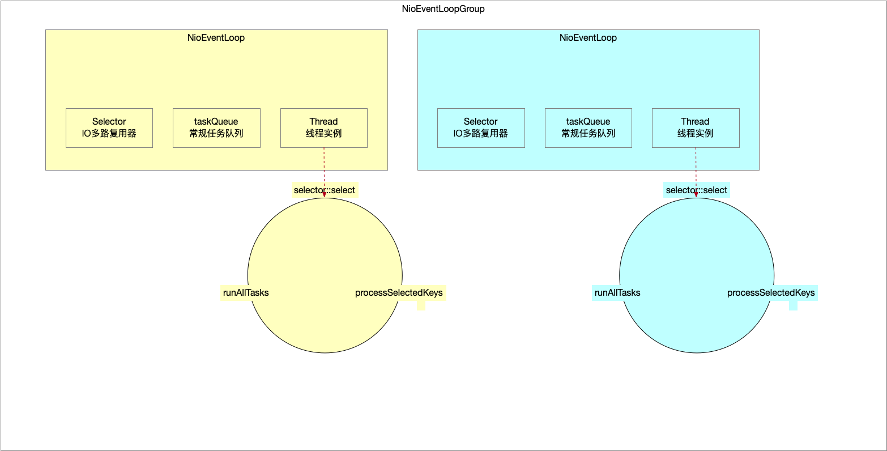

Netty没有简单地使用线程池复用线程的方式，而是自己实现了一套EventLoopGroup管理器，管理着EventLoop。

* 一个Group多个线程方式保证服务器的吞吐率。每个线程负责一个Channel的整个生命周期事件，虽然单个事件效率可能下降，但是利用异步方式增加了吞吐率。
* 每个NioEventLoop维护一个Selector多路复用器，保证IO读写事件始终在一个线程内处理。
* 在多线程下不存在线程间数据边界要处理。

因此Netty也将NioEventLoop的构造器保护了起来，使用了默认的访问修饰符。

## 1 EventLoop构造器

```java
// MultithreadEventExecutorGroup.java
children[i] = this.newChild(executor, args); // args=[SelectorProvider SelectStrategyFactory RejectedExecutionHandlers]
```


```java
// MultithreadEventExecutorGroup.java
protected abstract EventExecutor newChild(Executor executor, Object... args) throws Exception;
```


在MultithreadEventExecutorGroup中定义了抽象，实现在子类NioEventLoopGroup中。

```java
// NioEventLoopGroup.java
@Override
protected EventLoop newChild(Executor executor, Object... args) throws Exception { // executor=ThreadPerTaskExecutor实例 args=[SelectorProvider SelectStrategyFactory RejectedExecutionHandlers]
    SelectorProvider selectorProvider = (SelectorProvider) args[0]; // Java中对IO多路复用器的实现 依赖Jdk的版本 Window=WindowsSelectorProvider MacOSX=KQueueSelectorProvider Linux=EPollSelectorProvider
    SelectStrategyFactory selectStrategyFactory = (SelectStrategyFactory) args[1]; // DefaultSelectStrategyFactory实例 任务选择策略(如何从taskQueue任务队列中选择一个任务)
    RejectedExecutionHandler rejectedExecutionHandler = (RejectedExecutionHandler) args[2]; // RejectedExecutionHandlers实例
    EventLoopTaskQueueFactory taskQueueFactory = null;
    EventLoopTaskQueueFactory tailTaskQueueFactory = null;

    int argsLength = args.length;
    if (argsLength > 3) taskQueueFactory = (EventLoopTaskQueueFactory) args[3]; // null
    if (argsLength > 4) tailTaskQueueFactory = (EventLoopTaskQueueFactory) args[4]; // null
    return new NioEventLoop(this, // this是NioEventLoopGroup实例 在构造NioEventLoop的时候将线程是实例传给parent属性
                            executor, // ThreadPerTaskExecutor实例
                            selectorProvider,
                            selectStrategyFactory.newSelectStrategy(), // taskQueue任务队列中有任务就poll一个任务出来执行 空的就阻塞等待任务到来
                            rejectedExecutionHandler, // taskQueue任务队列满了拒绝策略(向上抛异常)
                            taskQueueFactory, // null
                            tailTaskQueueFactory // null
                           ); // NioEventLoop就是NioEventLoopGroup这个线程池中的个体 相当于线程池中的线程 在每个NioEventLoop实例内部都持有一个自己Thread实例
}
```


```java
// NioEventLoop.java
NioEventLoop(NioEventLoopGroup parent, // 标识EventLoop归属于哪个group
             Executor executor, // 线程执行器 将线程和EventLoop绑定
             SelectorProvider selectorProvider, // Java中IO多路复用器提供器
             SelectStrategy strategy, // 正常任务队列选择策略
             RejectedExecutionHandler rejectedExecutionHandler, // 正常任务队列拒绝策略
             EventLoopTaskQueueFactory taskQueueFactory, // 正常任务
             EventLoopTaskQueueFactory tailTaskQueueFactory // 收尾任务
            ) {
    super(parent,
          executor,
          false,
          newTaskQueue(taskQueueFactory), // 正常任务队列
          newTaskQueue(tailTaskQueueFactory), // 收尾任务队列
          rejectedExecutionHandler
         ); // 调用父类构造方法
    this.provider = ObjectUtil.checkNotNull(selectorProvider, "selectorProvider"); // IO多路复用器提供器 用于创建多路复用器实现
    this.selectStrategy = ObjectUtil.checkNotNull(strategy, "selectStrategy"); // 这个select是针对taskQueue任务队列中任务的选择策略
    final SelectorTuple selectorTuple = this.openSelector(); // 开启NIO中的组件 selector 意味着NioEventLoopGroup这个线程池中每个线程NioEventLoop都有自己的selector
    /**
         * 创建NioEventLoop绑定的selector对象
         * 初始化了IO多路复用器
         */
    this.selector = selectorTuple.selector; // Netty优化过的IO多路复用器
    this.unwrappedSelector = selectorTuple.unwrappedSelector; // Java原生的多路复用器
}
```

NioEventLoop构造起的作用就是为NioEventLoop这个组件初始化一些比较重要的属性：

* IO多路复用器Selector。
  * Netty在Java基础上优化的IO多路复用器版本。
  * Java原生的IO多路复用器。
* 线程执行器Executor，跟线程1:1绑定。
* taskQueue非IO任务队列。
  * 选择任务的选择策略。
  * 添加任务的拒绝策略。

### 1.1 IO多路复用器

#### 1.1.1 

#### 1.1.2 

### 1.2 非IO任务队列taskQueue

#### 1.2.1 选择策略

```java
// NioEventLoopGroup.java
SelectStrategyFactory selectStrategyFactory = (SelectStrategyFactory) args[1]; // DefaultSelectStrategyFactory实例 任务选择策略(如何从taskQueue任务队列中选择一个任务)
```


```java
// DefaultSelectStrategyFactory.java
public SelectStrategy newSelectStrategy() {
    return DefaultSelectStrategy.INSTANCE;
}
```

从taskQueue这个非IO任务队列中选任务，没有非IO任务要执行就准备阻塞在IO多路复用器上。

```java
// DefaultSelectStrategy.java
static final SelectStrategy INSTANCE = new DefaultSelectStrategy();


/**
     * selectSupplier回调接口
     *     - 在NioEventLoop中是IO多路复用器Selector的非阻塞方式执行select()方法 返回值只有两种情况
     *         - 0值 没有Channel处于IO事件就绪状态
     *         - 正数 IO事件就绪的Channel数量
     * hasTasks
     *     - taskQueue常规任务队列或者tailTasks收尾任务队列不为空就界定为有待执行任务 hasTasks为True
     *
     * 也就是说如果有非IO任务 使用非阻塞方式执行一次复用器的select()操作 尽量多执行一些任务
     * 如果没有非IO任务 就直接准备以阻塞方式执行一次复用器的select()操作
     */
@Override
public int calculateStrategy(IntSupplier selectSupplier, boolean hasTasks) throws Exception {
    return hasTasks ? selectSupplier.get() : SelectStrategy.SELECT;
}
```

#### 1.2.2 拒绝策略

taskQueue队列的拒绝策略很简单就是往taskQueue队列中添加元素满了的话就直接抛个异常。

```java
// NioEventLoopGroup.java
RejectedExecutionHandler rejectedExecutionHandler = (RejectedExecutionHandler) args[2]; // RejectedExecutionHandlers实例
```


```java
// RejectedExecutionHandlers.java
public static RejectedExecutionHandler reject() {
    return REJECT;
}
```


```java
// RejectedExecutionHandlers.java
private static final RejectedExecutionHandler REJECT = new RejectedExecutionHandler() {
    @Override
    public void rejected(Runnable task, SingleThreadEventExecutor executor) {
        throw new RejectedExecutionException();
    }
};
```

## 2 NioEventLoop工作流程

### 2.1 入口

NioEventLoop组件由NioEventLoopGroup统一管理，将来事件循环器代表的线程所做的一切事情都被封装成任务的形式抛给EventLoop。

* IO任务
* 非IO任务
  * 普通任务
  * 定时任务

#### 2.1.1 Demo

```java
// Demo.java
package io.netty.example.basic;

import io.netty.channel.EventLoopGroup;
import io.netty.channel.nio.NioEventLoopGroup;

/**
 *
 * @since 2022/11/7
 * @author dingrui
 */
public class NioEventLoopTest00 {

    public static void main(String[] args) {
        EventLoopGroup group = new NioEventLoopGroup();
        group.next().execute(() -> System.out.println("execute..."));
        group.next().submit(() -> System.out.println("submit..."));
    }
}

```

#### 2.1.2 execute(...)方法

NioEventLoop的execute(...)方法实现在父类`SingleThreadEventExecutor`中。

```java
// SingleThreadEventExecutor.java
@Override
public void execute(Runnable task) {
    ObjectUtil.checkNotNull(task, "task");
    // !(task instanceof LazyRunnable) && wakesUpForTask(task) -> true
    // this.execute(task, true);
    this.execute(task, !(task instanceof LazyRunnable) && wakesUpForTask(task));
}
```


```java
// SingleThreadEventExecutor.java
private void execute(Runnable task, boolean immediate) {
    /**
         * NioEventLoop只有一个线程 且它的阻塞点只有在IO多路复用器操作上
         * 因此当前添加任务的线程
         *     - NioEventLoop线程自己给自己添加任务 说明它压根没有被阻塞 而且肯定已经处于运行中状态
         *         - 这个线程已经被创建执行 那么这个新添加的任务被放到了非IO任务队列中 迟早会被取出来执行
         *     - 不是NioEventLoop线程 是其他线程往NioEventLoop添加任务
         *         - 如果NioEventLoop线程还没被创建执行 那么相当于任务裹挟着线程进行延迟创建并执行任务
         *         - 非IO任务队列没有任务 也没有IO事件到达时 NioEventLoop线程迟早会阻塞在复用器上
         *             - 阻塞期间有IO事件到达 退出select阻塞继续工作
         *             - 有定时任务还可能超时退出select NioEventLoop线程继续工作
         *             - 没有定时任务就永远阻塞 唤醒的方式 只有外部线程往NioEventLoop添加新任务触发selector复用器的wakeup()
         */
    boolean inEventLoop = super.inEventLoop();
    this.addTask(task); // 添加任务到taskQueue中 如果任务队列已经满了 就触发拒绝策略(抛异常)
    if (!inEventLoop) {
        this.startThread(); // NioEventLoop线程创建启动的时机就是提交进来的第一个异步任务
        if (this.isShutdown()) {
            boolean reject = false;
            try {
                if (removeTask(task)) reject = true;
            } catch (UnsupportedOperationException e) {
                // The task queue does not support removal so the best thing we can do is to just move on and
                // hope we will be able to pick-up the task before its completely terminated.
                // In worst case we will log on termination.
            }
            if (reject) reject();
        }
    }

    // NioEventLoop中线程阻塞点有且只有一个是在复用器上 因此addTaskWakesUp为false
    if (!addTaskWakesUp && immediate) this.wakeup(inEventLoop); // 唤醒阻塞的线程 这个wakeup(...)方法在子类NioEventLoop中特定的实现(借助复用器进行唤醒阻塞在复用器上的线程)
}
```

比较核心的方法有两个：

* startThread()方法
* wakeup(...)方法

##### 2.1.2.1 startThread()

```java
// SingleThreadEventExecutor.java
private void startThread() { // NioEventLoop线程被创建启动的时机(原子变量+CAS方式确保NioEventLoop线程只能被启动一次)
    if (state == ST_NOT_STARTED) {
        if (STATE_UPDATER.compareAndSet(this, ST_NOT_STARTED, ST_STARTED)) { // state状态标识线程已经启动 CAS确保线程只能被创建启动一次
            boolean success = false;
            try {
                this.doStartThread(); // 启动线程 在每个NioEventLoop只会被执行一次 保证NioEventLoop:线程=1:1
                success = true;
            } finally {
                if (!success) {
                    STATE_UPDATER.compareAndSet(this, ST_STARTED, ST_NOT_STARTED); // 线程启动失败依然将state标识为未启动
                }
            }
        }
    }
}
```


```java
// SingleThreadEventExecutor.java
private volatile Thread thread; // 线程执行器持有一个线程 每个Executor持有一个线程(相当于有且只有一个线程的线程池)

private void doStartThread() {
    assert thread == null;
    this.executor.execute(new Runnable() { // 这个executor就是实例化NioEventLoop时候传进来的ThreadPerTaskExecutor实例 每次来一个任务创建一个线程 调用execute()方法就会创建一个新的线程 也就是真正的线程Thread实例 Netty中Reactor模型=IO复用器select+多EventLoop线程 所以实际上这个executor线程执行器执行时机有且只有一次 保证一个EventLoop永远只跟一个线程实例班绑定
        @Override
        public void run() {
            /**
                 * 将Executor线程执行器跟线程绑定 线程跟NioEventLoop已经绑定 相当于是NioEvent->Thread->Executor 至于为什么多加一层的映射 是为了利用Executor抽象出来的更好用的API
                 * 记录线程也会为了后面判断执行线程是不是就是NioEventLoop线程自己 通过线程切换方式 保证既定任务整个生命周期都是同一个NioEventLoop线程在执行 
                 */
            thread = Thread.currentThread(); 
            if (interrupted) thread.interrupt();

            boolean success = false;
            updateLastExecutionTime();
            try {
                SingleThreadEventExecutor.this.run(); // 执行run()方法 该方法为抽象方法 在NioEventLoop中有实现 线程的死循环(不断地处理IO任务和非IO任务)
                success = true;
            } catch (Throwable t) {
            } finally {
                for (;;) {
                    int oldState = state;
                    if (oldState >= ST_SHUTTING_DOWN || STATE_UPDATER.compareAndSet(SingleThreadEventExecutor.this, oldState, ST_SHUTTING_DOWN))
                        break;
                }

                // Check if confirmShutdown() was called at the end of the loop.
                if (success && gracefulShutdownStartTime == 0) {
                }

                try {
                    // Run all remaining tasks and shutdown hooks. At this point the event loop
                    // is in ST_SHUTTING_DOWN state still accepting tasks which is needed for
                    // graceful shutdown with quietPeriod.
                    for (;;) if (confirmShutdown()) break;

                    // Now we want to make sure no more tasks can be added from this point. This is
                    // achieved by switching the state. Any new tasks beyond this point will be rejected.
                    for (;;) {
                        int oldState = state;
                        if (oldState >= ST_SHUTDOWN || STATE_UPDATER.compareAndSet(SingleThreadEventExecutor.this, oldState, ST_SHUTDOWN))
                            break;
                    }

                    // We have the final set of tasks in the queue now, no more can be added, run all remaining.
                    // No need to loop here, this is the final pass.
                    confirmShutdown();
                } finally {
                    try {
                        cleanup();
                    } finally {
                        // Lets remove all FastThreadLocals for the Thread as we are about to terminate and notify
                        // the future. The user may block on the future and once it unblocks the JVM may terminate
                        // and start unloading classes.
                        // See https://github.com/netty/netty/issues/6596.
                        FastThreadLocal.removeAll();

                        STATE_UPDATER.set(SingleThreadEventExecutor.this, ST_TERMINATED);
                        threadLock.countDown();
                        int numUserTasks = drainTasks();
                        terminationFuture.setSuccess(null);
                    }
                }
            }
        }
    });
}
```


NioEventLoop的轮询，具体的实现在`NioEventLoop`中：

```java
// NioEventLoop.java
@Override
protected void run() {
    int selectCnt = 0; // 当前EventLoop事件循环器代表的线程执行复用器select空轮询操作计数(Java对EPoll多路复用的实现缺陷 以阻塞方式执行复用器select 在没有读写事件时可能也会返回 产生空轮询 导致CPU负载)
    for (;;) {
        try {
            int strategy;
            try {
                /**
                     * strategy这个值只有3种情况 决定复用器如何执行(阻塞/非阻塞)
                     *     - 非IO任务队列为空->-1->复用器即将以阻塞方式执行一次看看有没有IO任务
                     *     - 非IO任务队列(常规任务队列taskQueue+收尾任务队列tailTasks)有任务 复用器以非阻塞方式执行一次看看有没有IO任务
                     *         - 没有IO事件->0
                     *         - 有IO事件->Channel数量
                     *
                     * 这样设计的方式是不要让复用器阻塞调用导致非IO任务不能及时执行
                     * 也就是尽可能多执行IO任务和非IO任务
                     */
                strategy = this.selectStrategy.calculateStrategy(this.selectNowSupplier, super.hasTasks());
                switch (strategy) {
                    case SelectStrategy.CONTINUE: // -2
                        continue;

                    case SelectStrategy.BUSY_WAIT: // -3
                        // fall-through to SELECT since the busy-wait is not supported with NIO

                    case SelectStrategy.SELECT: // -1 任务队列为空 将线程阻塞在复用器上 唤醒时机有两种情况(阻塞期间有IO事件到达 阻塞指定事件后主动结束阻塞开始执行定时任务)
                        long curDeadlineNanos = super.nextScheduledTaskDeadlineNanos(); // 定时任务队列中下一个待执行定时任务还有多久可以被唤醒执行 -1表示没有定时任务可以执行
                        if (curDeadlineNanos == -1L) curDeadlineNanos = NONE; // nothing on the calendar // 边界情况 没有定时任务要执行
                        this.nextWakeupNanos.set(curDeadlineNanos); // 下一次啥时候将线程唤醒
                        try {
                            if (!super.hasTasks()) strategy = this.select(curDeadlineNanos); // select()方法阻塞 超时时间是为了执行可能存在的定时任务 如果没有定时任务就将一直阻塞在复用器的select()操作上等待被唤醒
                        } finally {
                            // This update is just to help block unnecessary selector wakeups
                            // so use of lazySet is ok (no race condition)
                            nextWakeupNanos.lazySet(AWAKE);
                        }
                        // fall through
                    default:
                }
            } catch (IOException e) {
                // If we receive an IOException here its because the Selector is messed up. Let's rebuild
                // the selector and retry. https://github.com/netty/netty/issues/8566
                rebuildSelector0();
                selectCnt = 0;
                handleLoopException(e);
                continue;
            }

            selectCnt++; // 复用器select次数 但是疯狂自增的场景只会发生在没有非IO任务 本应该阻塞在复用器上的线程却一直select时 也就是空轮询
            cancelledKeys = 0;
            needsToSelectAgain = false;
            final int ioRatio = this.ioRatio; // 默认值是50
            boolean ranTasks; // 标识taskQueue中任务都被执行过一轮
            if (ioRatio == 100) { // 100->先处理IO任务 再执行非IO任务
                try {
                    if (strategy > 0) this.processSelectedKeys(); // 处理IO任务
                } finally {
                    // Ensure we always run tasks.
                    ranTasks = super.runAllTasks(); // 处理所有的非IO任务
                }
            } else if (strategy > 0) { // 不是100 先保证处理完所有IO任务 如果此时非IO任务很多(还是把所有非IO任务都执行完 耗时很多的话) 可能导致新到的IO任务不能得到及时处理 所以通过IoRatio参数控制非IO任务的处理时长
                final long ioStartTime = System.nanoTime(); // 记录IO任务处理开始时间
                try {
                    this.processSelectedKeys(); // 处理IO任务
                } finally {
                    // Ensure we always run tasks.
                    // 计算耗时 IO任务处理耗时
                    final long ioTime = System.nanoTime() - ioStartTime;
                    /**
                         * 计算非IO任务可以处理的时长 限定非IO任务处理时间 处理非IO任务
                         */
                    ranTasks = super.runAllTasks(ioTime * (100 - ioRatio) / ioRatio);
                }
            } else
                ranTasks = super.runAllTasks(0); // This will run the minimum number of tasks 非IO任务处理时间形参为0 但是内部实现对超时统计是有条件的 因此至少一次超时统计内这个时间段的非IO任务可以有机会处理

            if (ranTasks || strategy > 0) selectCnt = 0;
            else if (this.unexpectedSelectorWakeup(selectCnt)) selectCnt = 0; // 任务判定可能发生了空轮询 如果发生了空轮询场景 就通过重建复用器方式尽量避免再次发生空轮询
        } catch (CancelledKeyException e) {
            // Harmless exception - log anyway
        } catch (Error e) {
            throw e;
        } catch (Throwable t) {
            handleLoopException(t);
        } finally {
            // Always handle shutdown even if the loop processing threw an exception.
            try {
                if (isShuttingDown()) {
                    closeAll();
                    if (confirmShutdown()) return;
                }
            } catch (Error e) {
                throw e;
            } catch (Throwable t) {
                handleLoopException(t);
            }
        }
    }
}
```

##### 2.1.2.2 wakeup(...)方法

```java
// SingleThreadEventExecutor.java
protected void wakeup(boolean inEventLoop) { // NioEventLoop覆写了这个方法 有自己的特定实现
    if (!inEventLoop) {
        // Use offer as we actually only need this to unblock the thread and if offer fails we do not care as there
        // is already something in the queue.
        this.taskQueue.offer(WAKEUP_TASK);
    }
}
```


该方法被NioEventLoop定制化实现了：

```java
// NioEventLoop.java
@Override
protected void wakeup(boolean inEventLoop) { // 唤醒阻塞在复用器上的线程 NioEventLoop跟线程绑定了 自己阻塞在了复用器上后只能通过其他线程唤醒自己
    if (!inEventLoop && nextWakeupNanos.getAndSet(AWAKE) != AWAKE) { // 唤醒条件(NioEventLoop外部线程 NioEventLoop线程阻塞在复用器上[不是AWAKE已经被唤醒状态]) 有可能外界多个线程向NioEventLoop提交异步任务 通过CAS方式控制并发下保证只有一个线程唤醒阻塞在复用器上的NioEventLoop线程(可以不控制 但是Selector复用器wakeup这个系统调用会发生用户态切换内核态 开销比较大)
        this.selector.wakeup(); // 唤醒阻塞在复用器上的NioEventLoop线程
    }
}
```

#### 2.1.3 线程执行流程

整个线程周期处理的工作可以分为2部分：

* IO任务

  * select 执行一次复用器看看有多少IO事件到达

    * calculateStrategy(...) 非阻塞式执行

    * select(...) 阻塞式执行

  * processSelectedKeys(...) 处理IO事件

* runAllTasks(...) 处理非IO任务
  * 普通任务
  * 定时任务
  * 封装IO事件的任务

##### 2.1.3.1 IO多路复用器select

线程一次执行循环中可能有两个时机可以执行一次复用器的select操作，这样设计的目的因为一个线程负责所有任务整个执行流程，不能让某个环节的执行效率影响当个任务的后续步骤或者其他任务。

```java
// NioEventLoop.java
strategy = this.selectStrategy.calculateStrategy(this.selectNowSupplier, super.hasTasks());

// NioEventLoop.java
if (!super.hasTasks()) strategy = this.select(curDeadlineNanos); // select()方法阻塞 超时时间是为了执行可能存在的定时任务 如果没有定时任务就将一直阻塞在复用器的select()操作上等待被唤醒
```

###### 2.1.3.1.1 非阻塞式执行

```java
// NioEventLoop.java
strategy = this.selectStrategy.calculateStrategy(this.selectNowSupplier, super.hasTasks());
```


```java
// DefaultSelectStrategy.java
/**
     * selectSupplier回调接口
     *     - 在NioEventLoop中是IO多路复用器Selector的非阻塞方式执行select()方法 返回值只有两种情况
     *         - 0值 没有Channel处于IO事件就绪状态
     *         - 正数 IO事件就绪的Channel数量
     * hasTasks
     *     - taskQueue常规任务队列或者tailTasks收尾任务队列不为空就界定为有待执行任务 hasTasks为True
     *
     * 也就是说如果有非IO任务 使用非阻塞方式执行一次复用器的select()操作 尽量多执行一些任务
     * 如果没有非IO任务 就直接准备以阻塞方式执行一次复用器的select()操作
     */
@Override
public int calculateStrategy(IntSupplier selectSupplier, boolean hasTasks) throws Exception {
    return hasTasks ? selectSupplier.get() : SelectStrategy.SELECT;
}
```


```java

// NioEventLoop.java
private final IntSupplier selectNowSupplier = new IntSupplier() {
    @Override
    public int get() throws Exception {
        return selectNow();
    }
};
```


```java
// NioEventLoop.java
int selectNow() throws IOException {
    return selector.selectNow(); // IO多路复用器以非阻塞方式执行select()方法
}
```

在执行线程持有的任务队列中已经有任务的情况下，可以有3种选择：

* 1 不执行复用器-可能存在的风险是IO事件没有及时得到处理，最长延迟时间是线程一次循环周期时间。

* 2 阻塞式执行复用器-可能存在的风险是既有任务被延期，最长延迟时间是复用器阻塞时长或者外界添加任务时机。
* 3 非阻塞式执行复用器-收益在于，EventLoop线程已经有非IO任务待执行，因此它势必不可能阻塞住，至少必须要执行完既有任务，因此在真正执行非IO任务之前，可以贪心的看看有没有IO任务到达
  * 如果刚好有IO事件达到，可以及时处理它们
  * 如果没有IO事件，因为是非阻塞方式执行，因此对后续执行效率影响不大


因此选择非阻塞方式执行一次复用器。

###### 2.1.3.1.2 阻塞式执行

```java
// NioEventLoop.java
if (!super.hasTasks()) strategy = this.select(curDeadlineNanos); // select()方法阻塞 超时时间是为了执行可能存在的定时任务 如果没有定时任务就将一直阻塞在复用器的select()操作上等待被唤醒
```


```java
// NioEventLoop.java
private int select(long deadlineNanos) throws IOException { // 阻塞方式执行一次复用器select()操作
    if (deadlineNanos == NONE) return selector.select(); // 永久阻塞
    // Timeout will only be 0 if deadline is within 5 microsecs
    long timeoutMillis = deadlineToDelayNanos(deadlineNanos + 995000L) / 1000000L;
    return timeoutMillis <= 0 ? selector.selectNow() : selector.select(timeoutMillis);
}
```

如果线程执行中发现复用器空轮询达到一定阈值，便会对。

##### 2.1.3.2 处理到达的IO事件

```java
// NioEventLoop.java
private void processSelectedKeys() { // IO事件处理(IO事件到达)
    /**
         * selectedKeys是经过netty优化过的数据结构替代了jdk原生的方式 如果经过select()操作监听到了事件 selectedKeys的数组就会有值
         *     - Netty复用器 数组
         *     - Jdk原生复用器 hash表
         */
    if (this.selectedKeys != null)
        this.processSelectedKeysOptimized(); // 使用的Selector是Netty优化过的
    else
        this.processSelectedKeysPlain(this.selector.selectedKeys()); // Jdk原生的复用器
}
```


```java
// NioEventLoop.java
private void processSelectedKeysOptimized() {
    for (int i = 0; i < this.selectedKeys.size; ++i) { // 轮询数组中的Channel 这些Channel是Jdk原生的 并不是Netty中的NioChannel
        final SelectionKey k = selectedKeys.keys[i]; // Channel
        /**
             * 数组当前引用设置为null 因为selector不会自动清空
             * 与使用原生selector时候 通过遍历selector.selectedKeys()的set的时候 拿到key之后要执行remove()是一样的
             */
        selectedKeys.keys[i] = null;
        // 获取channel NioServerSocketChannel/NioSocketChannel 最终的事件是要交给Netty中Channel->Channel关联的pipeline->pipeline中的handler 因此利用attachment关联Netty中的Channel与Jdk中Channel的映射关系
        final Object a = k.attachment();
        // 根据channel类型调用不同的处理方法
        if (a instanceof AbstractNioChannel) // IO事件由Netty负责处理(NioServerSocketChannel和NioSocketChannel的抽象都是AbstractNioChannel)
            this.processSelectedKey(k, (AbstractNioChannel) a);
        else { // IO事件由用户自定义处理
            @SuppressWarnings("unchecked")
            NioTask<SelectableChannel> task = (NioTask<SelectableChannel>) a;
            processSelectedKey(k, task);
        }

        if (this.needsToSelectAgain) {
            // null out entries in the array to allow to have it GC'ed once the Channel close
            // See https://github.com/netty/netty/issues/2363
            selectedKeys.reset(i + 1);

            selectAgain();
            i = -1;
        }
    }
}
```


```java
// NioEventLoop.java
private void processSelectedKey(SelectionKey k, AbstractNioChannel ch) {
    final AbstractNioChannel.NioUnsafe unsafe = ch.unsafe(); // Socket上发生的读写最终不是交给Java的Channel处理 而是交给Netty的Channel去处理(Netty的Channel->pipeline->handler)
    /**
         * 如果Jdk底层的Channel是不合法的 说明这个channel可能有问题
         */
    if (!k.isValid()) {
        final EventLoop eventLoop;
        try {
            eventLoop = ch.eventLoop();
        } catch (Throwable ignored) {
            // If the channel implementation throws an exception because there is no event loop, we ignore this
            // because we are only trying to determine if ch is registered to this event loop and thus has authority
            // to close ch.
            return;
        }
        // Only close ch if ch is still registered to this EventLoop. ch could have deregistered from the event loop
        // and thus the SelectionKey could be cancelled as part of the deregistration process, but the channel is
        // still healthy and should not be closed.
        // See https://github.com/netty/netty/issues/5125
        if (eventLoop == this) {
            // close the channel if the key is not valid anymore
            unsafe.close(unsafe.voidPromise());
        }
        return;
    }
    /**
         * 执行到这 说明当前的Jdk的Channel是合法的
         */
    try {
        int readyOps = k.readyOps(); // Jdk的Channel发生的事件
        if ((readyOps & SelectionKey.OP_CONNECT) != 0) { // Jdk的Channel发生了连接事件
            // remove OP_CONNECT as otherwise Selector.select(..) will always return without blocking
            // See https://github.com/netty/netty/issues/924
            int ops = k.interestOps();
            ops &= ~SelectionKey.OP_CONNECT;
            k.interestOps(ops);

            unsafe.finishConnect();
        }
        // Process OP_WRITE first as we may be able to write some queued buffers and so free memory.
        if ((readyOps & SelectionKey.OP_WRITE) != 0) { // Jdk的Channel发生了写事件
            // Call forceFlush which will also take care of clear the OP_WRITE once there is nothing left to write
            ch.unsafe().forceFlush();
        }
        /**
             * 读事件和连接事件
             * 如果当前NioEventLoop是worker线程 这里就是op_read事件
             * 如果当前NioEventLoop是boss线程 这里就是op_accept事件
             *
             * 无论处理op_read事件还是op_accept事件 都走的unsafe的read()方法 这里unsafe是通过channel获取到的
             * 如果处理的是accept事件 这里的channel是NioServerSocketChannel 与之绑定的是{@link io.netty.channel.nio.AbstractNioMessageChannel.NioMessageUnsafe#unsafe}
             * 如果处理的是op_read事件 处理的线程是worker线程 这里的channel是{@link io.netty.channel.socket.nio.NioServerSocketChannel} 与之绑定的unsafe对象是{@link io.netty.channel.nio.AbstractNioByteChannel.NioByteUnsafe} 会进入{@link AbstractNioByteChannel.NioByteUnsafe#read()}方法
             */
        // Also check for readOps of 0 to workaround possible JDK bug which may otherwise lead
        // to a spin loop
        if ((readyOps & (SelectionKey.OP_READ | SelectionKey.OP_ACCEPT)) != 0 || readyOps == 0)
            unsafe.read();
    } catch (CancelledKeyException ignored) {
        unsafe.close(unsafe.voidPromise());
    }
}
```



##### 2.1.3.3 非IO任务

```java
// SingleThreadEventExecutor.java
protected boolean runAllTasks() {
        assert super.inEventLoop();
        boolean fetchedAll;
        boolean ranAtLeastOne = false;

        do {
            fetchedAll = this.fetchFromScheduledTaskQueue(); // 尝试从定时任务队列中找到所有可执行的定时任务放到非IO任务队列taskQueue中
            if (this.runAllTasksFrom(this.taskQueue)) ranAtLeastOne = true;
        } while (!fetchedAll); // keep on processing until we fetched all scheduled tasks.

        if (ranAtLeastOne) this.lastExecutionTime = ScheduledFutureTask.nanoTime(); // 尝试更新线程最近一次执行任务的时间
        this.afterRunningAllTasks(); // 收尾任务
        return ranAtLeastOne;
    }
```

执行流程：

* 找到可执行的定时任务放到taskQueue常规任务队列中
* 执行taskQueue中任务
* 收尾任务执行

###### 2.1.3.3.1 定时任务

```java
// SingleThreadEventExecutor.java
/**
     * 从定时任务队列中找到可执行的定时任务
     * 从定时任务中找到可以执行的任务将任务添加到普通任务队列taskQueue中
     */
private boolean fetchFromScheduledTaskQueue() {
    if (this.scheduledTaskQueue == null || this.scheduledTaskQueue.isEmpty()) return true;
    // 从定时任务队列中寻找截止时间为nanoTime的任务
    long nanoTime = AbstractScheduledEventExecutor.nanoTime();
    for (;;) {
        Runnable scheduledTask = super.pollScheduledTask(nanoTime); // 可执行的定时任务
        if (scheduledTask == null) return true;
        // 添加到普通任务队列过程失败就重新添加回定时任务队列中
        if (!this.taskQueue.offer(scheduledTask)) {
            // No space left in the task queue add it back to the scheduledTaskQueue so we pick it up again.
            this.scheduledTaskQueue.add((ScheduledFutureTask<?>) scheduledTask); // taskQueue常规任务队列已经满了 再把定时任务放回远处 等待下一轮执行时机
            return false;
        }
    }
}


```

###### 2.1.3.3.2 非IO任务

```java
// SingleThreadEventExecutor.java
protected final boolean runAllTasksFrom(Queue<Runnable> taskQueue) {
    Runnable task = this.pollTaskFrom(taskQueue); // 非IO任务
    if (task == null) {
        return false;
    }
    for (;;) {
        super.safeExecute(task);
        task = this.pollTaskFrom(taskQueue);
        if (task == null) {
            return true;
        }
    }
}
```


```java
// SingleThreadEventExecutor.java
protected static Runnable pollTaskFrom(Queue<Runnable> taskQueue) { // 从非IO任务队列中取任务
    for (;;) {
        Runnable task = taskQueue.poll();
        if (task != WAKEUP_TASK) {
            return task;
        }
    }
}
```


```java
// AbstractEventExecutor.java
protected static void safeExecute(Runnable task) {
    try {
        // 调用run()方法
        task.run();
    } catch (Throwable t) {
        logger.warn("A task raised an exception. Task: {}", task, t);
    }
}
```

### 2.2 工作流程图


